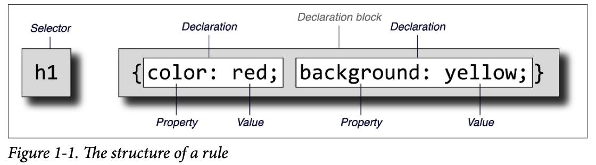

## CSS Fundamentals

### Stylesheet Contents

Inside a stylesheet, you’ll find a number of rules that look a little something like this: 

```css
h1 {color: maroon;} 
body {background: yellow;}
```

#### Rule Structure

Each rule has two fundamental parts: the selector and the declaration block. The declara‐tion block is composed of one or more declarations, and each declaration is a pairing of a property and a value. Every stylesheet is made up of a series of these rules. Figure 1-1 shows the parts of a rule.



The selector, shown on the left side of the rule, defines which piece of the document will be selected for styling. In Figure 1-1, `<h1>` (heading level 1) elements are selected. If the selector were p, then all `<p>` (paragraph) elements would be selected.

The right side of the rule contains the declaration block, which is made up of one or more declarations. Each declaration is a combination of a CSS property and a value of that prop‐erty.

#### Vendor Prefixing

Sometimes you’ll see pieces of CSS with hyphens and labels in front of them, like this: -oborder-image. These vendor prefixes were a way for browser vendors to mark properties, values, or other bits of CSS as being experimental or proprietary (or both). As of early 2023, a few vendor prefixes are in the wild, with the most common shown in Table 1-1.

*Table 1-1. Some common vendor prefixes*      

| Prefix   | Vendor                                                       |
| -------- | ------------------------------------------------------------ |
| -epub-   | International Digital Publishing Forum ePub format           |
| -moz-    | Gecko-based browsers (e.g., Mozilla Firefox)                 |
| -ms-     | Microsoft Internet Explorer                                  |
| -o-      | Opera-based browsers                                         |
| -webkit- | WebKit-based browsers (e.g., Apple Safari and Google Chrome) |

As of early 2023, vendor-prefixed CSS features are nearly nonexistent, with old prefixed properties and values being slowly but steadily removed from browser implementations. You’ll quite likely never write prefixed CSS, but you may encounter it in the wild or inherit it in a legacy codebase. Here’s an example: 

```css
-webkit-transform-origin: 0 0; 
-moz-transform-origin: 0 0; 
-o-transform-origin: 0 0; 
transform-origin: 0 0; 
```

That’s saying the same thing four times: once each for the WebKit, Gecko (Firefox), and Opera browser lines, and then finally the CSS-standard way. Again, this is no longer nec‐essary. We’re including it here only to give you an idea of what it might look like, should you come across this in the future.

#### Whitespace Handling

CSS is basically insensitive to whitespace between rules, and largely insensitive to whitespace within rules, although a few exceptions exist.

In general, CSS treats whitespace just like HTML does: any sequence of whitespace characters is collapsed to a single space for parsing purposes. Thus, you can format this hypo‐thetical rainbow rule in the following ways,

```css
rainbow: infrared  red  orange  yellow  green  blue  indigo  violet  ultraviolet; 

rainbow:    
		infrared  red  orange  yellow  green  blue  indigo  violet  ultraviolet; 

rainbow:   
		infrared  
		red   
		orange   
		yellow  
		green  
		blue   
		indigo  
		violet  
		ultraviolet  
		;
```

Similarly, you can format series of rules with whitespace in any fashion you like. These are just five examples out of an effectively infinite number of possibilities:

```css
html{color:black;} 
body {background: white;} 
p { 
  color: gray;} 
h2 {    
  color : silver ; 
	} 
ol 
	{    
    color   
   		 :    
    silver     
   		 ; 
}
```

#### CSS Comments

```css
/* This is a CSS comment */
```

It’s important to remember that CSS comments cannot be nested. So, for example, this would not be correct:

```css
/* This is a comment, in which we find 
	another comment, which is WRONG   
	/* Another comment */
and back to the first comment, which is not a comment.*/
```

Unfortunately, there is no “rest of the line” comment pattern such as // or # (the latter of which is reserved for ID selectors anyway). The only comment pattern in CSS is /* */.

#### Markup

There is no markup in stylesheets. This might seem obvious, but you’d be surprised. The one exception is HTML comment markup, which is permitted inside `<style>` elements for historical reasons:

```css
<style><!-- 
h1 {color: maroon;} 
body {background: yellow;} 
--></style>
```

That’s it, and even that isn’t recommended anymore; the browsers that needed it have faded into near oblivion.