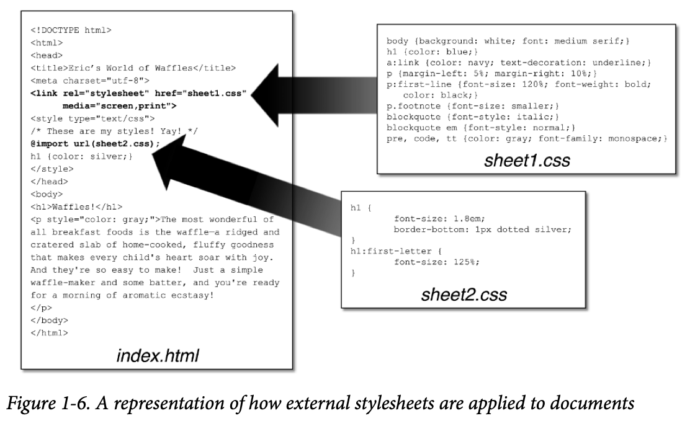

## CSS Fundamentals

### Stylesheet Contents

Inside a stylesheet, you’ll find a number of rules that look a little something like this: 

```css
h1 {color: maroon;} 
body {background: yellow;}
```

#### Rule Structure

Each rule has two fundamental parts: the selector and the declaration block. The declara‐tion block is composed of one or more declarations, and each declaration is a pairing of a property and a value. Every stylesheet is made up of a series of these rules. Figure 1-1 shows the parts of a rule.


The selector, shown on the left side of the rule, defines which piece of the document will be selected for styling. In Figure 1-1, `<h1>` (heading level 1) elements are selected. If the selector were p, then all `<p>` (paragraph) elements would be selected.

The right side of the rule contains the declaration block, which is made up of one or more declarations. Each declaration is a combination of a CSS property and a value of that prop‐erty.

#### Vendor Prefixing

Sometimes you’ll see pieces of CSS with hyphens and labels in front of them, like this: -oborder-image. These vendor prefixes were a way for browser vendors to mark properties, values, or other bits of CSS as being experimental or proprietary (or both). As of early 2023, a few vendor prefixes are in the wild, with the most common shown in Table 1-1.

*Table 1-1. Some common vendor prefixes*      

| Prefix   | Vendor                                                       |
| -------- | ------------------------------------------------------------ |
| -epub-   | International Digital Publishing Forum ePub format           |
| -moz-    | Gecko-based browsers (e.g., Mozilla Firefox)                 |
| -ms-     | Microsoft Internet Explorer                                  |
| -o-      | Opera-based browsers                                         |
| -webkit- | WebKit-based browsers (e.g., Apple Safari and Google Chrome) |

As of early 2023, vendor-prefixed CSS features are nearly nonexistent, with old prefixed properties and values being slowly but steadily removed from browser implementations. You’ll quite likely never write prefixed CSS, but you may encounter it in the wild or inherit it in a legacy codebase. Here’s an example: 

```css
-webkit-transform-origin: 0 0; 
-moz-transform-origin: 0 0; 
-o-transform-origin: 0 0; 
transform-origin: 0 0; 
```

That’s saying the same thing four times: once each for the WebKit, Gecko (Firefox), and Opera browser lines, and then finally the CSS-standard way. Again, this is no longer nec‐essary. We’re including it here only to give you an idea of what it might look like, should you come across this in the future.

#### Whitespace Handling

CSS is basically insensitive to whitespace between rules, and largely insensitive to whitespace within rules, although a few exceptions exist.

In general, CSS treats whitespace just like HTML does: any sequence of whitespace characters is collapsed to a single space for parsing purposes. Thus, you can format this hypo‐thetical rainbow rule in the following ways,

```css
rainbow: infrared  red  orange  yellow  green  blue  indigo  violet  ultraviolet; 

rainbow:    
		infrared  red  orange  yellow  green  blue  indigo  violet  ultraviolet; 

rainbow:   
		infrared  
		red   
		orange   
		yellow  
		green  
		blue   
		indigo  
		violet  
		ultraviolet  
		;
```

Similarly, you can format series of rules with whitespace in any fashion you like. These are just five examples out of an effectively infinite number of possibilities:

```css
html{color:black;} 
body {background: white;} 
p { 
  color: gray;} 
h2 {    
  color : silver ; 
	} 
ol 
	{    
    color   
   		 :    
    silver     
   		 ; 
}
```

#### CSS Comments

```css
/* This is a CSS comment */
```

It’s important to remember that CSS comments cannot be nested. So, for example, this would not be correct:

```css
/* This is a comment, in which we find 
	another comment, which is WRONG   
	/* Another comment */
and back to the first comment, which is not a comment.*/
```

Unfortunately, there is no “rest of the line” comment pattern such as // or # (the latter of which is reserved for ID selectors anyway). The only comment pattern in CSS is /* */.

#### Markup

There is no markup in stylesheets. This might seem obvious, but you’d be surprised. The one exception is HTML comment markup, which is permitted inside `<style>` elements for historical reasons:

```css
<style><!-- 
h1 {color: maroon;} 
body {background: yellow;} 
--></style>
```

That’s it, and even that isn’t recommended anymore; the browsers that needed it have faded into near oblivion.

### Elements

#### Replaced and Nonreplaced Elements

Although CSS depends on elements, not all elements are created equal. For example, images and paragraphs are not the same type of element. In CSS, elements generally take two forms: replaced and nonreplaced.

##### Replaced elements

Replaced elements are used to indicate content that is to be replaced by something not directly represented in the document. Probably the most familiar HTML example is the `` element, which is replaced by an image file external to the document itself. In fact, `` has no actual content, as you can see in this simple example: 

```html

```

This markup fragment contains only an element name and an attribute. The element presents nothing unless you point it to external content (in this case, an image file whose location is given by the src attribute). If you point to a valid image file, the image will be placed in the document. If not, the browser will either display nothing or will show a “broken image” placeholder.

Similarly, the `input` element can also be replaced—by a radio button, checkbox, text input box, or other, depending on its type.

##### Nonreplaced elements

The majority of HTML elements are nonreplaced elements. Their content is presented by the user agent (generally a browser) inside a box generated by the element itself. For example, `<span>hi there</span>` is a nonreplaced element, and the text “hi there” will be displayed by the user agent. This is true of paragraphs, headings, table cells, lists, and almost everything else in HTML.

#### Element Display Roles

##### Block-level elements

By default, **block-level elements** generate an element box that (by default) fills its parent element’s content area and cannot have other elements at its sides. In other words, it gen‐erates “breaks” before and after the element box. The most familiar block elements from HTML are `<p>` and `<div>`. Replaced elements can be block-level elements, but usually they are not.

In CSS, this is referred to as an element generating a **block formatting context**. It also means that the element generates a **block outer display type**. The parts inside the element may have different display types.

##### Inline-level elements

By default, inline-level elements generate an element box within a line of text and do not break up the flow of that line. The best inline element example is the `<a>` element in HTML. Other candidates are `<strong>` and `<em>`. These elements do not generate a “break” before or after themselves, so they can appear within the content of another ele‐ment without disrupting its display.

In CSS, this is referred to as an element generating an **inline formatting context**. It also means that the element generates an **inline outer display type**. The parts inside the element may have different display types. (In CSS, there is no restriction on how display roles can be nested within each other.)

### Bringing CSS and HTML Together

#### The `<link>` Tag

First, consider the use of the `<link>` tag: `<link rel="stylesheet" href="sheet1.css" media="screen, print">` The `<link>` tag’s basic purpose is to allow HTML authors to associate other documents with the document containing the `<link>` tag. CSS uses it to link stylesheets to the document.

These stylesheets, which are not part of the HTML document but are still used by it, are referred to as **external stylesheets**.

To successfully load an external stylesheet, `<link>` should be placed inside the `<head>` ele‐ment, though it can also appear inside the `<body>` element. This will cause the web browser to locate and load the stylesheet and use whatever styles it contains to render the HTML document; Figure 1-6 depicts the stylesheet called sheet1.css being linked to the document.

Also shown in Figure 1-6 is the loading of the external `sheet2.css` via an `@import` declara‐tion. Imports must be placed at the beginning of the stylesheet that contains them.



##### Attributes

The `rel` attribute stands for **relation**, and in this case, the relation is `stylesheet`. Note that the `rel` attribute is **required**. CSS has an optional `type` attribute whose default value is `text/css`, so you can include `type="text/css"` or leave it out, whichever you prefer.

Next, we find the `href` attribute. The value of this attribute is the URL of your stylesheet. This URL can be either absolute or relative

Finally, we have a `media` attribute. The value of this attribute is one or more **media descriptors**, which are rules regarding media types and the features of those media, with each rule separated by a comma. Thus, for example, you can use a linked stylesheet in both screen and print media: `<link rel="stylesheet" href="visual-sheet.css" media="screen, print">`. The default value is `all`, which means the CSS will be applied in all media.

##### Alternate stylesheets

It’s possible to define **alternate stylesheets** that users can select in some browsers. These are defined by making the value of the `rel` attribute `alternate stylesheet`, and they are used in document presentation only if selected by the user.

Should a browser be able to use alternate stylesheets, it will use the values of the `<link>` element’s `title` attributes to generate a list of style alternatives. So you could write the following:

```html
<link rel="stylesheet" href="sheet1.css" title="Default"> 
<link rel="alternate stylesheet" href="bigtext.css" title="Big Text"> 
<link rel="alternate stylesheet" href="zany.css" title="Crazy colors!">
```

Users could then pick the style they want to use, and the browser would switch from the first one, labeled `Default` in this case, to whichever the user picked.

As of early 2023, alternate stylesheets are supported in most Gecko-based browsers like Firefox. The Chromium and WebKit families do not support selecting alternate stylesheets.

It’s also possible to group alternate stylesheets together by giving them the same `title` value.

If you give a `<link>` with a `rel` of `stylesheet` a `title`, you are designating that stylesheet as a **preferred stylesheet**. Its use is preferred to alternate stylesheets, and it will be used when the document is first displayed. Once you select an alternate stylesheet, however, the preferred stylesheet will **not** be used. Furthermore, if you designate a number of stylesheets as preferred, **all but one** of them will be ignored. HTML doesn’t provide a method of determining which preferred stylesheets should be ignored and which should be used.

If you don’t give a stylesheet a title, it becomes a **persistent stylesheet** and is always used in the display of the document.

#### The `<style>` Element

The styles between the opening and closing `<style>` tags are referred to as the **document stylesheet** or the **embedded stylesheet** (because this kind of stylesheet is embedded within the document). It contains styles that apply to the document, but it can also contain mul‐tiple links to external stylesheets via the `@import` directive.

You can give `<style>` elements a `media` attribute, which functions in the same manner as it does on linked stylesheets. This, for example, will restrict an embedded stylesheet’s rules to be applied in print media only:

```html
<style media="print">…</style>
```

You can also label an embedded stylesheet with a `<title>` element, in the same manner and for the same reasons discussed in the previous section on alternate stylesheets.

#### The @import Directive

```css
@import url(sheet2.css);
```

Just like `<link>`, `@import` can be used to direct the web browser to load an external style‐sheet and use its styles in the rendering of the HTML document. The only major differ‐ence is in the syntax and placement of the command. As you can see, `@import` is found inside the `<style>` element. It must be placed first, before the other CSS rules, or it won’t work at all.

As with `<link>`, a document can have more than one `@import` statement. Unlike `<link>`, however, the stylesheets of every `@import` directive will be loaded and used; there is no way to designate alternate stylesheets with `@import`. So, given the following markup:

```css
@import url(sheet2.css); 
@import url(blueworld.css); 
@import url(zany.css);
```

…all three external stylesheets will be loaded, and all of their style rules will be used in the display of the document.

As with `<link>`, you can restrict imported stylesheets to one or more media by providing media descriptors after the stylesheet’s URL:

```css
@import url(sheet2.css) all; 
@import url(blueworld.css) screen; 
@import url(zany.css) screen, print;
```

The `@import` directive can be highly useful if you have an external stylesheet that needs to use the styles found in other external stylesheets. Since external stylesheets cannot contain any document markup, the `<link>` element can’t be used—but `@import` can.

CSS requires the `@import` directives to come before any rules in a stylesheet, though they can be preceded by `@charset` and `@layer` declarations. An `@import` that comes after other rules (e.g., `body {color: red;}`) will be ignored by conforming user agents.

Another descriptor that can be added to an `@import` directive is a **cascade layer identifier**. This assigns all of the styles in the imported stylesheet to a cascade layer

```css
@import url(basic-text.css) screen layer(basic);
```

That assigns the styles from `basic-text.css` to the `basic` cascade layer. If you want to assign the styles to an unnamed layer, use `layer` without the parenthetical naming, like so:

```css
@import url(basic-text.css) screen layer;
```

Note that this ability is a difference between `@import` and `<link>`, as the latter cannot be labeled with a cascade layer.