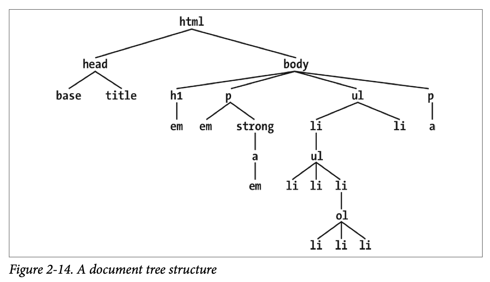
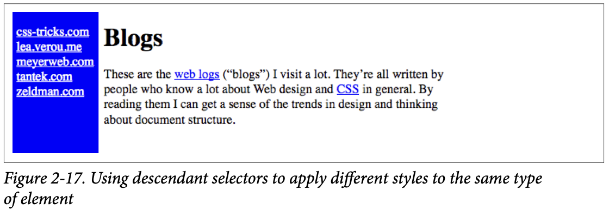
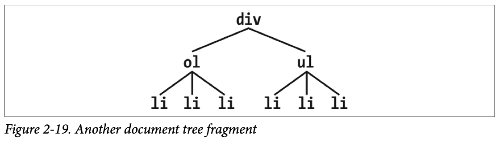

## Selectors

### Type Selectors

A **type selector**, previously known as an **element selector**, is most often an HTML element, but not always. For example, if a CSS file contains styles for an XML document, the type selectors might look something like this:

```css
quote {color: gray;} 
bib {color: red;} 
booktitle {color: purple;} 
myElement {color: red;}
```

If you’re styling an HTML document, the selector will generally be one of the many defined HTML elements such as `<p>`, `<h3>`, `<em>`, `<a>`, or even `<html>` itself. For example:

```css
html {color: black;} 
h1 {color: gray;} 
h2 {color: silver;}
```

### Grouping

```css
h2, p {color: gray;}
```

By placing the `h2` and `p` selectors at the beginning of the rule, before the opening curly brace, and separating them with a comma, you’ve defined a rule indicating that the style inside the curly braces `(color: gray;)` applies to the elements referenced by both selec‐tors. The comma tells the browser that two different selectors are involved in the rule. Leaving out the comma would give the rule a completely different meaning.

##### The universal selector

The **universal selector**, displayed as an asterisk (`*`), matches any element at all, much like a wildcard. For example, to make every single element in a document bold, you would write this:

```css
* {font-weight: bold;}
```

### Class and ID Selectors

In addition to **type selectors**, CSS has **class selectors** and **ID selectors**, which let you assign styles based on HTML attributes but independent of element type.

#### Class Selectors

```css
*.warning {font-weight: bold;}
```

The declaration `font-weight: bold` will be applied to every element that carries a class attribute with a value of warning.

```css
p.warning {font-weight: bold;}
```

The selector now matches any `<p>` elements that have a class attribute containing the word warning, but no other elements of any kind, classed or otherwise. Since the `<span>` element is not a paragraph, the rule’s selector doesn’t match it, and it won’t be displayed using boldfaced text.

If you wanted to assign different styles to the `<span>` element, you could use the selector `span.warning`:

```css
p.warning {font-weight: bold;} 
span.warning {font-style: italic;}
```

Another option is to use a combination of a general class selector and an element-specific class selector to make the styles even more useful, as in the following markup:

```css
.warning {font-style: italic;} 
span.warning {font-weight: bold;}
```

If you want to select all elements that share a class name, you can omit the universal selector from a class selector without any ill effects. Thus, `*.warning` and `.warning` will have exactly the same effect.

Another thing about class names: they should **never** begin with a number.

#### Multiple Classes

In the previous section, we dealt with `class` values that contain a single word. In HTML, it’s possible to have a space-separated list of words in a single `class` value. Unlike HTML tags and type selectors, class selectors are **case-sensitive**.

```css
.warning {font-weight: bold;} 
.urgent {font-style: italic;} 
.warning.urgent {background: silver;}
```

By chaining two class selectors together, you can select only those elements that have both class names, in any order. As you can see, the HTML source contains `class="urgent warning"`, but the CSS selector is written `.warning.urgent`. The order in which the words are written in the source document, or in the CSS, doesn’t matter.

```css
p.warning.help {background: red;}
```

As you might expect, the selector will match only those `<p>` elements with a `class` containing the space-separated words `warning` and `help`. Therefore, it will not match a `<p>` element with just the words `warning` and `urgent` in its class attribute. It would, however, match the following:

```html
<p class="urgent warning help">Help me!</p>
```

#### ID Selectors

In some ways, **ID selectors** are similar to class selectors, but a few crucial differences exist. First, ID selectors are preceded by a hash sign (`#`)—formally called an octothorpe and also known as a pound sign (in the United States), number sign, or tic-tac-toe board—instead of a period. Thus, you might see a rule like this one:

```css
*#first-para {font-weight: bold;}
```

The second difference is that instead of referencing values of the `class` attribute, ID selectors refer, sensibly enough, to values found in `id` attributes.

The third difference is that a document should have only one instance of a given ID value.

As with class selectors, it is possible (and very much the norm) to omit the universal selector from an ID selector. In the previous example, we could also have written this with the exact same effect:

```css
#lead-para {font-weight: bold;}
```

### Attribute Selectors

With both class and ID selectors, what you’re really doing is selecting values of ele‐ments’ attributes. The syntax used in the previous two sections is particular to HTML, SVG, and MathML documents as of this writing. In other markup languages, these class and ID selectors may not be available (as, indeed, those attributes may not be present).

To address this situation, CSS2 introduced **attribute selectors**, which can be used to select elements based on their attributes and the values of those attributes. There are four general types of attribute selectors: **simple attribute selectors**, **exact attribute value selectors**, **partial-match attribute value selectors**, and **leading-value attribute selectors**.

#### Simple Attribute Selectors

If you want to select elements that have a certain attribute, regardless of that attribute’s value, you can use a **simple attribute selector**. For example, to select all `<h1>` elements that have a `class` attribute with any value and make their text silver, write this:

```css
h1[class] {color: silver;}
```

This strategy is very useful in XML documents, as XML languages tend to have element and attribute names that are specific to their purpose. Consider an XML language that is used to describe planets of the solar system (we’ll call it PlanetML). If you want to select all `<pml-planet>` elements with a moons attribute and make them boldface, thus calling attention to any planet that has moons, you would write this:

```css
pml-planet[moons] {font-weight: bold;}
```

This would cause the text of the second and third elements in the following markup frag‐ment to be boldfaced, but not the first:

```html
<pml-planet>Venus</pml-planet> 
<pml-planet moons="1">Earth</pml-planet> 
<pml-planet moons="2">Mars</pml-planet>
```

In HTML documents, you can use this feature in creative ways. For example, you could style all images that have an `alt` attribute, thus highlighting those images that are correctly formed:

```css
img[alt] {outline: 3px solid forestgreen;}
```

If you wanted to boldface any element that includes `title` information, which most browsers display as a tool tip when a cursor hovers over the element, you could write this:

```css
*[title] {font-weight: bold;}
```

Similarly, you could style only those anchors (`<a>` elements) that have an `href` attribute, thus applying the styles to any hyperlink but not to any placeholder anchors.

It is also possible to select elements based on the presence of more than one attribute. You do this by chaining the attribute selectors together. For example, to boldface the text of any HTML hyperlink that has both an `href` and a `title` attribute, you would write the following:

```css
a[href][title] {font-weight: bold;}
```

#### Selection Based on Exact Attribute Value

You can further narrow the selection process to encompass only those elements whose attributes are a certain value. For example, let’s say you want to boldface any hyperlink that points to a certain document on the web server. This would look something like the following:

```css
a[href="http://www.css-discuss.org/about.html"] {font-weight: bold;}
```

XML languages can benefit from this approach to styling. Let’s return to our PlanetML example. Suppose you want to select only those `planet` elements that have a value of `1` for the attribute moons:

```css
planet[moons="1"] {font-weight: bold;}
```

This format requires an **exact** match for the attribute’s value. Consider the fol‐lowing markup fragment:

```html
<planet type="barren rocky">Mercury</planet>
```

The only way to match this element based on its exact attribute value is to write this:

```css
planet[type="barren rocky"] {font-weight: bold;}
```

If you were to write `planet[type="barren"]`, the rule would not match the example markup and thus would fail. This is true even for the class attribute in HTML. Consider the following:

```html
<p class="urgent warning">When handling plutonium, care must be taken to avoid the formation of a critical mass.</p>
```

To select this element based on its exact attribute value, you would have to write this:

```css
p[class="urgent warning"] {font-weight: bold;}
```

This is **not** equivalent to the dot-class notation covered earlier. Instead, it selects any `p` element whose class attribute has **exactly** the value `urgent warning`, with the words in that order and a single space between them. It’s effec‐tively an exact string match, whereas when using a `class` selector, the class order doesn’t matter.

Also, be aware that ID selectors and attribute selectors that target the `id` attribute are not precisely the same. In other words, a subtle but crucial difference exists between `h1#page-title` and `h1[id="page-title"]`. This difference is explained in Chapter 4.

#### Selection Based on Partial Attribute Values

Odds are that you’ll sometimes want to select elements based on portions of their attribute values, rather than the full value. For such situations, CSS offers a variety of options for matching substrings in an attribute’s value. These are summarized in Table 2-1.

*Table 2-1. Substring matching with attribute selectors* 

| Type           | Description                                                  |
| -------------- | ------------------------------------------------------------ |
| `[foo~="bar"]` | Selects any element with an attribute `foo` whose value contains the word `bar` in a space-separated list of words |
| `[foo*="bar"]` | Selects any element with an attribute `foo` whose value contains the substring `bar` |
| `[foo^="bar"]` | Selects any element with an attribute `foo` whose value begins with `bar` |
| `[foo$="bar"]` | Selects any element with an attribute `foo` whose value ends with `bar` |
| `[foo|="bar"]` | Selects any element with an attribute `foo` whose value starts with `bar` followed by a hyphen (U+002D) or whose value is exactly equal to bar |

In general, the form `[att|="val"]` can be used for any attribute and its values. Let’s say you have a series of figures in an HTML document, each of which has a filename like `figure-1.gif` or `figure-3.jpg`. You can match all of these images by using the following selector:  

```css
img[src|="figure"] {border: 1px solid gray;}
```

##### Matching one word in a space-separated list

Let’s say you want to select elements whose class attribute contains the word warning. You can do this with an attribute selector:

```css
p[class~="warning"] {font-weight: bold;}
```

#### The Case-Insensitivity Identifier

Including an i before the closing bracket of an attribute selector will allow that selector to match attribute values case-insensitively, regardless of document language rules. For example, suppose you want to select all links to PDF documents, but you don’t know if they’ll end in .pdf, .PDF, or even .Pdf. Here’s how:

```css
a[href$='.PDF' i]
```

### Using Document Structure

#### Understanding the Parent-Child Relationship

```html
<!DOCTYPE html> 
<html lang="en-us"> 
  <head> 
    <meta charset="utf-8"> 
    <meta name="viewport" content="width=device-width"> 
    <title>Meerkat Central</title> 
  </head>
  <body> 
    <h1>Meerkat <em>Central</em></h1> 
    <p> 
      Welcome to Meerkat <em>Central</em>, the <strong>best meerkat web site  on <a href="inet.html">the <em>entire</em> Internet</a></strong>!</p> 
    <ul>  
      <li>We offer:  
        <ul>   
          <li><strong>Detailed information</strong> on how to adopt a meerkat</li>  
          <li>Tips for living with a meerkat</li>  
          <li><em>Fun</em> things to do with a meerkat, including:    
            <ol>    
              <li>Playing fetch</li>    
              <li>Digging for food</li>  
              <li>Hide and seek</li>   
            </ol> 
          </li>  
        </ul>  
      </li> 
      <li>...and so much more!</li> 
    </ul> 
    <p>  
      Questions? <a href="mailto:suricate@meerkat.web">Contact us!</a> 
    </p> 
  </body> 
</html>
```

Much of the power of CSS is based on the **parent-child relationship** of elements. 



The terms **parent** and **child** are specific applications of the terms **ancestor** and **descendant**, respectively. There is a difference between them: in the tree view, if an element is exactly one level above or below another, those elements have a **parent-child relationship**. If the path from one element to another is traced through two or more levels, the elements have an **ancestor-descendant relationship**, but not a parent-child relationship. (A child is also a descendant, and a parent is also an ancestor.)

#### Defining Descendant Selectors

The first benefit of understanding this model is the ability to define **descendant selectors**. Defining descendant selectors is the act of creating rules that operate in certain structural circumstances but not others. As an example, let’s say you want to style only those `<em>` elements that are descended from `<h1>` elements. To do so, write the following:

```css
h1 em {color: gray;}
```

In a descendant selector, the selector side of a rule is composed of two or more spaceseparated selectors. The space between the selectors is an example of a **combinator**. Each space combinator can be translated as “found within,” “which is part of,” or “that is a descendant of,” but only if you read the selector right to left. Thus, `h1 em` can be translated as, “ Any `<em>` element that is a descendant of an `<h1>` element.”

To read the selector left to right, you might phrase it like, “ Any `<h1>` that contains an `<em>` will have the following styles applied to the `<em>`.” That’s much more verbose and confus‐ing, and it’s why we, like the browser, read selectors from right to left.

Descendant selectors can be extremely powerful. Let’s consider a common example. Assume you have a document with a sidebar and a main area. The sidebar has a blue background, the main area has a white background, and both areas include lists of links. You can’t set all links to be blue because they’d be impossible to read in the sidebar, and you also can’t set all links to white because they’d disappear in the main part of the page.

The solution: descendant selectors. In this case, you give the element that contains your sidebar a class of `sidebar` and enclose the main part of the page in a `<main>` element. Then, you write styles like this:

```css
.sidebar {background: blue;} 
main {background: white;} 
.sidebar a:any-link {color: white;} 
main a:any-link {color: blue;}
```

**Note**: `:any-link` refers to both visited and unvisited links.



A more subtle aspect of descendant selectors is that they have no notion of element proximity. For example, consider the following:

```html
div:not(.help) span {color: gray;} 
div.help span {color: red;} 

<div class="help">  
  <div class="aside">     
    This text contains <span>a span element</span> within.
   </div> 
</div>
```

What the CSS says, in effect, is “any `<span>` inside a `<div>` that doesn’t have a `class` containing the word `help` should be gray” in the first rule, and “any `<span>` inside a `<div>` whose `class` contains the word `help`” in the second rule. In the given markup fragment, **both** rules apply to the `<span>` shown.

Because the two rules have equal specificity weight and the red rule is written last, it wins out, and the `<span>` is red. The fact that `div class="aside"` is “closer to” `<span>` than `div class="help"` is **irrelevant**. Again: descendant selectors have no notion of element proximity. Both rules match, only one color can be applied, and because of the way CSS works, red is the winner here.

#### Selecting Children

In some cases, you don’t want to select an arbitrarily descended element. Rather, you want to narrow your range to select an element that is specifically a child of another element. You might, for example, want to select a `<strong>` element only if it is a child (as opposed to any other level of descendant) of an `<h1>` element. To do this, you use the **child combinator**, which is the greater-than symbol (`>`):

```css
h1 > strong {color: red;}
```

This rule will make red the `<strong>` element shown in the first `<h1>`, but not the second:

```html
<h1>This is <strong>very</strong> important.</h1>
<h1>This is <em>really <strong>very</strong></em> important.</h1>
```

Read right to left, the selector `h1 > strong` translates as, “Selects any `<strong>` element that is a direct child of an `<h1>` element.” The child combinator can be optionally surroun‐ded by whitespace. Thus, `h1 > strong`, `h1> strong`, and `h1>strong` are all equivalent. You can use or omit whitespace as you wish.

You can also combine descendant and child combinators in the same selector. Thus, `table.summary td > p` will select any `<p>` element that is a **child** of a `<td>` element that is itself **descended** from a `<table>` element that has a `class` attribute containing the word `summary`.

#### Selecting Adjacent-Sibling Elements

Let’s say you want to style the paragraph immediately after a heading, or give a special margin to a list that immediately follows a paragraph. To select an element that immedi‐ately follows another element with the same parent, you use the **adjacent-sibling combinator**, represented as a plus symbol (`+`).

To remove the top margin from a paragraph immediately following an `<h1>` element, write this:

```css
h1 + p {margin-top: 0;}
```

The selector is read as, “Select any `<p>` element that immediately follows an `<h1>` element that **shares a parent** with the `<p>` element.”



If you write `li + li {font-weight: bold;}`, only the second and third items in each list will be boldfaced. The first list items will be unaffected.

To work properly, CSS requires that the two elements appear in **source order**. In our exam‐ple, an `<ol>` element is followed by a `<ul>` element. This allows us to select the second element with `ol + ul`, but we cannot select the first by using the same syntax. For `ul + ol` to match, an ordered list must immediately follow an unordered list.

Keep in mind that text content between two elements does **not** prevent the adjacentsibling combinator from working.

```html
<div> 
  <ol>   
    <li>List item 1</li>
    <li>List item 1</li>  
    <li>List item 1</li>  
  </ol>  
  This is some text that is part of the 'div'.
  <ul>   
    <li>A list item</li>  
    <li>Another list item</li>  
    <li>Yet another list item</li>  
  </ul> 
</div>
```

Even though we have text between the two lists, we can still match the second list with the selector `ol + ul`. That’s because the intervening text is not contained within a sibling ele‐ment, but is instead part of the parent `<div>`. If we wrapped that text in a paragraph element, it would then prevent `ol + ul` from matching the second list. Instead, we might have to write something like `ol + p + ul`.

As the following example illustrates, the adjacent-sibling combinator can be used in con‐junction with other combinators:

```css
html > body table + ul{margin-top: 1.5em;}
```

The selector translates as, “Selects any `<ul>` element that immediately follows a sibling `<table>` element that is descended from a `<body>` element that is itself a child of an `<html>` element.”

As with all combinators, you can place the adjacent-sibling combinator in a more com‐plex setting, such as `div#content h1 + div ol`. That selector is read as, “Selects any `<ol>` element that is descended from a `<div>` when the `<div>` is the adjacent sibling of an `<h1>` that is itself descended from a `<div>` whose `id` attribute has a value of `content`.”

#### Selecting Following Siblings

The **general sibling combinator** lets you select any element that follows another element when both elements share the same parent, represented using the tilde (`~`) combinator.

As an example, to italicize any `<ol>` that follows an `<h2>` and also shares a parent with the `<h2>`, you’d write `h2 ~ ol {font-style: italic;}`. The two elements do not have to be adjacent siblings, although they can be adjacent and still match this rule.

```html
<div>  
  <h2>Subheadings</h2> 
  <p>It is the case that not every heading can be a main heading.  Some headings  
    must be subheadings.  Examples include:</p>  
  <ol>   
    <li>Headings that are less important</li>  
    <li>Headings that are subsidiary to more important headlines</li>  
    <li>Headings that like to be dominated</li> 
  </ol> 
  <p>Let's restate that for the record:</p> 
  <ol>   
    <li>Headings that are less important</li> 
    <li>Headings that are subsidiary to more important headlines</li>  
    <li>Headings that like to be dominated</li> 
  </ol> 
</div>
```

