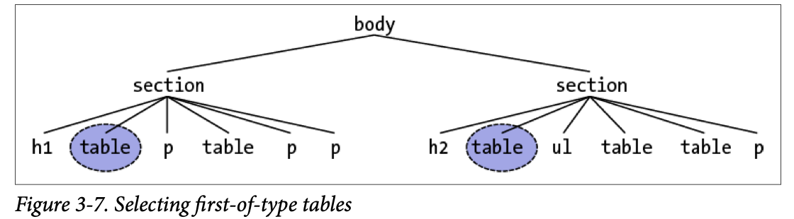

## Pseudo-Class and -Element Selectors

### Pseudo-Class Selectors

#### Combining Pseudo-Classes

Before we really get started, a word about chaining. CSS makes it possible to combine (chain) pseudo-classes together. For example, you can make unvisited links red when they’re hovered and visited links maroon when they are hovered:

```css
a:link:hover {color: red;} 
a:visited:hover {color: maroon;}
```

The order you specify doesn’t matter; you could also write `a:hover:link` to the same effect as `a:link:hover`.

Be careful not to combine mutually exclusive pseudo-classes. For example, a link cannot be both visited and unvisited, so `a:link:visited` doesn’t make any sense and will never match anything.

#### Structural Pseudo-Classes

##### Selecting the root element

This is the quintessence of structural simplicity: the pseudo-class `:root` selects the root element of the document. In HTML, this is **always** the `<html>` element. The real benefit of this selector is found when writing stylesheets for XML languages, as the root element may be different in every language—for example, in SVG it’s the `<svg>` element.

In HTML documents, you can always select the `<html>` element directly, without having to use the `:root` pseudo-class. The two selectors differ in terms of specificity, which we’ll cover in Chapter 4, but otherwise they’ll have the same effect.

##### Selecting empty elements

With the pseudo-class `:empty`, you can select any element that has no children of any kind, **including** text nodes, which covers both text and whitespace. This can be useful in suppressing elements that a content management system (CMS) has generated without filling in any actual content. Thus, `p:empty {display: none;}` would prevent the display of any empty paragraphs.

Note that in order to be matched, an element must be, from a parsing perspective, truly empty—no whitespace, visible content, or descendant elements. Of the following elements, only the **first and last** would be matched by `p:empty`:

```html
<p></p>
<p> </p>
<p>
</p>
<p><!—-a comment--></p>
```

You might be tempted to just style all empty elements with something like `*:empty {display: none;}`, but there’s a hidden catch: `:empty` matches HTML’s empty elements, like ``, `<hr>`, `<br>`, and `<input>`. It could even match `<textarea>`, unless you insert some default text into the `<textarea>` element.

##### Selecting only children

If you’ve ever wanted to select all the images that are wrapped by a hyperlink element, the `:only-child` pseudo-class is for you. It selects elements when they are the only child element of another element. So let’s say you want to add a border to any image that’s the only child of another element. You’d write the following:

```css
img:only-child {border: 1px solid black;}
```

This would match any image that meets those criteria. Therefore, if you had a paragraph that contained an image and no other child elements, the image would be selected regardless of all the text surrounding it. If what you’re really after is images that are sole children and found inside hyperlinks, you just modify the selector like so and only the first two elements are selected:

```html
a[href] img:only-child {border: 2px solid black;} 

<a href="http://w3.org/"></a> 
<a href="http://w3.org/"> The W3C</a> 
<a href="http://w3.org/"> <em>The W3C</em></a>
```

You should remember two things about `:only-child`. The first is that you **always** apply it to the element you want to be an only child, not to the parent element, as explained ear‐lier. That brings up the second thing to remember, which is that when you use `:onlychild` in a descendant selector, you aren’t restricting the elements listed to a parent-child relationship.

To go back to the hyperlinked-image example, `a[href] img:only-child` matches any image that is an only child and is descended from an a element, whether or not it’s a **child** of an `a` element. To match, the element image must be the only child of its direct parent and also a descendant of an `a` element with an `href` attribute, but that parent can itself be a descendant of the same `<a>` element. Therefore, all three of the images in the following would be matched:

```html
a[href] img:only-child {border: 5px solid black;} 

<a href="http://w3.org/"></a> 
<a href="http://w3.org/"><span></span></a> 
<a href="http://w3.org/">A link to <span>the   
  web</span> site</a>
```

In each case, the image is the only child element of its parent, and it is also descended from an `<a>` element. Thus, all three images are matched by the rule shown. If you want to restrict the rule so that it matches images that are the only children of `<a>` elements, you add the child combinator to yield `a[href] > img:only-child`. With that change, only the first of the three images would be matched.

##### Using only-of-type selection

What if you want to match images that are the only images inside hyperlinks, but other elements may be in there with them? Consider the following:

```html
<a href="http://w3.org/"><b>•</b></a>
```

In this case, we have an `a` element that has two children: `<b>` and ``. That image, no longer the only child of its parent (the hyperlink), can never be matched using `:only-child`. However, it **can** be matched using `:only-of-type`.

```html
a[href] img:only-of-type {border: 5px solid black;} 

<a href="http://w3.org/"><b>•</b></a>
<a href="http://w3.org/"><span><b>•</b></span></a>
```

The difference is that `:only-of-type` will match any element that is the only one of its type among all its siblings, whereas `:only-child` will match only if an element has no siblings at all.

This can be very useful in cases such as selecting images within paragraphs without having to worry about the presence of hyperlinks or other inline elements:

```css
p > img:only-of-type {float: right; margin: 20px;}
```

As long as there aren’t multiple images that are children of the same paragraph, the image will be floated to the right.

You can also use this pseudo-class to apply extra styles to an `<h2>` when it’s the only one in a given section of a document, like this:

```css
section > h2 {margin: 1em 0 0.33em; font-size: 1.8rem; border-bottom: 1px solid gray;} section > h2:only-of-type {font-size: 2.4rem;}
```

Given those rules, any `<section>` that has only one child `<h2>` will have that `<h2>` appear larger than usual. If a `section` has two or more `<h2>` children, neither will be larger than the other. The presence of other children—whether they are other heading levels, tables, paragraphs, lists, and so on—will not interfere with matching.

One more point to make clear is that `:only-of-type` refers to elements and nothing else. Consider the following:

```html
p.unique:only-of-type {color: red;} 

<div>  
  <p class="unique">This paragraph has a 'unique' class.</p> 
  <p>This paragraph doesn't have a class at all.</p>
</div>
```

In this case, neither of the paragraphs will be selected. Why not? Because two paragraphs are descendants of the `<div>`, neither can be the only one of their type.

The class name is irrelevant here. We can be fooled into thinking that **type** is a generic description, because of the way we parse language. **Type**, in the way `:only-of-type` means it, refers only to the element type, as with **type selectors**. Thus, `p.unique:only-of-type` means, “Select any `<p>` element that is the only `<p>` element among its siblings if it also has a `class` of `unique`.” It does **not** mean, “Select any `<p>` element whose `class` attribute contains the word `unique` when it’s the only sibling paragraph to meet that criterion.”

##### Selecting first children

The pseudo-class `:first-child` is used to select elements that are the first children of other elements. Consider the following markup:

```html
<div>  
  <p>These are the necessary steps:</p> 
  <ul>   
    <li>Insert key</li> 
    <li>Turn key <strong>clockwise</strong></li>  
    <li>Push accelerator</li> 
  </ul> 
  <p> 
    Do <em>not</em> push the brake at the same time as the accelerator.
  </p> 
</div>
```

In this example, the elements that are first children are the first `<p>`, the first `<li>`, and the `<strong>` and `<em>` elements, which are all the first children of their respective parents.

As has been mentioned, the most common error is assuming that a selector like `p:first-child` will select the first child of a `<p>` element. Remember the nature of pseudo-classes, which is to attach a sort of phantom class to the anchor element, the element associated with the pseudo-class. If you were to add actual classes to the markup, it would look like this:

```html
<div> 
  <p class="first-child">These are the necessary steps:</p> 
  <ul>   
    <li class="first-child">Insert key</li>  
    <li>Turn key <strong class="first-child">clockwise</strong></li>  
    <li>Push accelerator</li> 
  </ul> 
  <p>  
    Do <em class="first-child">not</em> push the brake at the same time as the accelerator.
  </p> 
</div>
```

Therefore, if you want to select those `<em>` elements that are the first child of another element, you write `em:first-child`.

##### Selecting last children

The mirror image of `:first-child` is `:last-child`.

Interestingly, you can combine these two pseudo-classes to create a version of `:only-child`. The following two rules will select the same elements:

```css
p:only-child {color: red;} 
p:first-child:last-child {background-color: red;}
```

##### Selecting the first and last of a type

In a manner similar to selecting the first and last children of an element, you can select the first or last of a type of element within another element. This permits actions like selecting the first `<table>` inside a given element, regardless of whatever elements come before it:

```css
table:first-of-type {border-top: 2px solid gray;}
```

Note that this does **not** apply to the entire document; the rule shown will not select the first table in the document and skip all the others. It will instead select the first `<table>` element within each element that contains one, and skip any sibling `<table>` elements that come after the first. Thus, given the document structure shown in Figure 3-7, the circled nodes are the ones that are selected.



Within the context of tables, a useful way to select the first data cell within a row regard‐less of whether a header cell comes before it in the row is as follows:

```css
td:first-of-type {border-left: 1px solid red;}
```

That would select the first data cell in each of the following table rows (that is, the cells containing 7 and R):

```html
<tr> 
  <th scope="row">Count</th><td>7</td><td>6</td><td>11</td>
</tr>
<tr> 
  <td>R</td><td>X</td><td>-</td> 
</tr>
```

Compare that to the effects of `td:first-child`, which would select the first `<td>` element in the second row, but not in the first row.

The flip side is `:last-of-type`, which selects the last instance of a given type from among its sibling elements. In a way, it’s just like `:first-of-type`, except you start with the last element in a group of siblings and walk backward toward the first element until you reach an instance of the type.

Similar to what was noted in the previous section, you can combine these two pseudoclasses to create a version of `:only-of-type`. The following two rules will select the same elements:

```css
table:only-of-type{color: red;} 
table:first-of-type:last-of-type {background: red;}
```

