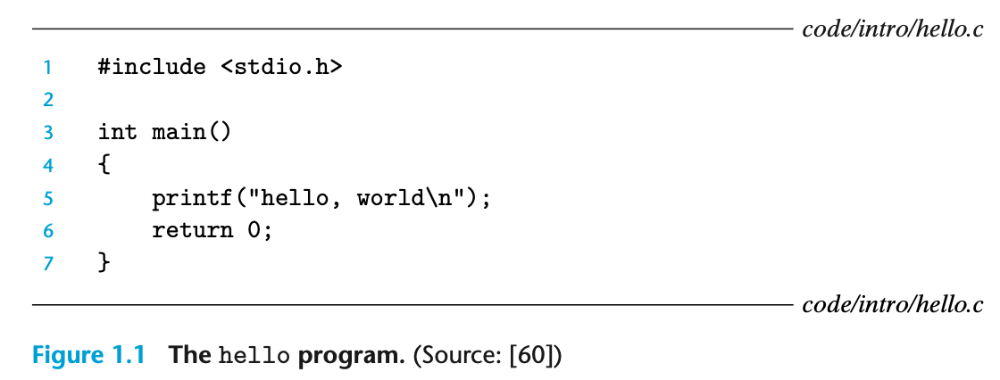

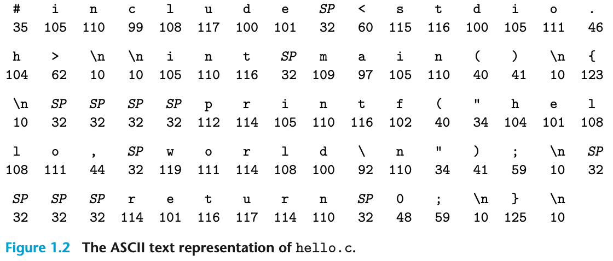

The _hello.c_ program is stored in a file as a sequence of bytes. Each byte has an integer value that corresponds to some character. For example, the first byte has the integer value 35, which corresponds to the character ‘#’. The second byte has the integer value 105, which corresponds to the character ‘i’, and so on. Notice that each text line is terminated by the invisible newline character ‘\n’, which is represented by the integer value 10. Files such as _hello.c_ that consist exclusively of ASCII characters are known as text files. All other files are known as binary files.

The representation of _hello.c_ illustrates a fundamental idea: All information in a system—including disk files, programs stored in memory, user data stored in memory, and data transferred across a network—is represented as a bunch of bits. The only thing that distinguishes different data objects is the context in which we view them. For example, in different contexts, the same sequence of bytes might represent an integer, floating-point number, character string, or machine instruction.

The _hello_ program begins life as a high-level C program because it can be read and understood by human beings in that form. However, in order to run _hello.c_ on the system, the individual C statements must be translated by other programs into a sequence of low-level machine-language instructions. These instructions are then packaged in a form called an _executable object program_ and stored as a binary disk file. Object programs are also referred to as _executable object files_.

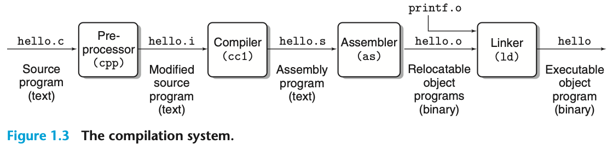

```sh
linux> gcc -o hello hello.c
```

Here, the _gcc_ compiler driver reads the source file _hello.c_ and translates it into an executable object file _hello_. The translation is performed in the sequence of four phases shown in Figure 1.3. The programs that perform the four phases (preprocessor, compiler, assembler, and linker) are known collectively as the compilation system.

> Preprocessing phase. The preprocessor (cpp) modifies the original C program according to directives that begin with the ‘#’ character. For example, the _#include <stdio.h>_ command in line 1 of _hello.c_ tells the preprocessor to read the contents of the system header file stdio.h and insert it directly into the program text. The result is another C program, typically with the .i suffix.
>
> Compilation phase. The compiler (cc1) translates the text file hello.i into the text file hello.s, which contains an assembly-language program.
>
> Assembly phase. Next, the assembler (as) translates hello.s into machine-language instructions, packages them in a form known as a relocatable object program, and stores the result in the object file hello.o. This file is a binary file containing 17 bytes to encode the instructions for function main. If we were to view hello.o with a text editor, it would appear to be gibberish.
>
> Linking phase. Notice that our hello program calls the printf function, which is part of the standard C library provided by every C compiler. The printf function resides in a separate precompiled object file called printf.o, which must somehow be merged with our hello.o program. The linker (ld) handles this merging. The result is the hello file, which is an executable object file (or simply executable) that is ready to be loaded into memory and executed by the system.

Running throughout the system is a collection of electrical conduits called buses that carry bytes of information back and forth between the components. Buses are typically designed to transfer fixed-size chunks of bytes known as words. The number of bytes in a word (the word size) is a fundamental system parameter that varies across systems. Most machines today have word sizes of either 4 bytes (32 bits) or 8 bytes (64 bits).

Each I/O device is connected to the I/O bus by either a controller or an adapter. The distinction between the two is mainly one of packaging. Controllers are chip sets in the device itself or on the system’s main printed circuit board (often called the motherboard). An adapter is a card that plugs into a slot on the motherboard. Regardless, the purpose of each is to transfer information back and forth between the I/O bus and an I/O device.

The main memory is a temporary storage device that holds both a program and the data it manipulates while the processor is executing the program. Physically, main memory consists of a collection of dynamic random access memory (DRAM) chips.

The central processing unit (CPU), or simply processor, is the engine that interprets (or executes) instructions stored in main memory. At its core is a word-size storage device (or register) called the program counter (PC). At any point in time, the PC points at (contains the address of) some machine-language instruction in main memory.

From the time that power is applied to the system until the time that the power is shut off, a processor repeatedly executes the instruction pointed at by the program counter and updates the program counter to point to the next instruction. A processor appears to operate according to a very simple instruction execution model, defined by its instruction set architecture. In this model, instructions execute in strict sequence, and executing a single instruction involves performing a series of steps. The processor reads the instruction from memory pointed at by the program counter (PC), interprets the bits in the instruction, performs some simple operation dictated by the instruction, and then updates the PC to point to the next instruction, which may or may not be contiguous in memory to the instruction that was just executed.

There are only a few of these simple operations, and they revolve around main memory, the register file, and the arithmetic/logic unit (ALU). The register file is a small storage device that consists of a collection of word-size registers, each with its own unique name. The ALU computes new data and address values. Here are some examples of the simple operations that the CPU might carry out at the request of an instruction:

- **Load**: Copy a byte or a word from main memory into a register, overwriting the previous contents of the register.
- **Store**: Copy a byte or a word from a register to a location in main memory, overwriting the previous contents of that location.
- **Operate**: Copy the contents of two registers to the ALU, perform an arithmetic operation on the two words, and store the result in a register, overwriting the previous contents of that register.
- **Jump**: Extract a word from the instruction itself and copy that word into the program counter (PC), overwriting the previous value of the PC.

Initially, the shell program is executing its instructions, waiting for us to type a command. As we type the characters ./hello at the keyboard, the shell program reads each one into a register and then stores it in memory, as shown in Figure 1.5.

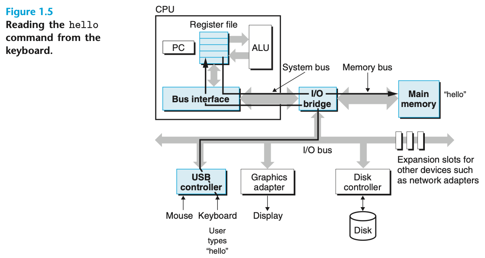

When we hit the enter key on the keyboard, the shell knows that we have finished typing the command. The shell then loads the executable hello file by executing a sequence of instructions that copies the code and data in the hello object file from disk to main memory.

Using a technique known as direct memory access (DMA), the data travel directly from disk to main memory, without passing through the processor. This step is shown in Figure 1.6.

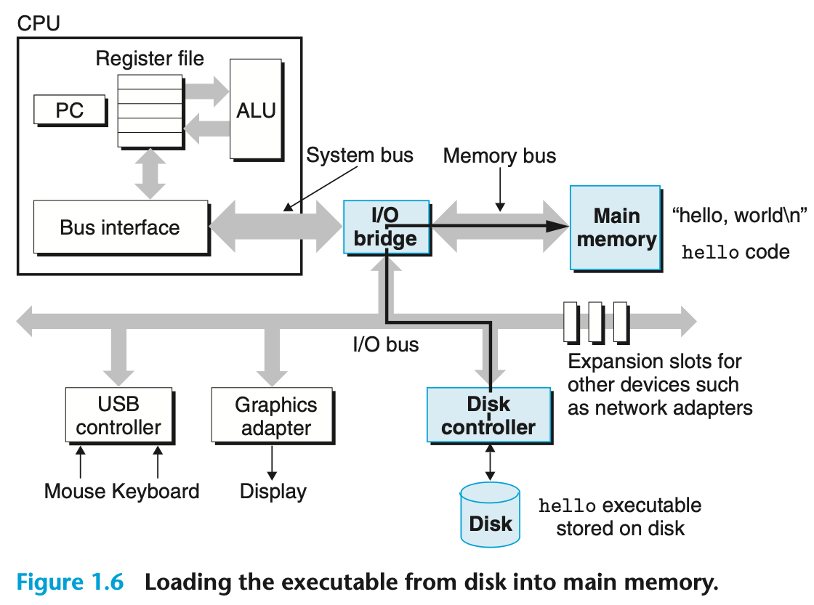

Once the code and data in the hello object file are loaded into memory, the processor begins executing the machine-language instructions in the hello program’s main routine. These instructions copy the bytes in the _hello, world\n_ string from memory to the register file, and from there to the display device, where they are displayed on the screen. This step is shown in Figure 1.7.

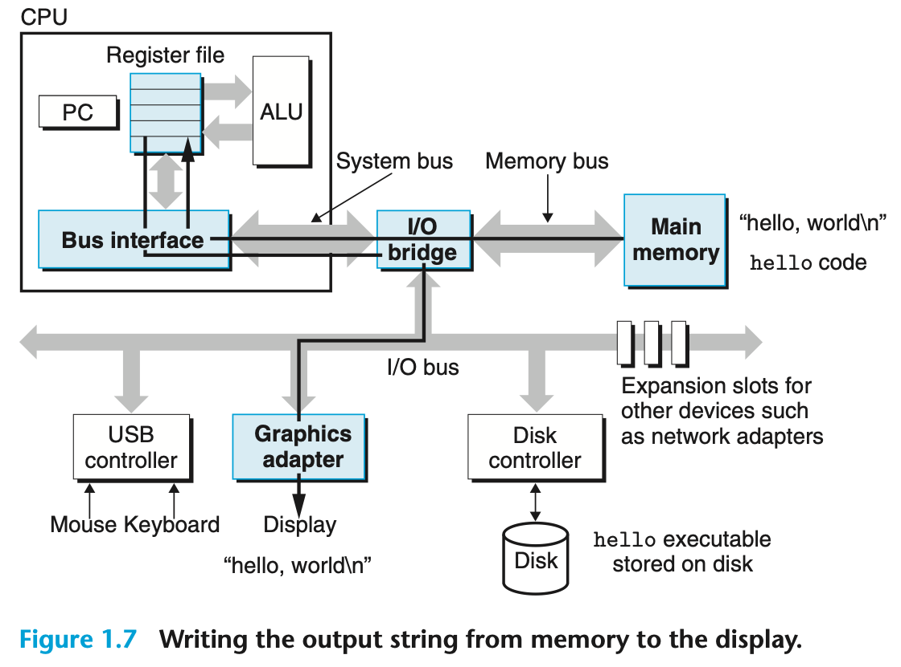

The processor can read data from the register file almost 100 times faster than from memory. Even more troublesome, as semiconductor technology progresses over the years, this processor–memory gap continues to increase.

To deal with the processor–memory gap, system designers include smaller, faster storage devices called cache memories (or simply caches) that serve as temporary staging areas for information that the processor is likely to need in the near future. Figure 1.8 shows the cache memories in a typical system. An L1 cache on the processor chip holds tens of thousands of bytes and can be accessed nearly as fast as the register file. A larger L2 cache with hundreds of thousands to millions of bytes is connected to the processor by a special bus. It might take 5 times longer for the processor to access the L2 cache than the L1 cache, but this is still 5 to 10 times faster than accessing the main memory. The L1 and L2 caches are implemented with a hardware technology known as static random access memory (SRAM).

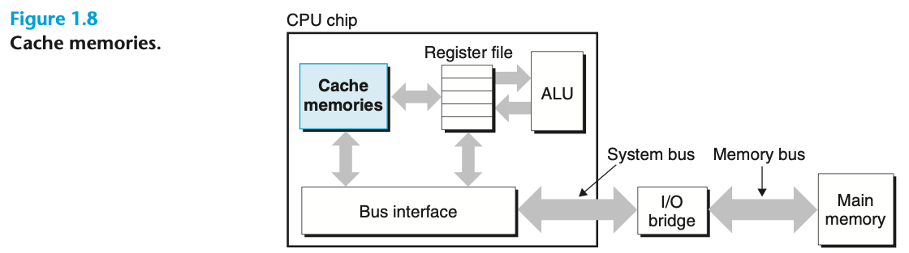

The operating system has two primary purposes: (1) to protect the hardware from misuse by runaway applications and (2) to provide applications with simple and uniform mechanisms for manipulating complicated and often wildly different low-level hardware devices. The operating system achieves both goals via the fundamental abstractions shown in Figure 1.11: processes, virtual memory, and files. As this figure suggests, files are abstractions for I/O devices, virtual memory is an abstraction for both the main memory and disk I/O devices, and processes are abstractions for the processor, main memory, and I/O devices.

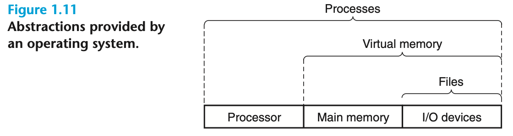

When a program such as _hello_ runs on a modern system, the operating system provides the illusion that the program is the only one running on the system. The program appears to have exclusive use of both the processor, main memory, and I/O devices. The processor appears to execute the instructions in the program, one after the other, without interruption. And the code and data of the program appear to be the only objects in the system’s memory. These illusions are provided by the notion of a process, one of the most important and successful ideas in computer science.

A process is the operating system’s abstraction for a running program. Multiple processes can run concurrently on the same system, and each process appears to have exclusive use of the hardware. By concurrently, we mean that the instructions of one process are interleaved with the instructions of another process.

Traditional systems could only execute one program at a time, while newer multicore processors can execute several programs simultaneously. In either case, a single CPU can appear to execute multiple processes concurrently by having the processor switch among them. The operating system performs this interleaving with a mechanism known as context switching. To simplify the rest of this discussion, we consider only a uniprocessor system containing a single CPU.

The operating system keeps track of all the state information that the process needs in order to run. This state, which is known as the context, includes information such as the current values of the PC, the register file, and the contents of main memory. At any point in time, a uniprocessor system can only execute the code for a single process. When the operating system decides to transfer control from the current process to some new process, it performs a context switch by saving the context of the current process, restoring the context of the new process, and then passing control to the new process. The new process picks up exactly where it left off.

There are two concurrent processes in our example scenario: the shell process and the _hello_ process. Initially, the shell process is running alone, waiting for input on the command line. When we ask it to run the _hello_ program, the shell carries out our request by invoking a special function known as a system call that passes control to the operating system. The operating system saves the shell’s context, creates a new _hello_ process and its context, and then passes control to the new _hello_ process. After _hello_ terminates, the operating system restores the context of the shell process and passes control back to it, where it waits for the next command-line input.

As Figure 1.12 indicates, the transition from one process to another is managed by the operating system kernel. The kernel is the portion of the operating system code that is always resident in memory. When an application program requires some action by the operating system, such as to read or write a file, it executes a special system call instruction, transferring control to the kernel. The kernel then performs the requested operation and returns back to the application program. Note that the kernel is not a separate process. Instead, it is a collection of code and data structures that the system uses to manage all the processes.

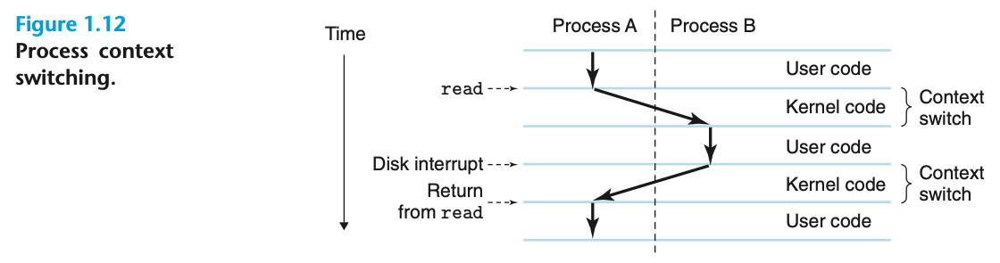

Although we normally think of a process as having a single control flow, in modern systems a process can actually consist of multiple execution units, called threads, each running in the context of the process and sharing the same code and global data. Threads are an increasingly important programming model because of the requirement for concurrency in network servers, because it is easier to share data between multiple threads than between multiple processes, and because threads are typically more efficient than processes. Multi-threading is also one way to make programs run faster when multiple processors are available.

Virtual memory is an abstraction that provides each process with the illusion that it has exclusive use of the main memory. Each process has the same uniform view of memory, which is known as its _virtual address space_. In Linux, the topmost region of the address space is reserved for code and data in the operating system that is common to all processes. The lower region of the address space holds the code and data defined by the user’s process. Note that addresses in Figure 1.13 increase from the bottom to the top.

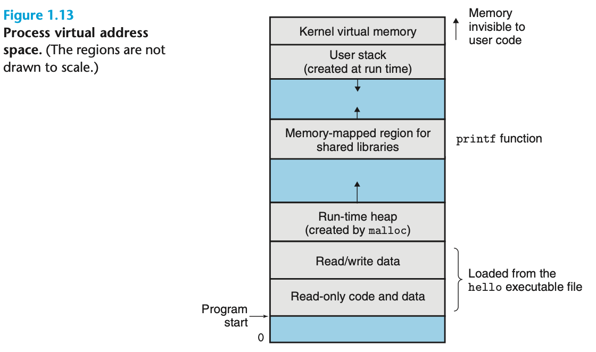

A file is a sequence of bytes, nothing more and nothing less. Every I/O device, including disks, keyboards, displays, and even networks, is modeled as a file. All input and output in the system is performed by reading and writing files, using a small set of system calls known as Unix I/O. This simple and elegant notion of a file is nonetheless very powerful because it provides applications with a uniform view of all the varied I/O devices that might be contained in the system.

The network can be viewed as just another I/O device, as shown in Figure 1.14. When the system copies a sequence of bytes from main memory to the network adapter, the data flow across the network to another machine, instead of, say, to a local disk drive. Similarly, the system can read data sent from other machines and copy these data to its main memory.

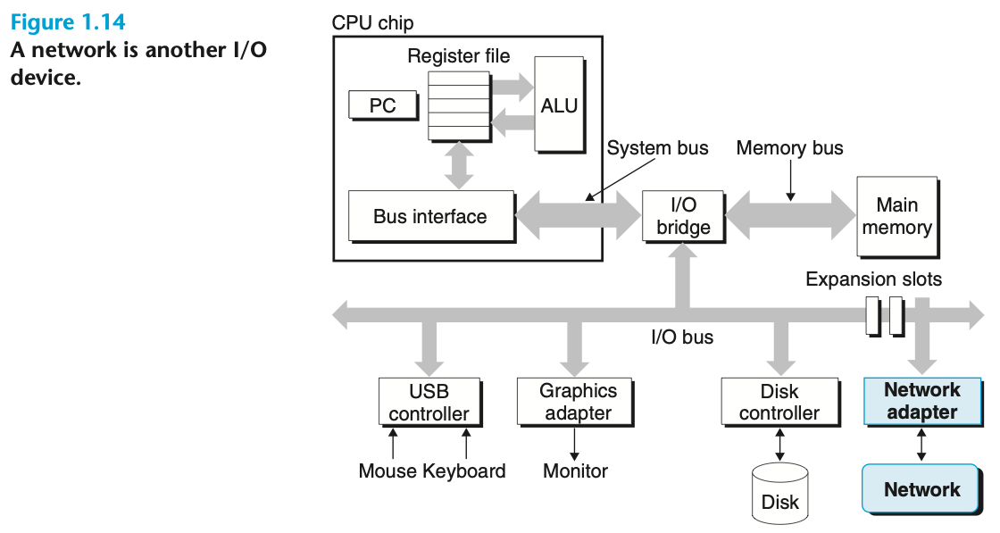

We use the term _concurrency_ to refer to the general concept of a system with multiple, simultaneous activities, and the term _parallelism_ to refer to the use of concurrency to make a system run faster.

When we construct a system consisting of multiple processors all under the control of a single operating system kernel, we have a multiprocessor system. Such systems have been available for large-scale computing since the 1980s, but they have more recently become commonplace with the advent of multi-core processors and _hyperthreading_.

Multi-core processors have several CPUs (referred to as “cores”) integrated onto a single integrated-circuit chip. Figure 1.17 illustrates the organization of a typical multi-core processor, where the chip has four CPU cores, each with its own L1 and L2 caches, and with each L1 cache split into two parts—one to hold recently fetched instructions and one to hold data. The cores share higher levels of cache as well as the interface to main memory.

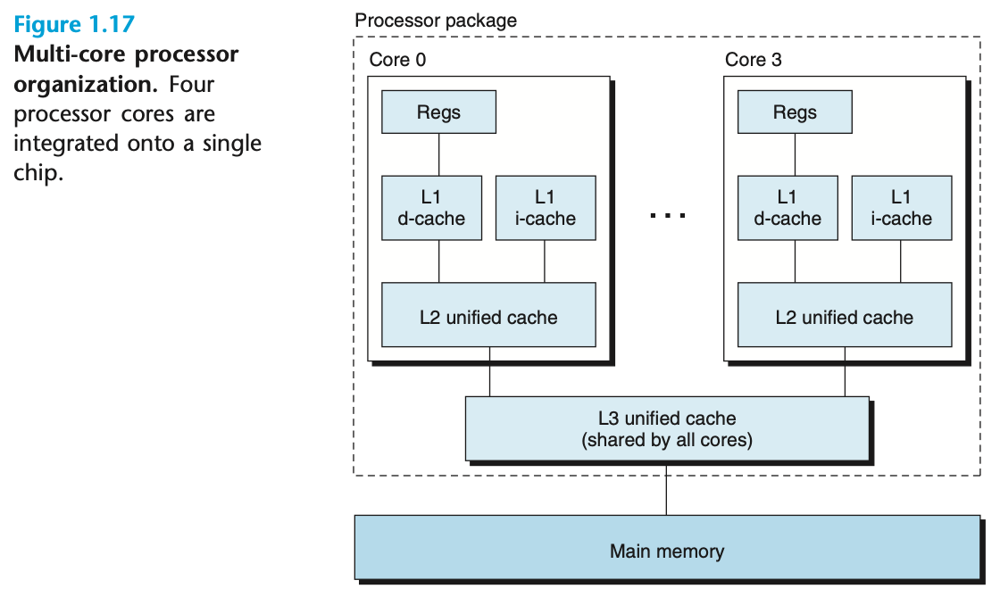

_Hyperthreading_, sometimes called simultaneous multi-threading, is a technique that allows a single CPU to execute multiple flows of control. It involves having multiple copies of some of the CPU hardware, such as program counters and register files, while having only single copies of other parts of the hardware, such as the units that perform floating-point arithmetic. Whereas a conventional processor requires around 20,000 clock cycles to shift between different threads, a hyperthreaded processor decides which of its threads to execute on a cycle-by-cycle basis. It enables the CPU to take better advantage of its processing resources. For example, if one thread must wait for some data to be loaded into a cache, the CPU can proceed with the execution of a different thread. As an example, the Intel Core i7 processor can have each core executing two threads, and so a four-core system can actually execute eight threads in parallel.

At a much lower level of abstraction, modern processors can execute multiple instructions at one time, a property known as _instruction-level parallelism_. Processors that can sustain execution rates faster than 1 instruction per cycle are known as _superscalar_ processors.

The use of abstractions is one of the most important concepts in computer science. For example, one aspect of good programming practice is to formulate a simple application program interface (API) for a set of functions that allow programmers to use the code without having to delve into its inner workings.

On the processor side, the instruction set architecture provides an abstraction of the actual processor hardware. With this abstraction, a machine-code program behaves as if it were executed on a processor that performs just one instruction at a time.

On the operating system side, we have introduced three abstractions: files as an abstraction of I/O devices, virtual memory as an abstraction of program memory, and processes as an abstraction of a running program. To these abstractions we add a new one: the virtual machine, providing an abstraction of the entire computer, including the operating system, the processor, and the programs.
