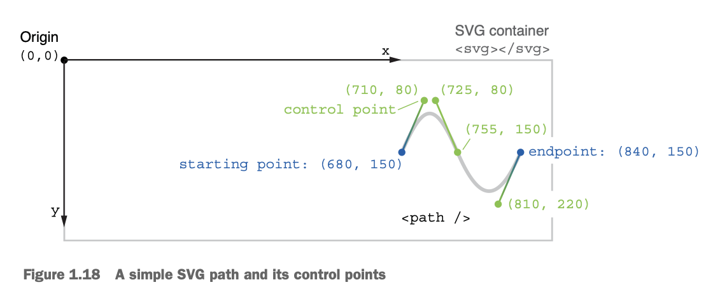
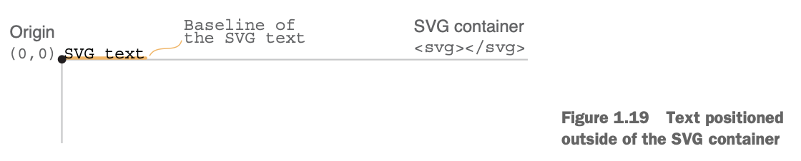
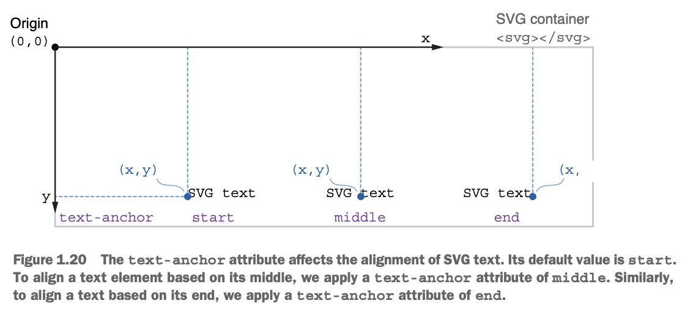

## An introduction to D3.js

### The D3 ecosystem: What you need to know to get started

#### Scalable Vector Graphics

```html
<svg width="900" height="300"></svg>
```

```html
<svg width="900" height="300" style="border:1px solid black;"></svg>
```

```html
<svg width="100%" height="300" style="border:1px solid black;"></svg>
```

Resize your browser again, and notice how the SVG takes the full width available and keeps a fixed height of 300 px. That’s better, but we’ve lost our original aspect ratio.

To make responsive SVG elements, we can use the `viewBox` attribute. In your code editor, remove the `width` and the `height` attributes from the SVG container, and replace them with a `viewBox` attribute. Give it a value of `"0 0 900 300"`:

```html
<svg viewBox="0 0 900 300" style="border:1px solid black;"></svg>
```

Play again with resizing your browser window. What do you notice? The SVG container now adapts to any screen size while maintaining its aspect ratio of 900:300. We have a responsive SVG! 

As you’ve seen, the `viewBox` attribute consists of a list of four values. The first two numbers specify the origin of the coordinate system of the viewBox (x and y). The last two numbers of the `viewBox` attribute are its width and height. They define the aspect ratio of the SVG and ensure that it scales perfectly to fit within any container without distortion.

Usually, we want our SVG to have a maximum width so that it doesn’t get larger than the rest of the content on the page. To do so, wrap the SVG container inside a `div` with a `width` of 100% and a `max-width` of 1200px.

```html
<div style="width:100%; max-width:1200px; margin:0 auto;">  
  <svg viewBox="0 0 900 300" style="border:1px solid black;"> ... </svg> 
</div>
```

##### LINE

```html
<svg>  
  <line x1="50" y1="45" x2="140" y2="225" />
</svg>
```

```html
<line x1="50" y1="45" x2="140" y2="225" stroke="black" />
```

If the `stroke-width` attribute isn’t declared, the browser applies a default value of 1 px:

```html
<line x1="50" y1="45" x2="140" y2="225" stroke="black" stroke-width="3" />
```

##### RECTANGLE

The attributes x and y declare the position of the rectangle’s top-left corner, while the attributes width and height respectively control its width and height.

```html
<rect x="260" y="25" width="120" height="60" fill="#6ba5d7" />
```

```html
<rect x="260" y="25" width="120" height="60" fill="#6ba5d7" fill-opacity="0.3" stroke="#0060b1" stroke-width="3" stroke-opacity="0.6"></rect>
```

If you want your rectangle to have rounded corners, you simply need to add the rx and ry attributes, which, respectively, represent the horizontal and vertical corner radius.

```html
<rect x="260" y="100" width="120" height="60" rx="20" ry="20" fill="#6ba5d7" />
```

```html
<rect x="260" y="175" width="60" height="60"  fill="transparent" stroke="#6ba5d7" />
```

Note that only the stroke is visible on the square because its `fill` attribute has a value of `transparent` (`none` would be the same).

##### CIRCLE AND ELLIPSE

```html
<circle cx="530" cy="80" r="50" />
```

Similarly, the `<ellipse />` element requires attributes for the position of the center of the shape (`cx`, `cy`). While circles have a constant radius, the radius of ellipses varies, giving them a flattened shape. We create this flattened effect by declaring a horizontal radius (rx) and a vertical radius (ry).

```html
<ellipse cx="530" cy="205" rx="50" ry="30" />
```

##### PATH

```html
<path d="M680 150 C 710 80, 725 80, 755 150 S 810 220, 840 150" fill="none" stroke="#773b9a" stroke-width="3" />
```

The `d` attribute contains a list of commands, from where to start drawing the path to the types of curves to use, up to specifying if we want the path to be a closed shape or not.

In this example, illustrated in figure 1.18, the d attribute starts with M680 150, which means “move (M) to the coordinate (680, 150).” Then we draw a cubic Bézier curve from the starting point (680 150) to the endpoint specified by the last coordinate (840 150) in the d attribute. A cubic Bézier curve also needs control points to define how steep the curve is and the directions in which it bends. Those control points start right after the letter C ( “cubic curve”) and stop right after the letter S (“stop”).



Another important thing to remember about paths is that browsers will fill them with black color, unless we set their `fill` attribute to `none` or `transparent`. This is true even if the path isn’t closed, as in our example.

##### TEXT

One of the most significant advantages of inline SVG graphics is that the text they contain is available to screen readers.

By default, the position of SVG text is calculated in reference to its baseline, controlled by the `dominant-baseline` attribute. If the coordinate of the text’s baseline is (0, 0), you can see in figure 1.19 how the actual text ends up outside of the SVG container. Because any element positioned outside of the SVG container is invisible, we don’t see our text.



```html
<text x="60" y="260">line</text>
```

So far, we’ve used the x and y attributes to declare the position of the bottom-left corner of our text elements. But what if we want to set the position of the middle point of our text instead? We can do so by using the attribute `text-anchor` with a value of `middle`, as illustrated in figure 1.20. For example, we can center a text label for our circle shape using this attribute:

```html
<text x="530" y="155" text-anchor="middle">circle</text>
```



##### GROUPING ELEMENTS

If we want the square and the “rect” label to be displayed together and move as one within the SVG container, we can place them inside a `<g>` element, as in the following example.

```html
<g>   
  <rect x="0" y="0" width="60" height="60" />   
  <text x="0" y="85">rect</text> 
</g>
```

Moving a group around the SVG container is done with the `transform` attribute. The `transform` attribute is identical to the CSS `transform` property. It takes a transformation (translate, rotate, scale, etc.) or a stack of transformations as values. To move a group, we use the `translate(x, y)` transformation. If we want to move our `<rect>` and `<text>` elements back to their original position, we need to apply a translation of 260 pixels to the right and 175 pixels down. To do so, we set the transform attribute of the `<g>` element to `transform="translate(260,175)"`:

```html
<g transform="translate(260,175)">  
  <rect x="0" y="0" width="60" height="60" />  
  <text x="0" y="85">rect</text>
</g>
```

Another helpful aspect of the `<g>` element is that its children inherit its styling attributes.

```html
<g fill="#636466" style="font-size:16px; font-family:monospace">   
  <text x="60" y="260">line</text> 
  <text x="530" y="155" style="text-anchor:middle">circle</text> 
  <text x="530" y="260" style="text-anchor:middle">ellipse</text> 
  <text x="730" y="260">path</text> 
</g>
```

[Example code](https://github.com/d3js-in-action-third-edition/code-files/blob/main/chapter_01/01_SVG_Shapes_Gallery/end/index.html)