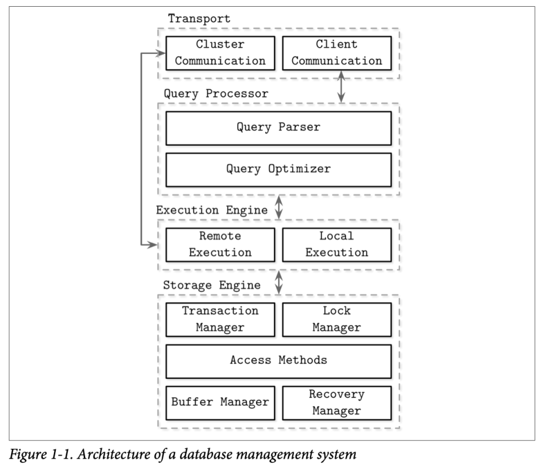

Database management systems can serve different purposes: some are used primarily for temporary hot data, some serve as a long-lived cold storage, some allow complex analytical queries, some only allow accessing values by the key, some are optimized to store time-series data, and some store large blobs efficiently.

Some sources group DBMSs into three major categories:

**Online transaction processing (OLTP) databases:** These handle a large number of user-facing requests and transactions. Queries are often predefined and short-lived.

**Online analytical processing (OLAP) databases:** These handle complex aggregations. OLAP databases are often used for analytics and data warehousing, and are capable of handling complex, long-running ad hoc queries.

**Hybrid transactional and analytical processing (HTAP):** These databases combine properties of both OLTP and OLAP stores.

Database management systems use a client/server model, where database system instances (nodes) take the role of servers, and application instances take the role of clients.

Client requests arrive through the transport subsystem. Requests come in the form of queries, most often expressed in some query language. The transport subsystem is also responsible for communication with other nodes in the database cluster.

## Memory- Versus Disk-Based DBMS

Database systems store data in memory and on disk. In-memory database management systems (sometimes called main memory DBMS) store data primarily in memory and use the disk for recovery and logging. Disk-based DBMS hold most of the data on disk and use memory for caching disk contents or as a temporary storage. Both types of systems use the disk to a certain extent, but main memory databases store their contents almost exclusively in RAM.

Main memory database systems are different from their disk-based counterparts not only in terms of a primary storage medium, but also in which data structures, organi‐zation, and optimization techniques they use.

Databases using memory as a primary data store do this mainly because of performance, comparatively low access costs, and access granularity. Programming for main memory is also significantly simpler than doing so for the disk. Operating systems abstract memory management and allow us to think in terms of allocating and freeing arbitrarily sized memory chunks. On disk, we have to manage data references, serialization formats, freed memory, and fragmentation manually.

The main limiting factors on the growth of in-memory databases are RAM volatility (in other words, lack of durability) and costs. Since RAM contents are not persistent, software errors, crashes, hardware failures, and power outages can result in data loss.

In-memory database systems maintain backups on disk to provide durability and prevent loss of the volatile data. Before the operation can be considered complete, its results have to be written to a sequential log file. To avoid replaying complete log contents during startup or after a crash, in-memory stores maintain a backup copy. The backup copy is maintained as a sorted disk-based structure, and modifications to this structure are often asynchronous (decoupled from client requests) and applied in batches to reduce the number of I/O operations. During recovery, database contents can be restored from the backup and logs. Log records are usually applied to backup in batches. After the batch of log records is processed, backup holds a database snapshot for a specific point in time, and log con‐tents up to this point can be discarded. This process is called checkpointing.

## Column- Versus Row-Oriented DBMS

One of the ways to classify databases is by how the data is stored on disk: row- or column-wise. Tables can be partitioned either horizontally (storing values belonging to the same row together), or vertically (storing values belonging to the same column together).

Examples of row-oriented database management systems are abundant: MySQL, PostgreSQL, and most of the traditional relational databases. The two pioneer open source column-oriented stores are MonetDB and C-Store (C-Store is an open source predecessor to Vertica).

## Data Files and Index Files

Database systems store data records, consisting of multiple fields, in tables, where each table is usually represented as a separate file. Each record in the table can be looked up using a search key. To locate a record, database systems use indexes: auxiliary data structures that allow it to efficiently locate data records without scanning an entire table on every access. Indexes are built using a subset of fields identifying the record.

A database system usually separates data files and index files: data files store data records, while index files store record metadata and use it to locate records in data files. Index files are typically smaller than the data files. Files are partitioned into pages, which typically have the size of a single or multiple disk blocks. Pages can be organized as sequences of records or as a slotted pages.

New records (insertions) and updates to the existing records are represented by key/value pairs. Most modern storage systems do not delete data from pages explicitly. Instead, they use deletion markers (also called tombstones), which contain deletion metadata, such as a key and a timestamp. Space occupied by the records shadowed by their updates or deletion markers is reclaimed during garbage collection, which reads the pages, writes the live (i.e., nonshadowed) records to the new place, and discards the shadowed ones.

> **Data Storage Unit**: A page is a chunk of memory or disk space where data is stored. It usually has a predefined size, such as 4KB, 8KB, or 16KB, which helps in optimizing the read and write operations.
>
> **Efficient Access**: By using pages, database systems can handle large amounts of data in manageable chunks. When the database needs to read or write data, it does so in terms of pages rather than individual records.
>
> **Page Structure**: Each page typically contains multiple records or data entries, along with metadata such as pointers to the next page, and information about the page’s contents.
>
> **Data Management**: When records are inserted or updated, they may modify the content of one or more pages. Deleted records are not immediately removed; instead, deletion markers (tombstones) are used to indicate that certain records are no longer valid. The actual removal of space occupied by these records happens during a process called garbage collection.
>
> **Garbage Collection**: During garbage collection, the system scans pages for live records (those that are not shadowed by updates or deletions). It writes these live records to a new page, thereby reclaiming space from pages that have outdated or deleted records.

Data files (sometimes called primary files) can be implemented as index-organized tables (IOT), heap-organized tables (heap files), or hash-organized tables (hashed files).

Records in heap files are not required to follow any particular order, and most of the time they are placed in a write order. This way, no additional work or file reorganiza‐tion is required when new pages are appended. Heap files require additional index structures, pointing to the locations where data records are stored, to make them searchable.

In hashed files, records are stored in buckets, and the hash value of the key deter‐mines which bucket a record belongs to. Records in the bucket can be stored in append order or sorted by key to improve lookup speed.

Index-organized tables (IOTs) store data records in the index itself. Since records are stored in key order, range scans in IOTs can be implemented by sequentially scanning its contents.

> Index-organized tables (IOTs) are a specific type of table organization in which the table data is stored in an index structure rather than in a separate heap or data file. This approach integrates the data and the index into a single structure, offering several advantages for certain types of queries and data retrieval patterns.
>
> Here’s a detailed overview of index-organized tables:
>
> ### Key Characteristics:
>
> 1. **Single Data Structure**: In an index-organized table, the table’s data rows are stored directly within the index. This means the index itself contains both the keys and the corresponding data, making it a combination of an index and a data storage structure.
> 2. **Primary Key-Based Storage**: The data is organized based on the table's primary key. The index is structured according to the primary key, and the rows are stored in the order of this key. This organization ensures efficient retrieval of rows based on the primary key.
> 3. **Efficient Retrieval**: Because the data and the index are integrated, retrieving a row by its primary key is typically very efficient. There's no need for additional disk seeks to access separate data files—once the primary key is located in the index, the corresponding data can be accessed directly.
> 4. **Ordered Data**: Since the data is stored in the order of the primary key, operations that benefit from sorted data, such as range queries and ordered retrievals, can be more efficient.
> 5. **Space Efficiency**: Index-organized tables can be more space-efficient for certain workloads. Since the data is stored in the index structure, there is no need for additional pointers or links between separate index and data files.
>
> ### Advantages:
>
> 1. **Faster Access for Primary Key Queries**: Accessing data by the primary key is generally faster because it involves a single lookup in the index structure, which is also the data store.
> 2. **Reduced I/O Operations**: With data and index combined, there are fewer I/O operations compared to systems where data and indexes are stored separately. This reduces the number of disk seeks needed to retrieve data.
> 3. **Efficient Range Queries**: For queries that involve ranges of primary key values, the ordered structure of an index-organized table can make these queries faster.
>
> ### Disadvantages:
>
> 1. **Overhead for Non-Primary Key Queries**: If a query frequently accesses data using columns other than the primary key, performance might not be as optimal. Non-primary key searches might require additional processing or the use of secondary indexes.
> 2. **Complex Updates and Inserts**: Insertion and update operations can be more complex and potentially slower because they may require maintaining the index structure and reordering the data as necessary.
> 3. **Potential for Fragmentation**: Over time, as data is inserted, updated, and deleted, the index-organized table might become fragmented, which can impact performance. Regular maintenance like reorganizing or rebuilding the index might be required.

Storing data records in the index allows us to reduce the number of disk seeks by at least one, since after traversing the index and locating the searched key, we do not have to address a separate file to find the associated data record.

> **Disk Seek**: A disk seek is the process of moving the disk’s read/write head to the location where the data is stored. Each seek involves physically moving parts of the disk drive or accessing different locations in an SSD, which can be time-consuming.
>
> **Traditional Approach**: In a traditional database system, the index and the actual data records are stored in separate files. To retrieve a data record, you first need to:
>
> * Perform a disk seek to access the index file.
> * Traverse the index to find the location of the data record.
> * Perform another disk seek to access the data file using the information obtained from the index.
>
> This approach requires at least two separate disk seeks: one to access the index file and another to access the data file.
>
> **Storing Data Records in the Index**: When data records are stored directly in the index, the index itself contains both the metadata (or keys) and the actual data records. This means that:
>
> * You only need to perform one disk seek to access the index file because the index directly provides both the key and the corresponding data.
> * Since the data is within the same file as the index, no additional seek is necessary to access the data record.

When records are stored in a separate file, index files hold data entries, uniquely iden‐tifying data records and containing enough information to locate them in the data file. For example, we can store file offsets (sometimes called row locators), locations of data records in the data file, or bucket IDs in the case of hash files. In index-organized tables, data entries hold actual data records.

Storage structures have three common variables: they use buffering (or avoid using it), use immutable (or mutable) files, and store values in order (or out of order). 

