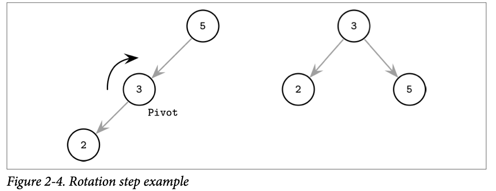
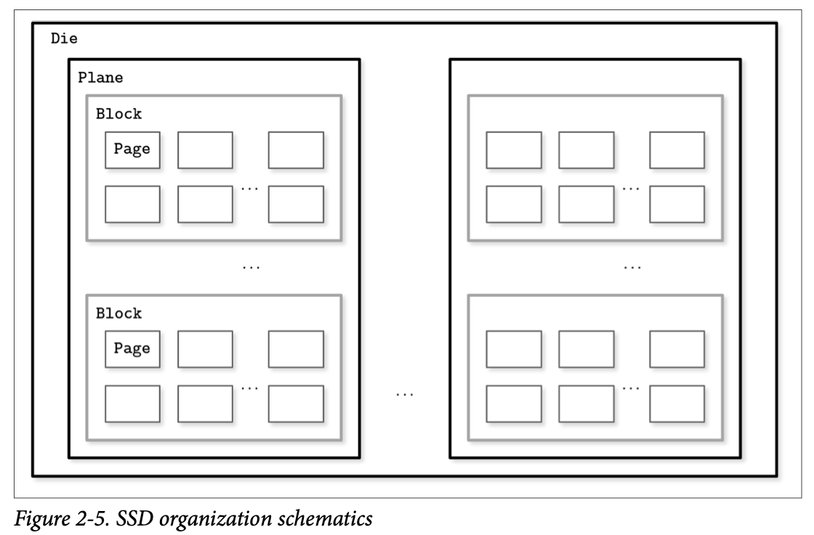
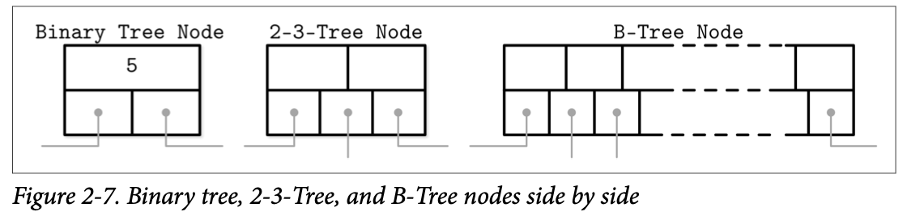
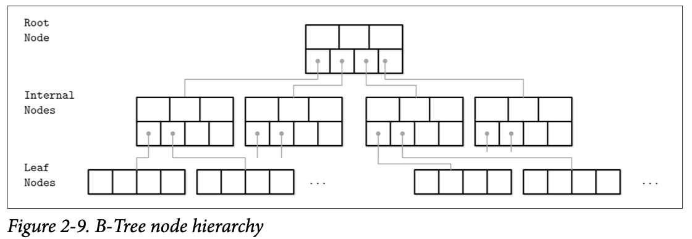
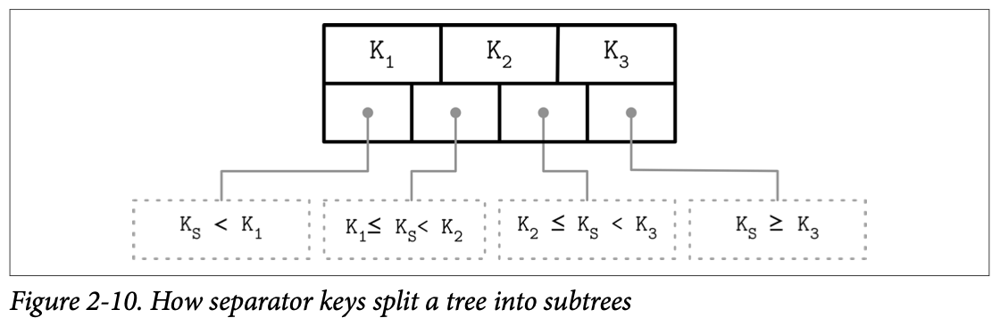
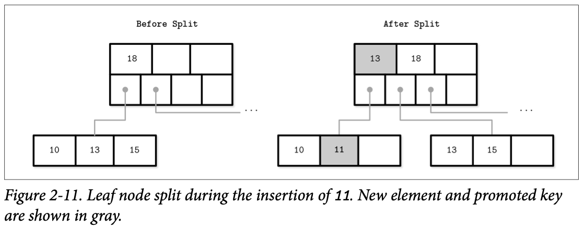
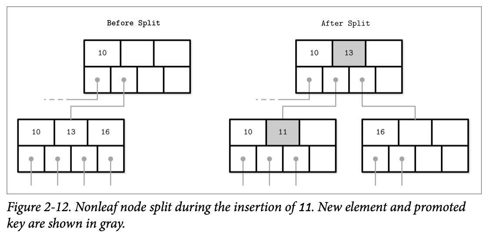
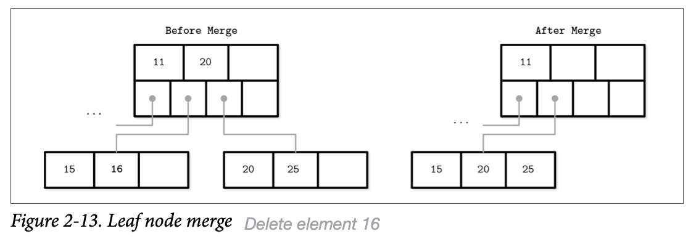
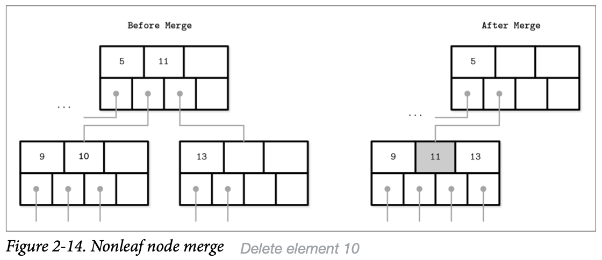

In the previous chapter, we separated storage structures in two groups: mutable and immutable ones, and identified immutability as one of the core concepts influencing their design and implementation. Most of the mutable storage structures use an in-place update mechanism. During insert, delete, or update operations, data records are updated directly in their locations in the target file.

The balanced tree is defined as one that has a height of $log{_2}{N}$, where N is the total number of items in the tree, and the difference in height between the two subtrees is not greater than one.

In the balanced tree, following the left or right node pointer reduces the search space in half on average, so lookup complexity is logarithmic: O($log{_2}{N}$). If the tree is not balanced, worst-case complexity goes up to O(N), since we might end up in a situation where all elements end up on one side of the tree.

One of the ways to keep the tree balanced is to perform a rotation step after nodes are added or removed. If the insert operation leaves a branch unbalanced (two consecu‐tive nodes in the branch have only one child), we can rotate nodes around the middle one. In the example shown in Figure 2-4, during rotation the middle node (3), known as a rotation pivot, is promoted one level higher, and its parent becomes its right child.

As previously mentioned, unbalanced trees have a worst-case complexity of O(N). Balanced trees give us an average O($log{_2}{N}$). At the same time, due to low fanout (fanout is the maximum allowed number of children per node), we have to perform balancing, relocate nodes, and update pointers rather frequently. Increased maintenance costs make BSTs impractical as on-disk data structures.

If we wanted to maintain a BST on disk, we’d face several problems. One problem is locality: since elements are added in random order, there’s no guarantee that a newly created node is written close to its parent, which means that node child pointers may span across several disk pages. We can improve the situation to a certain extent by modifying the tree layout and using *paged binary trees*.

Another problem, closely related to the cost of following child pointers, is tree height. Since binary trees have a fanout of just two, height is a binary logarithm of the number of the elements in the tree, and we have to perform O($log{_2}{N}$) seeks to locate the searched element and, subsequently, perform the same number of disk transfers. 2-3Trees and other low-fanout trees have a similar limitation: while they are useful as in-memory data structures, small node size makes them impractical for external storage.

Considering these factors, a version of the tree that would be better suited for disk implementation has to exhibit the following properties: 

- High fanout to improve locality of the neighboring keys.
- Low height to reduce the number of seeks during traversal.

> Fanout and height are inversely correlated: the higher the fanout, the lower the height. If fanout is high, each node can hold more children, reducing the number of nodes and, subsequently, reducing height.

On-disk data structures are often used when the amounts of data are so large that keeping an entire dataset in memory is impossible or not feasible. Only a fraction of the data can be cached in memory at any time, and the rest has to be stored on disk in a manner that allows efficiently accessing it.

On spinning disks, seeks increase costs of random reads because they require disk rotation and mechanical head movements to position the read/write head to the desired location. However, once the expensive part is done, reading or writing contig‐uous bytes (i.e., sequential operations) is relatively cheap.

The smallest transfer unit of a spinning drive is a sector, so when some operation is performed, at least an entire sector can be read or written. Sector sizes typically range from 512 bytes to 4 Kb.

Head positioning is the most expensive part of an operation on the HDD (Hard Disk Drive). This is one of the reasons we often hear about the positive effects of *sequential I/O*: reading and writing contiguous memory segments from disk.

Solid state drives (SSDs) do not have moving parts: there’s no disk that spins, or head that has to be positioned for the read. A typical SSD is built of memory cells, connec‐ted into strings (typically 32 to 64 cells per string), strings are combined into arrays, arrays are combined into pages, and pages are combined into blocks.

Depending on the exact technology used, a cell can hold one or multiple bits of data. Pages vary in size between devices, but typically their sizes range from 2 to 16 Kb. Blocks typically contain 64 to 512 pages. Blocks are organized into planes and, finally, planes are placed on a die. SSDs can have one or more dies.

The smallest unit that can be written (programmed) or read is a page. However, we can only make changes to the empty memory cells (i.e., to ones that have been erased before the write). The smallest erase entity is not a page, but a block that holds multi‐ple pages, which is why it is often called an erase block. Pages in an empty block have to be written sequentially.

The part of a flash memory controller responsible for mapping page IDs to their physical locations, tracking empty, written, and discarded pages, is called the Flash Translation Layer (FTL). It is also responsible for garbage collection, during which FTL finds blocks it can safely erase. Some blocks might still contain live pages. In this case, it relocates live pages from these blocks to new locations and remaps page IDs to point there. After this, it erases the now-unused blocks, making them available for writes.

Since in both device types (HDDs and SSDs) we are addressing chunks of memory rather than individual bytes (i.e., accessing data block-wise), most operating systems have a block device abstraction. It hides an internal disk structure and buffers I/O operations internally, so when we’re reading a single word from a block device, the whole block containing it is read. This is a constraint we cannot ignore and should always take into account when working with disk-resident data structures.

Besides the cost of disk access itself, the main limitation and design condition for building efficient on-disk structures is the fact that the smallest unit of disk operation is a block. To follow a pointer to the specific location within the block, we have to fetch an entire block. Since we already have to do that, we can change the layout of the data structure to take advantage of it.

B-Trees are sorted: keys inside the B-Tree nodes are stored in order. Because of that, to locate a searched key, we can use an algorithm like binary search. This also implies that lookups in B-Trees have logarithmic complexity. For example, finding a searched key among 4 billion ($4 \bullet 10^9$) items takes about 32 comparisons. If we had to make a disk seek for each one of these comparisons, it would significantly slow us down, but since B-Tree nodes store dozens or even hundreds of items, we only have to make one disk seek per level jump.

Using B-Trees, we can efficiently execute both point and range queries. Point queries, expressed by the equality (=) predicate in most query languages, locate a single item. On the other hand, range queries, expressed by comparison (<, >, ≤, and ≥) predicates, are used to query multiple data items in order.

Since B-Trees are a page organization technique (i.e., they are used to organize and navigate fixed-size pages), we often use terms node and page interchangeably.

The relation between the node capacity and the number of keys it actually holds is called occupancy.

B-Trees are characterized by their fanout: the number of keys stored in each node. Higher fanout helps to amortize the cost of structural changes required to keep the tree balanced and to reduce the number of seeks by storing keys and pointers to child nodes in a single block or multiple consecutive blocks. Balancing operations (namely, splits and merges) are triggered when the nodes are full or nearly empty.

A more precise name for the described data structure is $B^+$-Tree. B-Trees allow storing values on any level: in root, internal, and leaf nodes. $B^+$-Trees store values only in leaf nodes. Internal nodes store only separator keys used to guide the search algorithm to the associated value stored on the leaf level. Since values in $B^+$-Trees are stored only on the leaf level, all operations (inserting, updating, removing, and retrieving data records) affect only leaf nodes and propagate to higher levels only during splits and merges. $B^+$-Trees are referred to as a default design, and MySQL InnoDB refers to its $B^+$-Tree implementation as B-tree.

Keys stored in B-Tree nodes are called index entries, separator keys, or divider cells. They split the tree into subtrees (also called branches or subranges), holding corresponding key ranges. Keys are stored in sorted order to allow binary search. A sub‐tree is found by locating a key and following a corresponding pointer from the higher to the lower level.

Some B-Tree variants also have sibling node pointers, most often on the leaf level, to simplify range scans. These pointers help avoid going back to the parent to find the next sibling. Some implementations have pointers in both directions, forming a double-linked list on the leaf level, which makes the reverse iteration possible.

What sets B-Trees apart is that, rather than being built from top to bottom (as binary search trees), they’re constructed the other way around—from bottom to top. The number of leaf nodes grows, which increases the number of internal nodes and tree height.

### B-Tree Node Splits

### B-Tree Node Merges

