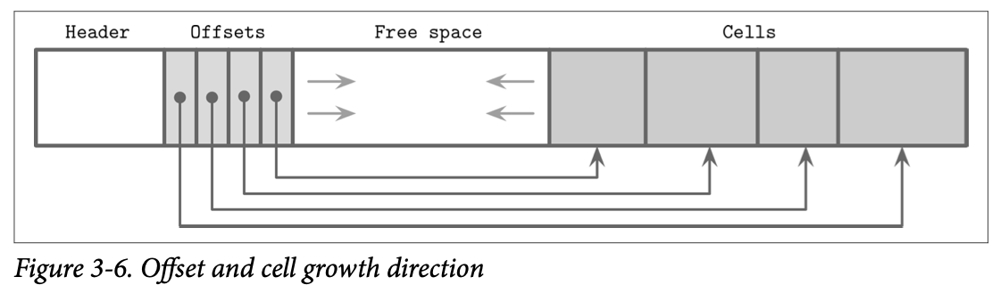

With the basic semantics of B-Trees covered, we are now ready to explore how exactly B-Trees and other structures are implemented on disk. We access the disk in a way that is different from how we access main memory: from an application developer’s perspective, memory accesses are mostly transparent. Because of virtual memory, we do not have to manage offsets manually. Disks are accessed using *system calls*. We usually have to specify the offset inside the target file, and then interpret on-disk representation into a form suitable for main memory.

Languages with an unmanaged memory model allow us to allocate more memory any time we need (within reasonable bounds) without us having to think or worry about whether or not there’s a contiguous memory segment available, whether or not it is fragmented, or what happens after we free it. On disk, we have to take care of garbage collection and fragmentation ourselves.

Data layout is much less important in memory than on disk. For a disk-resident data structure to be efficient, we need to lay out data on disk in ways that allow quick access to it, and consider the specifics of a persistent storage medium, come up with binary data formats, and find a means to serialize and deserialize data efficiently.

Records consist of primitives like numbers, strings, booleans, and their combinations. However, when transferring data over the network or storing it on disk, we can only use byte sequences. This means that, in order to send or write the record, we have to serialize it (convert it to an interpretable sequence of bytes) and, before we can use it after receiving or reading, we have to deserialize it (translate the sequence of bytes back to the original record).

In binary data formats, we always start with primitives that serve as building blocks for more complex structures. Different numeric types may vary in size. byte value is 8 bits, short is 2 bytes (16 bits), int is 4 bytes (32 bits), and long is 8 bytes (64 bits).

Floating-point numbers (such as float and double) are represented by their sign, fraction, and exponent. The IEEE Standard for Binary Floating-Point Arithmetic (IEEE 754) standard describes widely accepted floating-point number representation. A 32-bit float represents a single-precision value. For example, a floating-point number 0.15652 has a binary representation, as shown in Figure 3-2. The first 23 bits represent a fraction, the following 8 bits represent an exponent, and 1 bit represents a sign (whether or not the number is negative).

Strings and other variable-size data types (such as arrays of fixed-size data) can be serialized as a number, representing the length of the array or string, followed by *size* bytes: the actual data. For strings, this representation is often called *UCSD String* or *Pascal String*, named after the popular implementation of the Pascal programming language.

An alternative to Pascal strings is *null-terminated strings*, where the reader consumes the string byte-wise until the end-of-string symbol is reached. The Pascal string approach has several advantages: it allows finding out a length of a string in constant time, instead of iterating through string contents.

Database systems store data records in data and index files. These files are partitioned into fixed-size units called pages, which often have a size of multiple filesystem blocks. Page sizes usually range from 4 to 16 Kb. Each B-Tree node occupies one page or multiple pages linked together, so in the context of B-Trees the terms node and page (and even block) are often used interchangeably.

### Slotted Pages

To efficiently store variable-size records such as strings, binary large objects (BLOBs), etc., we can use an organization technique called slotted page (i.e., a page with slots) or slot directory. This approach is used by many databases, for example, PostgreSQL

We organize the page into a collection of slots or cells and split out pointers and cells in two independent memory regions residing on different sides of the page. This means that we only need to reorganize pointers addressing the cells to preserve the order, and deleting a record can be done either by nullifying its pointer or removing it.

Removing an item from the page does not have to remove the actual cell and shift other cells to reoccupy the freed space. Instead, the cell can be marked as deleted and an in-memory availability list can be updated with the amount of freed memory and a pointer to the freed value. The availability list stores offsets of freed segments and their sizes. When inserting a new cell, we first check the availability list to find if there’s a segment where it may fit.

> [Slotted Pages - A disk-based page layout](https://siemens.blog/posts/database-page-layout/)

