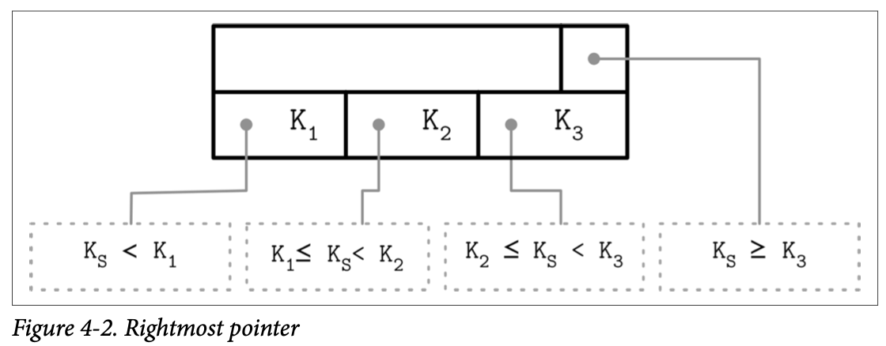
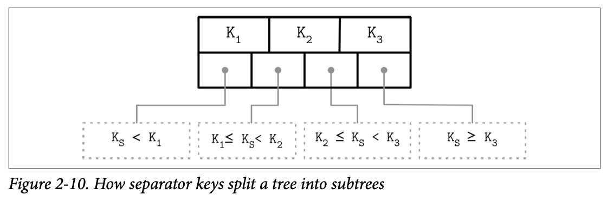
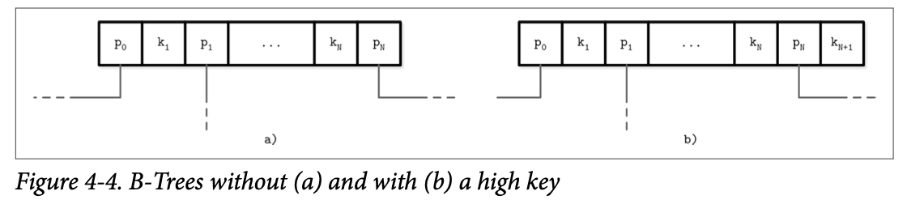
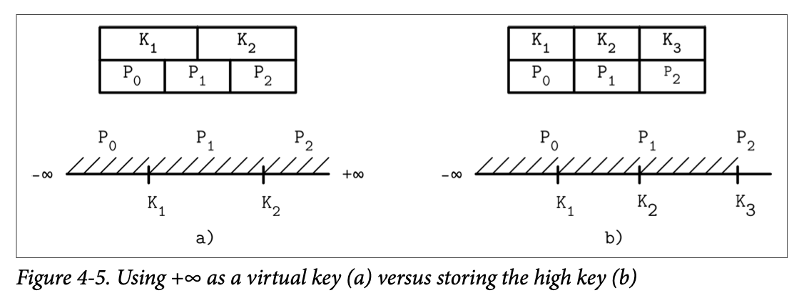
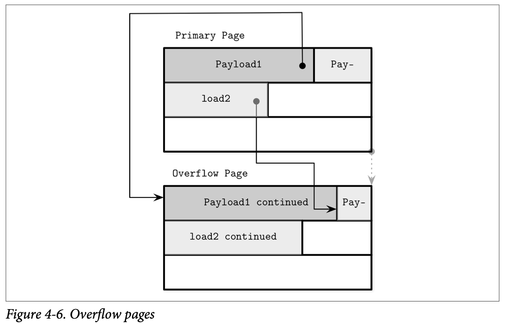
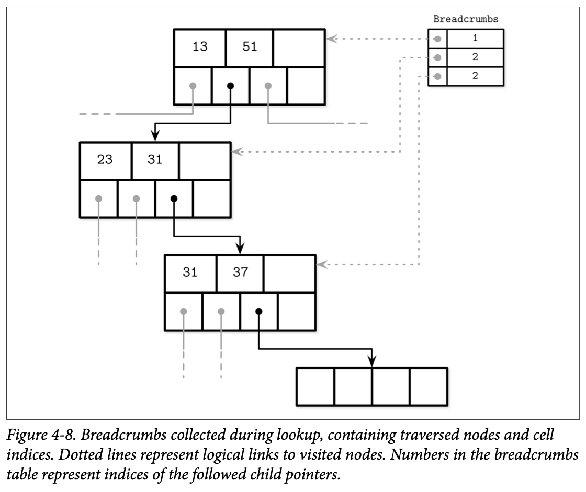
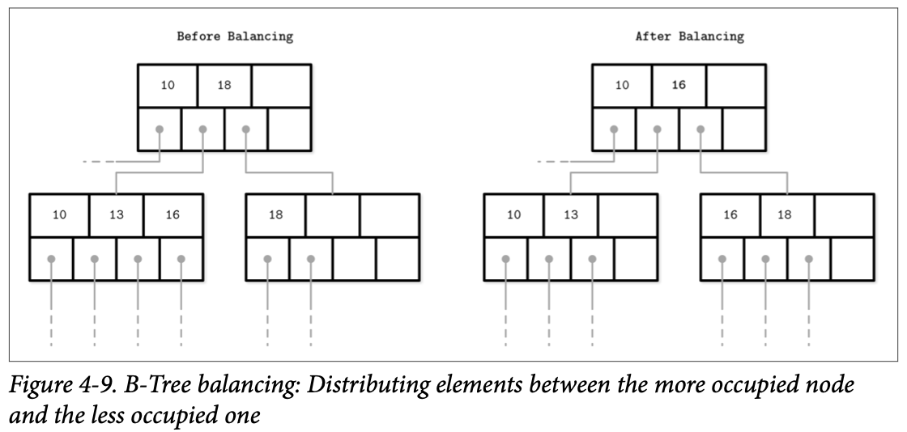

### Page Header

The page header holds information about the page that can be used for navigation, maintenance, and optimizations. For example, PostgreSQL stores the page size and layout version in the header. In MySQL InnoDB, page header holds the number of heap records, level, and some other implementation-specific values. In SQLite, page header stores the number of cells and a rightmost pointer.

### Sibling Links

Some implementations store forward and backward links, pointing to the left and right sibling pages. These links help to locate neighboring nodes without having to ascend back to the parent. This approach adds some complexity to split and merge operations, as the sibling offsets have to be updated as well.

### Rightmost Pointers

In many implementations, nodes look more like the ones displayed in Figure 4-2: each separator key has a child pointer, while the last pointer is stored separately, since it’s not paired with any key. You can compare this to Figure 2-10.

### Node High Keys

We can take a slightly different approach and store the rightmost pointer in the cell along with the node high key. The high key represents the highest possible key that can be present in the subtree under the current node. This approach is used by PostgreSQL and is called $B^{link}$-Trees.

$B^{link}$-Trees add a $K_{N+1}$ key to each node. It specifies an upper bound of keys that can be stored in the subtree to which the pointer $P_N$ points, and therefore is an upper bound of values that can be stored in the current subtree. Both approaches are shown in Figure 4-4: (a) shows a node without a high key, and (b) shows a node with a high key.

In this case, pointers can be stored pairwise, and each cell can have a corresponding pointer, which might simplify rightmost pointer handling as there are not as many edge cases to consider.

### Overflow Pages

The B-Tree algorithm specifies that every node keeps a specific number of items. Since some values have different sizes, we may end up in a situation where, according to the B-Tree algorithm, the node is not full yet, but there’s no more free space on the fixed-size page that holds this node. Resizing the page requires copying already writ‐ten data to the new region and is often impractical. However, we still need to find a way to increase or extend the page size.

To implement variable-size nodes without copying data to the new contiguous region, we can build nodes from multiple linked pages. For example, the default page size is 4K, and after inserting a few values, its data size has grown over 4K. Instead of allowing arbitrary sizes, nodes are allowed to grow in 4K increments, so we allocate a 4K extension page and link it from the original one. These linked page extensions are called *overflow pages*. For clarity, we call the original page the *primary page* in the scope of this section.

Most B-Tree implementations allow storing only up to a fixed number of payload bytes in the B-Tree node directly and spilling the rest to the overflow page. This value is calculated by dividing the node size by fanout. Using this approach, we cannot end up in a situation where the page has no free space, as it will always have at least *max_payload_size* bytes.

When the inserted payload is larger than *max_payload_size*, the node is checked for whether or not it already has any associated *overflow pages*. If an overflow page already exists and has enough space available, extra bytes from the payload are spilled there. Otherwise, a new overflow page is allocated.

When the first overflow page is allocated, its page ID is stored in the header of the primary page. If a single overflow page is not enough, multiple overflow pages are linked together by storing the next overflow page ID in the previous one’s header. Several pages may have to be traversed to locate the overflow part for the given payload.

For data records, we have to locate their overflow parts to return them to the user. However, this doesn’t matter much, since it’s an infrequent operation. If all data records are oversize, it is worth considering specialized blob storage for large values.

### Breadcrumbs

Instead of storing and maintaining parent node pointers, it is possible to keep track of nodes traversed on the path to the target leaf node, and follow the chain of parent nodes in reverse order in case of cascading splits during inserts, or merges during deletes.

During operations that may result in structural changes of the B-Tree (insert or delete), we first traverse the tree from the root to the leaf to find the target node and the insertion point. Since we do not always know up front whether or not the opera‐tion will result in a split or merge (at least not until the target leaf node is located), we have to collect breadcrumbs.

Breadcrumbs contain references to the nodes followed from the root and are used to backtrack them in reverse when propagating splits or merges. The most natural data structure for this is a stack. For example, PostgreSQL stores breadcrumbs in a stack, internally referenced as *BTStack*.

### Rebalancing

Some B-Tree implementations attempt to postpone split and merge operations to amortize their costs by rebalancing elements within the level, or moving elements from more occupied nodes to less occupied ones for as long as possible before finally performing a split or merge. This helps to improve node occupancy and may reduce the number of levels within the tree at a potentially higher maintenance cost of rebalancing.

Load balancing can be performed during insert and delete operations. To improve space utilization, instead of splitting the node on overflow, we can trans‐fer some of the elements to one of the sibling nodes and make space for the insertion. Similarly, during delete, instead of merging the sibling nodes, we may choose to move some of the elements from the neighboring nodes to ensure the node is at least half full.

B*-Trees keep distributing data between the neighboring nodes until both siblings are full. Then, instead of splitting a single node into two half-empty ones, the algorithm splits two nodes into three nodes, each of which is two-thirds full. SQLite uses this variant in the implementation. This approach improves an average occupancy by postponing splits, but requires additional tracking and balancing logic. Higher utilization also means more efficient searches, because the height of the tree is smaller and fewer pages have to be traversed on the path to the searched leaf.

Figure 4-9 shows distributing elements between the neighboring nodes, where the left sibling contains more elements than the right one. Elements from the more occupied node are moved to the less occupied one. Since balancing changes the min/max invariant of the sibling nodes, we have to update keys and pointers at the parent node to preserve it.

### Right-Only Appends

Many database systems use auto-incremented monotonically increasing values as primary index keys. This case opens up an opportunity for optimization, since all the insertions are happening toward the end of the index (in the rightmost leaf), so most of the splits occur on the rightmost node on each level. Moreover, since the keys are monotonically incremented, given that the ratio of appends versus updates and deletes is low, nonleaf pages are also less fragmented than in the case of randomly ordered keys.

PostgreSQL is calling this case a *fastpath*. When the inserted key is strictly greater than the first key in the rightmost page, and the rightmost page has enough space to hold the newly inserted entry, the new entry is inserted into the appropriate location in the cached rightmost leaf, and the whole read path can be skipped. SQLite has a similar concept and calls it *quickbalance*.

