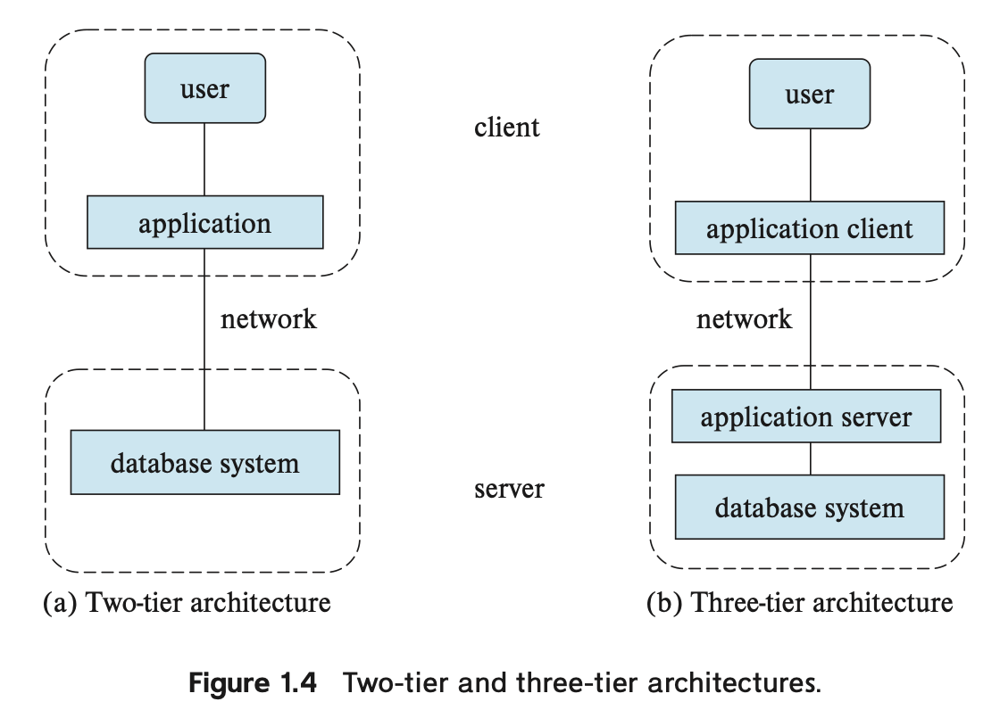

Managing complexity is challenging, not only in the management of data but in any domain. Key to the management of complexity is the concept of abstraction. Abstraction allows a person to use a complex device or system without having to know the details of how that device or system is constructed. By providing a high level of abstraction, a database system makes it possible for an enterprise to combine data of various types into a unified repository of the information needed to run the enterprise.

Broadly speaking, there are two modes in which databases are used.

- The first mode is to support online transaction processing, where a large number of users use the database, with each user retrieving relatively small amounts of data, and performing small updates. 
- The second mode is to support data analytics, that is, the processing of data to draw conclusions, and infer rules or decision procedures, which are then used to drive business decisions.

Keeping organizational information in a file-processing system has a number of major disadvantages:

- Data redundancy and inconsistency.
- Difficulty in accessing data.
- Data isolation.
- Integrity problems.
- Atomicity problems.
- Concurrent-access anomalies.
- Security problems.

Underlying the structure of a database is the data model: a collection of conceptual tools for describing data, data relationships, data semantics, and consistency constraints.

There are a number of different data models that we shall cover in the text. The data models can be classified into four different categories:

- **Relational Model**. The relational model uses a collection of tables to represent both data and the relationships among those data. Each table has multiple columns, and each column has a unique name. Tables are also known as relations. The relational model is an example of a record-based model. Record-based models are so named because the database is structured in fixed-format records of several types. Each table contains records of a particular type. Each record type defines a fixed number of fields, or attributes. The columns of the table correspond to the attributes of the record type. The relational data model is the most widely used data model, and a vast majority of current database systems are based on the relational model.
- **Entity-Relationship Model**. The entity-relationship (E-R) data model uses a collection of basic objects, called entities, and relationships among these objects. An entity is a “thing” or “object” in the real world that is distinguishable from other objects. The entity-relationship model is widely used in database design.
- **Semi-structured Data Model**. The semi-structured data model permits the specification of data where individual data items of the same type may have different sets of attributes. This is in contrast to the data models mentioned earlier, where every data item of a particular type must have the same set of attributes. JSON and Extensible Markup Language (XML) are widely used semi-structured data representations.
- **Object-Based Data Model**. Object-oriented programming (especially in Java, C++, or C#) has become the dominant software-development methodology. This led initially to the development of a distinct object-oriented data model, but today the concept of objects is well integrated into relational databases. Standards exist to store objects in relational tables. Database systems allow procedures to be stored in the database system and executed by the database system. This can be seen as extending the relational model with notions of encapsulation, methods, and object identity.

Since many database-system users are not computer trained, developers hide the complexity from users through several levels of data abstraction, to simplify users’ interactions with the system: 

- **Physical level**. The lowest level of abstraction describes **how** the data are actually stored. The physical level describes complex low-level data structures in detail.
- **Logical level**. The next-higher level of abstraction describes **what** data are stored in the database, and what relationships exist among those data. The logical level thus describes the entire database in terms of a small number of relatively simple structures. Although implementation of the simple structures at the logical level may involve complex physical-level structures, the user of the logical level does not need to be aware of this complexity. This is referred to as **physical data independence**. Database administrators, who must decide what information to keep in the database, use the logical level of abstraction.
- **View level**. The highest level of abstraction describes only part of the entire database. Even though the logical level uses simpler structures, complexity remains because of the variety of information stored in a large database. Many users of the database system do not need all this information; instead, they need to access only a part of the database. The view level of abstraction exists to simplify their interaction with the system. The system may provide many views for the same database.

An important feature of data models, such as the relational model, is that they hide such low-level implementation details from not just database users, but even from database-application developers. The database system allows application developers to store and retrieve data using the abstractions of the data model, and converts the abstract operations into operations on the low-level implementation.

The collection of information stored in the database at a particular moment is called an **instance** of the database. The overall design of the database is called the database **schema**.

Database systems have several schemas, partitioned according to the levels of abstraction. The **physical schema** describes the database design at the physical level, while the **logical schema** describes the database design at the logical level. A database may also have several schemas at the view level, sometimes called **subschemas**, that describe different views of the database.

Of these, the **logical schema** is by far the most important in terms of its effect on application programs, since programmers construct applications by using the logical schema. The **physical schema** is hidden beneath the logical schema and can usually be changed easily without affecting application programs. Application programs are said to **exhibit physical data independence** if they do not depend on the physical schema and thus need not be rewritten if the physical schema changes.

A database system provides a **data-definition language** (**DDL**) to specify the database schema and a **data-manipulation language** (**DML**) to express database queries and updates. In practice, the data-definition and data-manipulation languages are not two separate languages; instead they simply form parts of a single database language, such as the SQL language. Almost all relational database systems employ the SQL language,

The data values stored in the database must satisfy certain **consistency constraints**. For example, suppose the university requires that the account balance of a department must never be negative. The database system checks these constraints every time the database is updated. In general, a constraint can be an arbitrary predicate pertaining to the database. However, arbitrary predicates may be costly to test. Thus, database systems implement only those integrity constraints that can be tested with minimal overhead: 

- **Domain Constraints**. A domain of possible values must be associated with every attribute (for example, integer types, character types, date/time types). Declaring an attribute to be of a particular domain acts as a constraint on the values that it can take. Domain constraints are the most elementary form of **integrity constraint**. They are tested easily by the system whenever a new data item is entered into the database.
- **Referential Integrity**. There are cases where we wish to ensure that a value that appears in one relation for a given set of attributes also appears in a certain set of attributes in another relation (referential integrity). For example, the department listed for each course must be one that actually exists in the university. Database modifications can cause violations of referential integrity. When a referential integrity constraint is violated, the normal procedure is to reject the action that caused the violation.
- **Authorization**. We may want to differentiate among the users as far as the type of access they are permitted on various data values in the database. These differentiations are expressed in terms of authorization, the most common being: **read authorization**, which allows reading, but not modification, of data; **insert authorization**, which allows insertion of new data, but not modification of existing data; **update authorization**, which allows modification, but not deletion, of data; and **delete authorization**, which allows deletion of data. We may assign the user all, none, or a combination of these types of authorization.

The processing of DDL statements, just like those of any other programming language, generates some output. The output of the DDL is placed in the **data dictionary**, which contains **metadata**—that is, data about data. The data dictionary is considered to be a special type of table that can be accessed and updated only by the database system itself (not a regular user). The database system consults the data dictionary before reading or modifying actual data.

A **data-manipulation language** (**DML**) is a language that enables users to access or manipulate data as organized by the appropriate data model. The types of access are: 

- Retrieval of information stored in the database.
- Insertion of new information into the database.
- Deletion of information from the database.
- Modification of information stored in the database.

There are basically two types of data-manipulation language: 

- **Procedural DMLs** require a user to specify **what** data are needed and **how** to get those data.
- **Declarative DMLs** (also referred to as **nonprocedural DMLs**) require a user to specify **what** data are needed **without** specifying how to get those data.

A **query** is a statement requesting the retrieval of information. The portion of a DML that involves information retrieval is called a **query language**. Although technically incorrect, it is common practice to use the terms **query language** and **data-manipulation language** synonymously.

A database system is partitioned into modules that deal with each of the responsibilities of the overall system. The functional components of a database system can be broadly divided into the **storage manager**, the **query processor components**, and the **transaction management component**.

The **storage manager** is the component of a database system that provides the interface between the low-level data stored in the database and the application programs and queries submitted to the system. The storage manager is responsible for the interaction with the **file manager**. The raw data are stored on the disk using the file system provided by the operating system. The storage manager translates the various DML statements into low-level file-system commands. Thus, the storage manager is responsible for storing, retrieving, and updating data in the database.

The storage manager components include: 

- **Authorization and integrity manager**, which tests for the satisfaction of integrity constraints and checks the authority of users to access data.
- **Transaction manager**, which ensures that the database remains in a consistent (correct) state despite system failures, and that concurrent transaction executions proceed without conflicts.
- **File manager**, which manages the allocation of space on disk storage and the data structures used to represent information stored on disk.
- **Buffer manager**, which is responsible for fetching data from disk storage into main memory, and deciding what data to cache in main memory. The buffer manager is a critical part of the database system, since it enables the database to handle data sizes that are much larger than the size of main memory.

The storage manager implements several data structures as part of the physical system implementation: 

- **Data files**, which store the database itself.
- **Data dictionary**, which stores metadata about the structure of the database, in particular the schema of the database.
- **Indices**, which can provide fast access to data items. Like the index in this textbook, a database index provides pointers to those data items that hold a particular value.

The **query processor components** include: 

- **DDL interpreter**, which interprets DDL statements and records the definitions in the data dictionary.
- **DML compiler**, which translates DML statements in a query language into an evaluation plan consisting of low-level instructions that the query-evaluation engine understands. A query can usually be translated into any of a number of alternative evaluation plans that all give the same result. The DML compiler also performs **query optimization**; that is, it picks the lowest cost evaluation plan from among the alternatives.
- **Query evaluation engine**, which executes low-level instructions generated by the DML compiler.

Modern database applications use a **three-tier architecture**, where the client machine acts as merely a front end and does not contain any direct database calls; web browsers and mobile applications are the most commonly used application clients today. The front end communicates with an **application server**. The application server, in turn, communicates with a database system to access data. The **business logic** of the application, which says what actions to carry out under what conditions, is embedded in the application server, instead of being distributed across multiple clients. Three-tier applications provide better security as well as better performance than two-tier applications.

