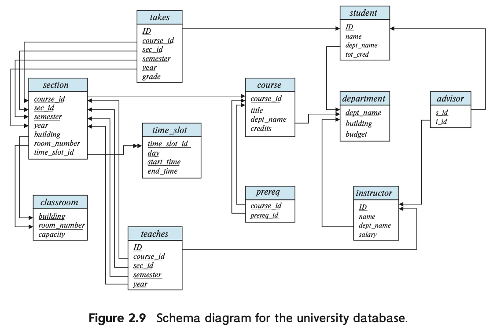

In mathematical terminology, a **tuple** is simply a sequence (or list) of values. A relationship between n values is represented mathematically by an **n-tuple** of values, that is, a tuple with **n** values, which corresponds to a row in a table. Thus, in the relational model the term **relation** is used to refer to a table, while the term **tuple** is used to refer to a row. Similarly, the term **attribute** refers to a column of a table. We use the term **relation instance** to refer to a specific instance of a relation, that is, containing a specific set of rows. 

The order in which tuples appear in a relation is irrelevant, since a relation is a set of tuples. Thus, whether the tuples of a relation are listed in sorted order, or are unsorted does not matter; the relations in the two figures(sorted and unsorted) are the same, since both contain the same set of tuples.

For each attribute of a relation, there is a set of permitted values, called the **domain** of that attribute. Thus, the domain of the salary attribute of the instructor relation is the set of all possible salary values, while the domain of the name attribute is the set of all possible instructor names.

When we talk about a database, we must differentiate between the **database schema**, which is the logical design of the database, and the **database instance**, which is a snapshot of the data in the database at a given instant in time.

A **superkey** is a set of one or more attributes that, taken collectively, allow us to identify uniquely a tuple in the relation.

A **superkey** may contain extraneous attributes. For example, the combination of ID and name is a superkey for the relation instructor. If K is a superkey, then so is any superset of K. We are often interested in superkeys for which no proper subset is a superkey. Such **minimal superkeys** are called **candidate keys**.

It is possible that several distinct sets of attributes could serve as a **candidate key**. Suppose that a combination of name and dept_name is sufficient to distinguish among members of the instructor relation. Then, both `{ID}` and `{name, dept_name}` are candidate keys. Although the attributes ID and name together can distinguish instructor tuples, their combination, `{ID, name}`, does not form a candidate key, since the attribute ID alone is a candidate key.

We shall use the term **primary key** to denote a candidate key that is chosen by the database designer as the principal means of identifying tuples within a relation. A key (whether primary, candidate, or super) is a property of the entire relation, rather than of the individual tuples. Any two individual tuples in the relation are prohibited from having the same value on the key attributes at the same time. The designation of a key represents a constraint in the real-world enterprise being modeled. Thus, primary keys are also referred to as **primary key constraints**.

The primary key should be chosen such that its attribute values are never, or are very rarely, changed. For instance, the address field of a person should not be part of the primary key, since it is likely to change. Social security numbers, on the other hand, are guaranteed never to change.

A **foreign-key constraint** from attribute(s) A of relation $r_1$ to the primary-key B of relation $r_2$ states that on any database instance, the value of A for each tuple in $r_1$ must also be the value of B for some tuple in $r_2$. Attribute set A is called a **foreign key** from $r_1$, referencing $r_2$. The relation $r_1$ is also called the **referencing relation** of the foreign-key constraint, and $r_2$ is called the **referenced relation**.

Note that in a foreign-key constraint, the referenced attribute(s) must be the **primary key** of the **referenced relation**. The more general case, a **referential-integrity constraint**, relaxes the requirement that the referenced attributes form the primary key of the referenced relation.

In general, a **referential integrity constraint** requires that the values appearing in specified attributes of any tuple in the referencing relation also appear in specified attributes of at least one tuple in the referenced relation.

 In fact, **foreign-key constraints** are a special case of **referential integrity constraints**, where the referenced attributes form the primary key of the referenced relation. Database systems today typically support foreign-key constraints, but they do not support referential integrity constraints where the referenced attribute is not a primary key.

A **database schema**, along with **primary key** and **foreign-key** constraints, can be depicted by **schema diagrams**.

> The two-headed arrow notation to represent **referential integrity constraints** has been introduced by us and is not supported by any tool as far as we know; the notations for primary and foreign keys, however, are widely used.

##### The Relational Algebra 

> See page 48

