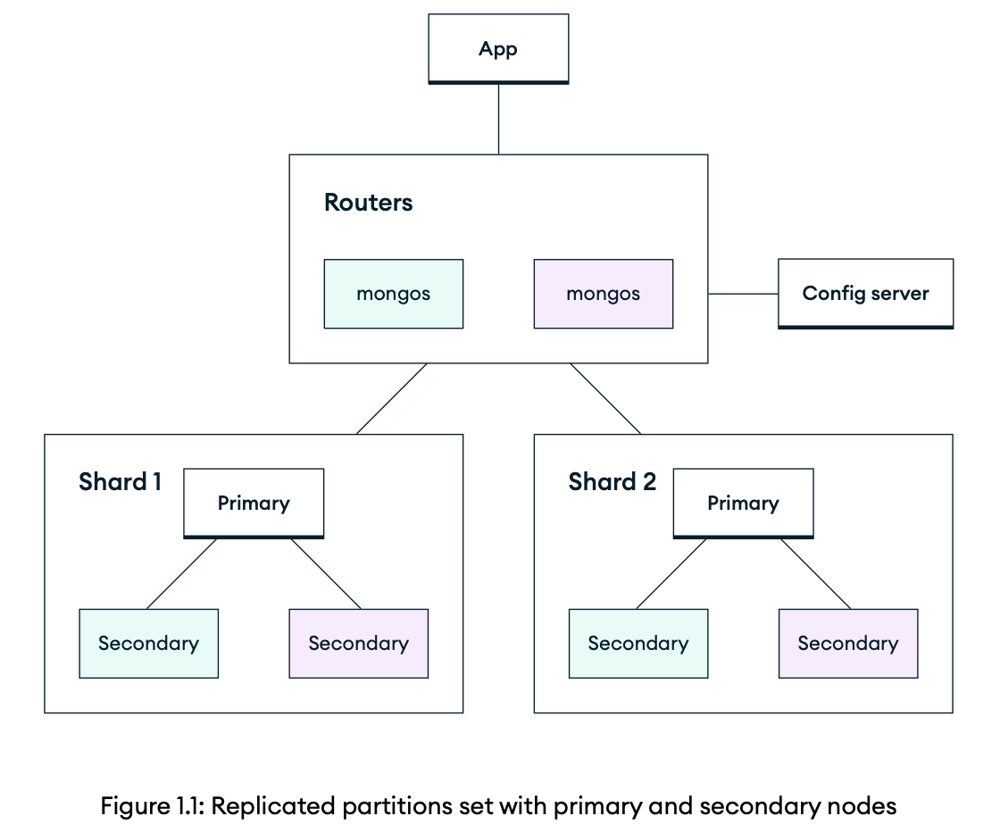

## Introduction to MongoDB

### Why developers love MongoDB?

consider a Python developer attempting to insert a document, query that document, and receive a set of results, using the following code:

```py
from pymongo import MongoClient 

# Connect to MongoDB 
client = MongoClient('mongodb://localhost:27017/') 
db = client['mydatabase']  # Specify the database name 
collection = db['mycollection']  # Specify the collection name 

# Create a document to be inserted 
document = {   
  'name': 'Jane Doe',  
  'age': 30,   
  'email': 'janedoe@example.com' 
}

# Insert the document into the collection 
result = collection.insert_one(document)  
# Check if the insertion was successful 
if result.acknowledged:   
  print('Document inserted successfully.')  
  print('Inserted document ID:', result.inserted_id) 
else:   
  print('Failed to insert document.')
```

```py
from pymongo import MongoClient 

# Connect to MongoDB 
client = MongoClient('mongodb://localhost:27017/') 
db = client['mydatabase']  # Specify the database name 
collection = db['mycollection']  # Specify the collection name 

# Retrieve documents based on specific conditions 
query = {   
  'age': {'$gte': 29},  # Retrieve documents where age is greater than or equal to 29 
}
documents = collection.find(query) 

# Iterate over the retrieved documents 
for document in documents:   
  print(document)
```

### Efficiency of the inherent complexity of MongoDB databases

The database server itself was originally built with the anticipation that most users would run it with a default configuration—**replica set**, sometimes also referred to as a **cluster**.

By default, replica set of MongoDB is a three-node configuration. All three nodes are data-bearing, which means that there is a complete copy of the database available on each node. Each database is hosted on a separate instance or host, which can be in the same availability zone, data center, or region. This default configuration is to ensure both **redundancy** and **high availability**.

If one of the instances becomes unresponsive or unavailable, a healthy node is promoted to become the primary node. This failover between members occurs automatically, and there's no impact on operations for the users of the database. This process considers many different factors, including node availability, data freshness, and responsiveness. This election process and protocol, while simple to understand at a high-level, is very nuanced. But since the operations continue without interruption, you hardly know or understand these details.

#### How is this possible?

Behind the scenes, write operations to MongoDB are propagated from the primary node to the secondary nodes via a process called **replication**. The best way to explain replication is with the example of a single write to the database. An inbound write from the client application (your app) will be first directed to the primary node. That primary node will apply the write to its copy of the database. Then, the write is recorded in the **operations log (oplog)**, which is tailed by secondary nodes.

Replication in MongoDB is based on the RAFT consensus protocol. One particular example of how this implementation varies is **leader elections**. In the traditional RAFT protocol, leader and primary node election occurs through a combination of randomized election timeouts and message exchanges. 

In MongoDB, there are settings for node priority. This priority is considered along with data freshness and response time when electing a primary node.

It is often true that the write operation is not written simultaneously to all nodes—there is a lag heavily influenced by factors such as network latency, the distance between nodes, hardware configuration, and workload. If one of the `mongod` nodes falls behind, it will catch up or resync itself when it is able to do so using the oplog to determine the gaps in its operations. The MongoDB system monitors the replication lag between nodes to track this metric and assess whether the delay between primary and secondary nodes is acceptable, and if not, takes necessary action. This process is unique among databases as well.

This default configuration of MongoDB is a replica set with three members, where replication of data between nodes and failover between nodes are all handled automatically. This configuration is both durable and highly available, which makes it easy to use. For developers who require larger, global deployments, MongoDB has a sharded cluster model. The first thing to understand is that a sharded cluster consists of replica sets. It is a way of further dividing your data into effectively replicated partitions.

