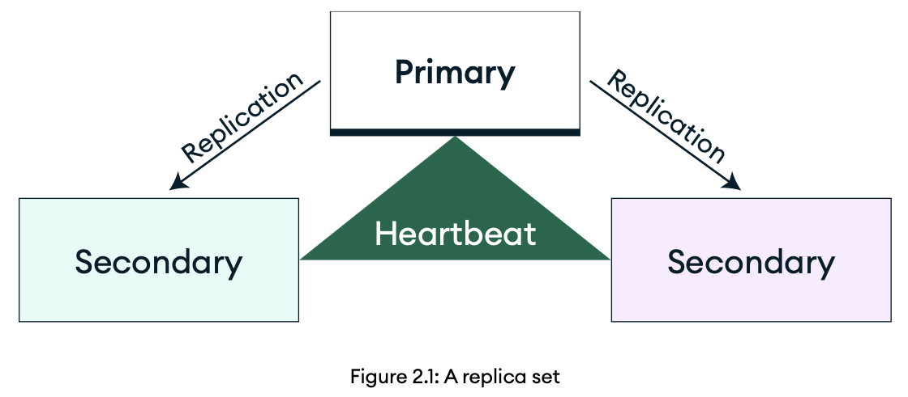

## The MongoDB Architecture

**Replication** is a crucial component in MongoDB's distributed architecture, ensuring data accessibility and resilience to faults. It enables you to spread identical datasets across various database servers, safeguarding against the failure of a single server.

**Sharding** is a horizontal scaling strategy for spreading data across several machines. As applications grow in popularity, and the volume of data they produce increases, scaling across machines becomes essential to ensure sufficient read and write throughput.

### Replication vs sharding

Replication is a process where data is duplicated and stored in multiple locations to ensure redundancy and reliability, playing a vital role in data protection and accessibility.

On the other hand, sharding involves dividing a larger database into smaller, more manageable parts, called shards. Each shard stores a portion of the total dataset on a separate database server instance.  However, it's important to note that each shard must also implement replication to maintain data integrity and availability.

### Replication

A replica set in MongoDB refers to a collection of `mongod` processes that uphold the same dataset. They offer redundancy and high availability, serving as the foundation for all production implementations.

The primary node handles all write operations, and logs all dataset changes in its **operations log (oplog)**. A MongoDB replica set can only have one primary node.

The secondary nodes replicate the primary's oplog, and implement the operations on their own datasets, ensuring that they mirror the primary's dataset. In the event of the primary becoming inaccessible, a qualified secondary will initiate an election to become the new primary.

With data stored across multiple servers, replication increases the reliability of the system. Furthermore, support for rolling upgrades lets you upgrade the software or hardware of individual servers without interruption, ensuring continuous availability of the database. Replication significantly improves the performance of read-heavy applications, distributing the read load across multiple servers to ensure fast data retrieval.

#### Replica set elections

MongoDB employs a protocol built on top of the Raft consensus algorithm to orchestrate replica set elections, ensuring data consistency across distributed systems. This protocol includes a voting mechanism used by replica sets to select which member will assume the primary role. 

Several events can initiate an election, including the following: 

- Adding or removing a node from the replica set 
- Initializing the replica set 
- A heartbeat failure between any of the secondary nodes and the primary that exceeds the preset timeout duration (default is 10 seconds for self-managed hosts, or 5 seconds in MongoDB Atlas)

When a primary replica becomes unavailable, secondary replicas vote for a new primary. The replica with the most recent write timestamp is more likely to win the election.

Under normal circumstances, with default replica set configuration settings, the average time taken for a cluster to elect a new primary should not exceed 12 seconds. This duration encompasses the time needed to declare the primary as inaccessible, and to initiate and finalize an election. This time frame can be adjusted by altering the `settings.electionTimeoutMillis` replication configuration option.

##### Member priority

Once a stable primary is established, the election algorithm enables the highest-priority secondary to initiate an election. Member priority affects both the timing and the outcome of elections, where secondaries with higher-priority are likely to initiate an election sooner and win. Nevertheless, lower-priority members may briefly serve as a primary, despite higher-priority members being available.  The process of elections persists until the highest-priority member ascends to the primary. Members with a priority value of 0 can't become a primary and don't seek election.

Since a replica set can accommodate a maximum of 50 members, with only seven of them being voting members, the inclusion of non-voting members enables the set to exceed the limit of seven.  Non-voting members, characterized by having zero votes, must possess a priority of 0.

### Sharding