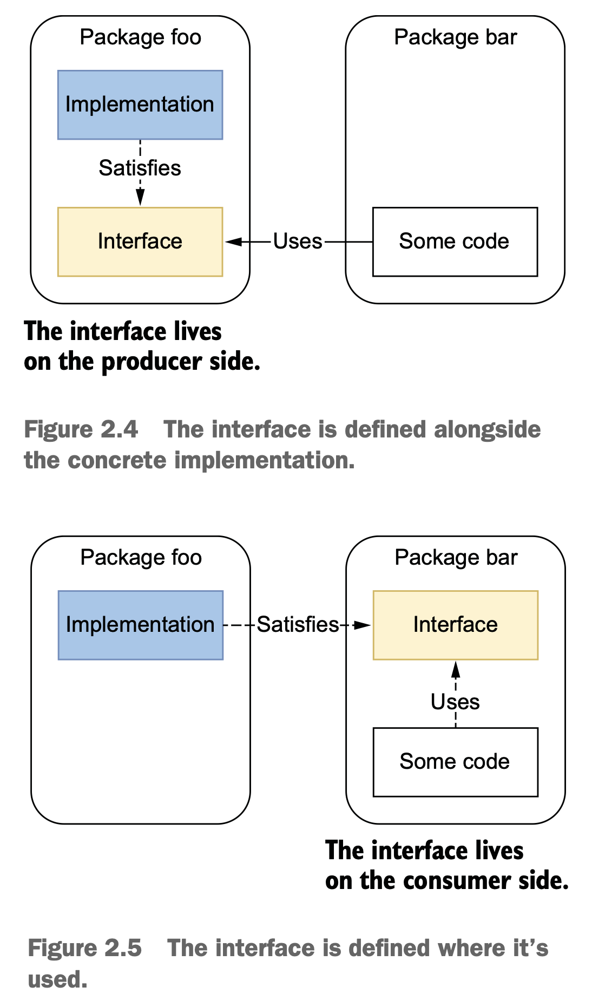
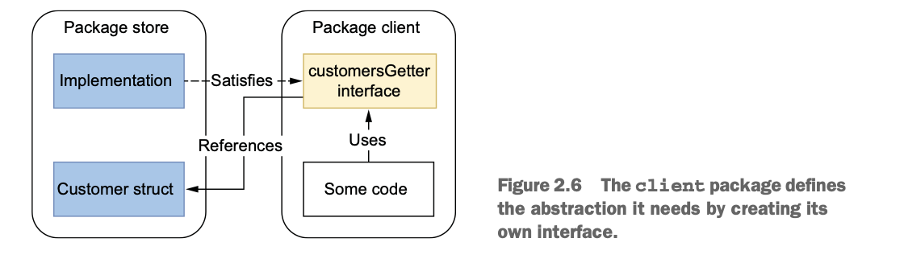

> Tell me and I forget. Teach me and I remember. Involve me and I learn.  —Unknown

### #1: Unintended variable shadowing

In Go, a variable name declared in a block can be redeclared in an inner block. This principle, called variable shadowing, is prone to common mistakes.

```go
var client *http.Client  // Declares a client variable
if tracing { 
  client, err := createClientWithTracing() // Creates an HTTP client with tracing enabled. (The client variable is shadowed in this block.)
  if err != nil {
    return err 
  }
  log.Println(client) 
} else { 
  client, err := createDefaultClient() // Creates a default HTTP client. (The client variable is also shadowed in this block.)
  if err != nil { 
    return err 
  } 
  log.Println(client) 
}
// Use client
```

In this example, we first declare a client variable. Then, we use the short variable declaration operator (:=) in both inner blocks to assign the result of the function call to the inner client variables—not the outer one. As a result, the outer variable is always nil.

How can we ensure that a value is assigned to the original client variable? There are two different options. The first option uses temporary variables in the inner blocks this way:

```go
var client *http.Client
if tracing {
  c, err := createClientWithTracing()  // Creates a temporary variable c
  if err != nil { 
    return err
  }
  client = c  // Assigns this temporary variable to client
} else { 
  // Same logic 
}
```

The second option uses the assignment operator (=) in the inner blocks to directly assign the function results to the client variable. However, this requires creating an error variable because the assignment operator works only if a variable name has already been declared. For example:

```go
var client *http.Client 
var err error  // Declares an err variable
if tracing { 
  client, err = createClientWithTracing()  // Uses the assignment operator to assign the *http.Client returned to the client variable directly
  if err != nil { 
    return err 
  }
} else { 
  // Same logic 
}
```

Both options are perfectly valid. The main difference between the two alternatives is that we perform only one assignment in the second option, which may be considered easier to read. Also, with the second option, we can mutualize and implement error handling outside the if/else statements.

### #2: Unnecessary nested code

A critical aspect of readability is the number of nested levels.

```go
func join(s1, s2 string, max int) (string, error) { 
  if s1 == "" { 
    return "", errors.New("s1 is empty") 
  } else { 
    if s2 == "" { 
      return "", errors.New("s2 is empty") 
    } else { 
      concat, err := concatenate(s1, s2)  // Calls a concatenate function to perform some specific concatenation but may return errors
      if err != nil { 
        return "", err 
      } else { 
        if len(concat) > max { 
          return concat[:max], nil 
        } else { 
          return concat, nil 
        }
      }
    }
  }
}

func concatenate(s1 string, s2 string) (string, error) { 
  // ...
}
```

The same function but implemented differently:

```go
func join(s1, s2 string, max int) (string, error) { 
  if s1 == "" { 
    return "", errors.New("s1 is empty")
  }
  if s2 == "" {
    return "", errors.New("s2 is empty") 
  }
  concat, err := concatenate(s1, s2) 
  if err != nil { 
    return "", err 
  } 
  if len(concat) > max {
    return concat[:max], nil 
  }
  return concat, nil 
}

func concatenate(s1 string, s2 string) (string, error) {
  // ...
}
```

### #3: Misusing init functions

#### Concepts

An init function is a function used to initialize the state of an application. It takes no arguments and returns no result (a func() function). When a package is initialized, all the constant and variable declarations in the package are evaluated. Then, the init functions are executed.

```go
package main 

import "fmt" 

var a = func() int { 
  fmt.Println("var")  // Executed first
  return 0 
}() 

func init() { 
  fmt.Println("init")  // Executed second
}

func main() { 
  fmt.Println("main")  // Executed last
}

/*
var
init
main
*/
```

An init function is executed when a package is initialized.

```go
package main 

import ( "fmt" 
        "redis" 
) 

func init() { 
  // ...
} 

func main() { 
  err := redis.Store("foo", "bar")  // A dependency on the redis package
  // ...
}
```

```go
package redis 

// imports 

func init() { 
  // ...
} 

func Store(key, value string) error { 
  // ...
}
```

Because main depends on redis, the redis package’s init function is executed first, followed by the init of the main package, and then the main function itself.

We can define multiple init functions per package. When we do, the execution order of the init function inside the package is based on the source files’ alphabetical order. For example, if a package contains an a.go file and a b.go file and both have an init function, the a.go init function is executed first.

We can also use init functions for side effects. In the next example, we define a main package that doesn’t have a strong dependency on foo (for example, there’s no direct use of a public function). However, the example requires the foo package to be initialized. We can do that by using the _ operator this way:

```go
package main 

import ( "fmt" 
        _ "foo"  // Imports foo for side effects
) 

func main() { 
  // ...
}
```

In this case, the foo package is initialized before main. Hence, the init functions of foo are executed.

Another aspect of an init function is that it can’t be invoked directly, as in the following example:

```go
package main 

func init() {} 

func main() { 
  init()  // error: undefined: init
}
```

#### When to use init functions

First, let’s look at an example where using an init function can be considered inappropriate: holding a database connection pool. In the init function in the example, we open a database using sql.Open. We make this database a global variable that other functions can later use:

```go
var db *sql.DB 

func init() { 
  dataSourceName := os.Getenv("MYSQL_DATA_SOURCE_NAME")  // Environment variable
  d, err := sql.Open("mysql", dataSourceName) 
  if err != nil { 
    log.Panic(err)
  } 
  err = d.Ping() 
  if err != nil { 
    log.Panic(err)
  } 
  db = d  // Assigns the DB connection to the global db variable
}
```

There are three main downsides. First, error management in an init function is limited. Indeed, as an init function doesn’t return an error, one of the only ways to signal an error is to panic, leading the application to be stopped.

Another important downside is related to testing. If we add tests to this file, the init function will be executed before running the test cases, which isn’t necessarily what we want.

The last downside is that the example requires assigning the database connection pool to a global variable. Global variables have some severe drawbacks; for example: 

- Any functions can alter global variables within the package.
- Unit tests can be more complicated because a function that depends on a global variable won’t be isolated anymore.

In most cases, we should favor encapsulating a variable rather than keeping it global:

```go
func createClient(dsn string) (*sql.DB, error) { 
  db, err := sql.Open("mysql", dsn) 
  if err != nil { 
    return nil, err
  } 
  if err = db.Ping(); err != nil { 
    return nil, err 
  } 
  return db, nil
}
```

Using this function, we tackled the main downsides discussed previously. Here’s how: 

- The responsibility of error handling is left up to the caller.
- It’s possible to create an integration test to check that this function works.
- The connection pool is encapsulated within the function.

Is it necessary to avoid init functions at all costs? Not really. There are still use cases where init functions can be helpful. For example, the official Go blog (`http://mng.bz/PW6w`) uses an init function to set up the static HTTP configuration:

```go
func init() { 
  redirect := func(w http.ResponseWriter, r *http.Request) { 
    http.Redirect(w, r, "/", http.StatusFound) 
  }
  http.HandleFunc("/blog", redirect) 
  http.HandleFunc("/blog/", redirect) 
  
  static := http.FileServer(http.Dir("static"))
  http.Handle("/favicon.ico", static) 
  http.Handle("/fonts.css", static) 
  http.Handle("/fonts/", static) 
  
  http.Handle("/lib/godoc/", http.StripPrefix("/lib/godoc/", http.HandlerFunc(staticHandler))) 
}
```

In summary, we saw that init functions can lead to some issues: 

- They can limit error management.
- They can complicate how to implement tests.
- If the initialization requires us to set a state, that has to be done through global variables.

### #4: Overusing getters and setters

In Go, there is no automatic support for getters and setters as we see in some languages. It is also considered neither mandatory nor idiomatic to use getters and setters to access struct fields.

### #5: Interface pollution

### #6: Interface on the producer side

Producer side—An interface defined in the same package as the concrete implementation (see figure 2.4).

Consumer side—An interface defined in an external package where it’s used (see figure 2.5).



As mentioned, interfaces are satisfied implicitly in Go, which tends to be a gamechanger compared to languages with an explicit implementation. In most cases, the approach to follow is similar to what we described in the previous section: abstractions should be discovered, not created. This means that it’s not up to the producer to force a given abstraction for all the clients. Instead, it’s up to the client to decide whether it needs some form of abstraction and then determine the best abstraction level for its needs.



The main point is that the client package can now define the most accurate abstraction for its need (here, only one method). It relates to the concept of the InterfaceSegregation Principle (the I in SOLID), which states that no client should be forced to depend on methods it doesn’t use. Therefore, in this case, the best approach is to expose the concrete implementation on the producer side and let the client decide how to use it and whether an abstraction is needed.

An interface should live on the consumer side in most cases. However, in particular contexts (for example, when we know—not foresee—that an abstraction will be helpful for consumers), we may want to have it on the producer side. If we do, we should strive to keep it as minimal as possible, increasing its reusability potential and making it more easily composable.

### #7: Returning interfaces

In most cases, we can get inspiration from Postel’s law: Be conservative in what you do, be liberal in what you accept from others.

If we apply this idiom to Go, it means: 

- Returning structs instead of interfaces 
- Accepting interfaces if possible

Of course, there are some exceptions. As software engineers, we are familiar with the fact that rules are never true 100% of the time. The most relevant one concerns the error type, an interface returned by many functions. We can also examine another exception in the standard library with the io package:

```go
func LimitReader(r Reader, n int64) Reader { 
  return &LimitedReader{r, n} 
}
```

All in all, in most cases, we shouldn’t return interfaces but concrete implementations. Otherwise, it can make our design more complex due to package dependencies and can restrict flexibility because all the clients would have to rely on the same abstraction. Again, the conclusion is similar to the previous sections: if we know (not foresee) that an abstraction will be helpful for clients, we can consider returning an interface. Otherwise, we shouldn’t force abstractions; they should be discovered by clients. If a client needs to abstract an implementation for whatever reason, it can still do that on the client’s side.

### #8: any says nothing

In Go, an interface type that specifies zero methods is known as the empty interface, interface{}. With Go 1.18, the predeclared type any became an alias for an empty interface; hence, all the interface{} occurrences can be replaced by any.

In general, we should avoid overgeneralizing the code we write at all costs. Perhaps a little bit of duplicated code might occasionally be better if it improves other aspects such as code expressiveness.

### #9: Being confused about when to use generics

-- 47:55
