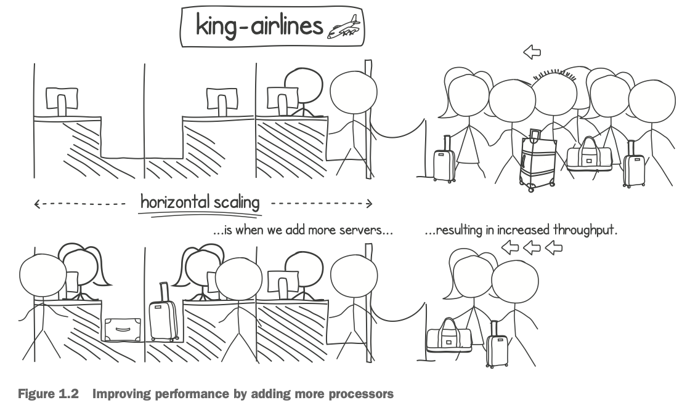

## Stepping into concurrent programming

### Increasing throughput

Horizontal scaling is when we improve system performance by distributing the load over multiple processing resources, such as processors and server machines (see figure 1.2). Vertical scaling is when we improve the existing resources, such as by getting a faster processor.

Having multiple processing resources means we can scale horizontally. We can use the extra processors to execute tasks in parallel and finish them more quickly. This is only possible if we write code in a way that takes full advantage of the extra processing resources.

What about a system that has only one processor? Is there any advantage to writing concurrent code if our system does not have multiple processors? It turns out that writing concurrent programs has a benefit even in this scenario.

Most programs spend only a small proportion of their time executing computations on the processor. Think, for example, about a word processor that waits for input from the keyboard, or a text-file search utility that spends most of its running time waiting for portions of the text files to load from disk. We can have our program perform different tasks while it’s waiting for I/O. For example, the word processor could perform a spell check on the document while the user is thinking about what to type next. We can have the file search utility look for a match with the file that we already loaded in memory while we are reading the next file into another portion of memory.

### Scaling performance

#### Amdahl’s law

In our house build scenario, the scalability is limited by various factors. For starters, our approach to solving the problem might be limiting us. For example, one cannot construct the second floor before constructing the first. In addition, several parts of the build can only be done sequentially. For example, if a single road leads to the building site, only one transport can use the road at any point in time. In other words, some parts of the building process are sequential (one after the other), and other parts can be done in parallel (at the same time). These factors influence and limit the scalability of our task.

Amdahl’s law tells us that the non-parallel parts of an execution act as a bottleneck and limit the advantage of parallelizing the execution.

As you can see from the chart, even with 512 people working on the construction, we would only finish the job about 19 times faster than if we had just 1 person. After this point, the situation does not improve much. We’ll need more than 4,096 builders to finish the project just 20 times faster.

The situation is even worse if a lower percentage of work is parallelizable. With 90%, we would hit this scalability limit around the 512-workers mark. With 75%, we get there at 128 workers, and with 50% at just 16 workers. Notice that it’s not just this limit that goes down—the speedup is also greatly reduced. When the work is 90%, 75%, and 50% parallelizable, we get maximum speedups of 10, 4, and 2, respectively. 

Even with concurrent code that has a tiny fraction of serial processing, the scalability is greatly reduced.