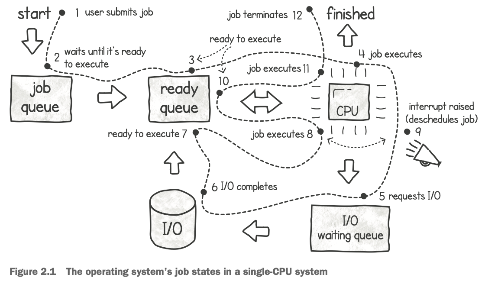

## Dealing with threads

### Multiprocessing in operating systems

How does an operating system provide abstractions to build and support concurrent programs? Multiprocessing (sometimes referred to as multiprogramming) is the term used when an operating system can handle more than one task at a time. This is important because it enables us to make effective use of the CPU. Whenever the CPU is idling, such as when the current job is waiting for user input, we can have the operating system choose another job to run on the CPU.

**Note**: On some operating systems (such as Linux), the **ready queue** is known as the **run queue**.

**Note**: Steps 9 and 10 are an example of a **context switch**, which occurs whenever the system interrupts a job and the operating system steps in to schedule another one.

A bit of overhead occurs on every context switch—the OS needs to save the current job state so that it can later resume where it left off. The OS also needs to load the state of the next job to be executed. This state is referred to as the process context block (PCB). It is a data structure used to store all the details about a job, such as the program counter, CPU registers, and memory information.

This context switching creates the impression that many tasks are happening at the same time, even when we have only one CPU. When we write concurrent code and execute it on a system with only one processor, our code creates a set of jobs that run in this fashion to give a quicker response. When we have a system with multiple CPUs, we can also have true parallelism, in that our jobs are running at the same time on different execution units.

### Abstracting concurrency with processes and threads

When we need to execute our code and manage concurrency (with jobs running, or appearing to run, at the same time), or enable true parallelism in the case of a multicore system, the operating system provides two abstractions: processes and threads.

A **process** represents a program that is currently running on the system. It is an essential concept in an operating system. The main purpose of an operating system is to efficiently allocate the system’s resources (such as memory and CPUs) amongst the many processes that are executing. We can use multiple processes and have them run concurrently as outlined in the previous section.

A **thread** is an extra construct that executes within the process context to give us a more lightweight and more efficient approach to concurrency. As we shall see, each process is started with a single thread of execution, sometimes referred to as the primary or main thread.

#### Concurrency with processes

Processes provide isolation at the cost of consuming more resources. If, for example, one process crashes due to an error, it will not affect other processes, since it has its own memory space. The downside of this isolation is that we end up consuming more memory. In addition, starting up processes takes a bit longer (compared to threads) since we need to allocate the memory space and other system resources.

When processes do need to communicate and synchronize with each other, we program them to use operating system tools and other applications, such as files, databases, pipes, sockets, etc.

#### Creating processes

For example, Windows has a `CreateProcess()` system call. This call creates the process, allocates the required resources, loads the program code, and starts executing the program as a process.

Alternatively, on UNIX systems, there is a `fork()` system call. Using this call, we can create a copy of an execution. When we make this system call from an executing process, the operating system makes a complete copy of the memory space and the process’s resource handlers, including the registers, stack, file handlers, and even the program counter. The new process then takes over this new memory space and continues execution from that point onward.

**Note**: We refer to the new process as the child and the process that created it as the parent. This child and parent terminology also applies to threads,

The `fork()` system call returns the process ID on the parent process and a value of 0 on the child. After forking into two processes, each process can determine what instructions to run based on the return value of the `fork()` system call. A child process can decide to use the copied resources (such as data contained in memory) or to clear it and start anew. Because each process has its own memory space, if one process changes its memory contents (for example, changing a variable’s value), the other process will not see this change.

As you can imagine, since each process has its own memory space, the total memory consumed increases every time you spawn a new process. In addition to consuming more memory, copying and allocating system resources takes time and consumes precious CPU cycles. This means that creating too many processes takes a heavy toll on the system. For this reason, it’s quite unusual for one program to use a large number of processes concurrently, all working on the same problem.

> ##### Copy on write for UNIX processes
>
> Copy on write (COW) is an optimization introduced to the `fork()` system call. It reduces the time taken by not copying the entire memory space. For systems using this optimization, whenever `fork()` is called, both child and parent processes share the same memory pages. Then, if one of the processes tries to modify the contents of a memory page, that page is copied to a new location so that each process has its own copy. The OS only makes copies of the memory pages that are modified. This is a great way to save both memory and time, but if a process modifies large parts of its memory, the OS will end up copying most pages anyway.

Concurrent programming in Go does not typically rely on heavyweight processes. As we shall see, Go adopts a more lightweight threading and goroutine concurrency model instead.

#### Concurrency with threads

When we create a new thread, the operating system needs to create only enough resources to manage the stack space, registers, and a program counter. The new thread runs inside the context of the same process. In contrast, when we create a new process, the OS needs to allocate a completely new memory space for it.

> ##### What goes on the stack space?
>
> The stack space stores the local variables that live within a function. These are typically short-lived variables—when the function finishes, they are not used anymore. This space does not include variables that are shared between functions (using pointers), which are allocated on the main memory space, called the heap.

TO BE CONTINUED...