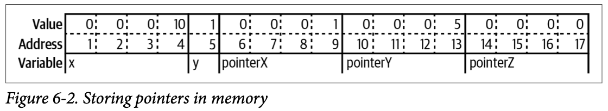
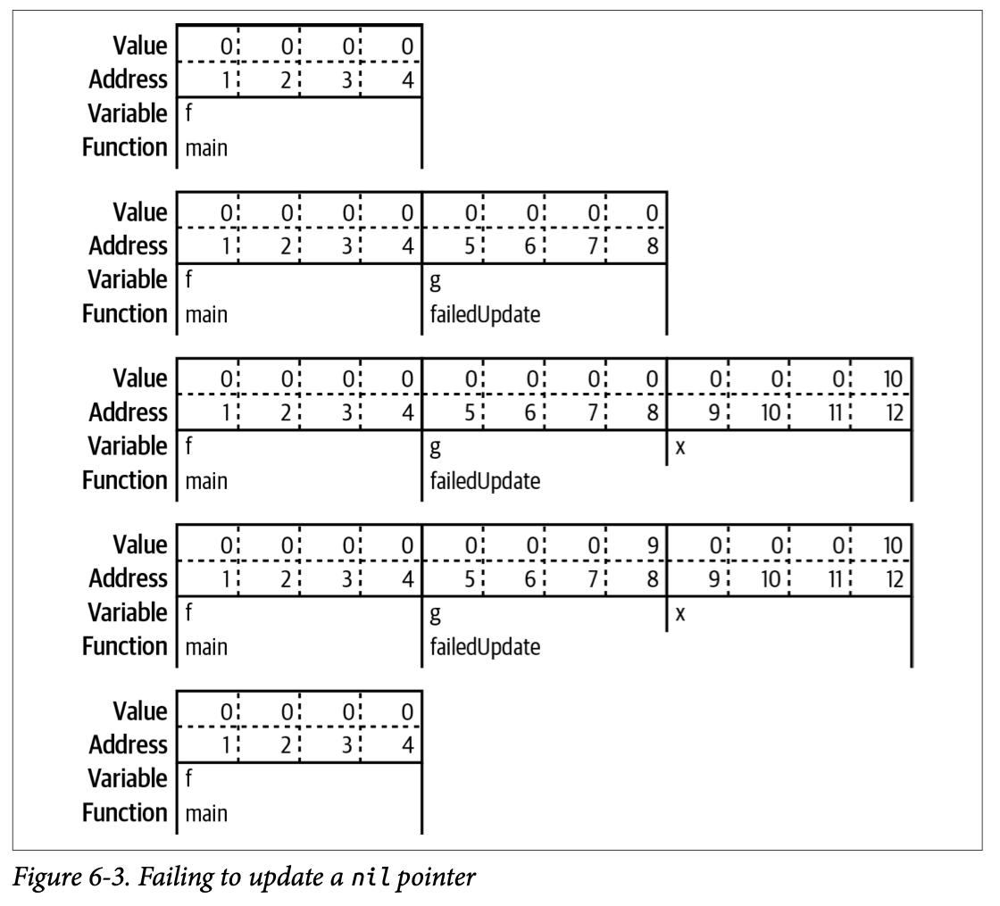
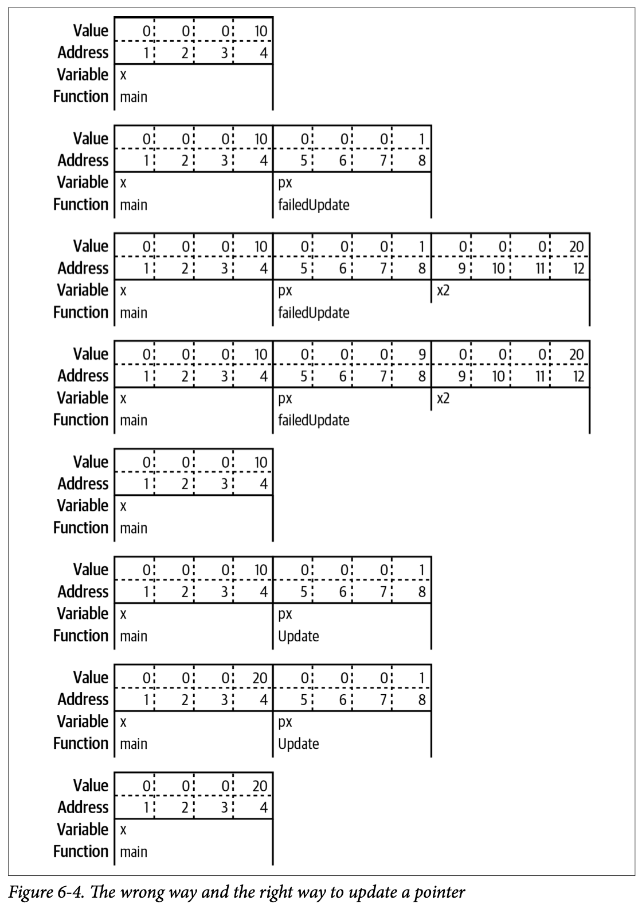
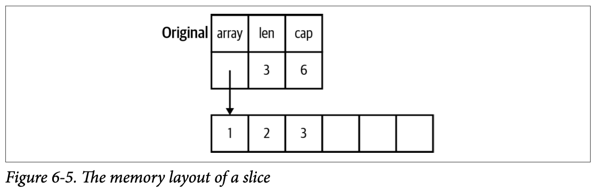
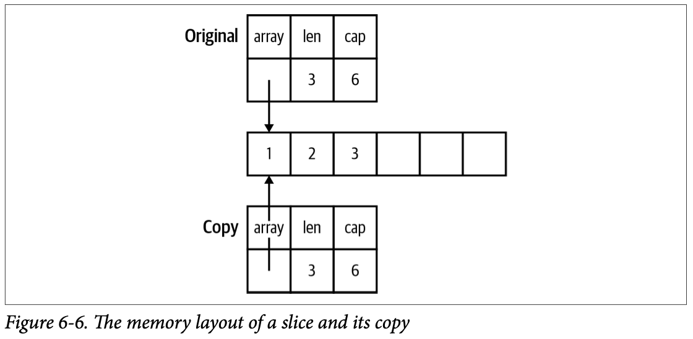
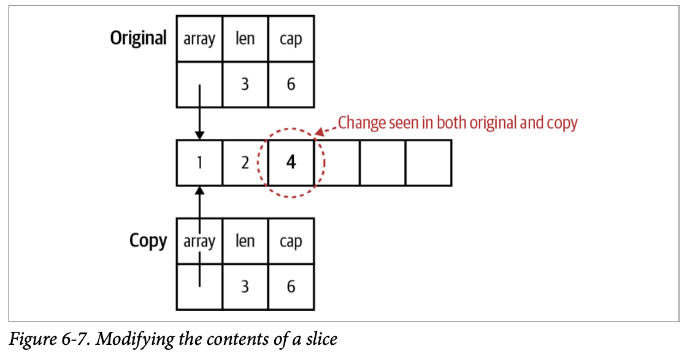
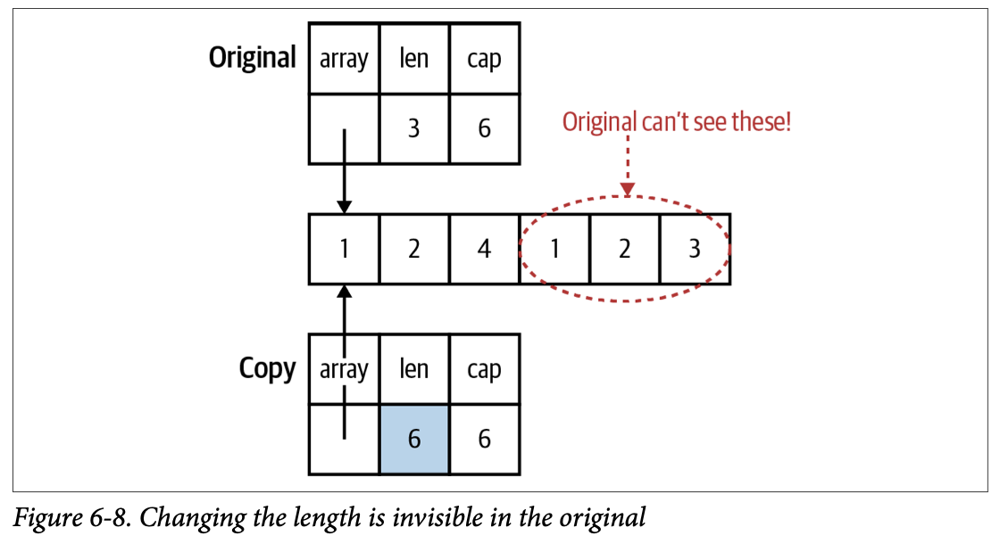
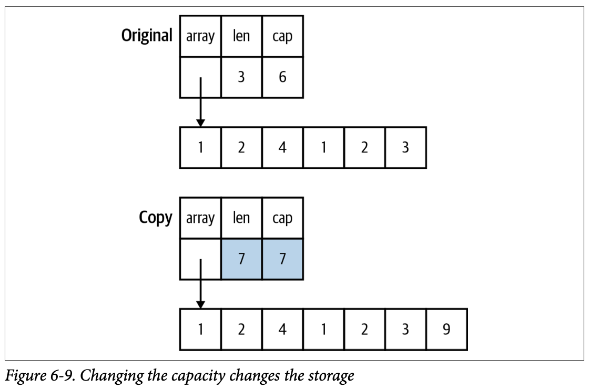

A pointer is a variable that holds the location in memory where a value is stored.

```go
var x int32 = 10 
var y bool = true 
pointerX := &x 
pointerY := &y 
var pointerZ *string
```



Storing a 32-bit int requires four bytes, so the value for x is stored in four bytes, starting at address 1 and ending at address 4. A boolean requires only a single byte (you need only a bit to represent true or false, but the smallest amount of memory that can be independently addressed is a byte), so the value for y is stored in one byte at address 5, with true represented by the value 1.

While different types of variables can take up different numbers of memory locations, every pointer, no matter what type it is pointing to, is always the same number of memory locations. The examples in this chapter use 4-byte pointers, but many modern computers use 8 bytes for a pointer.

The zero value for a pointer is `nil`. You’ve seen `nil` a few times before, as the zero value for **slices**, **maps**, and **functions**. All these types are implemented with **pointers**. (Two more types, channels and interfaces, are also implemented with pointers). `nil` is an untyped identifier that represents the lack of a value for certain types. Unlike NULL in C, nil is not another name for 0; you can’t convert it back and forth with a number.

`nil` is defined in the universe block. Because nil is a value defined in the universe block, it can be shadowed. Never name a variable or function nil, unless you are trying to trick your coworker and are unconcerned about your annual review.

The `&` is the **address** operator. It precedes a value type and returns the address where the value is stored. The `*` is the **indirection** operator. It precedes a variable of pointer type and returns the pointed-to value. This is called **dereferencing**. Before dereferencing a pointer, you must make sure that the pointer is non-nil. Your program will panic if you attempt to dereference a nil pointer. A **pointer type** is a type that represents a pointer, it is written with a `*` before a type name. A pointer type can be based on any type.

The built-in function `new` creates a pointer variable. It returns a pointer to a zero-value instance of the provided type:

```go
var x = new(int) 
fmt.Println(x == nil) // prints false 
fmt.Println(*x)       // prints 0
```

The `new` function is rarely used. For structs, use an `&` before a struct literal to create a pointer instance. You can’t use an `&` before a primitive literal (numbers, booleans, and strings) or a constant because they don’t have memory addresses; they exist only at compile time. When you need a pointer to a primitive type, declare a variable and point to it:

```go
x := &Foo{} 
var y string 
z := &y
```

Not being able to take the address of a constant is sometimes inconvenient. If you have a struct with a field of a pointer to a primitive type, you can’t assign a literal directly to the field:

```go
type person struct {    
  FirstName  string  
  MiddleName *string 
  LastName   string 
} 

p := person{  
  FirstName:  "Pat",  
  MiddleName: "Perry", // This line won't compile: cannot use "Perry" (type string) as type *string in field value
  LastName:   "Peterson", 
}
```

If you try to put an `&` before "Perry", you’ll get the error message: `cannot take the address of "Perry"`

There are two ways around this problem. The first is to do what was shown previously, which is to introduce a variable to hold the constant value. The second way is to write a generic helper function that takes in a parameter of any type and returns a pointer to that type:

```go
func makePointer[T any](t T) *T {  
  return &t 
}

p := person{ 
  FirstName:  "Pat", 
  MiddleName: makePointer("Perry"), // This works  
  LastName:   "Peterson",
}
```

Why does this work? When you pass a constant to a function, the constant is copied to a parameter, which is a variable. Since it’s a variable, it has an address in memory. The function then returns the variable’s memory address.

##### Don’t Fear the Pointers

If you are used to Java, JavaScript, Python, or Ruby, you might find pointers intimidating. However, pointers are actually the familiar behavior for classes. It’s the nonpointer structs in Go that are unusual.

In Java and JavaScript, there is a difference in the behavior between primitive types and classes. When a primitive value is assigned to another variable or passed to a function or method, any changes made to the other variable aren’t reflected in the original.

```js
// Example 6-1. Assigning primitive variables doesn’t share memory in JavaScript

let x = 10;
let y = x;
y = 20;
console.log(x)   // 10
```

However, let’s take a look at what happens when an instance of a class is assigned to another variable or passed to a function or method:

```js
class Foo {
    constructor(x) {
        this.x = x;
    }
}

function outer() {
    let f = new Foo(10);
    inner1(f);
    console.log(f.x);
    inner2(f);
    console.log(f.x);
    let g = null;
    inner2(g);
    console.log(g == null);
}

function inner1(f) {
    f.x = 20;
}

function inner2(f) {
    f = new Foo(30);
}

outer();
// 20
// 20
// true
```

That’s because the following scenarios are true in Java, Python, JavaScript, and Ruby:

- If you pass an instance of a class to a function and you change the value of a field, the change is reflected in the variable that was passed in.
- If you reassign the parameter, the change is not reflected in the variable that was passed in.
- If you pass nil/null/None for a parameter value, setting the parameter itself to a new value doesn’t modify the variable in the calling function.

Some people explain this behavior by saying that class instances are passed by reference in these languages. This is untrue. **If they were being passed by reference, scenarios two and three would change the variable in the calling function. These languages are always pass-by-value, just as in Go.**

What you are seeing is that **every instance of a class in these languages is implemented as a pointer**. When a class instance is passed to a function or method, the value being copied is the pointer to the instance. Since `outer` and `inner1` are referring to the same memory, changes made to fields in `f` in `inner1` are reflected in the variable in `outer`. When `inner2` reassigns `f` to a new class instance, this creates a separate instance and does not affect the variable in `outer`.

When you use a pointer variable or parameter in Go, you see the exact same behaviors. **The difference between Go and these languages is that Go gives you the choice to use pointers or values for both primitives and structs.** Most of the time, you should use a value. Values make it easier to understand how and when your data is modified. A secondary benefit is that using values reduces the amount of work that the garbage collector has to do.

##### Pointers Indicate Mutable Parameters

As you’ve already seen, Go constants provide names for literal expressions that can be calculated at compile time. Go has no mechanism to declare that other kinds of values are immutable. The lack of immutable declarations in Go might seem problematic, but the ability to choose between value and pointer parameter types addresses the issue. Rather than declare that some variables and parameters are immutable, Go developers use pointers to indicate that a parameter is mutable.

Since Go is a call-by-value language, the values passed to functions are copies. For nonpointer types like **primitives**, **structs**, and **arrays**, this means that the called function cannot modify the original. Since the called function has a copy of the original data, the original data’s immutability is guaranteed. However, if a pointer is passed to a function, the function gets a copy of the pointer. This still points to the original data, which means that the original data can be modified by the called function.

This has a couple of related implications.

The first implication is that when you pass a nil pointer to a function, you cannot make the value non-nil. You can reassign the value only if there was a value already assigned to the pointer. While confusing at first, it makes sense. Since the memory location was passed to the function via call-by-value, you can’t change the memory address, any more than you could change the value of an int parameter. You can demonstrate this with the following program:

```go
func failedUpdate(g *int) {   
  x := 10
  g = &x 
} 

func main() {  
  var f *int // f is nil  
  failedUpdate(f)   
  fmt.Println(f) // prints nil
}
```



You start with a `nil` variable `f` in main. When you call `failedUpdate`, you copy the value of `f`, which is `nil`, into the parameter named `g`. This means that `g` is also set to `nil`. You then declare a new variable `x` within `failedUpdate` with the value 10. Next, you change `g` in `failedUpdate` to point to `x`. This does not change the `f` in main, and when you exit `failedUpdate` and return to main, `f` is still `nil`.

The following code will throw an error:

```go
func failedUpdate(g *int) {   
	*g = 10
} 

func main() {  
  var f *int // f is nil  
  failedUpdate(f)   // runtime error: invalid memory address or nil pointer dereference
}
```

The second implication of copying a pointer is that if you want the value assigned to a pointer parameter to still be there when you exit the function, you must **dereference** the pointer and set the value. If you change the pointer, you have changed the copy, not the original. Dereferencing puts the new value in the memory location pointed to by both the original and the copy.

```go
func failedUpdate(px *int) {  
  x2 := 20  
  px = &x2
} 

func update(px *int) {  
  *px = 20 
} 

func main() {  
  x := 10  
  failedUpdate(&x)  
  fmt.Println(x) // prints 10  
  update(&x)   
  fmt.Println(x) // prints 20
}
```

In this example, you start with `x` in `main` set to 10. When you call `failedUpdate`, you copy the address of `x` into the parameter `px`. Next, you declare `x2` in `failedUpdate`, set to 20. You then point `px` in `failedUpdate` to the address of `x2`. When you return to `main`, the value of `x` is unchanged. When you call update, you copy the address of x into `px` again. However, this time you change the value of what `px` in update points to, the variable `x` in `main`. When you return to `main`, `x` has been changed.



##### Pointers Are a Last Resort

That said, you should be careful when using pointers in Go. As discussed earlier, they make it harder to understand data flow and can create extra work for the garbage collector. Rather than populating a struct by passing a pointer to it into a function, have the function instantiate and return the struct:

```go
// Example 6-3. Don’t do this 
func MakeFoo(f *Foo) error {  
  f.Field1 = "val"  
  f.Field2 = 20 
  return nil 
} 

// Example 6-4. Do this 
func MakeFoo() (Foo, error) { 
  f := Foo{   
    Field1: "val",   
    Field2: 20,  
  }  
  return f, nil 
}
```

The only time you should use pointer parameters to modify a variable is when the function expects an interface. You see this pattern when working with JSON.

```go
f := struct {  
  Name string `json:"name"` 
  Age int `json:"age"`
}{} 
err := json.Unmarshal([]byte(`{"name": "Bob", "age": 30}`), &f)
```

The `Unmarshal` function populates a variable from a slice of bytes containing `JSON`. It is declared to take a slice of bytes and an `any` parameter. The value passed in for the `any` parameter must be a pointer. If it is not, an error is returned.

Why do you pass a pointer into `Unmarshal` instead of having it return a value? There are two reasons. First, this function predates the addition of generics to Go, and without generics, there is no way to know what type of value to create and return.

The second reason is that passing in a pointer gives you control over memory allocation. Iterating over data and converting it from JSON to a Go struct is a common design pattern, so `Unmarshal` is optimized for this case. If the `Unmarshal` function returned a value and `Unmarshal` was called in a loop, one struct instance would be created on each loop iteration. This creates a lot more work for the garbage collector, which slows down your program.

##### Pointer Passing Performance

If a struct is large enough, using a pointer to the struct as either an input parameter or a return value improves performance. The time to pass a pointer into a function is constant for all data sizes, roughly one nanosecond. This makes sense, as the size of a pointer is the same for all data types. Passing a value into a function takes longer as the data gets larger. It takes about 0.7 milliseconds once the value gets to be around 10 megabytes of data.

The behavior for returning a pointer versus returning a value is more interesting. For data structures that are smaller than 10 megabytes, it is actually slower to return a pointer type than a value type. For example, a 100-byte data structure takes around 10 nanoseconds to be returned, but a pointer to that data structure takes about 30 nanoseconds. As your data structures get larger, the performance advantage flips. It takes nearly 1.5 milliseconds to return 10 megabytes of data, but a little less than half a millisecond to return a pointer to it.

So if you are passing megabytes of data between functions, consider using a pointer even if the data is meant to be immutable.

##### The Difference Between Maps and Slices

Passing a map to a function means that you are copying a pointer. Because of this, you should consider carefully before using maps for input parameters or return values, especially on public APIs. On an API-design level, maps are a bad choice because they say nothing about the values contained within; nothing explicitly defines any keys in the map, so the only way to know what they are is to trace through the code. From the standpoint of immutability, maps are bad because the only way to know what ended up in the map is to trace through all the functions that interact with it. This prevents your API from being self-documenting. If you are used to dynamic languages, don’t use a map as a replacement for another language’s lack of structure. Go is a strongly typed language; rather than passing a map around, use a struct.

A map input parameter or return value is the correct choice in certain situations. A struct requires you to name its fields at compile time. If the keys for your data aren’t known at compile time, a map is ideal.

Meanwhile, passing a slice to a function has more complicated behavior: any modification to the slice’s contents is reflected in the original variable, but using append to change the length isn’t reflected in the original variable, even if the slice has a capacity greater than its length. That’s because **a slice is implemented as a struct with three fields**: an int field for length, an int field for capacity, and a pointer to a block of memory.



When a slice is copied to a different variable or passed to a function, a copy is made of the length, capacity, and the pointer. Figure 6-6 shows how both slice variables point to the same memory.



Changing the values in the slice changes the memory that the pointer points to, so the changes are seen in both the copy and the original. You see in Figure 6-7 how this looks in memory.



```go
func main() {
	x := []int{1, 2, 3}
	y := x
	y[2] = 4
	fmt.Println(x)  // [1 2 4]
}
```

If the slice copy is appended to and there is enough capacity in the slice for the new values, the length changes in the copy, and the new values are stored in the block of memory that’s shared by the copy and the original. However, the length in the original slice remains unchanged. The Go runtime prevents the original slice from seeing those values since they are beyond the length of the original slice.



```go
func main() {
	x := []int{1, 2, 3}
	y := x
	y[2] = 4
	y = append(y, 1, 2, 3)
	fmt.Println(x) // [1 2 4]
	fmt.Println(y) // [1 2 4 1 2 3]
}
```

If the slice copy is appended to and there isn’t enough capacity in the slice for the new values, a new, bigger block of memory is allocated, values are copied over, and the pointer, length, and capacity fields in the copy are updated. Changes to the pointer, length, and capacity are not reflected in the original, because they are only in the copy. Figure 6-9 shows how each slice variable now points to a different memory block.



The result is that a slice that’s passed to a function can have its contents modified, but the slice can’t be resized. As the only usable linear data structure, slices are frequently passed around in Go programs. By default, you should assume that a slice is not modified by a function. Your function’s documentation should specify whether it modifies the slice’s contents.

The reason you can pass a slice of any size to a function is that the data type that’s passed to the function is the same for any size slice: a struct of two int values and a pointer. The reason you can’t write a function that takes an array of any size is that the entire array is passed to the function, not just a pointer to the data.

There is one situation where the ability to modify the contents (but not the size) of a slice input parameter is very useful. This makes them ideal for reusable buffers.

##### Slices as Buffers

When reading data from an external resource (like a file or a network connection), many languages use code like this:

```
r = open_resource() 
while r.has_data() {  
	data_chunk = r.next_chunk() 
	process(data_chunk) 
}
close(r)
```

The problem with this pattern is that every time you iterate through that while loop, you allocate another `data_chunk` even though each one is used only once. This creates lots of unnecessary memory allocations

Even though Go is a garbage-collected language, writing idiomatic Go means avoiding unneeded allocations. Rather than returning a new allocation each time you read from a data source, you create a slice of bytes once and use it as a buffer to read data from the data source:

```go
file, err := os.Open(fileName) 
if err != nil { 
  return err 
} 
defer file.Close() 
data := make([]byte, 100) 
for {   
  count, err := file.Read(data)   
  process(data[:count]) 
  if err != nil {    
    if errors.Is(err, io.EOF) { 
      return nil    
    }      
    return err  
  }
}
```

Remember that you can’t change the length or capacity of a slice when it is passed into a function, but you can change the contents up to the current length. In this code, you create a buffer of 100 bytes, and each time through the loop, you copy the next block of bytes (up to 100) into the slice. You then pass the populated portion of the buffer to process. If an error happens (other than `io.EOF`, a special-case error that indicates there is no more data to read), it is returned. When `io.EOF` is returned as the error, there is no more data and the function returns `nil`.

##### Reducing the Garbage Collector’s Workload

Using buffers is just one example of how you reduce the work done by the garbage collector. When programmers talk about “garbage,” what they mean is “data that has no more pointers pointing to it.” Once there are no more pointers pointing to some data, the memory that this data takes up can be reused. If the memory isn’t recovered, the program’s memory usage would continue to grow until the computer ran out of RAM. The job of a garbage collector is to automatically detect unused memory and recover it so it can be reused. But just because you have a garbage collector doesn’t mean you should create lots of garbage.

A stack is a consecutive block of memory. Every function call in a thread of execution shares the same stack. Allocating memory on the stack is fast and simple. A stack pointer tracks the last location where memory was allocated. Allocating additional memory is done by changing the value of the stack pointer. When a function is invoked, a new stack frame is created for the function’s data. Local variables are stored on the stack, along with parameters passed into a function. Each new variable moves the stack pointer by the size of the value. When a function exits, its return values are copied back to the calling function via the stack, and the stack pointer is moved back to the beginning of the stack frame for the exited function, deallocating all the stack memory that was used by that function’s local variables and parameters.

To store something on the stack, you have to know exactly how big it is at compile time. When you look at the value types in Go (primitive values, arrays, and structs), they all have one thing in common: you know exactly how much memory they take at compile time. This is why the size is considered part of the type for an array. Because their sizes are known, they can be allocated on the stack instead of the heap. The size of a pointer type is also known, and it is also stored on the stack.

Go is unusual in that it can increase the size of a stack while the program is running. This is possible because each goroutine has its own stack and goroutines are managed by the Go runtime, not by the underlying operating system. This has advantages (Go stacks start small and use less memory) and disadvantages (when the stack needs to grow, all data on the stack needs to be copied, which is slow). It’s also possible to write worst-case-scenario code that causes the stack to grow and shrink over and over.

The rules are more complicated when it comes to the data that the pointer points to. In order for Go to allocate the data the pointer points to on the stack, several conditions must be true. **The data must be a local variable whose data size is known at compile time**. **The pointer cannot be returned from the function**. If the pointer is passed into a function, the compiler must be able to ensure that these conditions still hold. If the size isn’t known, you can’t make space for it by moving the stack pointer. If the pointer variable is returned, the memory that the pointer points to will no longer be valid when the function exits. When the compiler determines that the data can’t be stored on the stack, we say that the data the pointer points to escapes the stack, and the compiler stores the data on the heap.

The heap is the memory that’s managed by the garbage collector (or by hand in languages like C and C++). I won’t discuss the details of garbage collector algorithm implementation, but they are much more complicated than moving a stack pointer. Any data that’s stored on the heap is valid as long as it can be tracked back to a pointer type variable on a stack. Once there are no more variables on the stack pointing to that data, either directly or via a chain of pointers, the data becomes garbage, and it’s the job of the garbage collector to clear it out.

A common source of bugs in C programs is returning a pointer to a local variable. In C, this results in a pointer pointing to invalid memory. The Go compiler is smarter. When it sees that a pointer to a local variable is returned, the local variable’s value is stored on the heap.

> [Is it possible to return a pointer to a local variable in C?](https://www.quora.com/Is-it-possible-to-return-a-pointer-to-a-local-variable-in-C)
>
> Returning a pointer to a local variable in C is technically possible, but it leads to undefined behavior. This is because local variables are allocated on the stack, and their lifetime ends when the function returns. Once the function exits, the memory for the local variable can be reused for other purposes, meaning the pointer will point to an invalid memory location. 

You might be wondering: what’s so bad about storing things on the heap? Two problems arise related to performance. First, the garbage collector takes time to do its work. It isn’t trivial to keep track of all available chunks of free memory on the heap or to track which used blocks of memory still have valid pointers. This is time that’s taken away from doing the processing that your program is written to do.

Many garbage-collection algorithms have been written, and they can be placed into two rough categories: those that are designed for **higher throughput** (find the most garbage possible in a single scan) or **lower latency** (finish the garbage scan as quickly as possible). The garbage collector used by the Go runtime favors **low latency**. Each garbage-collection cycle is designed to “stop the world” (i.e., pause your program) for fewer than 500 microseconds. However, if your Go program creates lots of garbage, the garbage collector won’t be able to find all the garbage during a cycle, slowing the collector and increasing memory usage.

##### Tuning the Garbage Collector

A garbage collector doesn’t immediately reclaim memory as soon as it is no longer referenced. Doing so would seriously impact performance. Instead, it lets the garbage pile up for a bit. The heap almost always contains both live data and memory that’s no longer needed. The Go runtime provides users a couple of settings to control the heap’s size. The first is the `GOGC` environment variable. The garbage collector looks at the heap size at the end of a garbage-collection cycle and uses the formula `CURRENT_HEAP_SIZE + CURRENT_HEAP_SIZE*GOGC/100` to calculate the heap size that needs to be reached to trigger the next garbage-collection cycle.

By default, `GOGC` is set to 100, which means that the heap size that triggers the next collection is roughly double the heap size at the end of the current collection. Setting `GOGC` to a smaller value will decrease the target heap size, and setting it to a larger value will increase it. As a rough estimate, doubling the value of `GOGC` will halve the amount of CPU time spent on GC.

Setting `GOGC` to `off` disables garbage collection. This will make your programs run faster. However, turning off garbage collection on a long-running process will potentially use all available memory on your computer. This is not usually considered optimal behavior.

The second garbage-collection setting specifies a limit on the total amount of memory your Go program is allowed to use. Java developers are likely familiar with the `-Xmx` JVM argument, and `GOMEMLIMIT` is similar. By default, it is disabled (technically, it is set to `math.MaxInt64`, but it’s unlikely that your computer has that much memory). The value for `GOMEMLIMIT` is specified in bytes, but you can optionally use the suffixes B, KiB, MiB, GiB, and TiB. For example, `GOMEMLIMIT=3GiB` sets the memory limit to 3 gibibytes (which is equal to 3,221,225,472 bytes).

It might seem counterintuitive that limiting the maximum amount of memory could improve a program’s performance, but there are good reasons this flag was added. The primary reason is that computers (or virtual machines or containers) don’t have infinite RAM. If a sudden, temporary spike occurs in memory usage, relying on `GOGC` alone might result in the maximum heap size exceeding the amount of available memory. This can cause memory to swap to disk, which is very slow. Depending on your operating system and its settings, it might crash your program. Specifying a maximum memory limit prevents the heap from growing beyond the computer’s resources.

`GOMEMLIMIT` is a soft limit that can be exceeded in certain circumstances. A common problem occurs in garbage-collected systems when the collector is unable to free up enough memory to get within a memory limit or the garbage-collection cycles are rapidly being triggered because a program is repeatedly hitting the limit. Called thrashing, this results in a program that does nothing other than run the garbage collector. If the Go runtime detects that thrashing is starting to happen, it chooses to end the current garbage-collection cycle and exceed the limit. 


