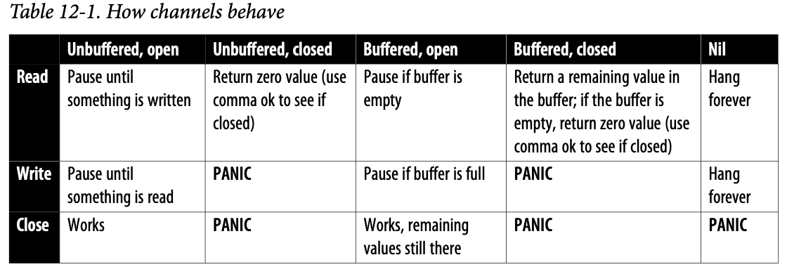

Most languages provide concurrency via a library using operating system–level threads that share data by attempting to acquire locks. Go is different. Its main concurrency model, arguably Go’s most famous feature, is based on **Communicating Sequential Processes** (**CSP**).

People are attracted to concurrency because they believe concurrent programs run faster. Unfortunately, that’s not always the case. More concurrency doesn’t automatically make things faster, and it can make code harder to understand. The key is understanding that **concurrency is not parallelism**. Concurrency is a tool to better structure the problem you are trying to solve.

### Goroutines

To understand goroutines, let’s define a couple of terms. The first is **process**. A process is an instance of a program that’s being run by a computer’s operating system. The operating system associates some resources, such as memory, with the process and makes sure that other processes can’t access them. A process is composed of one or more **threads**. A thread is a unit of execution that is given some time to run by the operating system. Threads within a process share access to resources. A CPU can execute instructions from one or more threads at the same time, depending on the number of cores. One of the jobs of an operating system is to schedule threads on the CPU to make sure that every process (and every thread within a process) gets a chance to run.

goroutine has several benefits:

- Goroutine creation is faster than thread creation, because you aren’t creating an operating system–level resource.
- Goroutine initial stack sizes are smaller than thread stack sizes and can grow as needed. This makes goroutines more memory efficient.
- Switching between goroutines is faster than switching between threads because it happens entirely within the process, avoiding operating system calls that are (relatively) slow.
- The goroutine scheduler is able to optimize its decisions because it is part of the Go process. The scheduler works with the network poller, detecting when a goroutine can be unscheduled because it is blocking on I/O. It also integrates with the garbage collector, making sure that work is properly balanced across all the operating system threads assigned to your Go process.

Any function can be launched as a goroutine. This is different from JavaScript, where a function runs asynchronously only if the author of the function declared it with the `async` keyword. However, it is customary in Go to launch goroutines with a closure that wraps business logic. The closure takes care of the concurrent bookkeeping.

```go
func process(val int) int {  
  // do something with val
} 

func processConcurrently(inVals []int) []int {   
  // create the channels  
  in := make(chan int, 5)    
  out := make(chan int, 5)  
  // launch processing goroutines   
  for i := 0; i < 5; i++ {    
    go func() {    
      for val := range in {    
        out <- process(val)  
      }     
    }()  
  }    
  // load the data into the in channel in another goroutine    
  // read the data from the out channel    
  // return the data 
}
```

In this code, the `processConcurrently` function creates a closure, which reads values out of a channel and passes them to the business logic in the `process` function. The `process` function is completely unaware that it is running in a goroutine. The result of `process` is then written back to a different channel by the closure. This separation of responsibility makes your programs modular and testable, and keeps concurrency out of your APIs.

### Channels

Goroutines communicate using **channels**. Like slices and maps, channels are a built-in type created using the `make` function:

```go
ch := make(chan int)
```

Like maps, channels are reference types. When you pass a channel to a function, you are really passing a pointer to the channel. Also like maps and slices, the zero value for a channel is `nil`.

#### Reading, Writing, and Buffering

Use the `<-` operator to interact with a channel. You read from a channel by placing the `<-` operator to the left of the channel variable, and you write to a channel by placing it to the right:

```go
a := <-ch // reads a value from ch and assigns it to a 
ch <- b   // write the value in b to ch
```

Each value written to a channel can be read only once. If multiple goroutines are reading from the same channel, a value written to the channel will be read by only one of them.

A single goroutine rarely reads and writes to the same channel. When assigning a channel to a variable or field, or passing it to a function, use an arrow before the `chan` keyword (`ch <-chan int`) to indicate that the goroutine only reads from the channel. Use an arrow after the `chan` keyword (`ch chan<- int`) to indicate that the goroutine only writes to the channel. Doing so allows the Go compiler to ensure that a channel is only read from or written to by a function.

By default, channels are **unbuffered**. Every write to an open, unbuffered channel causes the writing goroutine to pause until another goroutine reads from the same channel. Likewise, a read from an open, unbuffered channel causes the reading goroutine to pause until another goroutine writes to the same channel. This means you cannot write to or read from an unbuffered channel without at least two concurrently running goroutines.

Go also has **buffered** channels. These channels buffer a limited number of writes without blocking. If the buffer fills before there are any reads from the channel, a subsequent write to the channel pauses the writing goroutine until the channel is read. Just as writing to a channel with a full buffer blocks, reading from a channel with an empty buffer also blocks.

A buffered channel is created by specifying the capacity of the buffer when creating the channel:

```go
ch := make(chan int, 10)
```

The built-in functions `len` and `cap` return information about a buffered channel. Use `len` to find out how many values are currently in the buffer and use `cap` to find out the maximum buffer size. The capacity of the buffer cannot be changed.

Passing an unbuffered channel to both `len` and `cap` returns 0. This makes sense because, by definition, an unbuffered channel doesn’t have a buffer to store values.

#### Using for-range and Channels

You can also read from a channel by using a for-range loop:

```go
for v := range ch {   
  fmt.Println(v)
}
```

Unlike other for-range loops, there is only a single variable declared for the channel, which is the value. If the channel is open and a value is available on the channel, it is assigned to `v` and the body of the loop executes. If no value is available on the channel, the goroutine pauses until a value is available or the channel is closed. The loop continues until the channel is closed, or until a `break` or `return` statement is reached.

#### Closing a Channel

When you’re done writing to a channel, you close it using the built-in `close` function:

```go
close(ch)
```

Once a channel is closed, any attempts to write to it or close it again will panic. Inter‐estingly, attempting to read from a closed channel always succeeds. If the channel is buffered and some values haven’t been read yet, they will be returned in order. If the channel is unbuffered or the buffered channel has no more values, the zero value for the channel’s type is returned

This leads to a question that might sound familiar from your experience with maps: when your code reads from a channel, how do you tell the difference between a zero value that was written and a zero value that was returned because the channel is closed? Since Go tries to be a consistent language, there is a familiar answer—use the comma ok idiom to detect whether a channel has been closed:

```go
v, ok := <-ch
```

If `ok` is set to true, the channel is open. If it is set to false, the channel is closed.

The responsibility for closing a channel lies with the goroutine that writes to the channel. Be aware that closing a channel is required only if a goroutine is waiting for the channel to close (such as one using a for-range loop to read from the channel). Since a channel is just another variable, Go’s runtime can detect channels that are no longer referenced and garbage collect them.

Channels are one of the two things that set apart Go’s concurrency model. They guide you into thinking about your code as a series of stages and making data dependencies clear, which makes it easier to reason about concurrency. Other languages rely on global shared state to communicate between threads. This mutable shared state makes it hard to understand how data flows through a program, which in turn makes it difficult to understand whether two threads are actually independent.

#### Understanding How Channels Behave



### select

The select statement is the other thing that sets apart Go’s concurrency model. It is the control structure for concurrency in Go, and it elegantly solves a common problem: if you can perform two concurrent operations, which one do you do first? You can’t favor one operation over others, or you’ll never process some cases. This is called **starvation**.

The `select` keyword allows a goroutine to read from or write to one of a set of multiple channels. It looks a great deal like a blank `switch` statement:

```go
select { 
  case v := <-ch:  
 		 fmt.Println(v) 
  case v := <-ch2: 
  		fmt.Println(v) 
  case ch3 <- x:   
  		fmt.Println("wrote", x) 
  case <-ch4:    
  		fmt.Println("got value on ch4, but ignored it")
}
```

What happens if multiple cases have channels that can be read or written? The select algorithm is simple: it picks randomly from any of its cases that can go forward; order is unimportant. This is very different from a `switch` statement, which always chooses the first case that resolves to true. It also cleanly resolves the **starvation** problem, as no case is favored over another and all are checked at the same time.

Another advantage of `select` choosing at random is that it prevents one of the most common causes of **deadlocks**: acquiring locks in an inconsistent order. If you have two goroutines that both access the same two channels, they must be accessed in the same order in both goroutines, or they will deadlock. This means that neither one can proceed because they are waiting on each other. If every goroutine in your Go application is deadlocked, the Go runtime kills your program (see `Example 12-1`).

```go
// Example 12-1. Deadlocking goroutines

func main() {
	ch1 := make(chan int)
	ch2 := make(chan int)
	go func() {
		inGoroutine := 1
		ch1 <- inGoroutine
		fromMain := <-ch2
		fmt.Println("goroutine:", inGoroutine, fromMain)
	}()
	inMain := 2
	ch2 <- inMain
	fromGoroutine := <-ch1
	fmt.Println("main:", inMain, fromGoroutine)
}

// fatal error: all goroutines are asleep - deadlock!
```

Remember that `main` is running on a goroutine that is launched at startup by the Go runtime. The goroutine that is explicitly launched cannot proceed until `ch1` is read, and the main goroutine cannot proceed until `ch2` is read. If the channel read and the channel write in the main goroutine are wrapped in a `select`, deadlock is avoided (see `Example 12-2`).

```go
// Example 12-2. Using select to avoid deadlocks 

func main() {  
  ch1 := make(chan int)  
  ch2 := make(chan int)  
  go func() {     
    inGoroutine := 1    
    ch1 <- inGoroutine    
    fromMain := <-ch2       
    fmt.Println("goroutine:", inGoroutine, fromMain)  
  }()  
  inMain := 2   
  var fromGoroutine int   
  select {   
  case ch2 <- inMain:  
  case fromGoroutine = <-ch1:  
  }
  fmt.Println("main:", inMain, fromGoroutine)
}

// main: 2 1
```

Because a `select` checks whether any of its cases can proceed, the deadlock is avoided. The goroutine that is launched explicitly wrote the value 1 into `ch1`, so the read from `ch1` into fromGoroutine in the `main` goroutine is able to succeed.

Although this program doesn’t deadlock, it still doesn’t do the right thing. The `fmt.Println` statement in the launched goroutine never executes, because that goroutine is paused, waiting for a value to read from `ch2`. When the `main` goroutine exits, the program exits and kills any remaining goroutines, which does technically resolve the pause. However, you should make sure that all your goroutines exit properly so that you don’t **leak** them. The correct solution is: 

```go
func main() {
	ch1 := make(chan int)
	ch2 := make(chan int)
	var wg sync.WaitGroup
	wg.Add(1)
	go func() {
		defer wg.Done()
		inGoroutine := 1
		ch1 <- inGoroutine
		fromMain := <-ch2
		fmt.Println("goroutine:", inGoroutine, fromMain)
	}()
	inMain := 2
	var fromGoroutine int
	count := 0
	for count < 2 {
		select {
		case ch2 <- inMain:
			count++
		case fromGoroutine = <-ch1:
			count++
		}
	}
	fmt.Println("main:", inMain, fromGoroutine)
	wg.Wait()
}

// main: 2 1
// goroutine: 1 2
```

Since `select` is responsible for communicating over a number of channels, it is often embedded within a `for` loop:

```go
for {  
  select {   
  case <-done:  
    return   
  case v := <-ch:  
    fmt.Println(v)    
  }
}
```

This is so common that the combination is often referred to as a `for-select` loop. When using a `for-select` loop, you must include a way to exit the loop.

Just like `switch` statements, a `select` statement can have a `default` clause. Also just like `switch`, `default` is selected when there are no cases with channels that can be read or written. If you want to implement a nonblocking read or write on a channel, use a `select` with a `default`. The following code does not wait if there’s no value to read in `ch`; it immediately executes the body of the `default`:

```go
select { 
case v := <-ch:
  fmt.Println("read from ch:", v) 
default:  
  fmt.Println("no value written to ch") 
}
```

Having a `default` case inside a `for-select` loop is almost always the wrong thing to do. It will be triggered every time through the loop when there’s nothing to read or write for any of the cases. This makes your for loop run constantly, which uses a great deal of CPU.

### Concurrency Practices and Patterns

#### Keep Your APIs Concurrency-Free

Concurrency is an implementation detail, and good API design should hide implementation details as much as possible. This allows you to change how your code works without changing how your code is invoked.

Practically, this means that you should never expose channels or mutexes in your API’s types, functions, and methods If you expose a channel, you put the responsibility of channel management on the users of your API. The users then have to worry about concerns like whether a channel is buffered or closed or nil. They can also trigger deadlocks by accessing channels or mutexes in an unexpected order.

This doesn’t mean that you shouldn’t ever have channels as func‐tion parameters or struct fields. It means that they shouldn’t be exported.

This rule has some exceptions. If your API is a library with a concurrency helper function, channels are going to be part of its API.

#### Goroutines, for Loops, and Varying Variables

Most of the time, the closure that you use to launch a goroutine has no parameters. Instead, it captures values from the environment where it was declared. A backward-breaking change was introduced in Go 1.22 that changed the behavior of a for loop so that it creates new variables for the index and value on each iteration instead of reusing a single variable.

If you run the following code on Go 1.21, you’ll see a subtle bug:

```go
func main() {
	a := []int{2, 4, 6, 8, 10}
	ch := make(chan int, len(a))
	for _, v := range a {
		go func() {
			ch <- v * 2
		}()
	}
	for i := 0; i < len(a); i++ {
		fmt.Println(<-ch)
	}
}

/*
20
20
20
20
20
*/
```

The reason every goroutine wrote 20 to ch on earlier versions of Go is that the closure for every goroutine captured the same variable. The index and value variables in a for loop were reused on each iteration. The last value assigned to v was 10. When the goroutines run, that’s the value that they see.

Upgrading to Go 1.22, this gives you the expected result, with a different value passed to each goroutine:

```go
/*
20
4
12
8
16
*/
```

If you cannot upgrade to Go 1.22, you can resolve this issue in two ways. The first is to make a copy of the value by shadowing the value within the loop:

```go
for _, v := range a {   
  v := v 
  go func() { 
    ch <- v * 2  
  }()
}
```

If you want to avoid shadowing and make the data flow more obvious, you can also pass the value as a parameter to the goroutine:

```go
for _, v := range a {  
  go func(val int) {   
    ch <- val * 2 
  }(v)
}
```

While Go 1.22 prevents this issue for the index and value variables in for loops, you still need to be careful with other variables that are captured by closures. Anytime a closure depends on a variable whose value might change, whether or not it is used as a goroutine, you must pass the value into the closure or make sure a unique copy of the variable is created for each closure that refers to the variable.

Anytime a closure uses a variable whose value might change, use a parameter to pass a copy of the variable’s current value into the closure.

#### Always Clean Up Your Goroutines

Whenever you launch a goroutine function, you must make sure that it will eventually exit. Unlike variables, the Go runtime can’t detect that a goroutine will never be used again. If a goroutine doesn’t exit, all the memory allocated for variables on its stack remains allocated and any memory on the heap that is rooted in the goroutine’s stack variables cannot be garbage collected. This is called a **goroutine leak**.

```go
func countTo(max int) <-chan int { 
  ch := make(chan int)  
  go func() {  
    for i := 0; i < max; i++ { 
      ch <- i    
    }     
    close(ch)  
  }()   
  return ch
} 

func main() {  
  for i := range countTo(10) {  
    fmt.Println(i)  
  }
}
```

This is just a short example; don’t use a goroutine to generate a list of numbers. It’s too simple of an operation, which violates one of our “when to use concurrency” guidelines.

In the common case, where you use all the values, the goroutine exits. However, if you exit the loop early, the goroutine blocks forever, waiting for a value to be read from the channel:

```go
func main() {   
  for i := range countTo(10) {  
    if i > 5 {     
      break  
    }      
    fmt.Println(i)  
  }
}
```

#### Use the Context to Terminate Goroutines

To solve the `countTo` goroutine leak, you need a way to tell the goroutine that it’s time to stop processing. You solve this in Go by using a **context**.

```go
func countTo(ctx context.Context, max int) <-chan int {
	ch := make(chan int)
	go func() {
		defer close(ch)
		for i := 0; i < max; i++ {
			select {
			case <-ctx.Done():
				return
			case ch <- i:
			}
		}
	}()
	return ch
}

func main() {
	ctx, cancel := context.WithCancel(context.Background())
  defer cancel()
	ch := countTo(ctx, 10)
	for i := range ch {
		if i > 5 {
			break
		}
		fmt.Println(i)
	}
}
```

The `countTo` function is modified to take a `context.Context` parameter in addition to `max`. The for loop in the goroutine is also changed. It is now a for-select loop with two cases. One tries to write to `ch`. The other case checks the channel returned by the `Done` method on the context. If it returns a value, you exit the for-select loop and the goroutine. Now, you have a way to prevent the goroutine from leaking when every value is read.

This leads to the question, how do you get the `Done` channel to return a value? It is triggered via context cancellation. In `main`, you create a context and a cancel function by using the `WithCancel` function in the `context` package. Next, you use `defer` to call `cancel` when the main function exits. This closes the channel returned by `Done`, and since a closed channel always returns a value, it ensures that the goroutine running `countTo` exits.

Using the context to terminate a goroutine is a very common pattern. It allows you to stop goroutines based on something from an earlier function in the call stack.

#### Know When to Use Buffered and Unbuffered Channels

One of the most complicated techniques to master in Go concurrency is deciding when to use a buffered channel. By default, channels are unbuffered, and they are easy to understand: one goroutine writes and waits for another goroutine to pick up its work, like a baton in a relay race. Buffered channels are much more complicated. You have to pick a size, since buffered channels never have unlimited buffers. Proper use of a buffered channel means that you must handle the case where the buffer is full and your writing goroutine blocks waiting for a reading goroutine. So what is the proper use of a buffered channel?

The case for buffered channels is subtle. To sum it up in a single sentence: buffered channels are useful when you know how many goroutines you have launched, want to limit the number of goroutines you will launch, or want to limit the amount of work that is queued up.

Buffered channels work great when you either want to gather data back from a set of goroutines that you have launched or want to limit concurrent usage. They are also helpful for managing the amount of work a system has queued up, preventing your services from falling behind and becoming overwhelmed. Here are a couple of examples to show how they can be used.

In the first example, you are processing the first 10 results on a channel. To do this, you launch 10 goroutines, each of which writes its results to a buffered channel:

```go
func processChannel(ch chan int) []int {
	const conc = 10
	results := make(chan int, conc)
	for i := 0; i < conc; i++ {
		go func() {
			v := <-ch
			results <- process(v)
		}()
	}
	var out []int
	for i := 0; i < conc; i++ {
		out = append(out, <-results)
	}
	return out
}

func process(i int) int {
	// this should be a more complicated operation to make concurrency worthwhile
	return i * 2
}

func main() {
	vals := []int{1, 2, 3, 4, 5, 6, 7, 8, 9, 10, 11, 12, 13, 14, 15}
	ch := make(chan int)
	go func() {
		for _, v := range vals {
			ch <- v
		}
	}()
	result := processChannel(ch)
	fmt.Println(result)
}

// [2 8 4 6 10 12 14 16 18 20]
```

#### Implement Backpressure

```go
type PressureGauge struct {
	ch chan struct{}
}

func New(limit int) *PressureGauge {
	return &PressureGauge{
		ch: make(chan struct{}, limit),
	}
}

func (pg *PressureGauge) Process(f func()) error {
	select {
	case pg.ch <- struct{}{}:
		f()
		<-pg.ch
		return nil
	default:
		return errors.New("no more capacity")
	}
}

func doThingThatShouldBeLimited() string {
	time.Sleep(2 * time.Second)
	return "done"
}

func main() {
	pg := New(10)
	http.HandleFunc("/request", func(w http.ResponseWriter, r *http.Request) {
		err := pg.Process(func() {
			w.Write([]byte(doThingThatShouldBeLimited()))
		})
		if err != nil {
			w.WriteHeader(http.StatusTooManyRequests)
			w.Write([]byte("Too many requests"))
		}
	})
	http.ListenAndServe(":8080", nil)
}
```

#### Turn Off a case in a select

When you need to combine data from multiple concurrent sources, the select keyword is great. However, you need to properly handle closed channels. If one of the cases in a select is reading a closed channel, it will always be successful, returning the zero value. Every time that case is selected, you need to check to make sure that the value is valid and skip the case. If reads are spaced out, your program is going to waste a lot of time reading junk values. Even if there is lots of activity on the nonclosed channels, your program will still spend some portion of its time reading from the closed channel, since select chooses a case at random.

When that happens, you rely on something that looks like an error: reading a `nil` channel. As you saw earlier, reading from or writing to a `nil` channel causes your code to hang forever. While that is bad if it is triggered by a bug, you can use a `nil` channel to disable a case in a select. When you detect that a channel has been closed, set the channel’s variable to `nil`. The associated case will no longer run, because the read from the nil channel never returns a value. Here is a for-select loop that reads from two channels until both are closed:

```go
func main() {
	in1 := make(chan int)
	in2 := make(chan int)
	go func() {
		for i := 10; i < 100; i += 10 {
			in1 <- i
		}
		close(in1)
	}()
	go func() {
		for i := 20; i >= 0; i-- {
			in2 <- i
		}
		close(in2)
	}()
	result := readFromTwoChannels(in1, in2)
	fmt.Println(result)
}

func readFromTwoChannels(in, in2 chan int) []int {
	var out []int
	// in and in2 are channels
	for count := 0; count < 2; {
		select {
		case v, ok := <-in:
			if !ok {
				in = nil // the case will never succeed again!
				count++
				continue
			}
			// process the v that was read from in
			out = append(out, v)
		case v, ok := <-in2:
			if !ok {
				in2 = nil // the case will never succeed again!
				count++
				continue
			}
			// process the v that was read from in2
			out = append(out, v)
		}
	}
	return out
}

// [20 19 18 17 10 20 30 40 50 60 70 80 90 16 15 14 13 12 11 10 9 8 7 6 5 4 3 2 1 0]
```

#### Time Out Code

Most interactive programs have to return a response within a certain amount of time. One of the things that you can do with concurrency in Go is manage how much time a request (or a part of a request) has to run. Other languages introduce additional features on top of promises or futures to add this functionality, but Go’s timeout idiom shows how you build complicated features from existing parts. Let’s take a look:

```go
func main() {
	result, err := timeLimit(doSomeWork, 2*time.Second)
	fmt.Println(result, err)
}

func timeLimit[T any](worker func() T, limit time.Duration) (T, error) {
	out := make(chan T, 1)
	ctx, cancel := context.WithTimeout(context.Background(), limit)
	defer cancel()
	go func() {
		out <- worker()
	}()
	select {
	case result := <-out:
		return result, nil
	case <-ctx.Done():
		var zero T
		return zero, errors.New("work timed out")
	}
}

func doSomeWork() int {
	if x := rand.Int(); x%2 == 0 {
		return x
	} else {
		time.Sleep(10 * time.Second)
		return 100
	}
}
```

If `timeLimit` exits before the goroutine finishes processing, the goroutine continues to run, eventually writing the returned value to the buffered channel and exiting. You just don’t do anything with the result that is returned. If you want to stop work in a goroutine when you are no longer waiting for it to complete, use context **cancellation**, which I’ll discuss in “Cancellation” on page 358.

#### Use WaitGroups

Sometimes one goroutine needs to wait for multiple goroutines to complete their work. If you are waiting for a single goroutine, you can use the context cancellation pattern that you saw earlier. But if you are waiting on several goroutines, you need to use a WaitGroup, which is found in the sync package in the standard library.

```go
func main() {
	var wg sync.WaitGroup
	wg.Add(3)
	go func() {
		defer wg.Done()
		doThing1()
	}()
	go func() {
		defer wg.Done()
		doThing2()
	}()
	go func() {
		defer wg.Done()
		doThing3()
	}()
	wg.Wait()
}

func doThing1() {
	fmt.Println("Thing 1 done!")
}

func doThing2() {
	fmt.Println("Thing 2 done!")
}

func doThing3() {
	fmt.Println("Thing 3 done!")
}
```

A `sync.WaitGroup` doesn’t need to be initialized, just declared, as its zero value is useful. There are three methods on `sync.WaitGroup`: `Add`, which increments the counter of goroutines to wait for; `Done`, which decrements the counter and is called by a goroutine when it is finished; and `Wait`, which pauses its goroutine until the counter hits zero. `Add` is usually called once, with the number of goroutines that will be launched. `Done` is called within the goroutine. To ensure that it is called, even if the goroutine panics, you use a `defer`.

You’ll notice that you don’t explicitly pass the `sync.WaitGroup`. There are two reasons. The first is that you must ensure that every place that uses a `sync.WaitGroup` is using the same instance. If you pass the `sync.WaitGroup` to the goroutine function and don’t use a pointer, then the function has a copy and the call to `Done` won’t decrement the original `sync.WaitGroup`. By using a closure to capture the `sync.WaitGroup`, you are assured that every goroutine is referring to the same instance.

Let’s take a look at a more realistic example. As I mentioned earlier, when you have multiple goroutines writing to the same channel, you need to make sure that the channel being written to is closed only once. A `sync.WaitGroup` is perfect for this.

```go
func processAndGather[T, R any](in <-chan T, processor func(T) R, num int) []R {
	out := make(chan R, num)
	var wg sync.WaitGroup
	wg.Add(num)
	for i := 0; i < num; i++ {
		go func() {
			defer wg.Done()
			for v := range in {
				out <- processor(v)
			}
		}()
	}
	go func() {
		wg.Wait()
		close(out)
	}()
	var result []R
	for v := range out {
		result = append(result, v)
	}
	return result
}

func main() {
	ch := make(chan int)
	go func() {
		for i := 0; i < 20; i++ {
			ch <- i
		}
		close(ch)
	}()
	results := processAndGather(ch, func(i int) int {
		return i * 2
	}, 3)
	fmt.Println(results)
}

// [0 6 8 10 12 4 14 16 2 20 24 26 28 30 32 22 34 38 36 18]
```

In this example, you launch a monitoring goroutine that waits until all the processing goroutines exit. When they do, the monitoring goroutine calls close on the output channel. The for-range channel loop exits when out is closed and the buffer is empty. Finally, the function returns the processed values.

### When to Use Mutexes Instead of Channels

If you’ve had to coordinate access to data across threads in other programming languages, you have probably used a **mutex**. This is short for **mutual exclusion**, and the job of a mutex is to limit the concurrent execution of some code or access to a shared piece of data. This protected part is called the **critical section**.

There are good reasons Go’s creators designed channels and select to manage concurrency. The main problem with mutexes is that they obscure the flow of data through a program. When a value is passed from goroutine to goroutine over a series of channels, the data flow is clear. Access to the value is localized to a single goroutine at a time. When a mutex is used to protect a value, there is nothing to indicate which goroutine currently has ownership of the value, because access to the value is shared by all the concurrent processes. That makes it hard to understand the order of processing. There is a saying in the Go community to describe this philosophy: “Share memory by communicating; do not communicate by sharing memory.”

```go
type MutexScoreboardManager struct {
	l          sync.RWMutex
	scoreboard map[string]int
}

func NewMutexScoreboardManager() *MutexScoreboardManager {
	return &MutexScoreboardManager{
		scoreboard: map[string]int{},
	}
}

func (msm *MutexScoreboardManager) Update(name string, val int) {
	msm.l.Lock()
	defer msm.l.Unlock()
	msm.scoreboard[name] = val
}

func (msm *MutexScoreboardManager) Read(name string) (int, bool) {
	msm.l.RLock()
	defer msm.l.RUnlock()
	val, ok := msm.scoreboard[name]
	return val, ok
}

func main() {
	msm := NewMutexScoreboardManager()
	teams := []string{"Lions", "Tigers", "Bears"}
	var wg sync.WaitGroup
	wg.Add(len(teams))
	for _, v := range teams {
		go func(team string) {
			defer wg.Done()
			for i := 0; i < 10; i++ {
				curScore, found := msm.Read(team)
				if !found {
					curScore = 10
				} else {
					curScore += len(team)
				}
				msm.Update(team, curScore)
			}
		}(v)
	}
	wg.Wait()
	for _, v := range teams {
		score, found := msm.Read(v)
		fmt.Println(v, score, found)
	}
}

/*
Lions 55 true
Tigers 64 true
Bears 55 true
*/
```

Katherine Cox-Buday’s excellent book **Concurrency in Go** includes a decision tree to help you decide whether to use channels or mutexes: 

- If you are coordinating goroutines or tracking a value as it is transformed by a series of goroutines, use channels.
- If you are sharing access to a field in a struct, use mutexes.
- If you discover a critical performance issue when using channels (see “Using Benchmarks” on page 393 to learn how to do this), and you cannot find any other way to fix the issue, modify your code to use a mutex.

Since your scoreboard is a field in a struct and there’s no transfer of the scoreboard, using a mutex makes sense. This is a good use for a mutex only because the data is stored in-memory. When data is stored in external services, like an HTTP server or a database, don’t use a mutex to guard access to the system.

Mutexes require you to do more bookkeeping. For example, you must correctly pair locks and unlocks, or your programs will likely deadlock. The example both acquires and releases the locks within the same method. Another issue is that mutexes in Go aren’t **reentrant**. If a goroutine tries to acquire the same lock twice, it deadlocks, waiting for itself to release the lock. This is different from languages like Java, where locks are reentrant.

Nonreentrant locks make it tricky to acquire a lock in a function that calls itself recursively. You must release the lock before the recursive function call. In general, be careful when holding a lock while making a function call, because you don’t know what locks are going to be acquired in those calls. If your function calls another function that tries to acquire the same mutex lock, the goroutine deadlocks.

Like `sync.WaitGroup` and `sync.Once`, mutexes must never be copied. If they are passed to a function or accessed as a field on a struct, it must be via a pointer. If a mutex is copied, its lock won’t be shared.

Never try to access a variable from multiple goroutines unless you acquire a mutex for that variable first. It can cause odd errors that are hard to trace.


