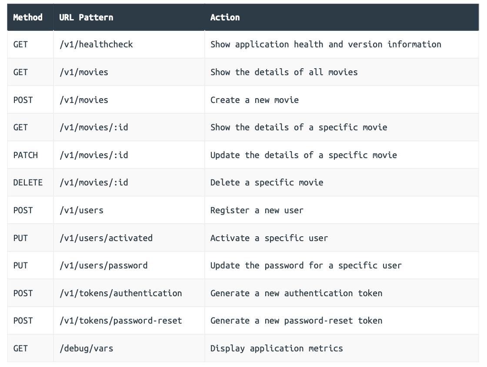

### Project Setup and Skeleton Structure

```
.
├── bin 
├── cmd 
│   └── api
│       └── main.go 
├── internal 
├── migrations 
├── remote 
├── go.mod 
└── Makefile
```

Here are the explanations: 

- The `bin` directory will contain our compiled application binaries, ready for deployment to a production server.
- The `cmd/api` directory will contain the application-specific code for our Greenlight API application. This will include the code for running the server, reading and writing HTTP requests, and managing authentication.
- The `internal` directory will contain various ancillary packages used by our API. It will contain the code for interacting with our database, doing data validation, sending emails and so on. Basically, any code which isn’t application-specific and can potentially be reused will live in here. Our Go code under `cmd/api` will import the packages in the internal directory (but never the other way around).
- The `migrations` directory will contain the SQL migration files for our database.
- The `remote` directory will contain the configuration files and setup scripts for our production server.
- The `go.mod` file will declare our project dependencies, versions and module path.
- The `Makefile` will contain recipes for automating common administrative tasks — like auditing our Go code, building binaries, and executing database migrations.

### A Basic HTTP Server

To start with, we’ll configure our server to have just one endpoint: `/v1/healthcheck`. This endpoint will return some basic information about our API, including its current version number and operating environment (development, staging, production, etc.).

```go
// File: cmd/api/main.go 

package main 

import (   
  "flag"    
  "fmt"    
  "log/slog"  
  "net/http"   
  "os"   
  "time" 
)

// Declare a string containing the application version number. Later in the book we'll 
// generate this automatically at build time, but for now we'll just store the version 
// number as a hard-coded global constant.
const version = "1.0.0" 

// Define a config struct to hold all the configuration settings for our application.
// For now, the only configuration settings will be the network port that we want the 
// server to listen on, and the name of the current operating environment for the 
// application (development, staging, production, etc.). We will read in these  
// configuration settings from command-line flags when the application starts.
type config struct {   
  port int   
  env  string 
}

// Define an application struct to hold the dependencies for our HTTP handlers, helpers, 
// and middleware. At the moment this only contains a copy of the config struct and a 
// logger, but it will grow to include a lot more as our build progresses.
type application struct {  
  config config   
  logger *slog.Logger 
} 

func main() {  
  // Declare an instance of the config struct.
  var cfg config   
  
  // Read the value of the port and env command-line flags into the config struct. We  
  // default to using the port number 4000 and the environment "development" if no  
  // corresponding flags are provided.
  flag.IntVar(&cfg.port, "port", 4000, "API server port")   
  flag.StringVar(&cfg.env, "env", "development", "Environment (development|staging|production)")  
  
  flag.Parse()  
  
  // Initialize a new structured logger which writes log entries to the standard out  
  // stream.
  logger := slog.New(slog.NewTextHandler(os.Stdout, nil))   
  
  // Declare an instance of the application struct, containing the config struct and  
  // the logger.
  app := &application{   
    config: cfg,     
    logger: logger,   
  }   
  
  // Declare a new servemux and add a /v1/healthcheck route which dispatches requests  
  // to the healthcheckHandler method (which we will create in a moment).
  mux := http.NewServeMux()   
  mux.HandleFunc("/v1/healthcheck", app.healthcheckHandler)  
  
  // Declare a HTTP server which listens on the port provided in the config struct,   
  // uses the servemux we created above as the handler, has some sensible timeout   
  // settings and writes any log messages to the structured logger at Error level.
  srv := &http.Server{      
    Addr:         fmt.Sprintf(":%d", cfg.port),   
    Handler:      mux,       
    IdleTimeout:  time.Minute,    
    ReadTimeout:  5 * time.Second,     
    WriteTimeout: 10 * time.Second,    
    ErrorLog:     slog.NewLogLogger(logger.Handler(), slog.LevelError),  
  }     
  
  // Start the HTTP server.
  logger.Info("starting server", "addr", srv.Addr, "env", cfg.env)   
  
  err := srv.ListenAndServe()   
  logger.Error(err.Error())  
  os.Exit(1) 
}
```

#### Creating the healthcheck handler

```go
// File: cmd/api/healthcheck.go 

package main

import (  
  "fmt"   
  "net/http" 
)

// Declare a handler which writes a plain-text response with information about the 
// application status, operating environment and version.
func (app *application) healthcheckHandler(w http.ResponseWriter, r *http.Request) {  
  fmt.Fprintln(w, "status: available")   
  fmt.Fprintf(w, "environment: %s\n", app.config.env) 
  fmt.Fprintf(w, "version: %s\n", version) 
}
```

#### Additional Information

##### API versioning

There are [two common approaches](https://stackoverflow.com/questions/389169/best-practices-for-api-versioning) to doing this:

1. By prefixing all URLs with your API version, like `/v1/healthcheck` or `/v2/healthcheck`.
2. By using custom `Accept` and `Content-Type` headers on requests and responses to convey the API version, like `Accept: application/vnd.greenlight-v1`.

### API Endpoints and RESTful Routing

#### Encapsulating the API routes

```go
// File: cmd/api/routes.go 

package main 

import (  
  "net/http"  
  
  "github.com/julienschmidt/httprouter" 
)

func (app *application) routes() http.Handler {  
  // Initialize a new httprouter router instance.
  router := httprouter.New()   
  
  // Register the relevant methods, URL patterns and handler functions for our   
  // endpoints using the HandlerFunc() method. Note that http.MethodGet and    
  // http.MethodPost are constants which equate to the strings "GET" and "POST"  
  // respectively.
  router.HandlerFunc(http.MethodGet, "/v1/healthcheck", app.healthcheckHandler)   
  router.HandlerFunc(http.MethodPost, "/v1/movies", app.createMovieHandler)    
  router.HandlerFunc(http.MethodGet, "/v1/movies/:id", app.showMovieHandler) 
  
  // Return the httprouter instance.
  return router
}
```

There are a couple of benefits to encapsulating our routing rules in this way. The first benefit is that it keeps our main() function clean and ensures all our routes are defined in one single place. The other big benefit, which we demonstrated in the first Let’s Go book, is that we can now easily access the router in any test code by initializing an application instance and calling the routes() method on it.

```go
// File: cmd/api/main.go 

package main 

...

func main() {  
  var cfg config  
  
  flag.IntVar(&cfg.port, "port", 4000, "API server port")   
  flag.StringVar(&cfg.env, "env", "development", "Environment (development|staging|production)")   
  flag.Parse()  
  
  logger := slog.New(slog.NewTextHandler(os.Stdout, nil)) 
  app := &application{    
    config: cfg,   
    logger: logger,   
  }    
  
  // Use the httprouter instance returned by app.routes() as the server handler.
  srv := &http.Server{    
    Addr:         fmt.Sprintf(":%d", cfg.port),   
    Handler:      app.routes(),     
    IdleTimeout:  time.Minute,       
    ReadTimeout:  5 * time.Second,   
    WriteTimeout: 10 * time.Second,     
    ErrorLog:     slog.NewLogLogger(logger.Handler(), slog.LevelError),   
  }   
  
  logger.Info("starting server", "addr", srv.Addr, "env", cfg.env)  
  err := srv.ListenAndServe()    
  logger.Error(err.Error())   
  os.Exit(1) 
}
```

#### Adding the new handler functions

```go
// File: cmd/api/movies.go

package main 

import (  
  "fmt"   
  "net/http"  
  "strconv"  
  
  "github.com/julienschmidt/httprouter" 
)

// Add a createMovieHandler for the "POST /v1/movies" endpoint. For now we simply 
// return a plain-text placeholder response.
func (app *application) createMovieHandler(w http.ResponseWriter, r *http.Request) {  
  fmt.Fprintln(w, "create a new movie") 
}

// Add a showMovieHandler for the "GET /v1/movies/:id" endpoint. For now, we retrieve 
// the interpolated "id" parameter from the current URL and include it in a placeholder 
// response.
func (app *application) showMovieHandler(w http.ResponseWriter, r *http.Request) {  
  // When httprouter is parsing a request, any interpolated URL parameters will be  
  // stored in the request context. We can use the ParamsFromContext() function to  
  // retrieve a slice containing these parameter names and values.
  params := httprouter.ParamsFromContext(r.Context())  
  
  // We can then use the ByName() method to get the value of the "id" parameter from  
  // the slice. In our project all movies will have a unique positive integer ID, but   
  // the value returned by ByName() is always a string. So we try to convert it to a  
  // base 10 integer (with a bit size of 64). If the parameter couldn't be converted,  
  // or is less than 1, we know the ID is invalid so we use the http.NotFound()  
  // function to return a 404 Not Found response.
  id, err := strconv.ParseInt(params.ByName("id"), 10, 64)   
  if err != nil || id < 1 {  
    http.NotFound(w, r)     
    return   
  }    
  
  // Otherwise, interpolate the movie ID in a placeholder response.
  fmt.Fprintf(w, "show the details of movie %d\n", id) 
}
```

#### Creating a helper to read ID parameters

```go
// File: cmd/api/helpers.go 

package main 

import ( 
  "errors"   
  "net/http"  
  "strconv"  
  
  "github.com/julienschmidt/httprouter" 
)

// Retrieve the "id" URL parameter from the current request context, then convert it to 
// an integer and return it. If the operation isn't successful, return 0 and an error. 
func (app *application) readIDParam(r *http.Request) (int64, error) { 
  params := httprouter.ParamsFromContext(r.Context())  
  
  id, err := strconv.ParseInt(params.ByName("id"), 10, 64)  
  if err != nil || id < 1 {    
    return 0, errors.New("invalid id parameter")  
  }   
  
  return id, nil 
}
```

**Note**: The `readIDParam()` method doesn’t use any dependencies from our application struct so it could just be a regular function, rather than a method on application. But in general, I suggest setting up all your application-specific handlers and helpers so that they are methods on application. It helps maintain consistency in your code structure, and also future-proofs your code for when those handlers and helpers change later and they do need access to a dependency.

```go
// File: cmd/api/movies.go 

package main 

import (   
  "fmt"  
  "net/http" 
)

...

func (app *application) showMovieHandler(w http.ResponseWriter, r *http.Request) { 
  id, err := app.readIDParam(r)  
  if err != nil {    
    http.NotFound(w, r)  
    return   
  }   
  fmt.Fprintf(w, "show the details of movie %d\n", id)
}
```

#### Additional Information

##### Conflicting routes

It’s important to be aware that `httprouter` doesn’t allow conflicting routes which potentially match the same request. So, for example, you cannot register a route like `GET /foo/new` and another route with a parameter segment that conflicts with it — like `GET /foo/:id`.