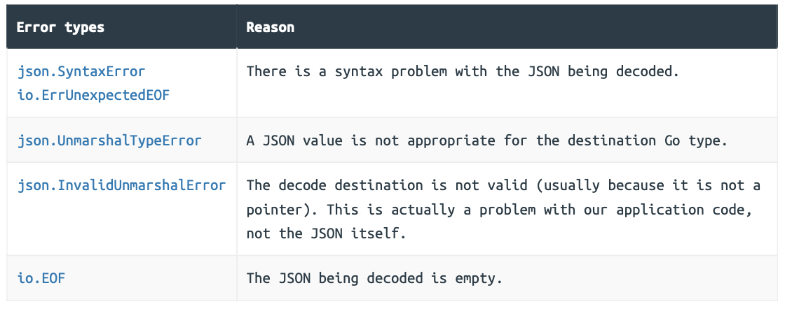

### JSON Decoding

ust like JSON encoding, there are two approaches that you can take to decode JSON into a native Go object: using a `json.Decoder` type or using the `json.Unmarshal()` function.

Both approaches have their pros and cons, but for the purpose of decoding JSON from a HTTP request body, using `json.Decoder` is generally the best choice. It’s more efficient than `json.Unmarshal()`, requires less code, and offers some helpful settings that you can use to tweak its behavior.

```go
// File: cmd/api/movies.go 

package main 

import (   
  "encoding/json" // New import  
  "fmt"  
  "net/http"  
  "time"  
  
  "greenlight.alexedwards.net/internal/data" 
)

...

func (app *application) createMovieHandler(w http.ResponseWriter, r *http.Request) { 
  // Declare an anonymous struct to hold the information that we expect to be in the  
  // HTTP request body (note that the field names and types in the struct are a subset  
  // of the Movie struct that we created earlier). This struct will be our *target   
  // decode destination*.
  var input struct {   
    Title   string   `json:"title"`   
    Year    int32    `json:"year"`    
    Runtime int32    `json:"runtime"`    
    Genres  []string `json:"genres"`  
  }
  
  // Initialize a new json.Decoder instance which reads from the request body, and   
  // then use the Decode() method to decode the body contents into the input struct. 
  // Importantly, notice that when we call Decode() we pass a *pointer* to the input  
  // struct as the target decode destination. If there was an error during decoding,   
  // we also use our generic errorResponse() helper to send the client a 400 Bad   
  // Request response containing the error message.
  err := json.NewDecoder(r.Body).Decode(&input)   
  if err != nil {   
    app.errorResponse(w, r, http.StatusBadRequest, err.Error())  
    return   
  }    
  
  // Dump the contents of the input struct in a HTTP response.
  fmt.Fprintf(w, "%+v\n", input) 
}

...
```

There are few important and interesting things about this code to point out: 

- When calling Decode() you must pass a non-nil pointer as the target decode destination. If you don’t use a pointer, it will return a json.InvalidUnmarshalError error at runtime.
- If the target decode destination is a struct — like in our case — the struct fields must be exported (start with a capital letter). Just like with encoding, they need to be exported so that they’re visible to the `encoding/json` package. 
- When decoding a JSON object into a struct, the key/value pairs in the JSON are mapped to the struct fields based on the struct tag names. If there is no matching struct tag, Go will attempt to decode the value into a field that matches the key name (exact matches are preferred, but it will fall back to a case-insensitive match). Any JSON key/value pairs which cannot be successfully mapped to the struct fields will be silently ignored.
- There is no need to close r.Body after it has been read. This will be done automatically by Go’s http.Server, so you don’t have to.

#### Additional Information

##### Using the json.Unmarshal function

```go
func (app *application) exampleHandler(w http.ResponseWriter, r *http.Request) {  
  var input struct {    
    Foo string `json:"foo"`  
  }    
  
  // Use io.ReadAll() to read the entire request body into a []byte slice.
  body, err := io.ReadAll(r.Body)  
  if err != nil {     
    app.serverErrorResponse(w, r, err)  
    return    
  }   
  
  // Use the json.Unmarshal() function to decode the JSON in the []byte slice to the 
  // input struct. Again, notice that we are using a *pointer* to the input   
  // struct as the decode destination.
  err = json.Unmarshal(body, &input)   
  if err != nil {  
    app.errorResponse(w, r, http.StatusBadRequest, err.Error())  
    return    
  }  
  
  fmt.Fprintf(w, "%+v\n", input) 
}

...
```

Using this approach is fine — the code works, and it’s clear and simple. But it doesn’t offer any benefits over and above the json.Decoder approach that we’re already taking.

Not only is the code marginally more verbose, but it’s also less efficient. If we benchmark the relative performance for this particular use case, we can see that using json.Unmarshal() requires about 80% more memory (B/op) than json.Decoder, as well as being a tiny bit slower (ns/op).

### Managing Bad Requests

Our createMovieHandler now works well when it receives a valid JSON request body with the appropriate data. But at this point you might be wondering: 

- What if the client sends something that isn’t JSON, like XML or some random bytes? 
- What happens if the JSON is malformed or contains an error? 
- What if the JSON types don’t match the types we are trying to decode into? 
- What if the request doesn’t even contain a body?

#### Triaging the Decode error

At this point in our application build, the Decode() method could potentially return the following five types of error:



```go
// File: cmd/api/helpers.go 

package main 

import (   
  "encoding/json" 
  "errors"   
  "fmt" // New import   
  "io"  // New import  
  "net/http"   
  "strconv"  
  "github.com/julienschmidt/httprouter" 
)

...

func (app *application) readJSON(w http.ResponseWriter, r *http.Request, dst any) error {  
  // Decode the request body into the target destination. 
  err := json.NewDecoder(r.Body).Decode(dst)   
  if err != nil { 
    // If there is an error during decoding, start the triage...
    var syntaxError *json.SyntaxError    
    var unmarshalTypeError *json.UnmarshalTypeError    
    var invalidUnmarshalError *json.InvalidUnmarshalError  
    
    switch {       
    // Use the errors.As() function to check whether the error has the type    
    // *json.SyntaxError. If it does, then return a plain-english error message    
    // which includes the location of the problem.
    case errors.As(err, &syntaxError):       
      return fmt.Errorf("body contains badly-formed JSON (at character %d)", syntaxError.Offset)   
      
    // In some circumstances Decode() may also return an io.ErrUnexpectedEOF error   
    // for syntax errors in the JSON. So we check for this using errors.Is() and    
    // return a generic error message. There is an open issue regarding this at    
    // https://github.com/golang/go/issues/25956.
    case errors.Is(err, io.ErrUnexpectedEOF):    
      return errors.New("body contains badly-formed JSON")     
      
    // Likewise, catch any *json.UnmarshalTypeError errors. These occur when the  
    // JSON value is the wrong type for the target destination. If the error relates   
    // to a specific field, then we include that in our error message to make it    
    // easier for the client to debug.
    case errors.As(err, &unmarshalTypeError):     
      if unmarshalTypeError.Field != "" {     
        return fmt.Errorf("body contains incorrect JSON type for field %q", unmarshalTypeError.Field)       
      }       
      return fmt.Errorf("body contains incorrect JSON type (at character %d)", unmarshalTypeError.Offset)      
      
    // An io.EOF error will be returned by Decode() if the request body is empty. We     
    // check for this with errors.Is() and return a plain-english error message     
    // instead.
    case errors.Is(err, io.EOF):     
      return errors.New("body must not be empty")   
      
    // A json.InvalidUnmarshalError error will be returned if we pass something    
    // that is not a non-nil pointer to Decode(). We catch this and panic,     
    // rather than returning an error to our handler. At the end of this chapter    
    // we'll talk about panicking versus returning errors, and discuss why it's an   
    // appropriate thing to do in this specific situation.
    case errors.As(err, &invalidUnmarshalError):         
      panic(err)     
      
    // For anything else, return the error message as-is.
    default:      
      return err   
    }
  }
    
  return nil 
}
```

```go
// File: cmd/api/movies.go 

package main 

import (   
  "fmt"  
  "net/http"  
  "time"   
  
  "greenlight.alexedwards.net/internal/data" 
)

func (app *application) createMovieHandler(w http.ResponseWriter, r *http.Request) {  
  var input struct {      
    Title   string   `json:"title"`   
    Year    int32    `json:"year"`    
    Runtime int32    `json:"runtime"`  
    Genres  []string `json:"genres"`  
  }
  
  // Use the new readJSON() helper to decode the request body into the input struct. 
  // If this returns an error we send the client the error message along with a 400  
  // Bad Request status code, just like before.
  err := app.readJSON(w, r, &input)  
  if err != nil {   
    app.errorResponse(w, r, http.StatusBadRequest, err.Error()) 
    return    
  }  
  
  fmt.Fprintf(w, "%+v\n", input) 
}

...
```

#### Making a bad request helper

In the `createMovieHandler` code above we’re using our generic `app.errorResponse()` helper to send the client a `400 Bad Request` response along with the error message.

Let’s quickly replace this with a specialist `app.badRequestResponse()` helper function instead:

```go
// File: cmd/api/errors.go 

package main 

...

func (app *application) badRequestResponse(w http.ResponseWriter, r *http.Request, err error) {    
  app.errorResponse(w, r, http.StatusBadRequest, err.Error())
}
```

```go
// File: cmd/api/movies.go 

package main 

...

func (app *application) createMovieHandler(w http.ResponseWriter, r *http.Request) {  
  var input struct {     
    Title   string   `json:"title"`  
    Year    int32    `json:"year"`  
    Runtime int32    `json:"runtime"`   
    Genres  []string `json:"genres"`    
  }    
  
  err := app.readJSON(w, r, &input)   
  if err != nil {    
    // Use the new badRequestResponse() helper.
    app.badRequestResponse(w, r, err)   
    return    
  } 
  
  fmt.Fprintf(w, "%+v\n", input) 
}

...
```

#### Additional Information

##### Panicking vs returning errors

The first class of errors are expected errors that may occur during normal operation. Some examples of expected errors are those caused by a database query timeout, a network resource being unavailable, or bad user input. These errors don’t necessarily mean there is a problem with your program itself — in fact they’re often caused by things outside the control of your program. Almost all of the time it’s good practice to return these kinds of errors and handle them gracefully.

The other class of errors are unexpected errors. These are errors which should not happen during normal operation, and if they do it is probably the result of a developer mistake or a logical error in your codebase. These errors are truly exceptional, and using panic in these circumstances is more widely accepted. In fact, the Go standard library frequently does this when you make a logical error or try to use the language features in an unintended way —such as when trying to access an out-of-bounds index in a slice, or trying to close an alreadyclosed channel.

But even then, I’d recommend trying to return and gracefully handle unexpected errors in most cases. The exception to this is when returning the error adds an unacceptable amount of error handling to the rest of your codebase.

Bringing this back to our readJSON() helper, if we get a json.InvalidUnmarshalError at runtime it’s because we as the developers have passed an unsupported value to Decode(). This is firmly an unexpected error which we shouldn’t see under normal operation, and is something that should be picked up in development and tests long before deployment.

### Restricting Inputs

To ensure that there are no additional JSON values (or any other content) in the request body, we will need to call Decode() a second time in our readJSON() helper and check that it returns an io.EOF (end of file) error.

Finally, there’s currently no upper-limit on the maximum size of the request body that we accept. This means that our createMovieHandler would be a good target for any malicious clients that wish to perform a denial-of-service attack on our API. We can address this by using the http.MaxBytesReader() function to limit the maximum size of the request body.

```go
// File: cmd/api/helpers.go

package main 

import (  
  "encoding/json"  
  "errors"   
  "fmt"   
  "io"   
  "net/http"  
  "strconv"   
  "strings" // New import  
  
  "github.com/julienschmidt/httprouter" 
)

...

func (app *application) readJSON(w http.ResponseWriter, r *http.Request, dst any) error {  
  // Use http.MaxBytesReader() to limit the size of the request body to 1MB.
  maxBytes := 1_048_576   
  r.Body = http.MaxBytesReader(w, r.Body, int64(maxBytes))  
  
  // Initialize the json.Decoder, and call the DisallowUnknownFields() method on it   
  // before decoding. This means that if the JSON from the client now includes any  
  // field which cannot be mapped to the target destination, the decoder will return 
  // an error instead of just ignoring the field.
  dec := json.NewDecoder(r.Body)  
  dec.DisallowUnknownFields()   
  
  // Decode the request body to the destination.
  err := dec.Decode(dst)   
  if err != nil {    
    var syntaxError *json.SyntaxError   
    var unmarshalTypeError *json.UnmarshalTypeError  
    var invalidUnmarshalError *json.InvalidUnmarshalError     
    // Add a new maxBytesError variable.
    var maxBytesError *http.MaxBytesError    
    
    switch {     
    case errors.As(err, &syntaxError):      
      return fmt.Errorf("body contains badly-formed JSON (at character %d)", syntaxError.Offset)   
      
    case errors.Is(err, io.ErrUnexpectedEOF):       
      return errors.New("body contains badly-formed JSON")
      
    case errors.As(err, &unmarshalTypeError):        
      if unmarshalTypeError.Field != "" {      
        return fmt.Errorf("body contains incorrect JSON type for field %q", unmarshalTypeError.Field)      
      }         
      return fmt.Errorf("body contains incorrect JSON type (at character %d)", unmarshalTypeError.Offset)    
      
    case errors.Is(err, io.EOF):     
      return errors.New("body must not be empty")     
      
    // If the JSON contains a field which cannot be mapped to the target destination    
    // then Decode() will now return an error message in the format "json: unknown    
    // field "<name>"". We check for this, extract the field name from the error,   
    // and interpolate it into our custom error message. Note that there's an open   
    // issue at https://github.com/golang/go/issues/29035 regarding turning this   
    // into a distinct error type in the future.
    case strings.HasPrefix(err.Error(), "json: unknown field "):       
      fieldName := strings.TrimPrefix(err.Error(), "json: unknown field ")   
      return fmt.Errorf("body contains unknown key %s", fieldName)  
      
    // Use the errors.As() function to check whether the error has the type   
    // *http.MaxBytesError. If it does, then it means the request body exceeded our   
    // size limit of 1MB and we return a clear error message.
    case errors.As(err, &maxBytesError):      
      return fmt.Errorf("body must not be larger than %d bytes", maxBytesError.Limit)   
      
    case errors.As(err, &invalidUnmarshalError):       
      panic(err)     
      
    default:     
      return err    
    }  
  }   
  
  // Call Decode() again, using a pointer to an empty anonymous struct as the    
  // destination. If the request body only contained a single JSON value this will   
  // return an io.EOF error. So if we get anything else, we know that there is    
  // additional data in the request body and we return our own custom error message.
  err = dec.Decode(&struct{}{})  
  if !errors.Is(err, io.EOF) {     
    return errors.New("body must only contain a single JSON value")  
  }   
  
  return nil 
}
```

### Custom JSON Decoding

#### The json.Unmarshaler interface

```go
// File: cmd/api/movies.go 

package main 

...

func (app *application) createMovieHandler(w http.ResponseWriter, r *http.Request) {  
  var input struct {       
    Title   string       `json:"title"`   
    Year    int32        `json:"year"`    
    Runtime data.Runtime `json:"runtime"` // Make this field a data.Runtime type.
    Genres  []string     `json:"genres"`   
  }
  
  err := app.readJSON(w, r, &input)   
  if err != nil {    
    app.badRequestResponse(w, r, err)    
    return   
  } 
  
  fmt.Fprintf(w, "%+v\n", input) 
}

...
```

```go
// File: internal/data/runtime.go 

package data

import (   
  "errors" // New import  
  "fmt"  
  "strconv" 
  "strings" // New import 
)

// Define an error that our UnmarshalJSON() method can return if we're unable to parse 
// or convert the JSON string successfully.
var ErrInvalidRuntimeFormat = errors.New("invalid runtime format") 

type Runtime int32 

...

// Implement a UnmarshalJSON() method on the Runtime type so that it satisfies the 
// json.Unmarshaler interface. IMPORTANT: Because UnmarshalJSON() needs to modify the 
// receiver (our Runtime type), we must use a pointer receiver for this to work 
// correctly. Otherwise, we will only be modifying a copy (which is then discarded when 
// this method returns).
func (r *Runtime) UnmarshalJSON(jsonValue []byte) error {  
  // We expect that the incoming JSON value will be a string in the format    
  // "<runtime> mins", and the first thing we need to do is remove the surrounding  
  // double-quotes from this string. If we can't unquote it, then we return the   
  // ErrInvalidRuntimeFormat error.
  unquotedJSONValue, err := strconv.Unquote(string(jsonValue))   
  if err != nil {     
    return ErrInvalidRuntimeFormat   
  }   
  
  // Split the string to isolate the part containing the number. 
  parts := strings.Split(unquotedJSONValue, " ")   
  
  // Sanity check the parts of the string to make sure it was in the expected format. 
  // If it isn't, we return the ErrInvalidRuntimeFormat error again.
  if len(parts) != 2 || parts[1] != "mins" {   
    return ErrInvalidRuntimeFormat   
  }  
  
  // Otherwise, parse the string containing the number into an int32. Again, if this 
  // fails return the ErrInvalidRuntimeFormat error.
  i, err := strconv.ParseInt(parts[0], 10, 32)  
  if err != nil {     
    return ErrInvalidRuntimeFormat   
  }    
  
  // Convert the int32 to a Runtime type and assign this to the receiver. Note that we 
  // use the * operator to deference the receiver (which is a pointer to a Runtime  
  // type) in order to set the underlying value of the pointer.
  *r = Runtime(i)  
  
  return nil 
}
```

### Validating JSON Input

#### Creating a validator package

```go
// File: internal/validator/validator.go 

package validator 

import (  
  "regexp"  
  "slices"
)

// Declare a regular expression for sanity checking the format of email addresses. 
var (   
  EmailRX = regexp.MustCompile("^[a-zA-Z0-9.!#$%&'*+/=?^_`{|}~-]+@[a-zA-Z0-9](?:[a-zA-Z0-9-]{0,61}[a-zA-Z0-9])?(?:\\.[a-zA-Z0-9](?:[a-zA-Z0-9-]{0,61}[a-zA-Z0-9])?)*$")
 )
  
// Define a new Validator type which contains a map of validation errors.
type Validator struct {   
  Errors map[string]string 
}
  
// New is a helper which creates a new Validator instance with an empty errors map.
func New() *Validator {  
  return &Validator{Errors: make(map[string]string)} 
}
  
// Valid returns true if the errors map doesn't contain any entries.
func (v *Validator) Valid() bool {   
  return len(v.Errors) == 0
}
  
// AddError adds an error message to the map (so long as no entry already exists for 
// the given key).
func (v *Validator) AddError(key, message string) {   
  if _, exists := v.Errors[key]; !exists {    
    v.Errors[key] = message  
  }
}
  
// Check adds an error message to the map only if a validation check is not 'ok'.
func (v *Validator) Check(ok bool, key, message string) { 
  if !ok {     
    v.AddError(key, message)  
  }
}
  
// Generic function which returns true if a specific value is in a list of permitted 
// values.
func PermittedValue[T comparable](value T, permittedValues ...T) bool {  
  return slices.Contains(permittedValues, value) 
}
  
// Matches returns true if a string value matches a specific regexp pattern.
func Matches(value string, rx *regexp.Regexp) bool {  
  return rx.MatchString(value) 
}
  
// Generic function which returns true if all values in a slice are unique.
func Unique[T comparable](values []T) bool {  
  uniqueValues := make(map[T]bool)  
  for _, value := range values {     
    uniqueValues[value] = true   
  }
  return len(values) == len(uniqueValues)
}
```

#### Performing validation checks

```go
// File: cmd/api/errors.go 

package main 

...

// Note that the errors parameter here has the type map[string]string, which is exactly  
// the same as the errors map contained in our Validator type.
func (app *application) failedValidationResponse(w http.ResponseWriter, r *http.Request, errors map[string]string) {  
  app.errorResponse(w, r, http.StatusUnprocessableEntity, errors) 
}
```

```go
// File: cmd/api/movies.go 

package main 

import ( 
  "fmt"  
  "net/http"   
  "time"   
  
  "greenlight.alexedwards.net/internal/data"     
  "greenlight.alexedwards.net/internal/validator" // New import 
)

func (app *application) createMovieHandler(w http.ResponseWriter, r *http.Request) {  
  var input struct {     
    Title   string       `json:"title"`    
    Year    int32        `json:"year"`     
    Runtime data.Runtime `json:"runtime"`    
    Genres  []string     `json:"genres"`  
  }
  
  err := app.readJSON(w, r, &input)  
  if err != nil {    
    app.badRequestResponse(w, r, err)    
    return   
  }  
  
  // Initialize a new Validator instance.
  v := validator.New()   
  
  // Use the Check() method to execute our validation checks. This will add the  
  // provided key and error message to the errors map if the check does not evaluate   
  // to true. For example, in the first line here we "check that the title is not  
  // equal to the empty string". In the second, we "check that the length of the title 
  // is less than or equal to 500 bytes" and so on.
  v.Check(input.Title != "", "title", "must be provided")  
  v.Check(len(input.Title) <= 500, "title", "must not be more than 500 bytes long")    
  
  v.Check(input.Year != 0, "year", "must be provided")   
  v.Check(input.Year >= 1888, "year", "must be greater than 1888")  
  v.Check(input.Year <= int32(time.Now().Year()), "year", "must not be in the future")  
  
  v.Check(input.Runtime != 0, "runtime", "must be provided")  
  v.Check(input.Runtime > 0, "runtime", "must be a positive integer")  
  
  v.Check(input.Genres != nil, "genres", "must be provided")   
  v.Check(len(input.Genres) >= 1, "genres", "must contain at least 1 genre") 
  v.Check(len(input.Genres) <= 5, "genres", "must not contain more than 5 genres")  
  
  // Note that we're using the Unique helper in the line below to check that all    
  // values in the input.Genres slice are unique.
  v.Check(validator.Unique(input.Genres), "genres", "must not contain duplicate values")  
  
  // Use the Valid() method to see if any of the checks failed. If they did, then use  
  // the failedValidationResponse() helper to send a response to the client, passing  
  // in the v.Errors map.
  if !v.Valid() {   
    app.failedValidationResponse(w, r, v.Errors)   
    return   
  }   
  
  fmt.Fprintf(w, "%+v\n", input) 
}

...
```

#### Making validation rules reusable

```go
// File: internal/data/movies.go 

package data 

import (  
  "time"   
  
  "greenlight.alexedwards.net/internal/validator" // New import 
)

type Movie struct {  
  ID        int64     `json:"id"` 
  CreatedAt time.Time `json:"-"` 
  Title     string    `json:"title"`  
  Year      int32     `json:"year,omitempty"` 
  Runtime   Runtime   `json:"runtime,omitempty"`  
  Genres    []string  `json:"genres,omitempty"`  
  Version   int32     `json:"version"`
}

func ValidateMovie(v *validator.Validator, movie *Movie) {  
  v.Check(movie.Title != "", "title", "must be provided")  
  v.Check(len(movie.Title) <= 500, "title", "must not be more than 500 bytes long")  
  
  v.Check(movie.Year != 0, "year", "must be provided")   
  v.Check(movie.Year >= 1888, "year", "must be greater than 1888")  
  v.Check(movie.Year <= int32(time.Now().Year()), "year", "must not be in the future")  
  
  v.Check(movie.Runtime != 0, "runtime", "must be provided")  
  v.Check(movie.Runtime > 0, "runtime", "must be a positive integer")  
  
  v.Check(movie.Genres != nil, "genres", "must be provided")  
  v.Check(len(movie.Genres) >= 1, "genres", "must contain at least 1 genre")  
  v.Check(len(movie.Genres) <= 5, "genres", "must not contain more than 5 genres")  
  v.Check(validator.Unique(movie.Genres), "genres", "must not contain duplicate values")
}
```

```go
// File: cmd/api/movies.go 

package main 

...

func (app *application) createMovieHandler(w http.ResponseWriter, r *http.Request) { 
  var input struct {      
    Title   string       `json:"title"`   
    Year    int32        `json:"year"`     
    Runtime data.Runtime `json:"runtime"`    
    Genres  []string     `json:"genres"`    
  }
  
  err := app.readJSON(w, r, &input)   
  if err != nil {     
    app.badRequestResponse(w, r, err)    
    return   
  }    
  
  // Copy the values from the input struct to a new Movie struct.
  movie := &data.Movie{    
    Title:   input.Title,     
    Year:    input.Year,    
    Runtime: input.Runtime,    
    Genres:  input.Genres,   
  }
  
  // Initialize a new Validator.
  v := validator.New()  
  
  // Call the ValidateMovie() function and return a response containing the errors if   
  // any of the checks fail.
  if data.ValidateMovie(v, movie); !v.Valid() {     
    app.failedValidationResponse(w, r, v.Errors)     
    return  
  }   
  
  fmt.Fprintf(w, "%+v\n", input) 
}

...
```

