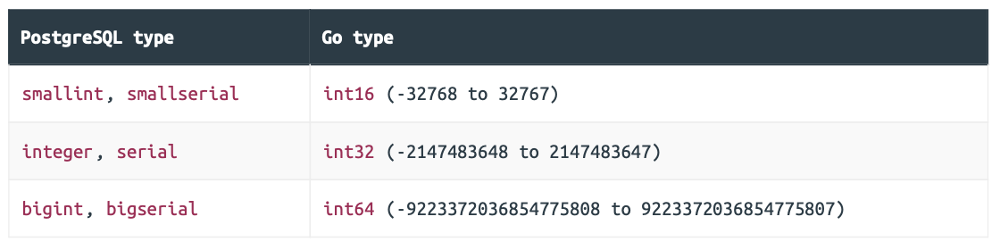

### Setting up the Movie Model

```go
// File: internal/data/movies.go 

package data 

import (  
  "database/sql" // New import  
  "time"   
  
  "greenlight.alexedwards.net/internal/validator" 
)

...

// Define a MovieModel struct type which wraps a sql.DB connection pool.
type MovieModel struct {   
  DB *sql.DB 
}

// Add a placeholder method for inserting a new record in the movies table.
func (m MovieModel) Insert(movie *Movie) error {  
  return nil 
}

// Add a placeholder method for fetching a specific record from the movies table.
func (m MovieModel) Get(id int64) (*Movie, error) {  
  return nil, nil 
}

// Add a placeholder method for updating a specific record in the movies table.
func (m MovieModel) Update(movie *Movie) error { 
  return nil 
}

// Add a placeholder method for deleting a specific record from the movies table.
func (m MovieModel) Delete(id int64) error {  
  return nil 
}
```

```go
// File: internal/data/models.go 

package data 

import ( 
  "database/sql" 
  "errors" 
)

// Define a custom ErrRecordNotFound error. We'll return this from our Get() method when 
// looking up a movie that doesn't exist in our database.
var ( 
  ErrRecordNotFound = errors.New("record not found") 
)

// Create a Models struct which wraps the MovieModel. We'll add other models to this, 
// like a UserModel and PermissionModel, as our build progresses.
type Models struct {  
  Movies MovieModel 
}

// For ease of use, we also add a New() method which returns a Models struct containing 
// the initialized MovieModel.
func NewModels(db *sql.DB) Models {  
  return Models{     
    Movies: MovieModel{DB: db},  
  }
}
```

```go
// File: cmd/api/main.go 

package main 

import ( 
  "context"   
  "database/sql"  
  "flag"   
  "fmt"   
  "log/slog"   
  "net/http"  
  "os"  
  "time"    
  
  "greenlight.alexedwards.net/internal/data" // New import    
  
  _ "github.com/lib/pq" 
)

...

// Add a models field to hold our new Models struct.
type application struct {  
  config config   
  logger *slog.Logger  
  models data.Models 
}

func main() {   
  var cfg config  
  
  flag.IntVar(&cfg.port, "port", 4000, "API server port")  
  flag.StringVar(&cfg.env, "env", "development", "Environment (development|staging|production)")   
  
  flag.StringVar(&cfg.db.dsn, "db-dsn", os.Getenv("GREENLIGHT_DB_DSN"), "PostgreSQL DSN")  
  
  flag.IntVar(&cfg.db.maxOpenConns, "db-max-open-conns", 25, "PostgreSQL max open connections")  
  flag.IntVar(&cfg.db.maxIdleConns, "db-max-idle-conns", 25, "PostgreSQL max idle connections")  
  flag.DurationVar(&cfg.db.maxIdleTime, "db-max-idle-time", 15*time.Minute, "PostgreSQL max connection idle time")  
  
  flag.Parse()  
  
  logger := slog.New(slog.NewTextHandler(os.Stdout, nil)) 
  db, err := openDB(cfg) 
  if err != nil {   
    logger.Error(err.Error())   
    os.Exit(1)    
  }
  
  defer db.Close() 
  
  logger.Info("database connection pool established")   
  
  // Use the data.NewModels() function to initialize a Models struct, passing in the  
  // connection pool as a parameter.
  app := &application{    
    config: cfg,    
    logger: logger,  
    models: data.NewModels(db),  
  }  
  
  srv := &http.Server{    
    Addr:         fmt.Sprintf(":%d", cfg.port),   
    Handler:      app.routes(),   
    IdleTimeout:  time.Minute,     
    ReadTimeout:  5 * time.Second,     
    WriteTimeout: 10 * time.Second,   
    ErrorLog:     slog.NewLogLogger(logger.Handler(), slog.LevelError),  
  } 
  
  logger.Info("starting server", "addr", srv.Addr, "env", cfg.env)  
  
  err = srv.ListenAndServe()  
  logger.Error(err.Error())   
  os.Exit(1) 
}

...
```

### Creating a New Movie

#### Executing the SQL query

Normally, you would use Go’s `Exec()` method to execute an `INSERT` statement against a database table. But because our SQL query is returning a single row of data (thanks to the `RETURNING` clause), we’ll need to use the `QueryRow()` method here instead.

```go
// File: internal/data/movies.go 

package data

import (   
  "database/sql"  
  "time"   
  
  "greenlight.alexedwards.net/internal/validator"  
  
  "github.com/lib/pq" // New import 
)

...

// The Insert() method accepts a pointer to a movie struct, which should contain the 
// data for the new record.
func (m MovieModel) Insert(movie *Movie) error {  
  // Define the SQL query for inserting a new record in the movies table and returning   
  // the system-generated data.
  query := `    
  INSERT INTO movies (title, year, runtime, genres)    
  VALUES ($1, $2, $3, $4)       
  RETURNING id, created_at, version`   
  
  // Create an args slice containing the values for the placeholder parameters from  
  // the movie struct. Declaring this slice immediately next to our SQL query helps to  
  // make it nice and clear *what values are being used where* in the query.
  args := []any{movie.Title, movie.Year, movie.Runtime, pq.Array(movie.Genres)}   
  
  // Use the QueryRow() method to execute the SQL query on our connection pool,   
  // passing in the args slice as a variadic parameter and scanning the system  
  // generated id, created_at and version values into the movie struct.
  return m.DB.QueryRow(query, args...).Scan(&movie.ID, &movie.CreatedAt, &movie.Version) 
}

...
```

Also, notice the final value in the slice? In order to store our movie.Genres value (which is a []string slice) in the database, we need to pass it through the pq.Array() adapter function before executing the SQL query.

#### Hooking it up to our API handler

```go
// File: cmd/api/movies.go 

package main 

...

func (app *application) createMovieHandler(w http.ResponseWriter, r *http.Request) {  
  var input struct {     
    Title   string       `json:"title"`    
    Year    int32        `json:"year"`   
    Runtime data.Runtime `json:"runtime"`    
    Genres  []string     `json:"genres"`   
  }
  
  err := app.readJSON(w, r, &input)    
  if err != nil {   
    app.badRequestResponse(w, r, err)    
    return   
  }
  
  // Note that the movie variable contains a *pointer* to a Movie struct.
  movie := &data.Movie{    
    Title:   input.Title,   
    Year:    input.Year,  
    Runtime: input.Runtime,   
    Genres:  input.Genres,  
  } 
  
  v := validator.New()  
  if data.ValidateMovie(v, movie); !v.Valid() {    
    app.failedValidationResponse(w, r, v.Errors)   
    return    
  }
  
  // Call the Insert() method on our movies model, passing in a pointer to the 
  // validated movie struct. This will create a record in the database and update the  
  // movie struct with the system-generated information.
  err = app.models.Movies.Insert(movie)  
  if err != nil {     
    app.serverErrorResponse(w, r, err)     
    return  
  }
  
  // When sending a HTTP response, we want to include a Location header to let the  
  // client know which URL they can find the newly-created resource at. We make an   
  // empty http.Header map and then use the Set() method to add a new Location header,  
  // interpolating the system-generated ID for our new movie in the URL.
  headers := make(http.Header)   
  headers.Set("Location", fmt.Sprintf("/v1/movies/%d", movie.ID))   
  
  // Write a JSON response with a 201 Created status code, the movie data in the  
  // response body, and the Location header.
  err = app.writeJSON(w, http.StatusCreated, envelope{"movie": movie}, headers)  
  if err != nil {  
    app.serverErrorResponse(w, r, err)  
  }
}

...
```

### Fetching a Movie

```go
// File: internal/data/movies.go 

package data 

import (   
  "database/sql"   
  "errors" // New import  
  "time"     
  
  "greenlight.alexedwards.net/internal/validator"   
  
  "github.com/lib/pq" 
)

...

func (m MovieModel) Get(id int64) (*Movie, error) {  
  // The PostgreSQL bigserial type that we're using for the movie ID starts   
  // auto-incrementing at 1 by default, so we know that no movies will have ID values   
  // less than that. To avoid making an unnecessary database call, we take a shortcut  
  // and return an ErrRecordNotFound error straight away.
  if id < 1 {  
    return nil, ErrRecordNotFound  
  }    
  
  // Define the SQL query for retrieving the movie data.
  query := `   
  SELECT id, created_at, title, year, runtime, genres, version    
  FROM movies     
  WHERE id = $1`  
  
  // Declare a Movie struct to hold the data returned by the query.
  var movie Movie  
      
  // Execute the query using the QueryRow() method, passing in the provided id value   
  // as a placeholder parameter, and scan the response data into the fields of the  
  // Movie struct. Importantly, notice that we need to convert the scan target for the 
  // genres column using the pq.Array() adapter function again.
  err := m.DB.QueryRow(query, id).Scan(   
    &movie.ID,     
    &movie.CreatedAt,    
    &movie.Title,     
    &movie.Year,    
    &movie.Runtime,     
    pq.Array(&movie.Genres),  
    &movie.Version,  
  )    
  
  // Handle any errors. If there was no matching movie found, Scan() will return  
  // a sql.ErrNoRows error. We check for this and return our custom ErrRecordNotFound 
  // error instead. 
  if err != nil {   
    switch {     
    case errors.Is(err, sql.ErrNoRows):    
      return nil, ErrRecordNotFound    
    default:         
      return nil, err    
    }    
  }   
  
  // Otherwise, return a pointer to the Movie struct.
  return &movie, nil 
}

...
```

The only real thing of note is the fact that we need to use the pq.Array() adapter again when scanning in the genres data from the PostgreSQL text[] array. If we didn’t use this adapter, we would get the following error at runtime:

```
sql: Scan error on column index 5, name "genres": unsupported Scan, storing driver.Value type []uint8 into type *[]string
```

#### Updating the API handler

```go
// File: cmd/api/movies.go 

package main 

import (   
  "errors" // New import   
  "fmt"   
  "net/http"  
  
  "greenlight.alexedwards.net/internal/data"  
  
  "greenlight.alexedwards.net/internal/validator"
)

...

func (app *application) showMovieHandler(w http.ResponseWriter, r *http.Request) { 
  id, err := app.readIDParam(r)   
  if err != nil {    
    app.notFoundResponse(w, r)     
    return   
  }  
  
  // Call the Get() method to fetch the data for a specific movie. We also need to   
  // use the errors.Is() function to check if it returns a data.ErrRecordNotFound   
  // error, in which case we send a 404 Not Found response to the client.
  movie, err := app.models.Movies.Get(id)   
  if err != nil {      
    switch {  
    case errors.Is(err, data.ErrRecordNotFound):   
      app.notFoundResponse(w, r)      
    default:       
      app.serverErrorResponse(w, r, err)   
    }
    return  
  }  
  
  err = app.writeJSON(w, http.StatusOK, envelope{"movie": movie}, nil)   
  if err != nil {   
    app.serverErrorResponse(w, r, err) 
  }
}
```

#### Additional Information

##### Why not use an unsigned integer for the movie ID?

At the start of the Get() method we have the following code which checks if the movie id parameter is less than 1:

```go
func (m MovieModel) Get(id int64) (*Movie, error) {   
  if id < 1 {  
    return nil, ErrRecordNotFound   
  }
  
  ...
}
```

This might have led you to wonder: if the movie ID is never negative, why aren’t we using an unsigned `uint64` type to store the ID in our Go code, instead of an `int64`? There are two reasons for this.

The first reason is because PostgreSQL doesn’t have unsigned integers. It’s generally sensible to align your Go and database integer types to avoid overflows or other compatibility problems, so because PostgreSQL doesn’t have unsigned integers, this means that we should avoid using `uint*` types in our Go code for any values that we’re reading/writing to PostgreSQL too.

Instead, it’s best to align the integer types based on the following table:



There’s also another, more subtle, reason. Go’s `database/sql` package doesn’t actually support any integer values greater than `9223372036854775807` (the maximum value for an `int64`). It’s possible that a `uint64` value could be greater than this, which would in turn lead to Go generating a runtime error similar to this:

```
sql: converting argument $1 type: uint64 values with high bit set are not supported
```

By sticking with an `int64` in our Go code, we eliminate the risk of ever encountering this error.

### Updating a Movie

#### Executing the SQL query

```go
// File: internal/data/movies.go 

package data 

...

func (m MovieModel) Update(movie *Movie) error {   
  // Declare the SQL query for updating the record and returning the new version   
  // number.
  query := `   
  UPDATE movies      
  SET title = $1, year = $2, runtime = $3, genres = $4, version = version + 1   
  WHERE id = $5     
  RETURNING version`  
  
  // Create an args slice containing the values for the placeholder parameters.
  args := []any{      
    movie.Title,      
    movie.Year,      
    movie.Runtime,    
    pq.Array(movie.Genres),     
    movie.ID,   
  }   
  
  // Use the QueryRow() method to execute the query, passing in the args slice as a  
  // variadic parameter and scanning the new version value into the movie struct.
  return m.DB.QueryRow(query, args...).Scan(&movie.Version) 
}

...
```

#### Creating the API handler

```go
// File: cmd/api/movies.go 

package main 

...

func (app *application) updateMovieHandler(w http.ResponseWriter, r *http.Request) {  
  // Extract the movie ID from the URL.
  id, err := app.readIDParam(r)   
  if err != nil {    
    app.notFoundResponse(w, r)    
    return   
  }   
  
  // Fetch the existing movie record from the database, sending a 404 Not Found    
  // response to the client if we couldn't find a matching record.
  movie, err := app.models.Movies.Get(id)   
  if err != nil {    
    switch {    
    case errors.Is(err, data.ErrRecordNotFound):    
      app.notFoundResponse(w, r)     
    default:       
      app.serverErrorResponse(w, r, err)   
    }    
    return   
  }   
  
  // Declare an input struct to hold the expected data from the client.
  var input struct {     
    Title   string       `json:"title"`    
    Year    int32        `json:"year"`    
    Runtime data.Runtime `json:"runtime"`    
    Genres  []string     `json:"genres"`  
  }  
  
  // Read the JSON request body data into the input struct.
  err = app.readJSON(w, r, &input)   
  if err != nil {      
    app.badRequestResponse(w, r, err)    
    return  
  }   
  
  // Copy the values from the request body to the appropriate fields of the movie   
  // record.
  movie.Title = input.Title  
  movie.Year = input.Year  
  movie.Runtime = input.Runtime   
  movie.Genres = input.Genres  
  
  // Validate the updated movie record, sending the client a 422 Unprocessable Entity  
  // response if any checks fail.
  v := validator.New()   
  if data.ValidateMovie(v, movie); !v.Valid() {  
    app.failedValidationResponse(w, r, v.Errors)    
    return   
  }   
  
  // Pass the updated movie record to our new Update() method.
  err = app.models.Movies.Update(movie)  
  if err != nil {  
    app.serverErrorResponse(w, r, err)     
    return   
  }  
  
  // Write the updated movie record in a JSON response.
  err = app.writeJSON(w, http.StatusOK, envelope{"movie": movie}, nil)  
  if err != nil {     
    app.serverErrorResponse(w, r, err)  
  } 
}
```

```go
// File: cmd/api/routes.go 

package main 

...

func (app *application) routes() http.Handler { 
  router := httprouter.New()  
  
  router.NotFound = http.HandlerFunc(app.notFoundResponse)   
  router.MethodNotAllowed = http.HandlerFunc(app.methodNotAllowedResponse)  
  
  router.HandlerFunc(http.MethodGet, "/v1/healthcheck", app.healthcheckHandler)   
  router.HandlerFunc(http.MethodPost, "/v1/movies", app.createMovieHandler)    
  router.HandlerFunc(http.MethodGet, "/v1/movies/:id", app.showMovieHandler)  
  // Add the route for the PUT /v1/movies/:id endpoint.
  router.HandlerFunc(http.MethodPut, "/v1/movies/:id", app.updateMovieHandler)  
  
  return app.recoverPanic(router) 
}
```

### Deleting a Movie

#### Adding the new endpoint

```go
// File: internal/data/movies.go 

package data 

...

func (m MovieModel) Delete(id int64) error {  
  // Return an ErrRecordNotFound error if the movie ID is less than 1.
  if id < 1 {   
    return ErrRecordNotFound  
  }
  
  // Construct the SQL query to delete the record.
  query := `   
  DELETE FROM movies   
  WHERE id = $1`  
  
  // Execute the SQL query using the Exec() method, passing in the id variable as   
  // the value for the placeholder parameter. The Exec() method returns a sql.Result  
  // object.
  result, err := m.DB.Exec(query, id)  
  if err != nil {      
    return err   
  }    
  
  // Call the RowsAffected() method on the sql.Result object to get the number of rows  
  // affected by the query.
  rowsAffected, err := result.RowsAffected()   
  if err != nil {      
    return err  
  }    
  
  // If no rows were affected, we know that the movies table didn't contain a record  
  // with the provided ID at the moment we tried to delete it. In that case we 
  // return an ErrRecordNotFound error.
  if rowsAffected == 0 {   
    return ErrRecordNotFound  
  }   
  return nil 
}
```

```go
// File: cmd/api/movies.go 

package main 

...

func (app *application) deleteMovieHandler(w http.ResponseWriter, r *http.Request) { 
  // Extract the movie ID from the URL.
  id, err := app.readIDParam(r)  
  if err != nil {     
    app.notFoundResponse(w, r)    
    return   
  }  
  
  // Delete the movie from the database, sending a 404 Not Found response to the  
  // client if there isn't a matching record.
  err = app.models.Movies.Delete(id)  
  if err != nil {    
    switch {      
    case errors.Is(err, data.ErrRecordNotFound):    
      app.notFoundResponse(w, r)    
    default:      
      app.serverErrorResponse(w, r, err)  
    }    
    return   
  }  
  
  // Return a 200 OK status code along with a success message.
  err = app.writeJSON(w, http.StatusOK, envelope{"message": "movie successfully deleted"}, nil)   
  if err != nil {    
    app.serverErrorResponse(w, r, err)    
  }
}
```

```go
// File: cmd/api/routes.go 

package main 

...

func (app *application) routes() http.Handler { 
  router := httprouter.New()  
  
  router.NotFound = http.HandlerFunc(app.notFoundResponse)  
  router.MethodNotAllowed = http.HandlerFunc(app.methodNotAllowedResponse)  
  
  router.HandlerFunc(http.MethodGet, "/v1/healthcheck", app.healthcheckHandler)  
  router.HandlerFunc(http.MethodPost, "/v1/movies", app.createMovieHandler)  
  router.HandlerFunc(http.MethodGet, "/v1/movies/:id", app.showMovieHandler) 
  router.HandlerFunc(http.MethodPut, "/v1/movies/:id", app.updateMovieHandler)  
  // Add the route for the DELETE /v1/movies/:id endpoint.
  router.HandlerFunc(http.MethodDelete, "/v1/movies/:id", app.deleteMovieHandler) 
  
  return app.recoverPanic(router) 
}
```

