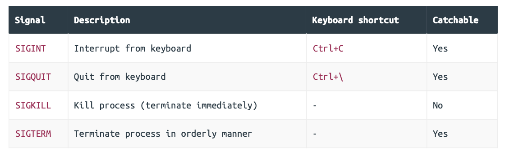

## Graceful Shutdown

### Sending Shutdown Signals



Catachable signals can be intercepted by our application and either ignored, or used to trigger a certain action (such as a graceful shutdown). Other signals, like `SIGKILL`, are not catchable and cannot be intercepted.

```sh
$ go run ./cmd/api
```

Doing this should start a process with the name `api` on your machine. You can use the `pgrep` command to verify that this process exists, like so:

```sh
$ pgrep -l api
20502 api

```

Once that’s confirmed, go ahead and try sending a SIGKILL signal to the `api` process using the [pkill](https://linuxize.com/post/pkill-command-in-linux/) command like so:

```sh
$ pkill -SIGKILL api
```

### Intercepting Shutdown Signals

Before we get into the nuts and bolts of how to intercept signals, let’s move the code related to our `http.Server` out of the `main()` function and into a separate file. This will give us a clean and clear starting point from which we can build up the graceful shutdown functionality.

```go
// File: cmd/api/server.go 

package main 

import (  
  "fmt"   
  "log/slog"   
  "net/http"   
  "time" 
)

func (app *application) serve() error {  
  // Declare a HTTP server using the same settings as in our main() function.
  srv := &http.Server{   
    Addr:         fmt.Sprintf(":%d", app.config.port),  
    Handler:      app.routes(),    
    IdleTimeout:  time.Minute,      
    ReadTimeout:  5 * time.Second,   
    WriteTimeout: 10 * time.Second,    
    ErrorLog:     slog.NewLogLogger(app.logger.Handler(), slog.LevelError),  
  }     
  
  // Likewise log a "starting server" message.
  app.logger.Info("starting server", "addr", srv.Addr, "env", app.config.env) 
  
  // Start the server as normal, returning any error.
  return srv.ListenAndServe() 
}
```

With that in place, we can simplify our main() function to use this new app.serve() method like so:

```go
// File: cmd/api/main.go 

package main 

import (  
  "context"  
  "database/sql"   
  "flag"   
  "log/slog"  
  "os"   
  "time"   
  
  "greenlight.alexedwards.net/internal/data"   
  
  _ "github.com/lib/pq" 
)

...

func main() {   
  var cfg config   
  
  flag.IntVar(&cfg.port, "port", 4000, "API server port")  
  flag.StringVar(&cfg.env, "env", "development", "Environment (development|staging|production)")  
  
  flag.StringVar(&cfg.db.dsn, "db-dsn", os.Getenv("GREENLIGHT_DB_DSN"), "PostgreSQL DSN")  
  
  flag.IntVar(&cfg.db.maxOpenConns, "db-max-open-conns", 25, "PostgreSQL max open connections")   
  flag.IntVar(&cfg.db.maxIdleConns, "db-max-idle-conns", 25, "PostgreSQL max idle connections")   
  flag.DurationVar(&cfg.db.maxIdleTime, "db-max-idle-time", 15*time.Minute, "PostgreSQL max connection idle time")    
  
  flag.Float64Var(&cfg.limiter.rps, "limiter-rps", 2, "Rate limiter maximum requests per second")   
  flag.IntVar(&cfg.limiter.burst, "limiter-burst", 4, "Rate limiter maximum burst")  
  flag.BoolVar(&cfg.limiter.enabled, "limiter-enabled", true, "Enable rate limiter")
  
  flag.Parse()   
  
  logger := slog.New(slog.NewTextHandler(os.Stdout, nil))  
  
  db, err := openDB(cfg)   
  if err != nil {  
    logger.Error(err.Error())   
    os.Exit(1)   
  }   
  defer db.Close()   
  
  logger.Info("database connection pool established")  
  
  app := &application{     
    config: cfg,     
    logger: logger,     
    models: data.NewModels(db),  
  }    
  
  // Call app.serve() to start the server.
  err = app.serve()   
  if err != nil {   
    logger.Error(err.Error())    
    os.Exit(1)   
  } 
}

...
```

#### Catching `SIGINT` and `SIGTERM` signals

To catch the signals, we’ll need to spin up a background goroutine which runs for the lifetime of our application. In this background goroutine, we can use the `signal.Notify()` function to listen for specific signals and relay them to a channel for further processing.

```go
// File: cmd/api/server.go 

package main 

import (   
  "fmt"   
  "log/slog"   
  "net/http"   
  "os"        // New import  
  "os/signal" // New import   
  "syscall"   // New import    
  "time" 
)

func (app *application) serve() error {  
  srv := &http.Server{     
    Addr:         fmt.Sprintf(":%d", app.config.port),   
    Handler:      app.routes(),     
    IdleTimeout:  time.Minute,    
    ReadTimeout:  5 * time.Second,  
    WriteTimeout: 10 * time.Second,    
    ErrorLog:     slog.NewLogLogger(app.logger.Handler(), slog.LevelError),   
  }    
  
  // Start a background goroutine.
  go func() {      
    // Create a quit channel which carries os.Signal values.
    quit := make(chan os.Signal, 1)  
    
    // Use signal.Notify() to listen for incoming SIGINT and SIGTERM signals and  
    // relay them to the quit channel. Any other signals will not be caught by  
    // signal.Notify() and will retain their default behavior.
    signal.Notify(quit, syscall.SIGINT, syscall.SIGTERM)    
    
    // Read the signal from the quit channel. This code will block until a signal is  
    // received.
    s := <-quit   
    
    // Log a message to say that the signal has been caught. Notice that we also  
    // call the String() method on the signal to get the signal name and include it 
    // in the log entry attributes.
    app.logger.Info("caught signal", "signal", s.String())   
    
    // Exit the application with a 0 (success) status code.
    os.Exit(0)  
  }()    
  
  // Start the server as normal.
  app.logger.Info("starting server", "addr", srv.Addr, "env", app.config.env)  
  
  return srv.ListenAndServe()
}
```

### Executing the Shutdown

```go
// File: cmd/api/server.go 

package main 

import (  
  "context" // New import  
  "errors"  // New import   
  "fmt"   
  "log/slog"   
  "net/http"   
  "os"   
  "os/signal"  
  "syscall"   
  "time" 
)

func (app *application) serve() error {  
  srv := &http.Server{    
    Addr:         fmt.Sprintf(":%d", app.config.port),    
    Handler:      app.routes(),     
    IdleTimeout:  time.Minute,    
    ReadTimeout:  5 * time.Second,   
    WriteTimeout: 10 * time.Second,     
    ErrorLog:     slog.NewLogLogger(app.logger.Handler(), slog.LevelError),   
  }    
  
  // Create a shutdownError channel. We will use this to receive any errors returned  
  // by the graceful Shutdown() function.
  shutdownError := make(chan error)   
  
  go func() {     
    // Intercept the signals, as before.
    quit := make(chan os.Signal, 1)  
    signal.Notify(quit, syscall.SIGINT, syscall.SIGTERM)   
    s := <-quit        
    
    // Update the log entry to say "shutting down server" instead of "caught signal".
    app.logger.Info("shutting down server", "signal", s.String())   
    
    // Create a context with a 30-second timeout.
    ctx, cancel := context.WithTimeout(context.Background(), 30*time.Second)     
    defer cancel()   
    
    // Call Shutdown() on our server, passing in the context we just made.
    // Shutdown() will return nil if the graceful shutdown was successful, or an   
    // error (which may happen because of a problem closing the listeners, or   
    // because the shutdown didn't complete before the 30-second context deadline is  
    // hit). We relay this return value to the shutdownError channel.
    shutdownError <- srv.Shutdown(ctx)  
  }()  
  
  app.logger.Info("starting server", "addr", srv.Addr, "env", app.config.env)   
  
  // Calling Shutdown() on our server will cause ListenAndServe() to immediately    
  // return a http.ErrServerClosed error. So if we see this error, it is actually a 
  // good thing and an indication that the graceful shutdown has started. So we check
  // specifically for this, only returning the error if it is NOT 
  // http.ErrServerClosed. 
  err := srv.ListenAndServe()  
  if !errors.Is(err, http.ErrServerClosed) { 
    return err   
  }  
  
  // Otherwise, we wait to receive the return value from Shutdown() on the    
  // shutdownError channel. If return value is an error, we know that there was a  
  // problem with the graceful shutdown and we return the error.
  err = <-shutdownError  
  if err != nil {   
    return err  
  }    
  
  // At this point we know that the graceful shutdown completed successfully and we 
  // log a "stopped server" message.
  app.logger.Info("stopped server", "addr", srv.Addr)    
  
  return nil
}
```

At a high-level what it’s doing can be summarized very simply: when we receive a SIGINT or SIGTERM signal, we instruct our server to stop accepting any new HTTP requests, and give any in-flight requests a ‘grace period’ of 30 seconds to complete before the application is terminated.

It’s important to be aware that the `Shutdown()` method does not wait for any background tasks to complete, nor does it close hijacked long-lived connections like WebSockets. Instead, you will need to implement your own logic to coordinate a graceful shutdown of these things.

To help demonstrate the graceful shutdown functionality, you can add a 4 second sleep delay to the `healthcheckHandler` method, like so:

```go
// File: cmd/api/healthcheck.go 

package main 

import (  
  "net/http"   
  "time" // New import 
)

func (app *application) healthcheckHandler(w http.ResponseWriter, r *http.Request) { 
  env := envelope{    
    "status": "available",     
    "system_info": map[string]string{      
      "environment": app.config.env,    
      "version":     version,  
    },   
  }   
  
  // Add a 4 second delay.
  time.Sleep(4 * time.Second)  
  
  err := app.writeJSON(w, http.StatusOK, env, nil)  
  if err != nil {  
    app.serverErrorResponse(w, r, err) 
  }
}
```

Then start the API, and in another terminal window issue a request to the healthcheck endpoint followed by a `SIGTERM` signal.

```sh
$ curl localhost:4000/v1/healthcheck & pkill -SIGTERM api
```

In the logs for the server, you should immediately see a `"shutting down server"`  message following the `SIGTERM` signal, similar to this:

```
time=2024-11-26T21:13:31.181+08:00 level=INFO msg="database connection pool established"
time=2024-11-26T21:13:31.181+08:00 level=INFO msg="starting server" addr=:4000 env=development
time=2024-11-26T21:14:00.623+08:00 level=INFO msg="shutting down server" signal=terminated
```

Then after a 4 second delay for the in-flight request to complete, our `healthcheckHandler` should return the JSON response as normal and you should see that our API has logged a final `"stopped server"` message before exiting cleanly:

```
time=2024-11-26T21:13:31.181+08:00 level=INFO msg="database connection pool established"
time=2024-11-26T21:13:31.181+08:00 level=INFO msg="starting server" addr=:4000 env=development
time=2024-11-26T21:14:00.623+08:00 level=INFO msg="shutting down server" signal=terminated
time=2024-11-26T21:14:04.881+08:00 level=INFO msg="stopped server" addr=:4000
```

```
{                                                                     
	"status": "available",
	"system_info": {
		"environment": "development",
		"version": "1.0.0"
	}
}

[1]  + 28958 done       curl localhost:4000/v1/healthcheck
```

