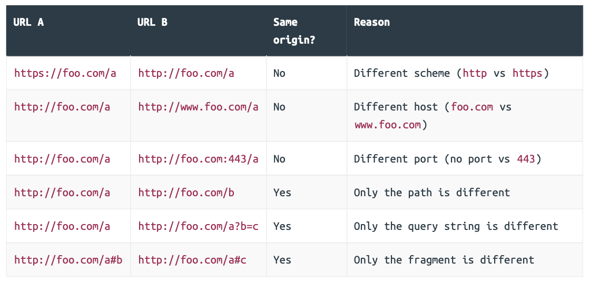

## Cross Origin Requests

### An Overview of CORS

Basically, if two URLs have the same scheme, host and port (if specified) they are said to share the same origin. To help illustrate this, let’s compare the following URLs:



Understanding what origins are is important because all web browsers implement a security mechanism known as the same-origin policy.

- A webpage on one origin can embed certain types of resources from another origin in their HTML — including images, CSS, and JavaScript files. For example, doing this is in your webpage is OK:

  ```html
  
  ```

- A webpage on one origin can send data to a different origin. For example, it’s OK for an HTML form in a webpage to submit data to a different origin. 
- But a webpage on one origin is not allowed to receive data from a different origin. 

This key thing here is the final bullet-point: the same-origin policy prevents a (potentially malicious) website on another origin from reading (possibly confidential) information from your website. 

It’s important to emphasize that cross-origin sending of data is not prevented by the same-origin policy, despite also being dangerous. In fact, this is why CSRF attacks are possible and why we need to take additional steps to prevent them — like using SameSite cookies and CSRF tokens. 

As a developer, the time that you’re most likely to run up against the same-origin policy is when making cross-origin requests from JavaScript running in a browser. 

For example, let’s say that you have a webpage at `https://foo.com` containing some frontend JavaScript code. If this JavaScript tries to make an HTTP request to `https://bar.com/data.json` (a different origin), then the request will be sent and processed by the bar.com server, but the user’s web browser will block the response so that the JavaScript code from `https://foo.com` cannot see it. 

Generally speaking, the same-origin policy is an extremely useful security safeguard. But while it’s good in the general case, in certain circumstances you might want to relax it. 

For example, if you have an API at api.example.com and a trusted JavaScript front-end application running on `www.example.com`, then you’ll probably want to allow cross-origin requests from the trusted `www.example.com` domain to your API. 

Or perhaps you have a completely open public API, and you want to allow cross-origin requests from anywhere so it’s easy for other developers to integrate with their own websites. 

Fortunately, most modern web browsers allow you to allow or disallow specific cross-origin requests to your API by setting `Access-Control` headers on your API responses.

### Demonstrating the Same-Origin Policy

To demonstrate how the same-origin policy works and how to relax it for requests to our API, we need to simulate a request to our API from a different origin .

```go
// File: cmd/examples/cors/simple/main.go 

package main 

import (  
  "flag"   
  "log"    
  "net/http" 
) 

// Define a string constant containing the HTML for the webpage. This consists of a <h1> 
// header tag, and some JavaScript which fetches the JSON from our GET /v1/healthcheck
// endpoint and writes it to inside the <div id="output"></div> element.
const html = `
<!DOCTYPE html> 
<html lang="en"> 
<head>   
	<meta charset="UTF-8"> 
</head> 
<body>   
	<h1>Simple CORS</h1> 
  <div id="output"></div>  
  <script>     
  	document.addEventListener('DOMContentLoaded', function() {    
    	fetch("http://localhost:4000/v1/healthcheck").then(    
      	function (response) {   
        	response.text().then(function (text) {  
          	document.getElementById("output").innerHTML = text;    
          });       
        },   
      	function(err) {        
      		document.getElementById("output").innerHTML = err;   
      	}        
   	 );    
 	 });  
  </script> 
</body> 
</html>`

func main() {   
  // Make the server address configurable at runtime via a command-line flag.
  addr := flag.String("addr", ":9000", "Server address")    
  flag.Parse()   
  
  log.Printf("starting server on %s", *addr)  
  
  // Start a HTTP server listening on the given address, which responds to all   
  // requests with the webpage HTML above.
  err := http.ListenAndServe(*addr, http.HandlerFunc(func(w http.ResponseWriter, r *http.Request) {   
    w.Write([]byte(html))    
  }))
  log.Fatal(err) 
}
```

#### Demonstration

```
$ go run ./cmd/examples/cors/simple
```

```
$ go run ./cmd/api
```

When you visit `http://localhost:9000` in your web browser, the `fetch()` action to `http://localhost:4000/v1/healthcheck` should be forbidden by the same-origin policy. Specifically, our API should receive and process the request, but your web browser should block the response from being read by the JavaScript code.

Here is the error message: `Access to fetch at 'http://localhost:4000/v1/healthcheck' from origin 'http://localhost:9000' has been blocked by CORS policy: No 'Access-Control-Allow-Origin' header is present on the requested resource. If an opaque response serves your needs, set the request's mode to 'no-cors' to fetch the resource with CORS disabled. `  

There are a couple of things that need to be noted:

- The request itself was not prevented by the same-origin policy — it’s just that the browser won’t let JavaScript see the response.
- The web browser automatically set an `Origin` header on the request to show where the request originates from. (In this example, the `Origin` header is: `http://localhost:9000`)
- It’s important to emphasize that the same-origin policy is a web browser thing only.

### Simple CORS Requests

Let’s now make some changes to our API which relax the same-origin policy, so that JavaScript can read the responses from our API endpoints. 

To start with, the simplest way to achieve this is by setting the following header on all our API responses:

```
Access-Control-Allow-Origin: *
```

The `Access-Control-Allow-Origin` response header is used to indicate to a browser that it’s OK to share a response with a different origin. In this case, the header value is the wildcard `*` character, which means that it’s OK to share the response with any other origin. 

Let’s go ahead and create a small `enableCORS()` middleware function in our API application which sets this header:

```go
// File: cmd/api/middleware.go

package main 

...

func (app *application) enableCORS(next http.Handler) http.Handler {  
  return http.HandlerFunc(func(w http.ResponseWriter, r *http.Request) { 
    w.Header().Set("Access-Control-Allow-Origin", "*")   
    next.ServeHTTP(w, r)   
  }) 
}
```

```go
// File: cmd/api/routes.go 

package main 

...

func (app *application) routes() http.Handler {  
  router := httprouter.New()  
  
  router.NotFound = http.HandlerFunc(app.notFoundResponse) 
  router.MethodNotAllowed = http.HandlerFunc(app.methodNotAllowedResponse)    
  
  router.HandlerFunc(http.MethodGet, "/v1/healthcheck", app.healthcheckHandler)  
  
  router.HandlerFunc(http.MethodGet, "/v1/movies", app.requirePermission("movies:read", app.listMoviesHandler))  
  router.HandlerFunc(http.MethodPost, "/v1/movies", app.requirePermission("movies:write", app.createMovieHandler))  
  router.HandlerFunc(http.MethodGet, "/v1/movies/:id", app.requirePermission("movies:read", app.showMovieHandler))    
  router.HandlerFunc(http.MethodPatch, "/v1/movies/:id", app.requirePermission("movies:write", app.updateMovieHandler)) 
  router.HandlerFunc(http.MethodDelete, "/v1/movies/:id", app.requirePermission("movies:write", app.deleteMovieHandler))  
  
  router.HandlerFunc(http.MethodPost, "/v1/users", app.registerUserHandler)   
  router.HandlerFunc(http.MethodPut, "/v1/users/activated", app.activateUserHandler)  
  
  router.HandlerFunc(http.MethodPost, "/v1/tokens/authentication", app.createAuthenticationTokenHandler)    
  
  // Add the enableCORS() middleware.
  return app.recoverPanic(app.enableCORS(app.rateLimit(app.authenticate(router)))) 
}
```

It’s important to point out here that the `enableCORS()` middleware is deliberately positioned early in the middleware chain.

If we positioned it after our rate limiter, for example, any cross-origin requests that exceed the rate limit would not have the `Access-Control-Allow-Origin header` set. This means that they would be blocked by the client’s web browser due to the same-origin policy, rather than the client receiving a `429 Too Many Requests` response like they should.

#### Restricting Origins

Using a wildcard to allow cross-origin requests, like we are in the code above, can be useful in certain circumstances (like when you have a completely public API with no access control checks). But more often you’ll probably want to restrict CORS to a much smaller set of trusted origins. 

To do this, you need to explicitly include the trusted origins in the `Access-Control-Allow-Origin` header instead of using a wildcard. For example, if you want to only allow CORS from the origin `https://www.example.com` you could send the following header in your responses:

```
Access-Control-Allow-Origin: https://www.example.com
```

But if you need to support multiple trusted origins, or you want the value to be configurable at runtime, then things get a bit more complex. 

One of the problems is that — in practice — you can only specify exactly one origin in the `Access-Control-Allow-Origin` header. You can’t include a list of multiple origin values, separated by spaces or commas like you might expect. 

To work around this limitation, you’ll need to update your `enableCORS()` middleware to check if the value of the `Origin` header matches one of your trusted origins. If it does, then you can reflect (or echo) that value back in the `Access-Control-Allow-Origin` response header.

#### Supporting multiple dynamic origins

The first thing we’ll do is add a new `-cors-trusted-origins` command-line flag to our API application, which we can use to specify the list of trusted origins at runtime. We’ll set this up so that the origins must be separated by a space character — like so:

```
$ go run ./cmd/api -cors-trusted-origins="https://www.example.com https://staging.example.com"
```

```go
// File: cmd/api/main.go 

package main

import (   
  "context"   
  "database/sql"   
  "flag"     
  "log/slog"   
  "os"    
  "strings" // New import 
  "sync"   
  "time"   
  
  "greenlight.alexedwards.net/internal/data"    
  "greenlight.alexedwards.net/internal/mailer"  
  
  _ "github.com/lib/pq" 
)

const version = "1.0.0" 

type config struct {  
  port int    
  env  string   
  db   struct {   
    dsn          string    
    maxOpenConns int     
    maxIdleConns int     
    maxIdleTime  time.Duration  
  }   
  limiter struct {    
    enabled bool      
    rps     float64   
    burst   int    
  }    
  smtp struct {    
    host     string   
    port     int      
    username string   
    password string     
    sender   string 
  }    
  // Add a cors struct and trustedOrigins field with the type []string.
  cors struct {    
    trustedOrigins []string   
  }
}

...

func main() {  
  var cfg config   
  
  flag.IntVar(&cfg.port, "port", 4000, "API server port")  
  flag.StringVar(&cfg.env, "env", "development", "Environment (development|staging|production)") 
  
  flag.StringVar(&cfg.db.dsn, "db-dsn", os.Getenv("GREENLIGHT_DB_DSN"), "PostgreSQL DSN")   
  
  flag.IntVar(&cfg.db.maxOpenConns, "db-max-open-conns", 25, "PostgreSQL max open connections")  
  flag.IntVar(&cfg.db.maxIdleConns, "db-max-idle-conns", 25, "PostgreSQL max idle connections")  
  flag.DurationVar(&cfg.db.maxIdleTime, "db-max-idle-time", 15*time.Minute, "PostgreSQL max connection idle time")  
  
  flag.BoolVar(&cfg.limiter.enabled, "limiter-enabled", true, "Enable rate limiter") 
  flag.Float64Var(&cfg.limiter.rps, "limiter-rps", 2, "Rate limiter maximum requests per second")  
  flag.IntVar(&cfg.limiter.burst, "limiter-burst", 4, "Rate limiter maximum burst") 
  
  flag.StringVar(&cfg.smtp.host, "smtp-host", "sandbox.smtp.mailtrap.io", "SMTP host")
  flag.IntVar(&cfg.smtp.port, "smtp-port", 25, "SMTP port")     
  flag.StringVar(&cfg.smtp.username, "smtp-username", "a7420fc0883489", "SMTP username")  
  flag.StringVar(&cfg.smtp.password, "smtp-password", "e75ffd0a3aa5ec", "SMTP password")  
  flag.StringVar(&cfg.smtp.sender, "smtp-sender", "Greenlight <no-reply@greenlight.alexedwards.net>", "SMTP sender")  
  
  // Use the flag.Func() function to process the -cors-trusted-origins command line  
  // flag. In this we use the strings.Fields() function to split the flag value into a
  // slice based on whitespace characters and assign it to our config struct.
  // Importantly, if the -cors-trusted-origins flag is not present, contains the empty
  // string, or contains only whitespace, then strings.Fields() will return an empty 
  // []string slice.
  flag.Func("cors-trusted-origins", "Trusted CORS origins (space separated)", func(val string) error {    
    cfg.cors.trustedOrigins = strings.Fields(val)   
    return nil    
  })
  
  flag.Parse()   
  
  ...
  
} 

...
```

We want the middleware to check if the value of the request `Origin` header is an exact, case-sensitive, match for one of our trusted origins. If there is a match, then we should set an `Access-Control-Allow-Origin` response header which reflects (or echoes) back the value of the request’s `Origin` header. 

Otherwise, we should allow the request to proceed as normal without setting an `Access-Control-Allow-Origin` response header. In turn, that means that any cross-origin responses will be blocked by a web browser, just like they were originally.

A side effect of this is that the response will be different depending on the origin that the request is coming from. Specifically, the value of the `Access-Control-Allow-Origin` header may be different in the response, or it may not even be included at all. 

So because of this we should make sure to always set a `Vary: Origin` response header to warn any caches that the response may be different. This is actually really important, and it can be the cause of subtle bugs [like this one](https://textslashplain.com/2018/08/02/cors-and-vary/) if you forget to do it. As a rule of thumb: 

If your code makes a decision about what to return based on the content of a request header, you should include that header name in your `Vary` response header — even if the request didn’t include that header.

```go
// File: cmd/api/middleware.go 

package main 

...

func (app *application) enableCORS(next http.Handler) http.Handler {  
  return http.HandlerFunc(func(w http.ResponseWriter, r *http.Request) {  
    // Add the "Vary: Origin" header.
    w.Header().Add("Vary", "Origin")  
    
    // Get the value of the request's Origin header.
    origin := r.Header.Get("Origin")    
    
    // Only run this if there's an Origin request header present.
    if origin != "" {     
      // Loop through the list of trusted origins, checking to see if the request   
      // origin exactly matches one of them. If there are no trusted origins, then  
      // the loop won't be iterated.
      for i := range app.config.cors.trustedOrigins {     
        if origin == app.config.cors.trustedOrigins[i] {  
          // If there is a match, then set a "Access-Control-Allow-Origin"  
          // response header with the request origin as the value and break   
          // out of the loop.
          w.Header().Set("Access-Control-Allow-Origin", origin)    
          break             
        }     
      }      
    }       
    
    // Call the next handler in the chain.
    next.ServeHTTP(w, r)    
  })
}
```

```
$ go run ./cmd/api -cors-trusted-origins="http://localhost:9000 http://localhost:9001"
```

```
$ go run ./cmd/examples/cors/simple --addr=":9002"
```

#### Additional Information

##### Partial origin matches

If you have a lot of trusted origins that you want to support, then you might be tempted to check for a partial match on the origin to see if it ‘starts with’ or ‘ends with’ a specific value, or matches a regular expression. If you do this, you must take a lot of care to avoid any unintentional matches. 

As a simple example, if `http://example.com` and `http://www.example.com` are your trusted origins, your first thought might check that the request `Origin` header ends with `example.com`. This would be a bad idea, as an attacker could register the domain name `attackerexample.com` and any requests from that origin would pass your check. 

This is just one simple example — and the following blog posts discuss some of the other vulnerabilities that can arise when using partial match or regular expression checks:

- [Security Risks of CORS](https://medium.com/@ehayushpathak/security-risks-of-cors-e3f4a25c04d7)
- [Exploiting CORS misconfigurations for Bitcoins and bounties](https://portswigger.net/research/exploiting-cors-misconfigurations-for-bitcoins-and-bounties)

##### The null origin

It’s important to never include the value "null" as a trusted origin in your safelist. This is because the request header `Origin: null` can be forged by an attacker by sending a request from a [sandboxed iframe](https://stackoverflow.com/questions/44764338/origin-header-null-for-xhr-request-made-from-iframe-with-sandbox-attribute/44765536#44765536).

##### Authentication and CORS

If your API endpoint requires credentials (cookies or HTTP basic authentication) you should also set an `Access-Control-Allow-Credentials: true` header in your responses. If you don’t set this header, then the web browser will prevent any cross-origin responses with credentials from being read by JavaScript. 

Importantly, you must never use the wildcard `Access-Control-Allow-Origin: *` header in conjunction with `Access-Control-Allow-Credentials: true`, as this would allow any website to make a credentialed cross-origin request to your API. 

Also, importantly, if you want credentials to be sent with a cross-origin request then you’ll need to explicitly specify this in your JavaScript. For example, with `fetch()` you should set the `credentials` value of the request to '`include`'. Like so:

```js
fetch("https://api.example.com", {credentials: 'include'}).then( ... );
```

### Preflight CORS Requests

The cross-origin request that we made from JavaScript in the previous chapter is known as a simple cross-origin request. Broadly speaking, cross-origin requests are classified as ‘simple’ when all the following conditions are met:

- The request HTTP method is one of the three CORS-safe methods: HEAD, GET or POST.
- The request headers are all either [forbidden headers](https://developer.mozilla.org/en-US/docs/Glossary/Forbidden_header_name) or one of the four CORS-safe headers:
  - Accept 
  - Accept-Language 
  - Content-Language 
  - Content-Type
- The value for the Content-Type header (if set) is one of:
  - application/x-www-form-urlencoded 
  - multipart/form-data 
  - text/plain

When a cross-origin request doesn’t meet these conditions, then the web browser will trigger an initial ‘preflight’ request before the real request. The purpose of this preflight request is to determine whether the real cross-origin request will be permitted or not.

#### Demonstrating a preflight request

To help demonstrate how preflight requests work and what we need to do to deal with them, let’s create another example webpage under the `cmd/examples/cors/` directory.

We’ll set up this webpage so it makes a request to our `POST /v1/tokens/authentication` endpoint. When calling this endpoint we’ll include an email address and password in a JSON request body, along with a `Content-Type: application/json` header. And because the header `Content-Type: application/json` isn’t allowed in a ‘simple’ cross-origin request, this should trigger a preflight request to our API.

```go
// File: cmd/examples/cors/preflight/main.go 

package main 

import (  
  "flag"   
  "log"    
  "net/http" 
)

// Define a string constant containing the HTML for the webpage. This consists of a <h1> 
// header tag, and some JavaScript which calls our POST /v1/tokens/authentication 
// endpoint and writes the response body to inside the <div id="output"></div> tag.
const html = `
<!DOCTYPE html> 
<html lang="en"> 
<head>     
	<meta charset="UTF-8"> 
</head> 
<body>   
	<h1>Preflight CORS</h1> 
  <div id="output"></div>   
  <script>      
  	document.addEventListener('DOMContentLoaded', function() {   
    	fetch("http://localhost:4000/v1/tokens/authentication", {    
      	method: "POST",          
        headers: {        
        	'Content-Type': 'application/json'     
        },          
        body: JSON.stringify({      
        	email: 'alice@example.com',    
          password: 'pa55word'     
        })       
      }).then(   
      		function (response) {    
         	 response.text().then(function (text) {      
          		document.getElementById("output").innerHTML = text;  
         	 });           
         }, 
         function(err) {      
         	document.getElementById("output").innerHTML = err;    
         }          
       );      
     });   
  </script> 
</body> 
</html>`

func main() {   
  addr := flag.String("addr", ":9000", "Server address")  
  flag.Parse()   
  
  log.Printf("starting server on %s", *addr)  
  
  err := http.ListenAndServe(*addr, http.HandlerFunc(func(w http.ResponseWriter, r *http.Request) {  
    w.Write([]byte(html))   
  }))   
  log.Fatal(err) 
}
```

```
$ go run ./cmd/examples/cors/preflight
```

```
$ go run ./cmd/api -cors-trusted-origins="http://localhost:9000"
```

Open the web browser, you can see the error message: `Access to fetch at 'http://localhost:4000/v1/tokens/authentication' from origin 'http://localhost:9000' has been blocked by CORS policy: Request header field content-type is not allowed by Access-Control-Allow-Headers in preflight response.`

#### Responding to preflight requests

In order to respond to a preflight request, the first thing we need to do is identify that it is a preflight request — rather than just a regular (possibly even cross-origin) `OPTIONS` request. 

To do that, we can leverage the fact that preflight requests always have three components: the HTTP method `OPTIONS`, an `Origin` header, and an `Access-Control-Request-Method` header. If any one of these pieces is missing, we know that it is not a preflight request. 

Once we identify that it is a preflight request, we need to send a `200 OK` response with some special headers to let the browser know whether or not it’s OK for the real request to proceed. These are:

- An `Access-Control-Allow-Origin` response header, which reflects the value of the preflight request’s Origin header (just like in the previous chapter).
- An `Access-Control-Allow-Methods` header listing the HTTP methods that can be used in real cross-origin requests to the URL.
- An `Access-Control-Allow-Headers` header listing the request headers that can be included in real cross-origin requests to the URL.

**Important**: When responding to a preflight request it’s not necessary to include the CORS-safe methods `HEAD`, `GET` or `POST` in the `Access-Control-Allow-Methods` header. Likewise, it’s not necessary to include forbidden or CORS-safe headers in `Access-Control-Allow-Headers`.

#### Updating our middleware

Let’s put this into action and update our `enableCORS()` middleware so it intercepts and responds to any preflight requests. Specifically, we want to:

1. Set a `Vary: Access-Control-Request-Method` header on all responses, as the response will be different depending on whether or not this header exists in the request. 
2. Check whether the request is a preflight cross-origin request or not. If it’s not, then we should allow the request to proceed as normal. 
3. Otherwise, if it is a preflight cross-origin request, then we should add the `Access-Control-Allow-Method` and `Access-Control-Allow-Headers` headers as described above.

```go
// File: cmd/api/middleware.go 

package main 

...

func (app *application) enableCORS(next http.Handler) http.Handler {   
  return http.HandlerFunc(func(w http.ResponseWriter, r *http.Request) {    
    w.Header().Add("Vary", "Origin")      
    
    // Add the "Vary: Access-Control-Request-Method" header.
    w.Header().Add("Vary", "Access-Control-Request-Method")  
    
    origin := r.Header.Get("Origin")       
    if origin != "" {    
      for i := range app.config.cors.trustedOrigins {        
        if origin == app.config.cors.trustedOrigins[i] {   
          w.Header().Set("Access-Control-Allow-Origin", origin)       
          
          // Check if the request has the HTTP method OPTIONS and contains the    
          // "Access-Control-Request-Method" header. If it does, then we treat    
          // it as a preflight request.
          if r.Method == http.MethodOptions && r.Header.Get("Access-Control-Request-Method") != "" {           
            // Set the necessary preflight response headers, as discussed  
            // previously.
            w.Header().Set("Access-Control-Allow-Methods", "OPTIONS, PUT, PATCH, DELETE")             
            w.Header().Set("Access-Control-Allow-Headers", "Authorization, Content-Type")                    
            
            // Write the headers along with a 200 OK status and return from  
            // the middleware with no further action.
            w.WriteHeader(http.StatusOK)     
            return        
          }        
          break     
        }          
      }      
    }     
    next.ServeHTTP(w, r) 
  }) 
}
```

There are a couple of additional things to point out here: 

- When we respond to a preflight request we deliberately send the HTTP status `200 OK` rather than `204 No Content` — even though there is no response body. This is because certain browser versions may not support `204 No Content` responses and subsequently block the real request. 
- If you allow the `Authorization` header in cross-origin requests, like we are in the code above, it’s important to not set the wildcard `Access-Control-Allow-Origin: *` header or reflect the `Origin` header without checking against a list of trusted origins. Otherwise, this would leave your service vulnerable to a distributed brute-force attack against any authentication credentials that are passed in that header.

#### Additional Information

##### Caching preflight responses

If you want, you can also add an `Access-Control-Max-Age` header to your preflight responses. This indicates the number of seconds that the information provided by the `Access-Control-Allow-Methods` and `Access-Control-Allow-Headers` headers can be cached by the browser. 

For example, to allow the values to be cached for 60 seconds you can set the following header on your preflight response:

```
Access-Control-Max-Age: 60
```

If you don’t set an `Access-Control-Max-Age` header, current versions of Chrome/Chromium and Firefox will default to caching these preflight response values for 5 seconds. Older versions or other browsers may have different defaults, or not cache the values at all. 

Setting a long `Access-Control-Max-Age` duration might seem like an appealing way to reduce requests to your API — and it is! But you also need to be careful. Not all browsers provide a way to clear the preflight cache, so if you send back the wrong headers the user will be stuck with them until the cache expires. 

If you want to disable caching altogether, you can set the value to -1:

```
Access-Control-Max-Age: -1
```

It’s also important to be aware that browsers may impose a hard maximum on how long the headers can be cached for. The [MDN documentation](https://developer.mozilla.org/en-US/docs/Web/HTTP/Headers/Access-Control-Max-Age) says:

> - Firefox caps this at 24 hours (86400 seconds).
> - Chromium (prior to v76) caps at 10 minutes (600 seconds).
> - Chromium (starting in v76) caps at 2 hours (7200 seconds).

##### Preflight wildcards

If you have a complex or rapidly changing API then it might be awkward to maintain a hardcoded safelist of methods and headers for the preflight response. You might think: I just want to allow all HTTP methods and headers for cross-origin requests. 

In this case, both the `Access-Control-Allow-Methods` and `Access-Control-Allow-Headers` headers allow you to use a wildcard `*` character like so:

```
Access-Control-Allow-Methods: * 
Access-Control-Allow-Headers: *
```

But using these comes with some important caveats:

- Wildcards in these headers are currently supported by [95% of browsers](https://caniuse.com/mdn-http_headers_access-control-allow-methods_wildcard). Any browsers which don’t support them will block the preflight request. 
- The `Authorization` header cannot be wildcarded. Instead, you will need to include this explicitly in the header like `Access-Control-Allow-Headers: Authorization, *` . 
- Wildcards are not supported for credentialed requests (those with cookies or HTTP basic authentication). For these, the character `*` will be treated as the literal string "*", rather than as a wildcard.