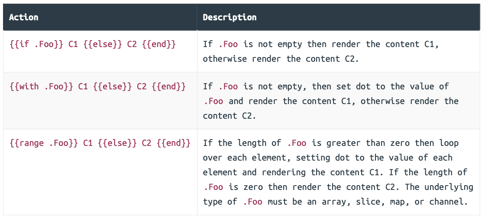
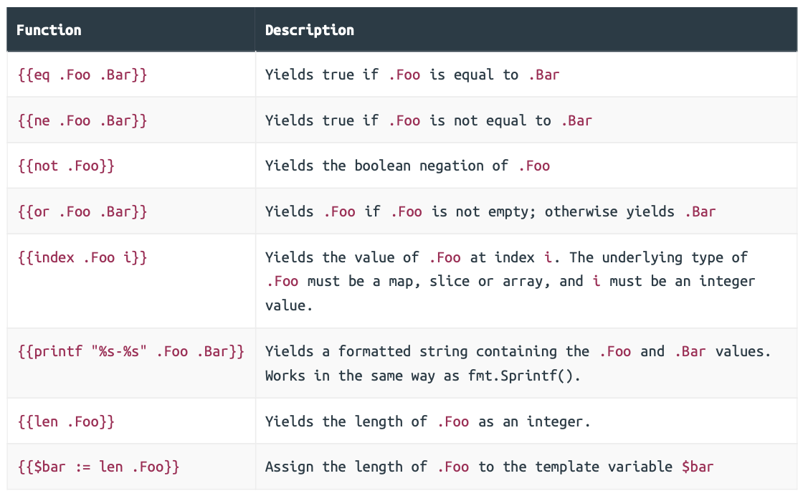

### Displaying dynamic data

```go
// File: cmd/web/handlers.go 

package main 

import (  
  "errors"  
  "fmt"   
  "html/template" // Uncomment import  
  "net/http"   
  "strconv"  
  
  "snippetbox.alexedwards.net/internal/models" 
)

...

func (app *application) snippetView(w http.ResponseWriter, r *http.Request) {  
  id, err := strconv.Atoi(r.URL.Query().Get("id"))   
  if err != nil || id < 1 {     
    app.notFound(w)     
    return   
  }  
  
  snippet, err := app.snippets.Get(id)  
  if err != nil {     
    if errors.Is(err, models.ErrNoRecord) {    
      app.notFound(w)       
    } else {       
      app.serverError(w, err)    
    }     
    return   
  }    
  
  // Initialize a slice containing the paths to the view.tmpl file,   
  // plus the base layout and navigation partial that we made earlier.
  files := []string{   
    "./ui/html/base.tmpl",    
    "./ui/html/partials/nav.tmpl",     
    "./ui/html/pages/view.tmpl",   
  }   
  
  // Parse the template files...
  ts, err := template.ParseFiles(files...)  
  if err != nil {   
    app.serverError(w, err)    
    return   
  }   
  
  // And then execute them. Notice how we are passing in the snippet 
  // data (a models.Snippet struct) as the final parameter.  
  err = ts.ExecuteTemplate(w, "base", snippet)  
  if err != nil {      
    app.serverError(w, err) 
  }
}

...
```

Within your HTML templates, any dynamic data that you pass in is represented by the `.` character (referred to as dot).

In this specific case, the underlying type of dot will be a `models.Snippet` struct. When the underlying type of dot is a struct, you can render (or yield) the value of any exported field in your templates by postfixing dot with the field name. So, because our `models.Snippet` struct has a Title field, we could yield the snippet title by writing `{{.Title}}` in our templates.

```html
// File: ui/html/pages/view.tmpl 

{{define "title"}}Snippet #{{.ID}}{{end}} 

{{define "main"}}    
<div class='snippet'>     
  <div class='metadata'>    
    <strong>{{.Title}}</strong>     
    <span>#{{.ID}}</span>    
  </div>     
  <pre><code>{{.Content}}</code></pre>   
  <div class='metadata'>         
    <time>Created: {{.Created}}</time>     
    <time>Expires: {{.Expires}}</time>     
  </div>   
</div> 
{{end}}
```

#### Rendering multiple pieces of data

An important thing to explain is that Go’s html/template package allows you to pass in one —and only one — item of dynamic data when rendering a template. But in a real-world application there are often multiple pieces of dynamic data that you want to display in the same page.

A lightweight and type-safe way to achieve this is to wrap your dynamic data in a struct which acts like a single ‘holding structure’ for your data.

```go
// File: cmd/web/templates.go 

package main 

import "snippetbox.alexedwards.net/internal/models" 

// Define a templateData type to act as the holding structure for 
// any dynamic data that we want to pass to our HTML templates.
// At the moment it only contains one field, but we'll add more
// to it as the build progresses.
type templateData struct {   
  Snippet *models.Snippet 
}
```

```go
// File: cmd/web/handlers.go 

package main 

...

func (app *application) snippetView(w http.ResponseWriter, r *http.Request) {  
  id, err := strconv.Atoi(r.URL.Query().Get("id"))   
  if err != nil || id < 1 {    
    app.notFound(w)  
    return  
  }   
  
  snippet, err := app.snippets.Get(id) 
  if err != nil {     
    if errors.Is(err, models.ErrNoRecord) {    
      app.notFound(w)   
    } else {      
      app.serverError(w, err)   
    }      
    return  
  }    
  
  files := []string{    
    "./ui/html/base.tmpl",    
    "./ui/html/partials/nav.tmpl",     
    "./ui/html/pages/view.tmpl",   
  }    
  
  ts, err := template.ParseFiles(files...)   
  if err != nil {  
    app.serverError(w, err)     
    return   
  }   
  
  // Create an instance of a templateData struct holding the snippet data.
  data := &templateData{     
    Snippet: snippet,   
  }   
  
  // Pass in the templateData struct when executing the template.
  err = ts.ExecuteTemplate(w, "base", data)    
  if err != nil {    
    app.serverError(w, err)  
  }
}

...
```

```html
// File: ui/html/pages/view.tmpl 

{{define "title"}}Snippet #{{.Snippet.ID}}{{end}} 

{{define "main"}}   
<div class='snippet'>   
  <div class='metadata'>    
    <strong>{{.Snippet.Title}}</strong>    
    <span>#{{.Snippet.ID}}</span>     
  </div>       
  <pre><code>{{.Snippet.Content}}</code></pre>   
  <div class='metadata'>      
    <time>Created: {{.Snippet.Created}}</time>     
    <time>Expires: {{.Snippet.Expires}}</time>   
  </div>    
</div>
{{end}}
```

#### Additional information

##### Dynamic content escaping

The html/template package automatically escapes any data that is yielded between `{{ }}` tags. This behavior is hugely helpful in avoiding cross-site scripting (XSS) attacks, and is the reason that you should use the html/template package instead of the more generic text/template package that Go also provides.

As an example of escaping, if the dynamic data you wanted to yield was:

```html
<span>{{"<script>alert('xss attack')</script>"}}</span>
```

It would be rendered harmlessly as:

```html
<span>&lt;script&gt;alert(&#39;xss attack&#39;)&lt;/script&gt;</span>
```

##### Calling methods

For example, if `.Snippet.Created` has the underlying type `time.Time` (which it does) you could render the name of the weekday by calling its `Weekday()` method like so:

```html
<span>{{.Snippet.Created.Weekday}}</span>
```

You can also pass parameters to methods. For example, you could use the `AddDate()` method to add six months to a time like so:

```html
<span>{{.Snippet.Created.AddDate 0 6 0}}</span>
```

Notice that this is different syntax to calling functions in Go — the parameters are not surrounded by parentheses and are separated by a single space character, not a comma.

##### Html comments

Finally, the html/template package always strips out any HTML comments you include in your templates, including any conditional comments.

The reason for this is to help avoid XSS attacks when rendering dynamic content. Allowing conditional comments would mean that Go isn’t always able to anticipate how a browser will interpret the markup in a page, and therefore it wouldn’t necessarily be able to escape everything appropriately. To solve this, Go simply strips out all HTML comments.

### Template actions and functions

We’ve already talked about some of the actions — `{{define}}`, `{{template}}` and `{{block}}` — but there are three more which you can use to control the display of dynamic data —`{{if}}`, `{{with}}` and `{{range}}`.





The final row is an example of declaring a template variable. Template variables are particularly useful if you want to store the result from a function and use it in multiple places in your template. Variable names must be prefixed by a dollar sign and can contain alphanumeric characters only.

#### Using the with action

```html
// File: ui/html/pages/view.tmpl 

{{define "title"}}Snippet #{{.Snippet.ID}}{{end}}

{{define "main"}}   
{{with .Snippet}}  
<div class='snippet'>  
  <div class='metadata'>    
    <strong>{{.Title}}</strong>      
    <span>#{{.ID}}</span>    
  </div>     
  <pre><code>{{.Content}}</code></pre>     
  <div class='metadata'>     
    <time>Created: {{.Created}}</time>   
    <time>Expires: {{.Expires}}</time>     
  </div>  
</div> 
{{end}}
{{end}}
```

So now, between `{{with .Snippet}}` and the corresponding `{{end}}` tag, the value of dot is set to `.Snippet`. Dot essentially becomes the `models.Snippet` struct instead of the parent `templateData` struct.

#### Using the if and range actions

```go
// File: cmd/web/templates.go 

package main 

import "snippetbox.alexedwards.net/internal/models" 

// Include a Snippets field in the templateData struct.
type templateData struct { 
  Snippet  *models.Snippet 
  Snippets []*models.Snippet
}
```

```go
// File: cmd/web/handlers.go 

package main 

...

func (app *application) home(w http.ResponseWriter, r *http.Request) {  
  if r.URL.Path != "/" {    
    app.notFound(w)    
    return  
  }  
  
  snippets, err := app.snippets.Latest()  
  if err != nil {   
    app.serverError(w, err)    
    return   
  }  
  
  files := []string{ 
    "./ui/html/base.tmpl",   
    "./ui/html/partials/nav.tmpl",     
    "./ui/html/pages/home.tmpl",   
  }   
  
  ts, err := template.ParseFiles(files...)   
  if err != nil {   
    app.serverError(w, err)   
    return   
  }   
  
  // Create an instance of a templateData struct holding the slice of  
  // snippets.
  data := &templateData{   
    Snippets: snippets,   
  }   
  
  // Pass in the templateData struct when executing the template.
  err = ts.ExecuteTemplate(w, "base", data)   
  if err != nil {     
    app.serverError(w, err)  
  }
}

...
```

```html
// File: ui/html/pages/home.tmpl 

{{define "title"}}Home{{end}} 

{{define "main"}}  
<h2>Latest Snippets</h2> 
{{if .Snippets}}    
<table>     
  <tr>    
    <th>Title</th>       
    <th>Created</th>      
    <th>ID</th>       
  </tr>     
  {{range .Snippets}}   
  <tr>       
    <td><a href='/snippet/view?id={{.ID}}'>{{.Title}}</a></td>    
    <td>{{.Created}}</td>     
    <td>#{{.ID}}</td>  
  </tr>    
  {{end}}  
</table> 
{{else}}  
<p>There's nothing to see here... yet!</p>  
{{end}} 
{{end}}
```

#### Additional information

##### Combining functions

For example, the following tag will render the content C1 if the length of Foo is greater than 99:

```html
{{if (gt (len .Foo) 99)}} C1 {{end}}
```

Or as another example, the following tag will render the content C1 if .Foo equals 1 and .Bar is less than or equal to 20:

```html
{{if (and (eq .Foo 1) (le .Bar 20))}} C1 {{end}}
```

##### Controlling loop behavior

Within a `{{range}}` action you can use the `{{break}}` command to end the loop early, and `{{continue}}` to immediately start the next loop iteration.

```html
{{range .Foo}}    
	// Skip this iteration if the .ID value equals 99.
  {{if eq .ID 99}}     
		{{continue}}   
	{{end}}   
	// ...
{{end}}
```

```html
{{range .Foo}}    
	// End the loop if the .ID value equals 99.
  {{if eq .ID 99}}      
		{{break}}   
	{{end}}  
	// ...
{{end}}
```

### Caching templates