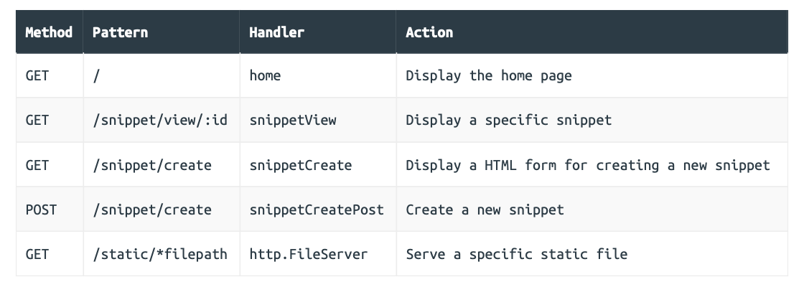

### Choosing a router

[julienschmidt/httprouter](https://github.com/julienschmidt/httprouter), [go-chi/chi](https://github.com/go-chi/chi), [gorilla/mux](https://github.com/gorilla/mux)

[Which Go router should I use?](https://www.alexedwards.net/blog/which-go-router-should-i-use)

### Clean URLs and method-based routing



```go
// File: cmd/web/routes.go

package main 

import (  
  "net/http"    
  
  "github.com/julienschmidt/httprouter" // New import  
  "github.com/justinas/alice" 
)

func (app *application) routes() http.Handler {  
  // Initialize the router.
  router := httprouter.New()   
  
  // Update the pattern for the route for the static files.
  fileServer := http.FileServer(http.Dir("./ui/static/"))  
  router.Handler(http.MethodGet, "/static/*filepath", http.StripPrefix("/static", fileServer))   
  
  // And then create the routes using the appropriate methods, patterns and handlers.
  router.HandlerFunc(http.MethodGet, "/", app.home)   
  router.HandlerFunc(http.MethodGet, "/snippet/view/:id", app.snippetView)   
  router.HandlerFunc(http.MethodGet, "/snippet/create", app.snippetCreate)   
  router.HandlerFunc(http.MethodPost, "/snippet/create", app.snippetCreatePost)  
  
  // Create the middleware chain as normal.
  standard := alice.New(app.recoverPanic, app.logRequest, secureHeaders) 
  
  // Wrap the router with the middleware and return it as normal.
  return standard.Then(router)
}
```

```go
// File: cmd/web/handlers.go 

package main

import (    
  "errors"     
  "fmt"  
  "net/http"  
  "strconv"   
  
  "snippetbox.alexedwards.net/internal/models" 
  
  "github.com/julienschmidt/httprouter" // New import 
)

func (app *application) home(w http.ResponseWriter, r *http.Request) {   
  // Because httprouter matches the "/" path exactly, we can now remove the   
  // manual check of r.URL.Path != "/" from this handler.
    
  snippets, err := app.snippets.Latest()   
  if err != nil {     
    app.serverError(w, err)    
    return   
  }   
  
  data := app.newTemplateData(r)    
  data.Snippets = snippets   
  
  app.render(w, http.StatusOK, "home.tmpl", data) 
}

func (app *application) snippetView(w http.ResponseWriter, r *http.Request) {  
  // When httprouter is parsing a request, the values of any named parameters   
  // will be stored in the request context. We'll talk about request context  
  // in detail later in the book, but for now it's enough to know that you can 
  // use the ParamsFromContext() function to retrieve a slice containing these   
  // parameter names and values like so:   
  params := httprouter.ParamsFromContext(r.Context())   
  
  // We can then use the ByName() method to get the value of the "id" named   
  // parameter from the slice and validate it as normal.
  id, err := strconv.Atoi(params.ByName("id"))   
  if err != nil || id < 1 {     
    app.notFound(w)       
    return    
  }    
  
  snippet, err := app.snippets.Get(id)   
  if err != nil {       
    if errors.Is(err, models.ErrNoRecord) {  
      app.notFound(w)   
    } else {      
      app.serverError(w, err)   
    }       
    return   
  }   
  
  data := app.newTemplateData(r)  
  data.Snippet = snippet   
  
  app.render(w, http.StatusOK, "view.tmpl", data)
}

// Add a new snippetCreate handler, which for now returns a placeholder 
// response. We'll update this shortly to show a HTML form.
func (app *application) snippetCreate(w http.ResponseWriter, r *http.Request) {   
  w.Write([]byte("Display the form for creating a new snippet...")) 
} 

// Rename this handler to snippetCreatePost.
func (app *application) snippetCreatePost(w http.ResponseWriter, r *http.Request) {  
  // Checking if the request method is a POST is now superfluous and can be   
  // removed, because this is done automatically by httprouter.
  title := "O snail"  
  content := "O snail\nClimb Mount Fuji,\nBut slowly, slowly!\n\n– Kobayashi Issa"    
  expires := 7   
  id, err := app.snippets.Insert(title, content, expires)   
  if err != nil {    
    app.serverError(w, err)     
    return   
  }    
  
  // Update the redirect path to use the new clean URL format.
  http.Redirect(w, r, fmt.Sprintf("/snippet/view/%d", id), http.StatusSeeOther) 
}
```

```html
{{define "title"}}Home{{end}} 

{{define "main"}}    
<h2>Latest Snippets</h2>  
{{if .Snippets}}   
<table>     
  <tr>     
    <th>Title</th>  
    <th>Created</th>        
    <th>ID</th>     
  </tr>      
  {{range .Snippets}}   
  <tr>       
    <!-- Use the new clean URL style-->  
    <td><a href='/snippet/view/{{.ID}}'>{{.Title}}</a></td>   
    <td>{{humanDate .Created}}</td>    
    <td>#{{.ID}}</td>      
  </tr>   
  {{end}}  
</table>  
{{else}}    
<p>There's nothing to see here... yet!</p>  
{{end}} 
{{end}}
```

#### Custom error handlers

Before we continue, you might also like to try making the following two requests:

```sh
$ curl http://localhost:4000/snippet/view/99 
Not Found 

$ curl http://localhost:4000/missing 
404 page not found
```

So that’s a bit strange. We can see that both requests result in 404 responses, but they have slightly different response bodies.

This is happening because the first request ends up calling out to our `app.notFound()` helper when no snippet with ID 99 can be found, whereas the second response is returned automatically by `httprouter` when no matching route is found.

Fortunately `httprouter` makes it easy to set a custom handler for dealing with 404 responses, like so:

```go
// File: cmd/web/routes.go 

package main 

import (   
  "net/http"  
  
  "github.com/julienschmidt/httprouter"  
  "github.com/justinas/alice" 
)

func (app *application) routes() http.Handler {   
  router := httprouter.New()   
  
  // Create a handler function which wraps our notFound() helper, and then   
  // assign it as the custom handler for 404 Not Found responses. You can also  
  // set a custom handler for 405 Method Not Allowed responses by setting    
  // router.MethodNotAllowed in the same way too.
  router.NotFound = http.HandlerFunc(func(w http.ResponseWriter, r *http.Request) {   
    app.notFound(w)    
  })   
  
  fileServer := http.FileServer(http.Dir("./ui/static/"))  
  router.Handler(http.MethodGet, "/static/*filepath", http.StripPrefix("/static", fileServer))  
  
  router.HandlerFunc(http.MethodGet, "/", app.home)  
  router.HandlerFunc(http.MethodGet, "/snippet/view/:id", app.snippetView)     
  router.HandlerFunc(http.MethodGet, "/snippet/create", app.snippetCreate)  
  router.HandlerFunc(http.MethodPost, "/snippet/create", app.snippetCreatePost)  
  
  standard := alice.New(app.recoverPanic, app.logRequest, secureHeaders)  
  return standard.Then(router) 
}
```

#### Additional information

##### Conflicting route patterns

It’s important to be aware that `httprouter` doesn’t allow conflicting route patterns which potentially match the same request. So, for example, you cannot register a route like `GET /foo/new` and another route with a named parameter segment or catch-all parameter that conflicts with it — like `GET /foo/:name` or `GET /foo/*name`.

But if you do need to support conflicting routes, then I would recommend using `chi` or `gorilla/mux` instead — both of which do permit conflicting routes.