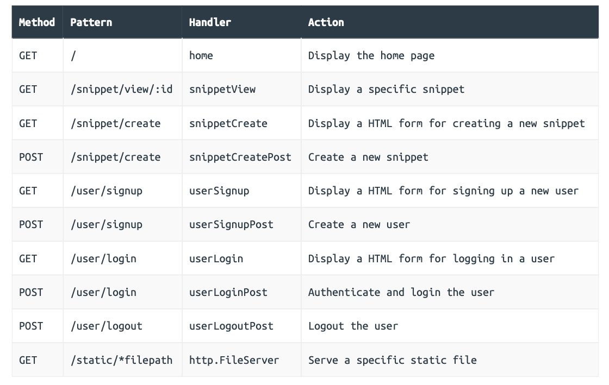

### Routes setup



```go
// File: cmd/web/handlers.go 

package main 

...

func (app *application) userSignup(w http.ResponseWriter, r *http.Request) {     
  fmt.Fprintln(w, "Display a HTML form for signing up a new user...")
} 

func (app *application) userSignupPost(w http.ResponseWriter, r *http.Request) {   
  fmt.Fprintln(w, "Create a new user...") 
}

func (app *application) userLogin(w http.ResponseWriter, r *http.Request) {    
  fmt.Fprintln(w, "Display a HTML form for logging in a user...") 
}

func (app *application) userLoginPost(w http.ResponseWriter, r *http.Request) {  
  fmt.Fprintln(w, "Authenticate and login the user...") 
}

func (app *application) userLogoutPost(w http.ResponseWriter, r *http.Request) {     
  fmt.Fprintln(w, "Logout the user...") 
}
```

```go
// File: cmd/web/routes.go 

package main 

...

func (app *application) routes() http.Handler {   
  router := httprouter.New()    
  
  router.NotFound = http.HandlerFunc(func(w http.ResponseWriter, r *http.Request) {   
    app.notFound(w)    
  })   
  
  fileServer := http.FileServer(http.Dir("./ui/static/"))  
  router.Handler(http.MethodGet, "/static/*filepath", http.StripPrefix("/static", fileServer))   
  
  dynamic := alice.New(app.sessionManager.LoadAndSave)  
  
  router.Handler(http.MethodGet, "/", dynamic.ThenFunc(app.home))   
  router.Handler(http.MethodGet, "/snippet/view/:id", dynamic.ThenFunc(app.snippetView))    
  router.Handler(http.MethodGet, "/snippet/create", dynamic.ThenFunc(app.snippetCreate))  
  router.Handler(http.MethodPost, "/snippet/create", dynamic.ThenFunc(app.snippetCreatePost))     
  // Add the five new routes, all of which use our 'dynamic' middleware chain.
  router.Handler(http.MethodGet, "/user/signup", dynamic.ThenFunc(app.userSignup))   
  router.Handler(http.MethodPost, "/user/signup", dynamic.ThenFunc(app.userSignupPost)) 
  router.Handler(http.MethodGet, "/user/login", dynamic.ThenFunc(app.userLogin))    
  router.Handler(http.MethodPost, "/user/login", dynamic.ThenFunc(app.userLoginPost))  
  router.Handler(http.MethodPost, "/user/logout", dynamic.ThenFunc(app.userLogoutPost))  
  
  standard := alice.New(app.recoverPanic, app.logRequest, secureHeaders)   
  return standard.Then(router) 
}
```

```html
// File: ui/html/partials/nav.tmpl 

{{define "nav"}} 
<nav>  
  <div>    
    <a href='/'>Home</a>       
    <a href='/snippet/create'>Create snippet</a>   
  </div>   
  <div>    
    <a href='/user/signup'>Signup</a>   
    <a href='/user/login'>Login</a>   
    <form action='/user/logout' method='POST'>      
      <button>Logout</button>  
    </form>   
  </div> 
</nav> 
{{end}}
```

### Creating a users model

```sql
USE snippetbox; 

CREATE TABLE users (  
  id INTEGER NOT NULL PRIMARY KEY AUTO_INCREMENT,   
  name VARCHAR(255) NOT NULL,   
  email VARCHAR(255) NOT NULL,  
  hashed_password CHAR(60) NOT NULL,  
  created DATETIME NOT NULL 
);

ALTER TABLE users ADD CONSTRAINT users_uc_email UNIQUE (email);
```

#### Building the model in Go

```go
// File: internal/models/errors.go 

package models 

import (  
  "errors" 
) 

var (   
  ErrNoRecord = errors.New("models: no matching record found")   
  
  // Add a new ErrInvalidCredentials error. We'll use this later if a user  
  // tries to login with an incorrect email address or password.
  ErrInvalidCredentials = errors.New("models: invalid credentials")   
  
  // Add a new ErrDuplicateEmail error. We'll use this later if a user   
  // tries to signup with an email address that's already in use.
  ErrDuplicateEmail = errors.New("models: duplicate email") )
```

```go
// File: internal/models/users.go 

package models 

import (   
  "database/sql"   
  "time" 
) 

// Define a new User type. Notice how the field names and types align 
// with the columns in the database "users" table.
type User struct {  
  ID             int   
  Name           string   
  Email          string  
  HashedPassword []byte   
  Created        time.Time 
}

// Define a new UserModel type which wraps a database connection pool.
type UserModel struct {  
  DB *sql.DB 
}

// We'll use the Insert method to add a new record to the "users" table.
func (m *UserModel) Insert(name, email, password string) error {  
  return nil 
}

// We'll use the Authenticate method to verify whether a user exists with 
// the provided email address and password. This will return the relevant 
// user ID if they do.
func (m *UserModel) Authenticate(email, password string) (int, error) {   
  return 0, nil
}

// We'll use the Exists method to check if a user exists with a specific ID.
func (m *UserModel) Exists(id int) (bool, error) {  
  return false, nil
}
```

```go
// File: cmd/web/main.go 

package main 

...

// Add a new users field to the application struct.
type application struct {  
  errorLog       *log.Logger  
  infoLog        *log.Logger   
  snippets       *models.SnippetModel   
  users          *models.UserModel   
  templateCache  map[string]*template.Template   
  formDecoder    *form.Decoder   
  sessionManager *scs.SessionManager 
}

func main() {    
  ...
  
  // Initialize a models.UserModel instance and add it to the application   
  // dependencies.
  app := &application{  
    errorLog:       errorLog,   
    infoLog:        infoLog,    
    snippets:       &models.SnippetModel{DB: db},   
    users:          &models.UserModel{DB: db},  
    templateCache:  templateCache,    
    formDecoder:    formDecoder,    
    sessionManager: sessionManager,   
  }    
  
  tlsConfig := &tls.Config{     
    CurvePreferences: []tls.CurveID{tls.X25519, tls.CurveP256},   
  }   
  
  srv := &http.Server{   
    Addr:         *addr,   
    ErrorLog:     errorLog,   
    Handler:      app.routes(),    
    TLSConfig:    tlsConfig,     
    IdleTimeout:  time.Minute,    
    ReadTimeout:  5 * time.Second,     
    WriteTimeout: 10 * time.Second,    
  }
  
  infoLog.Printf("Starting server on %s", *addr)   
  err = srv.ListenAndServeTLS("./tls/cert.pem", "./tls/key.pem") 
  errorLog.Fatal(err) 
}

...
```

### User signup and password encryption

```html
// File: ui/html/pages/signup.tmpl 

{{define "title"}}Signup{{end}} 

{{define "main"}} 
<form action='/user/signup' method='POST' novalidate>  
  <div>      
    <label>Name:</label>  
    {{with .Form.FieldErrors.name}}    
    <label class='error'>{{.}}</label>    
    {{end}}    
    <input type='text' name='name' value='{{.Form.Name}}'>  
  </div>   
  <div>    
    <label>Email:</label>  
    {{with .Form.FieldErrors.email}}  
    <label class='error'>{{.}}</label>    
    {{end}}    
    <input type='email' name='email' value='{{.Form.Email}}'>  
  </div>  
  <div>  
    <label>Password:</label> 
    {{with .Form.FieldErrors.password}}       
    <label class='error'>{{.}}</label>      
    {{end}}     
    <input type='password' name='password'>   
  </div>   
  <div>   
    <input type='submit' value='Signup'>   
  </div> 
</form> 
{{end}}
```

```go
// File: cmd/web/handlers.go 

package main 

...

// Create a new userSignupForm struct.
type userSignupForm struct {   
  Name                string `form:"name"`   
  Email               string `form:"email"`   
  Password            string `form:"password"`   
  validator.Validator `form:"-"`
} 

// Update the handler so it displays the signup page.
func (app *application) userSignup(w http.ResponseWriter, r *http.Request) {  
  data := app.newTemplateData(r)   
  data.Form = userSignupForm{}   
  app.render(w, http.StatusOK, "signup.tmpl", data) 
}

...
```

#### Validating the user input

```go
// File: internal/validator/validator.go 

package validator 

import (   
  "regexp" // New import  
  "strings"  
  "unicode/utf8" 
)

// Use the regexp.MustCompile() function to parse a regular expression pattern 
// for sanity checking the format of an email address. This returns a pointer to 
// a 'compiled' regexp.Regexp type, or panics in the event of an error. Parsing 
// this pattern once at startup and storing the compiled *regexp.Regexp in a 
// variable is more performant than re-parsing the pattern each time we need it.
var EmailRX = regexp.MustCompile("^[a-zA-Z0-9.!#$%&'*+\\/=?^_`{|}~-]+@[a-zA-Z0-9](?:[a-zA-Z0-9-]{0,61}[a-zA-Z0-9])?(?:\\.[a-zA-Z0-9](?:[a-zA-Z0-9-]{0,61}[a-zA-Z0-9])?)*$" 

...

// MinChars() returns true if a value contains at least n characters.
func MinChars(value string, n int) bool {   
  return utf8.RuneCountInString(value) >= n 
}
                                 
// Matches() returns true if a value matches a provided compiled regular 
// expression pattern.
func Matches(value string, rx *regexp.Regexp) bool {  
  return rx.MatchString(value) 
}
```

```go
// File: cmd/web/handlers.go 

package main 

...

func (app *application) userSignupPost(w http.ResponseWriter, r *http.Request) {  
  // Declare an zero-valued instance of our userSignupForm struct.
  var form userSignupForm   
  
  // Parse the form data into the userSignupForm struct.
  err := app.decodePostForm(r, &form)   
  if err != nil {     
    app.clientError(w, http.StatusBadRequest)     
    return  
  }  
  
  // Validate the form contents using our helper functions.
  form.CheckField(validator.NotBlank(form.Name), "name", "This field cannot be blank")   
  form.CheckField(validator.NotBlank(form.Email), "email", "This field cannot be blank") 
  form.CheckField(validator.Matches(form.Email, validator.EmailRX), "email", "This field must be a valid email address")   
  form.CheckField(validator.NotBlank(form.Password), "password", "This field cannot be blank")  
  form.CheckField(validator.MinChars(form.Password, 8), "password", "This field must be at least 8 characters long")   
  
  // If there are any errors, redisplay the signup form along with a 422 status code.
  if !form.Valid() {   
    data := app.newTemplateData(r)    
    data.Form = form      
    app.render(w, http.StatusUnprocessableEntity, "signup.tmpl", data)  
    return   
  }   
  
  // Otherwise send the placeholder response (for now!).
  fmt.Fprintln(w, "Create a new user...")
}

...
```

#### Storing the user details

```go
// File: internal/models/users.go 

package models 

import (   
  "database/sql"   
  "errors"  // New import  
  "strings" // New import  
  "time"   
  
  "github.com/go-sql-driver/mysql" // New import  
  "golang.org/x/crypto/bcrypt"     // New import 
)

...

type UserModel struct {   
  DB *sql.DB 
}

func (m *UserModel) Insert(name, email, password string) error {  
  // Create a bcrypt hash of the plain-text password.
  hashedPassword, err := bcrypt.GenerateFromPassword([]byte(password), 12)   
  if err != nil {    
    return err   
  }   
  
  stmt := `INSERT INTO users (name, email, hashed_password, created)  
  VALUES(?, ?, ?, UTC_TIMESTAMP())` 
  
  // Use the Exec() method to insert the user details and hashed password   
  // into the users table.
  _, err = m.DB.Exec(stmt, name, email, string(hashedPassword))  
  if err != nil {     
    // If this returns an error, we use the errors.As() function to check   
    // whether the error has the type *mysql.MySQLError. If it does, the    
    // error will be assigned to the mySQLError variable. We can then check    
    // whether or not the error relates to our users_uc_email key by    
    // checking if the error code equals 1062 and the contents of the error   
    // message string. If it does, we return an ErrDuplicateEmail error.
    var mySQLError *mysql.MySQLError   
    if errors.As(err, &mySQLError) {     
      if mySQLError.Number == 1062 && strings.Contains(mySQLError.Message, "users_uc_email"){ 
        return ErrDuplicateEmail   
      }     
    }     
    return err   
  }  
  
  return nil 
}

...
```

```go
// File: cmd/web/handlers.go 

package main 

...

func (app *application) userSignupPost(w http.ResponseWriter, r *http.Request) {   
  var form userSignupForm  
  
  err := app.decodePostForm(r, &form)   
  if err != nil {   
    app.clientError(w, http.StatusBadRequest)   
    return   
  }    
  
  form.CheckField(validator.NotBlank(form.Name), "name", "This field cannot be blank")  
  form.CheckField(validator.NotBlank(form.Email), "email", "This field cannot be blank")  
  form.CheckField(validator.Matches(form.Email, validator.EmailRX), "email", "This field must be a valid email address")  
  form.CheckField(validator.NotBlank(form.Password), "password", "This field cannot be blank")   
  form.CheckField(validator.MinChars(form.Password, 8), "password", "This field must be at least 8 characters long")    
  
  if !form.Valid() {   
    data := app.newTemplateData(r)   
    data.Form = form    
    app.render(w, http.StatusUnprocessableEntity, "signup.tmpl", data)  
    return    
  }  
  
  // Try to create a new user record in the database. If the email already  
  // exists then add an error message to the form and re-display it.
  err = app.users.Insert(form.Name, form.Email, form.Password)   
  if err != nil {      
    if errors.Is(err, models.ErrDuplicateEmail) {    
      form.AddFieldError("email", "Email address is already in use")    
      data := app.newTemplateData(r)        
      data.Form = form     
      app.render(w, http.StatusUnprocessableEntity, "signup.tmpl", data)   
    } else {      
      app.serverError(w, err)    
    }    
    
    return  
  }    
  
  // Otherwise add a confirmation flash message to the session confirming that  
  // their signup worked.
  app.sessionManager.Put(r.Context(), "flash", "Your signup was successful. Please log in.") 
  
  // And redirect the user to the login page.
  http.Redirect(w, r, "/user/login", http.StatusSeeOther) 
}

...
```

#### Additional information

##### Using database bcrypt implementations

Some databases provide built-in functions that you can use for password hashing and verification instead of implementing your own in Go, like we have in the code above.

But it’s probably a good idea to avoid using these for two reasons: 

- They tend to be vulnerable to **side-channel timing attacks** due to string comparison time not being constant, at least in PostgreSQL and MySQL.
- Unless you’re very careful, sending a plain-text password to your database risks the password being accidentally recorded in one of your database logs. A couple of highprofile examples of this happening were the [Github](https://www.bleepingcomputer.com/news/security/github-accidentally-recorded-some-plaintext-passwords-in-its-internal-logs/) and [Twitter](https://www.bleepingcomputer.com/news/security/twitter-admits-recording-plaintext-passwords-in-internal-logs-just-like-github/) incidents in 2018.

##### Alternatives for checking email duplicates

I understand that the code in our UserModel.Insert() method isn’t very pretty, and that checking the error returned by MySQL feels a bit flaky. What if future versions of MySQL change their error numbers? Or the format of their error messages? 

An alternative (but also imperfect) option would be to add an UserModel.EmailTaken() method to our model which checks to see if a user with a specific email already exists. We could call this before we try to insert a new record, and add a validation error message to the form as appropriate.

However, this would introduce a race condition to our application. If two users try to sign up with the same email address at exactly the same time, both submissions will pass the validation check but ultimately only one INSERT into the MySQL database will succeed. The other will violate our UNIQUE constraint and the user would end up receiving a 500 Internal Server Error response.

The outcome of this particular race condition is fairly benign, and [some people](https://stackoverflow.com/questions/25702813/how-to-avoid-race-condition-with-unique-checks-in-django) would advise you to simply not worry about it. But thinking critically about your application logic and writing code which avoids race conditions is a good habit to get into, and where there’s a viable alternative — like there is in this case — it’s better to avoid shipping with known race conditions in your codebase.

### User login

```go
// File: internal/validator/validator.go 

package validator 

...

// Add a new NonFieldErrors []string field to the struct, which we will use to 
// hold any validation errors which are not related to a specific form field.
type Validator struct {  
  NonFieldErrors []string  
  FieldErrors    map[string]string 
}

// Update the Valid() method to also check that the NonFieldErrors slice is empty.
func (v *Validator) Valid() bool {  
  return len(v.FieldErrors) == 0 && len(v.NonFieldErrors) == 0 
} 

// Create an AddNonFieldError() helper for adding error messages to the new 
// NonFieldErrors slice.
func (v *Validator) AddNonFieldError(message string) {  
  v.NonFieldErrors = append(v.NonFieldErrors, message)
}

...
```

```html
// File: ui/html/pages/login.tmpl 

{{define "title"}}Login{{end}} 

{{define "main"}} 
<form action='/user/login' method='POST' novalidate> 
  <!-- Notice that here we are looping over the NonFieldErrors and displaying them, if any exist -->   
  {{range .Form.NonFieldErrors}}   
  <div class='error'>{{.}}</div>  
  {{end}}  
  <div>  
    <label>Email:</label>    
    {{with .Form.FieldErrors.email}}  
    <label class='error'>{{.}}</label>   
    {{end}}       
    <input type='email' name='email' value='{{.Form.Email}}'>  
  </div>   
  <div>      
    <label>Password:</label>  
    {{with .Form.FieldErrors.password}}        
    <label class='error'>{{.}}</label>   
    {{end}}     
    <input type='password' name='password'> 
  </div>   
  <div>    
    <input type='submit' value='Login'>  
  </div> 
</form>
{{end}}
```

```go
// File: cmd/web/handlers.go 

package main 

...

// Create a new userLoginForm struct.
type userLoginForm struct {  
  Email               string `form:"email"`  
  Password            string `form:"password"`  
  validator.Validator `form:"-"`
}

// Update the handler so it displays the login page.
func (app *application) userLogin(w http.ResponseWriter, r *http.Request) {  
  data := app.newTemplateData(r)    
  data.Form = userLoginForm{}  
  app.render(w, http.StatusOK, "login.tmpl", data)
}

...
```

#### Verifying the user details

```go
// File: internal/models/users.go 

package models 

...

func (m *UserModel) Authenticate(email, password string) (int, error) { 
  // Retrieve the id and hashed password associated with the given email. If  
  // no matching email exists we return the ErrInvalidCredentials error.
  var id int   
  var hashedPassword []byte  
  
  stmt := "SELECT id, hashed_password FROM users WHERE email = ?"    
  
  err := m.DB.QueryRow(stmt, email).Scan(&id, &hashedPassword)  
  if err != nil {      
    if errors.Is(err, sql.ErrNoRows) {     
      return 0, ErrInvalidCredentials     
    } else {      
      return 0, err     
    }   
  }    
  
  // Check whether the hashed password and plain-text password provided match.
  // If they don't, we return the ErrInvalidCredentials error.
  err = bcrypt.CompareHashAndPassword(hashedPassword, []byte(password))  
  if err != nil {     
    if errors.Is(err, bcrypt.ErrMismatchedHashAndPassword) {   
      return 0, ErrInvalidCredentials    
    } else {        
      return 0, err      
    }   
  }   
  
  // Otherwise, the password is correct. Return the user ID.
  return id, nil 
}
```

```go
// File: cmd/web/handlers.go 

package main 

...

func (app *application) userLoginPost(w http.ResponseWriter, r *http.Request) {   
  // Decode the form data into the userLoginForm struct.
  var form userLoginForm   
  
  err := app.decodePostForm(r, &form)    
  if err != nil {     
    app.clientError(w, http.StatusBadRequest)    
    return   
  } 
  
  // Do some validation checks on the form. We check that both email and    
  // password are provided, and also check the format of the email address as   
  // a UX-nicety (in case the user makes a typo).
  form.CheckField(validator.NotBlank(form.Email), "email", "This field cannot be blank")   
  form.CheckField(validator.Matches(form.Email, validator.EmailRX), "email", "This field must be a valid email address")  
  form.CheckField(validator.NotBlank(form.Password), "password", "This field cannot be blank")   
  
  if !form.Valid() {   
    data := app.newTemplateData(r)    
    data.Form = form    
    app.render(w, http.StatusUnprocessableEntity, "login.tmpl", data)  
    return   
  }     
  
  // Check whether the credentials are valid. If they're not, add a generic   
  // non-field error message and re-display the login page.
  id, err := app.users.Authenticate(form.Email, form.Password)   
  if err != nil {       
    if errors.Is(err, models.ErrInvalidCredentials) {   
      form.AddNonFieldError("Email or password is incorrect")   
      data := app.newTemplateData(r)        
      data.Form = form     
      app.render(w, http.StatusUnprocessableEntity, "login.tmpl", data)   
    } else {         
      app.serverError(w, err)    
    }      
    
    return   
  }    
  
  // Use the RenewToken() method on the current session to change the session   
  // ID. It's good practice to generate a new session ID when the  
  // authentication state or privilege levels changes for the user (e.g. login  
  // and logout operations).
  err = app.sessionManager.RenewToken(r.Context())  
  if err != nil {  
    app.serverError(w, err)     
    return   
  }    
  
  // Add the ID of the current user to the session, so that they are now  
  // 'logged in'.
  app.sessionManager.Put(r.Context(), "authenticatedUserID", id)  
  
  // Redirect the user to the create snippet page.
  http.Redirect(w, r, "/snippet/create", http.StatusSeeOther) 
}

...
```

**Note**: The [SessionManager.RenewToken()](https://pkg.go.dev/github.com/alexedwards/scs/v2#SessionManager.RenewToken) method that we’re using in the code above will change the ID of the current user’s session but retain any data associated with the session. It’s good practice to do this before login to mitigate the risk of a **session fixation attack**. For more background and information on this, please see the OWASP Session Management Cheat Sheet.

### User logout

```go
// File: cmd/web/handlers.go 

package main 

...

func (app *application) userLogoutPost(w http.ResponseWriter, r *http.Request) {   
  // Use the RenewToken() method on the current session to change the session   
  // ID again.
  err := app.sessionManager.RenewToken(r.Context())    
  if err != nil {   
    app.serverError(w, err)     
    return  
  }    
  
  // Remove the authenticatedUserID from the session data so that the user is  
  // 'logged out'.
  app.sessionManager.Remove(r.Context(), "authenticatedUserID")   
  
  // Add a flash message to the session to confirm to the user that they've been   
  // logged out.
  app.sessionManager.Put(r.Context(), "flash", "You've been logged out successfully!") 
  
  // Redirect the user to the application home page.
  http.Redirect(w, r, "/", http.StatusSeeOther) 
}
```

### User authorization

```go
// File: cmd/web/helpers.go 

package main 

...

// Return true if the current request is from an authenticated user, otherwise 
// return false.
func (app *application) isAuthenticated(r *http.Request) bool {   
  return app.sessionManager.Exists(r.Context(), "authenticatedUserID")
}
```

```go
// File: cmd/web/templates.go 

package main 

import ( 
  "html/template"  
  "path/filepath" 
  "time"   
  
  "snippetbox.alexedwards.net/internal/models"
)

type templateData struct {   
  CurrentYear     int   
  Snippet         *models.Snippet   
  Snippets        []*models.Snippet  
  Form            any  
  Flash           string   
  IsAuthenticated bool // Add an IsAuthenticated field to the templateData struct.
} 

...
```

```go
// File: cmd/web/helpers.go 

package main 

...

func (app *application) newTemplateData(r *http.Request) *templateData { 
  return &templateData{     
    CurrentYear:     time.Now().Year(),  
    Flash:           app.sessionManager.PopString(r.Context(), "flash"),    
    // Add the authentication status to the template data.
    IsAuthenticated: app.isAuthenticated(r),  
  }
}

...
```

```html
// File: ui/html/partials/nav.tmpl 

{{define "nav"}} 
<nav>  
  <div>    
    <a href='/'>Home</a>    
    <!-- Toggle the link based on authentication status -->    
    {{if .IsAuthenticated}}       
    <a href='/snippet/create'>Create snippet</a>   
    {{end}}   
  </div> 
  <div>    
    <!-- Toggle the links based on authentication status -->    
    {{if .IsAuthenticated}}     
    <form action='/user/logout' method='POST'>  
      <button>Logout</button>     
    </form>     
    {{else}}     
    <a href='/user/signup'>Signup</a>   
    <a href='/user/login'>Login</a>     
    {{end}}   
  </div>
</nav>
{{end}}
```

#### Restricting access

```go
// File: cmd/web/middleware.go 

package main 

...

func (app *application) requireAuthentication(next http.Handler) http.Handler {  
  return http.HandlerFunc(func(w http.ResponseWriter, r *http.Request) { 
    // If the user is not authenticated, redirect them to the login page and  
    // return from the middleware chain so that no subsequent handlers in   
    // the chain are executed.
    if !app.isAuthenticated(r) {    
      http.Redirect(w, r, "/user/login", http.StatusSeeOther)    
      return      
    }      
    
    // Otherwise set the "Cache-Control: no-store" header so that pages   
    // require authentication are not stored in the users browser cache (or     
    // other intermediary cache).
    w.Header().Add("Cache-Control", "no-store")  
    
    // And call the next handler in the chain.
    next.ServeHTTP(w, r)  
  }) 
}
```

```go
// File: cmd/web/routes.go 

package main 

...

func (app *application) routes() http.Handler {   
  router := httprouter.New()  
  
  router.NotFound = http.HandlerFunc(func(w http.ResponseWriter, r *http.Request) {  
    app.notFound(w)   
  })  
  
  fileServer := http.FileServer(http.Dir("./ui/static/"))  
  router.Handler(http.MethodGet, "/static/*filepath", http.StripPrefix("/static", fileServer))   
  
  // Unprotected application routes using the "dynamic" middleware chain.
  dynamic := alice.New(app.sessionManager.LoadAndSave)   
  
  router.Handler(http.MethodGet, "/", dynamic.ThenFunc(app.home))     
  router.Handler(http.MethodGet, "/snippet/view/:id", dynamic.ThenFunc(app.snippetView))   
  router.Handler(http.MethodGet, "/user/signup", dynamic.ThenFunc(app.userSignup))  
  router.Handler(http.MethodPost, "/user/signup", dynamic.ThenFunc(app.userSignupPost))  
  router.Handler(http.MethodGet, "/user/login", dynamic.ThenFunc(app.userLogin))   
  router.Handler(http.MethodPost, "/user/login", dynamic.ThenFunc(app.userLoginPost))  
  
  // Protected (authenticated-only) application routes, using a new "protected"   
  // middleware chain which includes the requireAuthentication middleware.
  protected := dynamic.Append(app.requireAuthentication)  
  
  router.Handler(http.MethodGet, "/snippet/create", protected.ThenFunc(app.snippetCreate))  
  router.Handler(http.MethodPost, "/snippet/create", protected.ThenFunc(app.snippetCreatePost))   
  router.Handler(http.MethodPost, "/user/logout", protected.ThenFunc(app.userLogoutPost)) 
  
  standard := alice.New(app.recoverPanic, app.logRequest, secureHeaders)    
  return standard.Then(router)
}
```

### CSRF protection

A great explanation of the basic CSRF attack can be [found here](https://www.gnucitizen.org/blog/csrf-demystified/).

In our application, the main risk is this: 

- A user logs into our application. Our session cookie is set to persist for 12 hours, so they will remain logged in even if they navigate away from the application.
- The user then goes to a malicious website which contains some code that sends a crosssite request to our `POST /snippet/create` endpoint add a new snippet to our database. The session cookie will be sent along with this request. 
- Because the request includes the session cookie, our application will interpret the request as coming from a logged-in user and it will process the request with that user’s privileges. So completely unknown to the user, a new snippet will be added to our database.

As well as ‘traditional’ CSRF attacks like the above (where a request is processed with a logged-in user’s privileges) your application may also be at risk from [login and logout](https://stackoverflow.com/questions/6412813/do-login-forms-need-tokens-against-csrf-attacks) CSRF attacks.

#### SameSite cookies

One mitigation that we can take to prevent CSRF attacks is to make sure that the SameSite attribute is appropriately set on our session cookie.

By default the alexedwards/scs package that we’re using always sets SameSite=Lax on the session cookie. This means that the session cookie won’t be sent by the user’s browser for any unsafe cross-site requests (i.e. cross-site requests with the HTTP methods POST, PUT and DELETE).

So long as our application uses the POST method for any state-changing HTTP requests (like our login, signup, logout and create snippet form submissions), it means that the session cookie won’t be sent for these requests if they are cross-site — which in turn means that they should be safe from CSRF attacks.

However, the SameSite attribute is still relatively new and only fully supported by [95% of browsers](https://caniuse.com/same-site-cookie-attribute) worldwide. So, although it’s something that we can (and should) use as a defensive measure, we can’t rely on it for all users.

#### Token-based mitigation

To mitigate the risk of CSRF for all users we’ll also need to implement some form of [token check](https://cheatsheetseries.owasp.org/cheatsheets/Cross-Site_Request_Forgery_Prevention_Cheat_Sheet.html). Like session management and password hashing, when it comes to this there’s a lot that you can get wrong so it’s probably safer to use a tried-and-tested third-party package instead of rolling your own implementation.

A good and popular choice is [justinas/nosurf](https://github.com/justinas/nosurf), which uses the [double-submit cookie](https://cheatsheetseries.owasp.org/cheatsheets/Cross-Site_Request_Forgery_Prevention_Cheat_Sheet.html#alternative-using-a-double-submit-cookie-pattern) pattern to prevent CSRF attacks. In this pattern a random CSRF token is generated and sent to the user in a CSRF cookie. This CSRF token is then added to a hidden field in each HTML form that’s vulnerable to CSRF. When the form is submitted, it uses some middleware to check that the hidden field value and cookie value match.

#### Using the nosurf package

```go
// File: cmd/web/middleware.go 

package main 

import ( 
  "fmt"   
  "net/http"  
  
  "github.com/justinas/nosurf" // New import 
)

...

// Create a NoSurf middleware function which uses a customized CSRF cookie with 
// the Secure, Path and HttpOnly attributes set.
func noSurf(next http.Handler) http.Handler {   
  csrfHandler := nosurf.New(next)   
  csrfHandler.SetBaseCookie(http.Cookie{ 
    HttpOnly: true,     
    Path:     "/",     
    Secure:   true,   
  })   
  
  return csrfHandler
}
```

```go
// File: cmd/web/routes.go 

package main

...

func (app *application) routes() http.Handler {  
  router := httprouter.New()   
  
  router.NotFound = http.HandlerFunc(func(w http.ResponseWriter, r *http.Request) {    
    app.notFound(w)   
  })      
  
  fileServer := http.FileServer(http.Dir("./ui/static/")) 
  router.Handler(http.MethodGet, "/static/*filepath", http.StripPrefix("/static", fileServer))   
  
  // Use the nosurf middleware on all our 'dynamic' routes.
  dynamic := alice.New(app.sessionManager.LoadAndSave, noSurf)    
  
  router.Handler(http.MethodGet, "/", dynamic.ThenFunc(app.home))   
  router.Handler(http.MethodGet, "/snippet/view/:id", dynamic.ThenFunc(app.snippetView))  
  router.Handler(http.MethodGet, "/user/signup", dynamic.ThenFunc(app.userSignup))    
  router.Handler(http.MethodPost, "/user/signup", dynamic.ThenFunc(app.userSignupPost))  
  router.Handler(http.MethodGet, "/user/login", dynamic.ThenFunc(app.userLogin))  
  router.Handler(http.MethodPost, "/user/login", dynamic.ThenFunc(app.userLoginPost))  
  
  // Because the 'protected' middleware chain appends to the 'dynamic' chain    
  // the noSurf middleware will also be used on the three routes below too.
  protected := dynamic.Append(app.requireAuthentication)    
  
  router.Handler(http.MethodGet, "/snippet/create", protected.ThenFunc(app.snippetCreate))  
  router.Handler(http.MethodPost, "/snippet/create", protected.ThenFunc(app.snippetCreatePost))  
  router.Handler(http.MethodPost, "/user/logout", protected.ThenFunc(app.userLogoutPost)) 
  
  standard := alice.New(app.recoverPanic, app.logRequest, secureHeaders)  
  return standard.Then(router) 
}
```

```go
// File: cmd/web/templates.go 

package main 

import (   
  "html/template"  
  "path/filepath"   
  "time"  
  "snippetbox.alexedwards.net/internal/models" 
)

type templateData struct {    
  CurrentYear     int   
  Snippet         *models.Snippet   
  Snippets        []*models.Snippet   
  Form            any  
  Flash           string   
  IsAuthenticated bool   
  CSRFToken       string // Add a CSRFToken field.
} 

...
```

```go
// File: cmd/web/helpers.go 

package main 

import (  
  "bytes"  
  "errors"  
  "fmt"   
  "net/http"    
  "runtime/debug"  
  "time"   
  
  "github.com/go-playground/form/v4" 
  "github.com/justinas/nosurf" // New import 
)

...

func (app *application) newTemplateData(r *http.Request) *templateData {  
  return &templateData{    
    CurrentYear:     time.Now().Year(),  
    Flash:           app.sessionManager.PopString(r.Context(), "flash"),    
    IsAuthenticated: app.isAuthenticated(r),    
    CSRFToken:       nosurf.Token(r), // Add the CSRF token.  
  }
}

...
```

```html
// File: ui/html/pages/create.tmpl 

{{define "title"}}Create a New Snippet{{end}} 

{{define "main"}}
<form action='/snippet/create' method='POST'>  
  <!-- Include the CSRF token -->  
  <input type='hidden' name='csrf_token' value='{{.CSRFToken}}'>  
  <div>      
    <label>Title:</label> 
    {{with .Form.FieldErrors.title}}      
    <label class='error'>{{.}}</label>   
    {{end}}     
    <input type='text' name='title' value='{{.Form.Title}}'>   
  </div>  
  <div>  
    <label>Content:</label>    
    {{with .Form.FieldErrors.content}}      
    <label class='error'>{{.}}</label>    
    {{end}}     
    <textarea name='content'>{{.Form.Content}}</textarea> 
  </div>   
  <div>     
    <label>Delete in:</label>   
    {{with .Form.FieldErrors.expires}}    
    <label class='error'>{{.}}</label>     
    {{end}}      
    <input type='radio' name='expires' value='365' {{if (eq .Form.Expires 365)}}checked{{end}}> One Year   
    <input type='radio' name='expires' value='7' {{if (eq .Form.Expires 7)}}checked{{end}}> One Week     
    <input type='radio' name='expires' value='1' {{if (eq .Form.Expires 1)}}checked{{end}}> One Day   
  </div>   
  <div>   
    <input type='submit' value='Publish snippet'> 
  </div>
</form> 
{{end}}
```

```html
// File: ui/html/pages/login.tmpl 

{{define "title"}}Login{{end}}

{{define "main"}} 
<form action='/user/login' method='POST' novalidate>   
  <!-- Include the CSRF token -->   
  <input type='hidden' name='csrf_token' value='{{.CSRFToken}}'>  
  {{range .Form.NonFieldErrors}}     
  <div class='error'>{{.}}</div> 
  {{end}}    
  <div> 
    <label>Email:</label> 
    {{with .Form.FieldErrors.email}}    
    <label class='error'>{{.}}</label>     
    {{end}}     
    <input type='email' name='email' value='{{.Form.Email}}'>  
  </div>  
  <div>    
    <label>Password:</label> 
    {{with .Form.FieldErrors.password}}      
    <label class='error'>{{.}}</label>      
    {{end}}    
    <input type='password' name='password'>  
  </div>    
  <div>   
    <input type='submit' value='Login'>  
  </div> 
</form> 
{{end}}
```

```html
// File: ui/html/pages/signup.tmpl 

{{define "title"}}Signup{{end}} 

{{define "main"}} 
<form action='/user/signup' method='POST' novalidate>  
  <!-- Include the CSRF token -->    
  <input type='hidden' name='csrf_token' value='{{.CSRFToken}}'> 
  <div>     
    <label>Name:</label>   
    {{with .Form.FieldErrors.name}}   
    <label class='error'>{{.}}</label>    
    {{end}}     
    <input type='text' name='name' value='{{.Form.Name}}'>
  </div>   
  <div>  
    <label>Email:</label>  
    {{with .Form.FieldErrors.email}}    
    <label class='error'>{{.}}</label>  
    {{end}}     
    <input type='email' name='email' value='{{.Form.Email}}'>   
  </div>   
  <div>      
    <label>Password:</label>   
    {{with .Form.FieldErrors.password}}    
    <label class='error'>{{.}}</label>  
    {{end}}     
    <input type='password' name='password'>  
  </div>   
  <div>    
    <input type='submit' value='Signup'>  
  </div> 
</form>
{{end}}
```

```html
// File: ui/html/partials/nav.tmpl 

{{define "nav"}} 
<nav> 
  <div>   
    <a href='/'>Home</a>  
    {{if .IsAuthenticated}}      
    <a href='/snippet/create'>Create snippet</a>     
    {{end}}   
  </div>   
  <div>     
    {{if .IsAuthenticated}}    
    <form action='/user/logout' method='POST'>     
      <!-- Include the CSRF token -->       
      <input type='hidden' name='csrf_token' value='{{.CSRFToken}}'>   
      <button>Logout</button>   
    </form>      
    {{else}}     
    <a href='/user/signup'>Signup</a>   
    <a href='/user/login'>Login</a>   
    {{end}}   
  </div> 
</nav>
{{end}}
```

#### Additional information

##### SameSite ‘Strict’ setting

If you want, you can change the session cookie to use the `SameSite=Strict` setting instead of (the default) `SameSite=Lax`. Like this:

```go
sessionManager := scs.New() 
sessionManager.Cookie.SameSite = http.SameSiteStrictMode
```

But it’s important to be aware that using SameSite=Strict will block the session cookie being sent by the user’s browser for all cross-site usage — including safe requests with HTTP methods like GET and HEAD.

While that might sound even safer (and it is!) the downside is that the session cookie won’t be sent when a user clicks on a link to your application from another website. In turn, that means that your application would initially treat the user as ‘not logged in’ even if they have an active session containing their "authenticatedUserID" value.

So if your application will potentially have other websites linking to it (or even links shared in emails or private messaging services), then SameSite=Lax is generally the more appropriate setting.

##### SameSite cookies and TLS 1.3

Earlier in this chapter I said that we can’t solely rely on the SameSite cookie attribute to prevent CSRF attacks, because it isn’t fully supported by all browsers.

But there is an [exception](https://security.stackexchange.com/a/249636) to this rule, due to the fact that there is no browser that exists which supports TLS 1.3 and does not support SameSite cookies.

In other words, if you were to make TLS 1.3 the minimum supported version in the TLS config for your server, then all browsers able to use your application will support SameSite cookies.

```go
tlsConfig := &tls.Config{  
  MinVersion: tls.VersionTLS13,
}
```

So long as you only allow HTTPS requests to your application and enforce TLS 1.3 as the minimum TLS version, you don’t need to make any additional mitigation against CSRF attacks (like using the `justinas/nosurf` package). Just make sure that you always:

- Set SameSite=Lax or SameSite=Strict on the session cookie; and 
- Use an ‘unsafe’ HTTP method (i.e. POST, PUT or DELETE) for any state-changing requests.