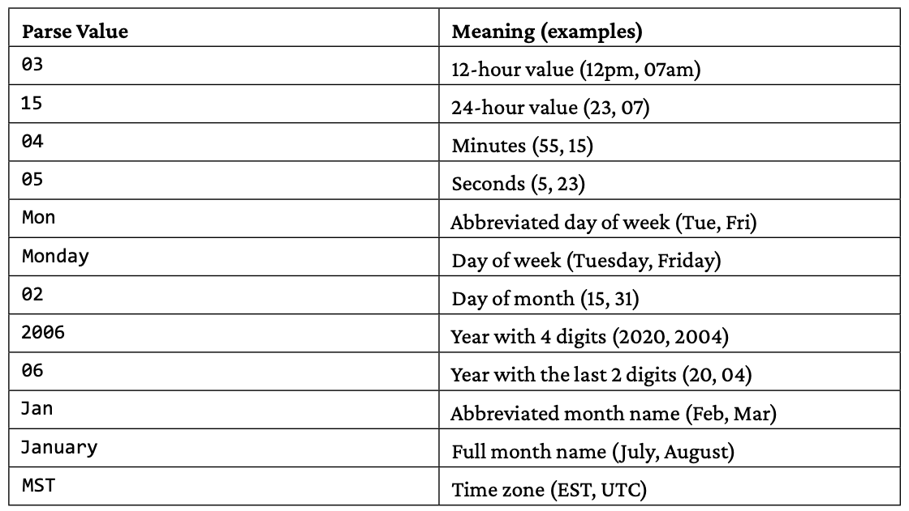

Go provides a special data type, named `error`, for representing error conditions and error messages—in practice, this means that Go treats errors as values. To program successfully in Go, you should be aware of the error conditions that might occur with the functions and methods you are using and handle them accordingly.

You will most likely work with errors in your programs without needing the functionality of the `errors` package. Additionally, you are not going to need to define custom error messages unless you are creating big applications or packages.

If you want to format your error messages in the way `fmt.Printf()` works, you can use the `fmt.Errorf()` function, which simplifies the creation of custom error messages—the `fmt.Errorf()` function returns an error value just like `errors.New()`.

Now, we should talk about something important: you should have a global error-handling tactic in each application that should not change. In practice, this means the following: 

- All error messages should be handled at the same level, which means that all errors should either be returned to the calling function or be handled at the place they occurred.
- The handling of critical errors should be clearly documented. This means that there will be situations where a critical error should terminate the program and other times where a critical error might just create a warning message onscreen and continue.
- It is considered a good practice to send all error messages to the log service of your machine because this way the error messages can be examined later. However, this is not always true, so exercise caution when setting this up—for example, cloud-native apps do not work that way. For cloud-native apps it is better to send the error output to standard error so that the error messages do not get lost.

The `int` and `uint` data types are special as they are the most efficient sizes for signed and unsigned integers on a given platform and can be either 32 or 64 bits each — their size is defined by Go itself based on the CPU register size.

You can create a new byte slice from a given string by using a `[]byte("A String")` statement. Given a byte slice variable b, you can convert it into a string using the `string(b)` statement. When working with byte slices that contain Unicode characters, the number of bytes in a byte slice is not always connected to the number of characters in the byte slice, because most Unicode characters require more than one byte for their representation. As a result, when you try to print each single byte of a byte slice using `fmt.Println()` or `fmt.Print()`, the output is not text presented as characters but instead integer values. If you want to print the contents of a byte slice as text, you should either print it using `string(byteSliceVar)` or using `fmt.Printf()` with `%s` to tell `fmt.Printf()` that you want to print a string. You can initialize a new byte slice with the desired string by using a statement such as `[]byte("My Initialization String")`.

You can define a rune using single quotes: `r := '€'` and you can print the integer value of the bytes that compose it as `fmt.Println(r)`—in this case, the integer value is 8364. Printing it as a single Unicode character requires the use of the `%c` control string in `fmt.Printf()`.

As strings can be accessed as arrays, you can iterate over the runes of the string using a for loop or point to a specific character if you know its place in the string. The length of the string is the same as the number of characters found in the string, which is usually not true for byte slices because Unicode characters usually require more than one byte.

```go

package main

import "fmt"

func main() {
	aString := "Hello World! €"
	fmt.Println("First byte", string(aString[0]))

	// Runes
	// A rune
	r := '€'
	fmt.Println("As an int32 value:", r)
	// Convert Runes to text
	fmt.Printf("As a string: %s and as a character: %c\n", r, r)

	// Print an existing string as runes
	for _, v := range aString {
		fmt.Printf("%x ", v)
	}
	fmt.Println()

	// String to rune Array
	myRune := []rune(aString)
	fmt.Printf("myRune %U\n", myRune)

	// Rune array to string
	runeArray := []rune{'1', '2', '3'}
	s := string(runeArray)
	fmt.Println(s)

	// Print an existing string as characters
	for _, v := range aString {
		fmt.Printf("%c", v)
	}
	fmt.Println()
}

/*
First byte H
As an int32 value: 8364
As a string: %!s(int32=8364) and as a character: €
48 65 6c 6c 6f 20 57 6f 72 6c 64 21 20 20ac 
myRune [U+0048 U+0065 U+006C U+006C U+006F U+0020 U+0057 U+006F U+0072 U+006C U+0064 U+0021 U+0020 U+20AC]
123
Hello World! €
*/
```

You can convert an integer value into a string in two main ways: using `string()` and using a function from the `strconv` package. However, the two methods are fundamentally different. The `string()` function converts an integer value into a Unicode code point, which is a single character, whereas functions such as `strconv.FormatInt()` and `strconv.Itoa()` convert an integer value into a string value with the same representation and the same number of characters.

```go

package main

import (
	"fmt"
	"os"
	"strconv"
)

func main() {
	if len(os.Args) == 1 {
		fmt.Println("Print provide an integer.")
		return
	}

	n, err := strconv.Atoi(os.Args[1])
	if err != nil {
		fmt.Println(err)
		return
	}

	// Using strconv.Itoa()
	input := strconv.Itoa(n)
	fmt.Printf("strconv.Itoa() %s of type %T\n", input, input)

	// Using strconv.FormatInt
	input = strconv.FormatInt(int64(n), 10)
	fmt.Printf("strconv.FormatInt() %s of type %T\n", input, input)

	// Using string()
	input = string(n)
	fmt.Printf("string() %s of type %T\n", input, input)
}

/*
go run main.go 97   

strconv.Itoa() 97 of type string
strconv.FormatInt() 97 of type string
string() a of type string
*/
```

### The strings package

```go

package main

import (
	"fmt"
	s "strings"
	"unicode"
)

var f = fmt.Printf

func main() {
	f("To Upper: %s\n", s.ToUpper("Hello there!"))
	f("To Lower: %s\n", s.ToLower("Hello THERE"))

	f("%s\n", s.Title("tHis wiLL be A title!"))

	f("EqualFold: %v\n", s.EqualFold("Mihalis", "MIHAlis"))
	f("EqualFold: %v\n", s.EqualFold("Mihalis", "MIHAli"))

	f("Prefix: %v\n", s.HasPrefix("Mihalis", "Mi"))
	f("Prefix: %v\n", s.HasPrefix("Mihalis", "mi"))
	f("Suffix: %v\n", s.HasSuffix("Mihalis", "is"))
	f("Suffix: %v\n", s.HasSuffix("Mihalis", "IS"))

	f("Index: %v\n", s.Index("Mihalis", "ha"))
	f("Index: %v\n", s.Index("Mihalis", "Ha"))
	f("Count: %v\n", s.Count("Mihalis", "i"))
	f("Count: %v\n", s.Count("Mihalis", "I"))
	f("Repeat: %s\n", s.Repeat("ab", 5))

	f("TrimSpace: %s\n", s.TrimSpace(" \n \t  This is a    line. \n"))
	f("TrimLeft: %s\n", s.TrimLeft("        This is a   line.", " "))
	f("TrimRight: %s\n", s.TrimRight("   This is a line.\t!!!  \n", "\n\t !"))

	f("Compare: %v\n", s.Compare("Mihalis", "MIHALIS"))
	f("Compare: %v\n", s.Compare("Mihalis", "Mihalis"))
	f("Compare: %v\n", s.Compare("MIHALIS", "MIHalis"))

	t := s.Fields("This is a string!")
	f("Fields: %v\n", len(t))
	t = s.Fields("ThisIs a\tstring!")
	f("Fields: %v\n", len(t))

	f("%s\n", s.Split("abcd efg", ""))
	f("%s\n", s.Replace("abcd efg", "", "_", -1))
	f("%s\n", s.Replace("abcd efg", "", "_", 4))
	f("%s\n", s.Replace("abcd efg", "b", "_", 1))

	lines := []string{"abc", "def", "ghi"}
	f("Join: %s\n", s.Join(lines, "+++"))

	f("SplitAfter: %q\n", s.SplitAfter("123++432++", "++"))
	f("Split: %q\n", s.Split("123++432++", "++"))

	trimFunction := func(c rune) bool {
		return !unicode.IsLetter(c)
	}
	f("TrimFunc: %s\n", s.TrimFunc("123 abc    ABC.", trimFunction))
}

/*
To Upper: HELLO THERE!
To Lower: hello there
THis WiLL Be A Title!
EqualFold: true
EqualFold: false
Prefix: true
Prefix: false
Suffix: true
Suffix: false
Index: 2
Index: -1
Count: 2
Count: 0
Repeat: ababababab
TrimSpace: This is a    line.
TrimLeft: This is a   line.
TrimRight:    This is a line.
Compare: 1
Compare: 0
Compare: -1
Fields: 4
Fields: 3
[a b c d   e f g]
_a_b_c_d_ _e_f_g_
_a_b_c_d efg
a_cd efg
Join: abc+++def+++ghi
SplitAfter: ["123++" "432++" ""]
Split: ["123" "432" ""]
TrimFunc: abc    ABC
*/
```

### Times and dates



The presented utility accepts a date and a time and converts them into different time zones. This can be particularly handy when you want to preprocess log files from different sources that use different time zones to convert these different time zones into a common one. Once again, you need `time.Parse()` in order to convert a valid input into a `time.Time` value before doing the conversions. This time the input string contains the time zone and is parsed by the `"02 January 2006 15:04 MST"` string.

### Constants

Strictly speaking, the value of a constant variable is defined at compile time, not at runtime—this means that it is included in the binary executable. The constant generator `iota` is used for declaring a sequence of related values that use incrementing numbers without the need to explicitly type each one of them.

```go

package main

import (
	"fmt"
)

type Digit int
type Power2 int

func main() {
	const (
		Zero Digit = iota
		One
		Two
		Three
		Four
	)

	fmt.Println(One)
	fmt.Println(Two)

	const (
		p2_0 Power2 = 1 << iota
		_
		p2_2
		_
		p2_4
		_
		p2_6
	)

	fmt.Println("2^0:", p2_0)
	fmt.Println("2^2:", p2_2)
	fmt.Println("2^4:", p2_4)
	fmt.Println("2^6:", p2_6)
}

/*
1
2
2^0: 1
2^2: 4
2^4: 16
2^6: 64
*/
```

Constant values can have a data type. This can be restrictive because a constant value with a data type can only operate with values and variables of the same data type, but it can save you from bugs because the compiler can catch such situations.

```go
package main

import "fmt"

const (
	typedConstant   = int16(100)
	untypedConstant = 100
)

func main() {
	i := 1
	fmt.Println("unTyped:", i*untypedConstant)
	fmt.Println("Typed:", i*typedConstant) // invalid operation: i * typedConstant (mismatched types int and int16)
}

```


