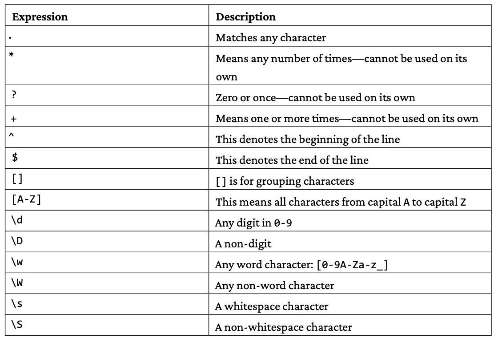

### Maps

Maps are more powerful data structures because they allow you to use indexes of various data types as keys to look up your data, as long as these keys are comparable. Comparable means that Go should be able to tell if two values are equal or which value is bigger (or smaller) than the other.

Although Boolean variables are comparable, it makes no sense to use a bool variable as the key to a map because it only allows for two distinct values. Additionally, although floating point values are comparable, precision issues caused by the internal representation of such values might create bugs and crashes, so you might want to avoid using floating point values as keys to maps.

You should make no assumptions about the order of the elements inside a map. Go randomizes keys when iterating over a map—this is done on purpose and is an intentional part of the language design.

Now, a very important detail: if you try to get the value of a key that does not exist in a map, Go will not complain about it and return the zero value of the data type of the value.

In real-world applications, if a function accepts a map argument, then it should check that the map is not nil before working with it.

### Structures

A structure has fields, and each field has its own data type. Two structures with the same fields will not be considered identical in Go if their fields are not in the same order.

Although you can embed a structure definition into another structure, it is generally a bad idea and should be avoided. If you even think about doing so, you might need to think about your design decisions. However, it is perfectly acceptable to have existing structs as types inside a struct.

Two ways exist to work with structure variables. The first one is as regular variables, and the second one is as pointer variables that point to the memory address of a structure. Both ways are equally good and are usually embedded into separate functions, because they allow you to initialize some or all of the fields of structure variables properly and/or do any other tasks you want before using the structure variable.

As a result, there exist two main ways to create a new structure variable using a function. The first one returns a regular structure variable whereas the second one returns a pointer to a structure. Each one of these two ways has two variations. The first variation returns a structure instance that is initialized by the Go compiler, whereas the second variation returns a structure instance that is initialized by the developer.

Additionally, you can create new structure instances using the `new()` keyword with statements such as `pS := new(Entry)`.

```go

package main

import "fmt"

// Knowning the data structures of a program is really important
// Programs = Data Structures + Algorithms
type Entry struct {
	Name    string
	Surname string
	Year    int
}

// Initialized by Go
func zeroS() Entry {
	return Entry{}
}

// Initialized by the user
func initS(N, S string, Y int) Entry {
	if Y < 2000 {
		return Entry{Name: N, Surname: S, Year: 2000}
	}
	return Entry{Name: N, Surname: S, Year: Y}
}

// Initialized by Go - returns pointer
func zeroPtoS() *Entry {
	t := &Entry{}
	return t
}

// Initialized by the user - returns pointer
func initPtoS(N, S string, Y int) *Entry {
	if len(S) == 0 {
		return &Entry{Name: N, Surname: "Unknown", Year: Y}
	}
	return &Entry{Name: N, Surname: S, Year: Y}
}

func main() {
	s1 := zeroS()
	p1 := zeroPtoS()
	fmt.Println("s1:", s1, "p1:", *p1)

	s2 := initS("Mihalis", "Tsoukalos", 2024)
	p2 := initPtoS("Mihalis", "Tsoukalos", 2024)
	fmt.Println("s2:", s2, "p2:", *p2)
	fmt.Println("Year:", s1.Year, s2.Year, p1.Year, p2.Year)
	pS := new(Entry)
	fmt.Println("pS:", pS)
}

/*
s1: {  0} p1: {  0}
s2: {Mihalis Tsoukalos 2024} p2: {Mihalis Tsoukalos 2024}
Year: 0 2024 0 2024
pS: &{  0}
*/
```

If no initial value is given to a variable, the Go compiler automatically initializes that variable to the zero value of its data type. For structures, this means that a structure variable without an initial value is initialized to the zero values of the data type of each one of its fields. Therefore, the `zeroS()` function returns a zero-initialized Entry structure.

The `new(Entry)` call returns a pointer to an Entry structure. As a rule of thumb, when you have to initialize lots of structure variables, it is considered good practice to create a function for doing so, as this is less error-prone.

### Regular expressions and pattern matching

The main and crucial difference between `regexp.Compile()` and `regexp.MustCompile()` is that the former returns a `*regexp.Regexp` pointer and an error variable, whereas the latter returns a `*regexp.Regexp` pointer only. As a result, if there is some kind of error in the parsing of the regular expression, `regexp.MustCompile()` is going to panic and therefore crash your program!

There are times when we want to find only those matches for a pattern that are followed or preceded by another given pattern. These kinds of operations are called lookahead and lookbehind, respectively. Go offers no support for either lookahead or lookbehind and will throw an error message when used. The general syntax of lookahead is `X(?=Y)`, which means, match X only if it is followed by Y.




