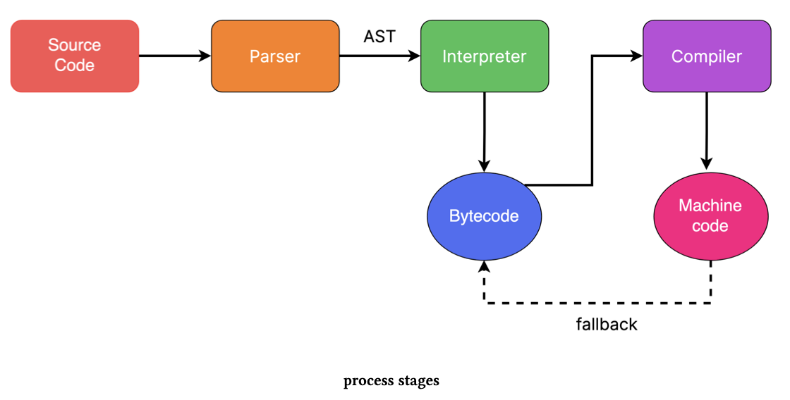

JavaScript is thought of as an “interpreted” language by many because of the nature of how it is executed, but calling JavaScript just an “interpreted” language is not entirely true.

In the case of compiled languages, compilers usually compile the source code and produce a binary executable file, which can then be distributed and executed.

On the other hand, in the case of interpreted languages, interpreters do not produce an executable output file; unlike compilers, which compile the source code ahead of time, interpreters read and execute code on the fly.

In the case of JavaScript, the JavaScript engines do not output an executable file, which is one of the reasons it is thought of as an interpreted language.

However, the JavaScript code is compiled into an intermediary form known as byte code, which is then executed by the virtual machine. The virtual machine interprets byte code, but modern JavaScript engines don’t just interpret the byte code; they include what’s known as the “Just-intime (JIT) compiler” to compile the byte code into native machine code, which is executed at a faster speed than the byte code.

### JIT Compiler

Just-in-time (JIT) compilation is a technique used by many modern JavaScript engines to increase the execution speed of the JavaScript code.

JavaScript code is converted into byte code, and the JavaScript engine then executes this byte code. However, modern JavaScript engines perform many optimizations to increase the performance of JavaScript code. These optimizations are performed based on the information collected by the engine while it is executing the code.

One way to optimize performance is to compile byte code into machine code, which executes faster than the byte code. The JavaScript engine identifies the “hot” parts of the code to do this - parts that are being executed frequently.

These “hot” parts of the code are then compiled into native machine code, and this machine code is then executed instead of the corresponding byte code.

So how is the JIT compiler different from a traditional compiler used by languages like C++? Unlike traditional compilers, which compile the code ahead of time, the JIT compiler compiles the code at runtime while the code is being executed.

While Javascript code is still distributed in source code format rather than executable format, it is compiled into byte code and possibly native machine code.

So, coming back to the question: is JavaScript a compiled or interpreted language? It is safe to say that it is both - compiled as well as an interpreted language.

### JavaScript Engine

To execute JavaScript code, we need another software known as a JavaScript engine. This engine contains all the necessary components to transform the code into something the machine can execute.

Different browser vendors typically create JavaScript engines; each major vendor has developed a JavaScript engine that executes the JavaScript code in their browser.

The following table shows some major browsers and their JavaScript engines. [Browser Engines… Chromium, V8, Blink? Gecko? WebKit?](https://medium.com/@jonbiro/browser-engines-chromium-v8-blink-gecko-webkit-98d6b0490968)

| Browser         | Engine                          |
| --------------- | ------------------------------- |
| Google Chrome   | V8                              |
| Edge            | Chakra (switched to V8 in 2020) |
| Mozilla Firefox | Spider Monkey                   |
| Safari          | JavaScriptCore                  |

The following image shows the high-level overview of the execution pipeline of the V8 engine:



#### Source Code

Before the JavaScript engine can begin its work, the source code needs to be downloaded from some source. This can either be from the network, a cache, or a service worker that pre-fetched the code.

The engine itself doesn’t have the capability to download the code. The browser does it and then passes it to the engine, which can then begin transforming it and eventually execute it.

#### Parser

After downloading the source code, the next step is to transform it into tokens. Think of this step as identifying different parts of the code; for example, the word “function” is one token that is identified as a “keyword.” Other tokens may include a string, an operator, etc. This process of dividing the code into tokens is done by a “scanner,” and this process is known as “**tokenization**.”

The following JavaScript code:

```js
function add(num1, num2) { 
  return num1 + num2; 
}
```

It can be tokenized as shown below:

```js
[ 
  { type: "keyword", value: "function" }, 
  { type: "identifier", value: "add" }, 
  { type: "openRoundParen", value: "(" }, 
  { type: "identifier", value: "num1" }, 
  { type: "identifier", value: "num2" }, 
  { type: "closeRoundParen", value: ")" }, 
  { type: "openCurlyParen", value: "{" }, 
  { type: "keyword", value: "return" }, 
  { type: "identifier", value: "num1" }, 
  { type: "addOperator", value: "+" }, 
  { type: "identifier", value: "num2" }, 
  { type: "closeCurlyParen", value: "}" } 
];
```

Once the tokens have been generated, the parser uses them to generate an [Abstract Syntax Tree (AST)](https://en.wikipedia.org/wiki/Abstract_syntax_tree), a set of objects that represent the structure of the source code. [AST Explorer](https://astexplorer.net/) is a cool website that you can use to visualize the AST.

#### Interpreter

