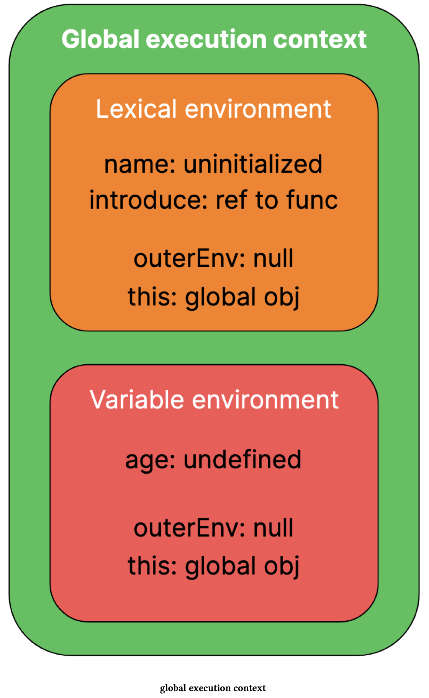

JavaScript is thought of as an “interpreted” language by many because of the nature of how it is executed, but calling JavaScript just an “interpreted” language is not entirely true.

In the case of compiled languages, compilers usually compile the source code and produce a binary executable file, which can then be distributed and executed.

On the other hand, in the case of interpreted languages, interpreters do not produce an executable output file; unlike compilers, which compile the source code ahead of time, interpreters read and execute code on the fly.

In the case of JavaScript, the JavaScript engines do not output an executable file, which is one of the reasons it is thought of as an interpreted language.

However, the JavaScript code is compiled into an intermediary form known as byte code, which is then executed by the virtual machine. The virtual machine interprets byte code, but modern JavaScript engines don’t just interpret the byte code; they include what’s known as the “Just-intime (JIT) compiler” to compile the byte code into native machine code, which is executed at a faster speed than the byte code.

### JIT Compiler

Just-in-time (JIT) compilation is a technique used by many modern JavaScript engines to increase the execution speed of the JavaScript code.

JavaScript code is converted into byte code, and the JavaScript engine then executes this byte code. However, modern JavaScript engines perform many optimizations to increase the performance of JavaScript code. These optimizations are performed based on the information collected by the engine while it is executing the code.

One way to optimize performance is to compile byte code into machine code, which executes faster than the byte code. The JavaScript engine identifies the “hot” parts of the code to do this - parts that are being executed frequently.

These “hot” parts of the code are then compiled into native machine code, and this machine code is then executed instead of the corresponding byte code.

So how is the JIT compiler different from a traditional compiler used by languages like C++? Unlike traditional compilers, which compile the code ahead of time, the JIT compiler compiles the code at runtime while the code is being executed.

While Javascript code is still distributed in source code format rather than executable format, it is compiled into byte code and possibly native machine code.

So, coming back to the question: is JavaScript a compiled or interpreted language? It is safe to say that it is both - compiled as well as an interpreted language.

### JavaScript Engine

To execute JavaScript code, we need another software known as a JavaScript engine. This engine contains all the necessary components to transform the code into something the machine can execute.

Different browser vendors typically create JavaScript engines; each major vendor has developed a JavaScript engine that executes the JavaScript code in their browser.

The following table shows some major browsers and their JavaScript engines. [Browser Engines… Chromium, V8, Blink? Gecko? WebKit?](https://medium.com/@jonbiro/browser-engines-chromium-v8-blink-gecko-webkit-98d6b0490968)

| Browser         | Engine                          |
| --------------- | ------------------------------- |
| Google Chrome   | V8                              |
| Edge            | Chakra (switched to V8 in 2020) |
| Mozilla Firefox | Spider Monkey                   |
| Safari          | JavaScriptCore                  |

The following image shows the high-level overview of the execution pipeline of the V8 engine:


#### Source Code

Before the JavaScript engine can begin its work, the source code needs to be downloaded from some source. This can either be from the network, a cache, or a service worker that pre-fetched the code.

The engine itself doesn’t have the capability to download the code. The browser does it and then passes it to the engine, which can then begin transforming it and eventually execute it.

#### Parser

After downloading the source code, the next step is to transform it into tokens. Think of this step as identifying different parts of the code; for example, the word “function” is one token that is identified as a “keyword.” Other tokens may include a string, an operator, etc. This process of dividing the code into tokens is done by a “scanner,” and this process is known as “**tokenization**.”

The following JavaScript code:

```js
function add(num1, num2) { 
  return num1 + num2; 
}
```

It can be tokenized as shown below:

```js
[ 
  { type: "keyword", value: "function" }, 
  { type: "identifier", value: "add" }, 
  { type: "openRoundParen", value: "(" }, 
  { type: "identifier", value: "num1" }, 
  { type: "identifier", value: "num2" }, 
  { type: "closeRoundParen", value: ")" }, 
  { type: "openCurlyParen", value: "{" }, 
  { type: "keyword", value: "return" }, 
  { type: "identifier", value: "num1" }, 
  { type: "addOperator", value: "+" }, 
  { type: "identifier", value: "num2" }, 
  { type: "closeCurlyParen", value: "}" } 
];
```

Once the tokens have been generated, the parser uses them to generate an [Abstract Syntax Tree (AST)](https://en.wikipedia.org/wiki/Abstract_syntax_tree), a set of objects that represent the structure of the source code. [AST Explorer](https://astexplorer.net/) is a cool website that you can use to visualize the AST.

#### Interpreter

The Bytecode Generator uses the AST produced by the parser to generate the bytecode. This generated bytecode is taken by the Bytecode Interpreter, which then interprets it.

#### Compiler

While the bytecode is executed, the JavaScript engine collects information about the code being executed. The engine then uses this information to optimize the code further.

For example, the JavaScript engine can identify the parts of code that are being executed frequently, also known as the “hot” parts of the code. The “hot” parts of the code are then compiled into native machine code to ensure that these parts get executed as fast as possible.

However, the optimized native machine code sometimes has to be deoptimized back to the bytecode generated by the Bytecode Generator because of the way the code was written.

The need for falling back to the bytecode arises from the fact that JavaScript is a dynamically typed11 language. The dynamic nature means that we can call a particular JavaScript function with different kinds of values.

Consider the following code:

```js
function print(obj) { 
  console.log(obj); 
}
```

The above function can be called with different “shapes” of objects.

```js
print({ a: 1, b: 2, c: 3 }); 
print({ a: 1, c: 3 }); 
print({ b: 2 });
```

This means that if the print function is called multiple times with objects with the following shape:

```js
{ a: 1, b: 2, c: 3 }
```

and if it is compiled to native machine code, but then if the same function is called with an object with a *different* shape, the JavaScript engine cannot use the optimized machine code and has to fall back to the bytecode.

The optimized native machine code is generated using the information collected during the execution of the JavaScript code. The native machine code requires certain checks to ensure that the assumptions made during the generation of the native machine code are not violated. If the checks fail, the JavaScript engine has to execute the bytecode instead of the native machine code. This process is called **deoptimization**.

Whenever any JavaScript code is executed, it is executed inside an environment. By “environment”, I mean everything that is accessible by the code that aids in its execution. For example, the value of this, variables in the current scope, function arguments, etc. This environment is known as the “Execution Context”. Every time any JavaScript code is executed, an execution context is created before its execution.

#### References:

[Understanding the V8 JavaScript Engine - (freeCodeCamp talk by Lydia Hallie)](https://www.youtube.com/watch?v=xckH5s3UuX4)

[How JavaScript Works: Under the Hood of the V8 Engine - (freeCodeCamp blog)](https://www.freecodecamp.org/news/javascript-under-the-hood-v8/) 

[What does V8’s ignition really do? - (stackoverflow post)](https://stackoverflow.com/questions/54957946/what-does-v8s-ignition-really-do)

[Ignition - an interpreter for V8 - (youtube video)](https://www.youtube.com/watch?v=r5OWCtuKiAk)

[Blazingly fast parsing, part 1: optimizing the scanner - (V8 blog)](https://v8.dev/blog/scanner)

[Overhead of Deoptimization Checks in the V8 JavaScript Engine - (paper by Dept. of Computer Engineering, University of California)](https://masc.soe.ucsc.edu/docs/iiswc16.pdf)

### Types of execution contexts

- Global execution context
- Function execution context

### Execution context phases

#### Creation phase

As the name suggests, the execution contexts (global and function) are created during the creation phase.

During this phase, the variable declarations and references to functions are saved as key-value pairs inside the execution context. The value of this and a reference to the outer environment are also set during this phase.

The values for variables are not assigned during the creation phase. However, variables that refer to functions do refer to functions during this phase. Variables declared using var are assigned undefined as their value during this phase, while variables declared using let or constants declared using const are left uninitialized.

In the case of a global context, there is no outer environment, so reference to the outer environment is set to null, but in the case of a function context, the value of this depends on how the function is called, so the value of this is set appropriately.

##### Lexical and Variable environments

During the creation phase, the following two components are created: 

- Lexical environment 
- Variable environment 

Lexical and Variable environments are structures that are used internally to hold key-value mappings of variables, functions, reference to the outer environment, and the value of this.

The difference between the lexical and variable environments is that the variable environment only holds the key-value mappings of variables declared with the var keyword, while function declarations and variables declared with let or constants declared using const are inside the lexical environment.

Consider the following code:

```js
let name = "Jane Doe"; 
var age = 20; 

function introduce(name, age) { 
  console.log("Hello, I am " + name + " and I am " + age + " years old"); 
}
```



#### Execution phase

As mentioned earlier, after the creation phase, different variables in the execution context are yet to be assigned their respective values. Assignments are done during the execution phase, and the code is finally executed.

#### References

[Understanding Execution Context and Execution Stack in Javascript - (blog)](https://blog.bitsrc.io/understanding-execution-context-and-execution-stack-in-javascript-1c9ea8642dd0 )

[JavaScript Execution Context – How JS Works Behind The Scenes - (freeCodeCamp blog)](https://www.freecodecamp.org/news/execution-context-how-javascript-works-behind-the-scenes/ )

[JavaScript Under The Hood - Execution Context - (youtube video)](https://www.youtube.com/watch?v=Fd9VaW0M7K4)

Different JavaScript engines may handle memory differently, and “primitives in javaScript simply go on the stack” is a misconception.

Currently, modern JavaScript engines use a **Mark-and-sweep algorithm**. This algorithm determines which blocks of memory are “unreachable”; such blocks of memory are considered eligible for garbage collection. This algorithm is an improvement over the **reference counting algorithm**, which has its limitations.


