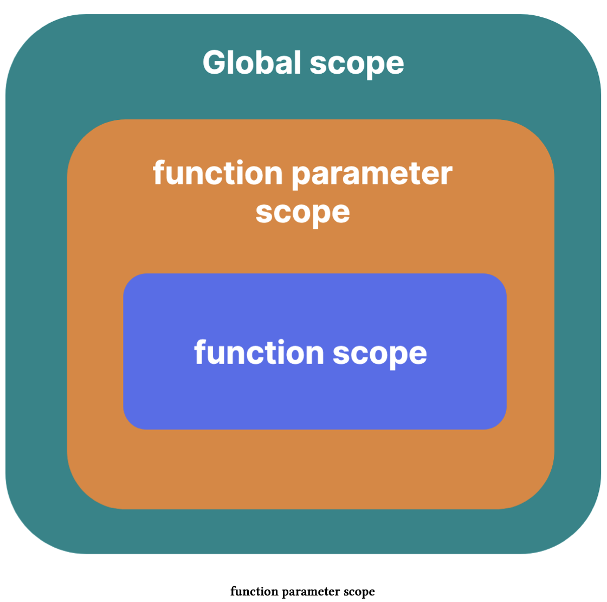

## Scope

Modern JavaScript has four main types of scopes that are mentioned below: 

- Global scope 
- Function scope 
- Block scope 
- Module scope 

Before discussing the above-mentioned types of scopes in JavaScript, we need to understand what “lexical” scope is.

### Lexical scope

In JavaScript, the scope of different identifiers (variables, functions, etc.) is determined at compile time. During compilation, the JavaScript engines determine the scope of different identifiers declared in the code by analyzing the code structure. This means that before the step-by-step execution of the JavaScript code starts, JavaScript engines determine the scopes of different declarations in the code.

This type of scope, which is determined at compile time by analyzing the code structure, is known as lexical scope. JavaScript is not the only language that has a lexical scope. Other languages, like Java, also have a lexical scope.

Lexical scope is also known as “static” scope. An alternative type of scope is [Dynamic scope](https://en.wikipedia.org/wiki/Scope_(computer_science)#Lexical_scope_vs._dynamic_scope).

In JavaScript, the global scope is the browser window or, more accurately, a browser window tab. The global scope is exposed to the JavaScript code using the window object.

Variables created using the var keyword or function declarations declared in the global scope are added as properties on the window object.

```js
var todoList = ["grocery", "exercise", "meeting"]; 

function emptyTodoList() { 
  todoList = []; 
} 

console.log(window.hasOwnProperty("todoList")); // true 
console.log(window.hasOwnProperty("emptyTodoList")); // true
```

If the todoList was declared with let or const, it wouldn’t have been added as a property on the window object, but it would still be a global variable. Similarly, if the emptyTodoList was a function expression instead of a function declaration, and if the identifier referring to this function expression was declared using let or const, it also wouldn’t be part of the window object as its property. Instead, it would just be a global function expression.

```js
const todoList = ["grocery", "exercise", "meeting"]; 

let emptyTodoList = function () { 
  todoList = []; 
}; 

console.log(window.hasOwnProperty("todoList")); // false 
console.log(window.hasOwnProperty("emptyTodoList")); // false
```

### Implicit globals

JavaScript as a language has many quirks. One of those is the implicit creation of global variables. Whenever there is an assignment to an undeclared variable, JavaScript will declare that undeclared variable as a global variable. This is most likely a mistake by the programmer, and instead of throwing an error, javaScript hides this by automatically declaring a global variable by the same name.

```js
function printSquare(num) { 
  result = num * num;  // result variable is not declared
  console.log(result); 
} 

printSquare(8); 

console.log("implicit global: " + result); // implicit global: 64
```

It is important to mention that this weird behavior only happens in non-strict mode.

There is another type of implicit global variable, see this: [Do DOM tree elements with IDs become global properties?](https://stackoverflow.com/questions/3434278/do-dom-tree-elements-with-ids-become-global-properties) 

### Shadowing declarations

Declarations inside a nested scope can “shadow” the declarations with the same name in the outer scope. This is referred to as “shadowing declaration” or simply “shadowing.”

```js
let hobby = "reading"; 

function printHobbies() { 
  const hobby = "traveling"; 
  console.log(hobby); // traveling 
} 

printHobbies();
```

It is generally not ideal to shadow other declarations because that can reduce the readability of the code. It could also make it impossible for code inside the nested scope to access the shadowed declarations.

Recall that the `var` declarations in the global scope are added as properties on the `window` object. So, if the global `hobby` variable was declared using the `var` keyword, we could have used `window.hobby` to access the shadowed variable.

### Function parameter scope

First, we need to differentiate between “simple” and “non-simple” parameter lists. If the function parameters are defined in such a way that they use ES2015+ features like **Default parameters**, **Destructuring**, or **Rest parameters**, such parameters are considered to be non-simple parameters; if the parameters don’t use any of these features, they are considered to be simple parameters.

If the parameters are simple, they behave like they are declared in the function’s local scope, but if the parameters are non-simple, they are declared in their own scope. Non-simple parameter scope can be thought of as between the function scope and the scope containing the function.

If the function with non-simple parameters is defined in the global scope, its parameter scope can be conceptually visualized as shown in the image below:



The following code example proves that the non-simple parameters indeed exist in a different scope than the function’s local scope:

```js
function paramScope(arr = ["initial array"], buff = () => arr) { 
  var arr = [1, 2, 3]; 
  console.log(arr); // [1, 2, 3] 
  console.log(buff()); // ["initial array"] 
} 

paramScope();
```

The arr parameter and the arr variable inside the function are two different variables that exist in two different scopes. The arr inside the function shadows the arr parameter, but calling the buff function returns the parameter arr. If the parameter and the local arr were the same variable, the buff function would return [1, 2, 3] instead of the default value of the arr parameter.

Remove the var keyword inside the function to show the different output:

```js
function paramScope(arr = ["initial array"], buff = () => arr) { 
  arr = [1, 2, 3]; 
  console.log(arr); // [1, 2, 3] 
  console.log(buff()); // [1, 2, 3] 
} 

paramScope();
```

### Function expression name scope

The function expressions are mostly written as an anonymous function expression, as shown below:

```js
let fn = function () { 
  // code ...
};
```

We can also write a named function expression as shown below:

```js
let fn = function namedFn() { 
  // code ...
};
```

In the code example above, the name of the function expression namedFn is only accessible inside the function body. As a result, some might incorrectly believe that the name of a named function expression is declared inside the function body, but that is not correct; the name is declared in a different scope. The following code proves this claim:

```js
let fn = function namedFn() { 
  let namedFn = 123; 
  console.log(namedFn); 
};
```

The let doesn’t allow the re-declaration of a variable. So if the nameFn was declared inside the function scope, then the code example above should have thrown an error; instead, there is no error, and this is valid code. The nameFn inside the function body is actually shadowing the name of the function expression.

Named function expression’s name scope is nested between the scope containing the function expression and the function expression’s local scope, similar to the scope of the non-simple parameter list discussed above.

### Block Scope

Prior to the addition of block-scoped let and const in the JavaScript language, variables defined with the var keyword in a block were accessible outside that block. This is because the variables declared with the var keyword have function scope. However, the variables declared using let, or the constants declared using const are scoped to the block in which they are defined unless they are declared in the global scope, which makes them global variables.

The block-scoped let and const solve problems like unnecessary exposure of variables outside blocks, closure inside loops, etc.