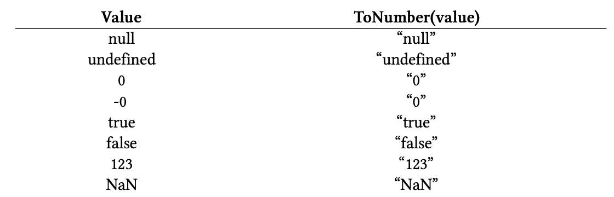

## Coercion

Coercion in JavaScript is the conversion of one type of value into another type of value. MDN defines coercion as: 

> Type coercion is the automatic or implicit conversion of values from one data type to another (such as strings to numbers).

According to MDN’s definition, if the conversion of values is **implicit**, then it is **coercion**, whereas **type conversion** can either be **implicit** or **explicit**.

The ECMAScript specification has documented several mechanisms that are used by the JavaScript language to convert one type of value into another type of value. These mechanisms are known as “**abstract operations**”; abstract in the sense that these are not some real functions that can be referred to or called by the JavaScript code; instead, they are just algorithmic steps internally used by the language to perform type conversion.

There are many [abstract operations](https://262.ecma-international.org/13.0/#sec-abstract-operations) mentioned in the ECMAScript specification, but some of the common ones that come into play when dealing with coercion are mentioned below:

- ToPrimitive 
- ToNumber 
- ToString 
- ToBoolean

### ToPrimitive

The `ToPrimitive` abstract operation is used to convert an object to a primitive value. This operation takes two arguments: 

- `input`: an object that should be converted into a primitive value 
- `preferredType`: an optional second argument that specifies the type that should be favored when converting an object into a primitive value

#### OrdinaryToPrimitive

This operation invokes another abstract operation known as `OrdinaryToPrimitive` to do the actual conversion, and it also takes two arguments: 

- `O`: an object that should be converted into a primitive value 
- `hint`: a type that should be favored when converting an object to a primitive value

`ToPrimitive` abstract operation invokes the `OrdinaryToPrimitive` abstract operation, passing in the object, that is to be converted into a primitive value, as the first argument, and the second argument hint is set based on the value of `preferredType` argument as described below: 

- If the `preferredType` is “string”, set `hint` to string 
- If the `preferredType` is a “number”, set `hint` to the number 
- If `preferredType` is not specified, set `hint` to the number 

Each object in JavaScript inherits the following two methods from the object that sits at the top of the inheritance hierarchy, i.e., the `Object.prototype` object: 

- `toString()` 
- `valueOf()`

##### toString( )

```js
const obj = { a: 123 }; 
obj.toString(); // [object Object]
```

As the default implementation of the toString method is not useful at all, different objects override this method to make its output more useful. The built-in `Date` object, for example, when converted to a string, outputs a human-readable string representation of the date:

```js
new Date().toString(); // Sat Feb 04 2023 20:44:23 GMT+0500
```

##### valueOf( )

The `valueOf` method is used to convert an object into a primitive value. The default implementation of this method, like the `toString` method, is useless, as it just returns the object on which this method is called.

```js
const arr = []; 
arr.valueOf() === arr; // true
```

It is meant to be overridden by other objects. Many built-in objects override this method. For example, for the `Date` objects, this method returns the number of milliseconds since midnight 01 January 1, 1970 UTC.

```js
new Date().valueOf(); // 1675526929129
```

The `OrdinaryToPrimitive` abstract operation invokes the `toString` and the `valueOf` methods to convert an object into a primitive value. Among these two methods, in some cases, only one of them is called; in other cases, both of them are called.

The `hint` argument received by the `OrdinaryToPrimitive` abstract operation determines which of these two methods is called first.

#### Prefer string

If the `hint` argument is “string”, then the `OrdinaryToPrimitive` abstract operation first invokes the `toString` method on the object. If the `toString` method returns a primitive value, **even if that primitive value is not of the string type**, then that primitive value is used as a primitive representation of the object.

If the `toString` method doesn’t exist or doesn’t return a primitive value, then the `valueOf` method is invoked. If the valueOf method returns a primitive value, then that value is used; otherwise, a `TypeError` is thrown, indicating that the object couldn’t be converted to a primitive value.

```js
const obj = { 
  toString() { 
    console.log("toString invoked"); 
    return "hello world"; 
  }, 
  valueOf() { 
    console.log("valueOf invoked"); 
    return 123; 
  } 
}; 

console.log(`${obj}`); 

// toString invoked 
// hello world
```

In the above code example, we have an object containing overridden implementations of the `toString` and the `valueOf` method. At the end of the code example, we are trying to log obj, embedded in a template literal, to the console. In this case, the obj will be converted into a string.

As discussed above, when the hint argument of the `OrdinaryToPrimitive` abstract operation is “string”, the `toString` method is invoked to convert an object into a primitive value, preferably into a value of string type.

As the `toString` implementation of the obj object is returning a string primitive value, the `valueOf` method is not invoked, and the object-to-primitive conversion process for the obj object is complete at this point. The primitive value returned by the `toString` method of the obj object is used by the template literal.

But it was mentioned above that the value returned by the `toString` method can be of non-string primitive type. The following code example verifies this claim:

```js
const obj = { 
  toString() { 
    console.log("toString invoked"); 
    return true; 
  }, 
  valueOf() { 
    console.log("valueOf invoked"); 
    return 123; 
  } 
}; 

console.log(`${obj}`); 

// toString invoked 
// true
```

The `toString` method in the above code example returns a boolean (non-string) primitive value. Instead of invoking the `valueOf` method or converting the non-string return value of the `toString` method into a string value, the boolean value is accepted as the primitive representation of the obj object.

The next case we need to verify is what happens if the `toString` method doesn’t return a primitive value. The following code example demonstrates this case:

```js
const obj = { 
  toString() { 
    console.log("toString invoked"); 
    return []; 
  }, 
  valueOf() { 
    console.log("valueOf invoked"); 
    return 123; 
  } 
}; 

console.log(`${obj}`); 

// toString invoked 
// valueOf invoked 
// 123
```

As explained earlier, if the `toString` method doesn’t return a primitive value, the `valueOf` method will be invoked to get a primitive representation of the object. In the code example above, the `toString` method returns an empty array of an object type; as a result, the `valueOf` method is invoked.

The `valueOf` method is invoked even if the `toString` is not defined for an object. The following code example shows this behavior:

```js
const obj = { 
  toString: undefined, 
  valueOf() { 
    console.log("valueOf invoked"); 
    return 123; 
  } 
}; 

console.log(`${obj}`); 

// valueOf invoked 
// 123
```

The last case we need to verify is what happens when JavaScript can’t get a primitive value, even after invoking the `toString` and the `valueOf` method.

```js
const obj = { 
  toString() { 
    console.log("toString invoked"); 
    return []; 
  }, 
  valueOf() { 
    console.log("valueOf invoked"); 
    return []; 
  } 
}; 

console.log(`${obj}`); 

// toString invoked 
// valueOf invoked 
// Uncaught TypeError: Cannot convert object to primitive value
```

When JavaScript can’t get a primitive value after invoking both methods, a `TypeError` is thrown, indicating that the object couldn’t be converted into a primitive value. So, it is important to remember when overriding these methods that at least one of them should return a primitive value.

#### Prefer number

If the hint argument is “number”, then the `OrdinaryToPrimitive` abstract operation first invokes the `valueOf` method and then the `toString` method, if needed.

```js
const obj = { 
  toString() { 
    console.log("toString invoked"); 
    return "hello"; 
  }, 
  valueOf() { 
    console.log("valueOf invoked"); 
    return 123; 
  } 
}; 

console.log(obj + 1); 

// valueOf invoked 
// 124
```

So when JavaScript gets an object in a context where it expects a number, it tries to coerce the object into a primitive type, preferably into a number type.

In this case, the `hint` argument passed to the `OrdinaryToPrimitive` abstract operation is “number”; as a result, the `valueOf` method is invoked first. Since it returned a primitive value, there is no need to invoke the `toString` method.

#### No preference

When the `ToPrimitive` abstract operation is called without the preferred type or hint, or if the `hint` is set to “default”, then this operation generally behaves as if the `hint` were “number”. So, by default, the `ToPrimitive` prefers the conversion to number type.

However, the objects can override this default `ToPrimitive` behavior by implementing the `Symbol.toPrimitive` function. This function is passed a preferred type as an argument, and it returns the primitive representation of the object.

```js
const obj = { 
  [Symbol.toPrimitive](hint) { 
    if (hint === "string") { 
      return "hello"; 
    } else { 
      return 123; 
    } 
  } 
}; 

console.log(`${obj}`); // hello 
console.log(obj + 1); // 124
```

Out of the built-in objects, only the `Date` and `Symbol` objects override the default behavior of the `ToPrimitive` abstract operation. The `Date` objects implement the default behavior as if the preferred type or hint is “string.”

```js
new Date()[Symbol.toPrimitive]("default"); // Tue Feb 07 2023 23:47:42 GMT+0500
```

We rarely need to call the `Symbol.toPrimitive` function explicitly. JavaScript calls this function automatically when it needs to convert an object into a primitive value.


### ToNumber


As far as objects are concerned, the `ToNumber` abstract operation first converts the object into a primitive value using the `ToPrimitive` abstract operation with “number” as the preferred type, and then the resulting value is converted into a number.

The `BigInt` values allow explicit conversion into a number type, but the implicit conversion is not allowed; implicit conversion throws a `TypeError`.

```js
console.log(Number(10n)); // 10 
console.log(+10n); // Uncaught TypeError: Cannot convert a BigInt value to a number
```

### ToString



In the case of objects, the `ToString` abstract operation first converts the object into a primitive value using the `ToPrimitive` abstract operation with “string” as the preferred type, and then the resulting value is converted into a string.

### ToBoolean

Unlike the above-mentioned abstract operations, this operation is simply a lookup of whether a value is a **falsy** value. If it is, we get false as a return value; for all other values, this operation returns true.

The following is a list of falsy values: 

- false 
- 0, -0, 0n 
- undefined 
- null 
- NaN 
- ””

### Summary of abstract equality operator

The working of the double equals operator is roughly summarized in the steps below: 

- If the values being compared are of the same type, then perform the **strict equality comparison**.
- If one value is `undefined` or `null` and the other value is also `undefined` or `null`, return true.
- If one or both values are objects, they are converted into primitive types, preferring the number type.
- If both values are primitives but are of different types, convert the types until they match, preferring the number type for coercing values.

#### null vs undefined

The fact that `null` and `undefined` are equal to each other according to the abstract equality operator makes for an interesting use case of the abstract equality operator. When writing JavaScript code, it is common to check if a value is neither `null` nor `undefined`.

With the strict equality operator, we will have a check that looks something like the following:

```js
if (someVal !== null && someVal !== undefined) { 
  // code 
}
```

Whereas with the abstract equality operator, we can shorten this check to just one condition:

```js
if (someVal != null) { 
  // code
} 

// or 

if (someVal != undefined) { 
  // code 
}
```

#### “if” conditions

```js
const someVal = {}; 

if (someVal == true) { 
  console.log("if"); 
} else { 
  console.log("else"); 
}
```

We know from an earlier lesson that objects are **truthy** values. So, in the above code example, it seems reasonable to assume that the if condition would be evaluated as true, leading to the execution of the `if` block. But, if you execute the above code, you might be surprised to know that instead of the `if` block, the `else` would execute because the `someVal == true` check would evaluate to false.

If either operand of the abstract equality operator is a boolean value, it is first converted to a number - `false` into `0` and `true` into `1`. So the `if` condition in the above code example would be evaluated as follows: 

1. One operand is an object, and the other one is a boolean, so according to **step 10** of the [isLooselyEqual](https://tc39.es/ecma262/multipage/abstract-operations.html#sec-islooselyequal) abstract operation, if one operand is a boolean value, convert it into a number using the `ToNumber` abstract operation. So our condition would become:  `someVal == 1;` 
1. After coercing a boolean value into a number, we have a comparison between an object and a number. According to **step 12** of the `isLooselyEqual` abstract operation, the object `someVal` would be converted into a primitive value using the `ToPrimitive` abstract operation, passing “number” as the preferred type. The default primitive representation of object literals is `"[object Object]"`, so our condition after coercion would become: `js "[object Object]" == 1;` 
1. Now, we have a comparison between a string and a number. According to **step 6** of the `isLooselyEqual` abstract operation, if one operand is a string and the other one is a number, convert a string into a number. Converting `"[object Object]"` into a number will give us `NaN`. So our condition would become:  `NaN == 1;` 
1. After coercing three times, we have a comparison between a `NaN` value and a number. They are not equal to each other. (`NaN` value is not equal to any other value, including itself.). So our condition fails to evaluate as `true`.

In such cases where we want to check if a value is truthy or falsy, instead of using the abstract equality operator, it is enough to take advantage of the coercive behavior of the if statement. What I mean is that the if condition in the above code should be written as:

```js
if (someVal) {
  // code
}
```

So, as a piece of advice, avoid checks such as `someVal == true`, where one operand is a boolean value. In such cases, take advantage of the implicit coercive nature of the if statement, which will check if the value is a valid value or not.

### Relational operators

`0 == false` 

> 1. As the types are not equal and one of the operands is a boolean, the boolean operand is converted into a number using the `ToNumber` abstract operation. So, the first coercive step is to convert false into a number, i.e., 0. The expression becomes:  `0 == 0` .
> 2. Now the types are equal, so the strict equality comparison is performed, i.e., `0 === 0`, giving us `true` as an output.

`"" == false`

> 1. As the types are not equal and one of the operands is a boolean, the boolean operand is converted into a number using the `ToNumber` abstract operation. So, the first coercive step is to convert false into a number, i.e., 0. The expression becomes: `"" == 0` 
> 2. Now, we have a string and a number. Recall that the abstract equality operator prefers number comparison, so the string operand is converted into a number using the `ToNumber` abstract operation. An empty string, when converted into a number, outputs 0. So the expression becomes: `0 == 0`
> 3. The types are equal, so the strict equality comparison is performed, i.e., `0 === 0`, giving us `true` as an output.

`0 == []`

> 1. The array is converted into a primitive value using the `ToPrimitive` abstract operation. As the abstract equality operator prefers number comparison, the array is converted into a primitive value with a number as the preferred type. An empty array, when converted into a primitive value, outputs an empty string. So the expression becomes: `0 == ""` 
> 2. Next, the string will be converted into a number. An empty string converted into a number outputs 0. So the expression becomes: `0 == 0` 
> 3. The types are equal, so the strict equality comparison is performed, i.e., `0 === 0`, giving us `true` as an output.

`[123] == 123`

> 1. We have a comparison between an array and a number. So, the array is converted into a primitive value using the `ToPrimitive` abstract operation, with number as the preferred type. The `valueOf` method will be invoked first, as the preferred type is a number. But we know that the default implementation of the `valueOf` method simply returns the object on which it is called. So, the `toString` is invoked next. For Arrays, the `toString` method returns an empty string for empty arrays; for an array like `[1, 2, 3]`, it returns the contents of the array as a string, joined by commas, i.e., `"1,2,3"`. Each array element is coerced into a string and then joined by comma(s). In our case, we have a single element in an array, i.e., `[123]`, so it will be coerced into `"123"`. So the expression becomes: `"123" == 123` 
> 2. Next, the string will be converted into a number. So the expression becomes: `123 == 123` 
> 3. The types are equal, so the strict equality comparison is performed, i.e., `123 === 123`, giving us `true` as an output.

**Note**: Weird fact about array conversion into a primitive value: an array containing `null` or `undefined` is coerced into an empty string, i.e., `[null]` —> `""` and `[undefined]` —> `""`. Similarly, an array containing both of them is coerced into a string containing a single comma, i.e., `[null, undefined]` —> `","`. Why don’t we get `"null"`, `"undefined"`, and `"null,undefined"` for such arrays, respectively? This is just one of the corner cases of coercion.

`[1] < [2]`

> 1. This is a comparison between two objects. Both arrays are converted into primitive values using the `ToPrimitive` abstract operation, with number as the preferred type. As explained in the previous example, the `toString` will eventually be called to convert both arrays into primitive values, giving us `"1"` and `"2"` as output, respectively. So the expression becomes: `"1" < "2"` 
> 2. Now, we have two strings. The types are equal, so the strict equality comparison is performed, i.e., `"1" < "2"`, giving us `true` as an output because the strings are compared using their Unicode code points.

`[] == ![]`

> 1. In this comparison, we have two operators: the abstract equality operator and the Not (`!`) operator. The Not operator has a higher precedence than the equality operator, so the subexpression `![]` is evaluated first. The Not operator converts true into false, and vice versa. But here it is used with a non-boolean value. So what happens when JavaScript sees a value of one type in a context where it expects a value of a different type? Coercion! So `[]` will be coerced into a boolean value, as boolean is the expected type, using the `ToBoolean` abstract operation. As `[]` is a **truthy** value, it is coerced into `true` and then the Not operator negates it, converting `true` into `false`. So the expression becomes: `[] == false` 
> 2. Next, the boolean operand, i.e., `false` is converted into a number, i.e., 0. The expression is now: `[] == 0` 
> 3. Now we have a comparison between an object and a number. Recalling how the abstract equality operator works, the object will be converted into a primitive value, preferring the number type. As mentioned in one of the earlier examples, an empty array is converted into an empty string, so the expression becomes: `"" == 0` 
> 4. Next, the empty string is converted into a number, i.e., 0, using the `ToNumber` abstract operation: `0 == 0` 
> 5. The types are equal, so the strict equality comparison is performed, i.e., `0 === 0`, giving us `true` as an output.

`!!"true" == !!"false"`

> 1. Again, we have two operators in an expression. As mentioned before, the precedence of the logical Not operator is higher, so the sub-expressions `!!"true"` and `!!"false"` will be evaluated first. The string `"true"` in the expression `!!"true"` is a **truthy** value, so it will be coerced to the boolean value `true`. So the expression will become `!!true`. Next, we have two occurrences of the Not operator. Applying it twice to `true` will first convert it to `false` and then back to `true`. The second sub-expression `!!"false"` will also evaluate to true because the string `"false"` is a **truthy** value, so same as the first sub-expression, the expression will become `!!true` and then applying the Not operator twice will give us `true`. So after the sub-expressions have been coerced and evaluated, our expression will become: `true == true` 
> 2. The types are equal, so the strict equality comparison is performed, i.e., `true === true`, giving us `true` as an output.

`[1, 2, 3] + [4, 5, 6]`

> 1. Recall how the addition operator works. The abstract operation involved here is [ApplyStringOrNumericBinaryOperator](https://tc39.es/ecma262/multipage/ecmascript-language-expressions.html#sec-applystringornumericbinaryoperator). As both of the operands are objects, they are first converted into primitive values with no preferred type specified for the `ToPrimitive` abstract operation. So, by default, “number” is the preferred type. Arrays, when coerced into primitive values, are converted into primitive values using the `toString` method. For the array that we have in our expression, we will get `"1,2,3"` and `"4,5,6"` respectively. So the expression becomes: `"1,2,3" + "4,5,6"` 
> 2. As both operands, after coercion, are strings, instead of addition, concatenation is performed, joining both strings, giving us `"1,2,34,5,6"` as output.

`[undefined] == 0`

> 1. As we have seen many times in this lesson when there is a comparison between an object and a number using the abstract equality operator, the object is first converted into a primitive value. Recall from a note earlier in this lesson that `[undefined]`, when converted into a primitive value, outputs an empty string. So the expression becomes: `"" == 0` 
> 2. An empty string, when converted into a number, gives us 0. So the expression becomes: `0 == 0` 
> 3. The types are equal, so the strict equality comparison is performed, i.e., `0 === 0`, giving us `true` as an output.

`[[]] == ''`

> 1. In this expression, we have an array containing an empty array and an empty string. The array operand is first converted into a primitive value. Recall how arrays are converted into primitive values. Apart from some corner cases mentioned earlier, arrays are converted into primitives by coercing their elements into strings and then joining them using commas. So, the nested empty array will be converted into a primitive value. What do we get when an empty array is converted into a primitive value? Yes, an empty string. So, the outer array is also converted into an empty string. The expression after coercion becomes: `"" == ""` 
> 2. An empty string is equal to an empty string, so the output is `true`.

`[] + {}`

> 1. As the operator is an addition operator and both operands are objects, they are both converted into primitives with no preferred type. So, by default, the preferred type is set to “number”. An empty array is converted into an empty string, and the default primitive representation of object literals is the string `"[object Object]"`. So the expression becomes: `"" + "[object Object]"` 
> 2. Both operands are now strings that are concatenated, giving us `“[object Object]”` as an output.

Check out more examples: [wtfjs](https://github.com/denysdovhan/wtfjs)

