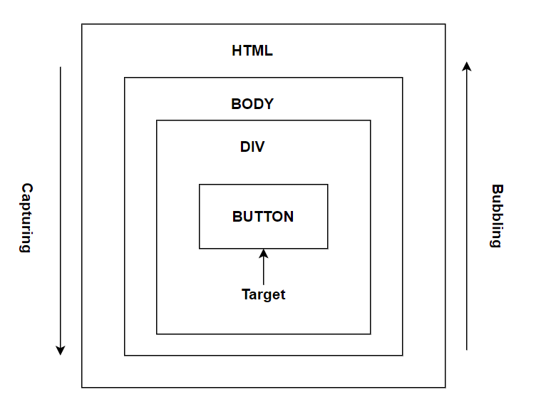

401. ### What is RxJS

     RxJS (Reactive Extensions for JavaScript) is a library for implementing reactive programming using observables that makes it easier to compose asynchronous or callback-based code. It also provides utility functions for creating and working with observables.

     **[⬆ Back to Top](#table-of-contents)**

402. ### What is the difference between Function constructor and function declaration

     The functions which are created with `Function constructor` do not create closures to their creation contexts but they are always created in the global scope. i.e, the function can access its own local variables and global scope variables only. Whereas function declarations can access outer function variables(closures) too.

     Let's see this difference with an example,

     **Function Constructor:**

     ```javascript
     var a = 100;
     function createFunction() {
       var a = 200;
       return new Function("return a;");
     }
     console.log(createFunction()()); // 100
     ```

     **Function declaration:**

     ```javascript
     var a = 100;
     function createFunction() {
       var a = 200;
       return function func() {
         return a;
       };
     }
     console.log(createFunction()()); // 200
     ```

     **[⬆ Back to Top](#table-of-contents)**

403. ### What is a Short circuit condition

     Short circuit conditions are meant for condensed way of writing simple if statements. Let's demonstrate the scenario using an example. If you would like to login to a portal with an authentication condition, the expression would be as below,

     ```javascript
     if (authenticate) {
       loginToPorta();
     }
     ```

     Since the javascript logical operators evaluated from left to right, the above expression can be simplified using && logical operator

     ```javascript
     authenticate && loginToPorta();
     ```

     **[⬆ Back to Top](#table-of-contents)**

404. ### What is the easiest way to resize an array

     The length property of an array is useful to resize or empty an array quickly. Let's apply length property on number array to resize the number of elements from 5 to 2,

     ```javascript
     var array = [1, 2, 3, 4, 5];
     console.log(array.length); // 5

     array.length = 2;
     console.log(array.length); // 2
     console.log(array); // [1,2]
     ```

     and the array can be emptied too

     ```javascript
     var array = [1, 2, 3, 4, 5];
     array.length = 0;
     console.log(array.length); // 0
     console.log(array); // []
     ```

     **[⬆ Back to Top](#table-of-contents)**

405. ### What is an observable

     An Observable is basically a function that can return a stream of values either synchronously or asynchronously to an observer over time. The consumer can get the value by calling `subscribe()` method.
     Let's look at a simple example of an Observable

     ```javascript
     import { Observable } from "rxjs";

     const observable = new Observable((observer) => {
       setTimeout(() => {
         observer.next("Message from a Observable!");
       }, 3000);
     });

     observable.subscribe((value) => console.log(value));
     ```

     

     **Note:** Observables are not part of the JavaScript language yet but they are being proposed to be added to the language

     **[⬆ Back to Top](#table-of-contents)**

406. ### What is the difference between function and class declarations

     The main difference between function declarations and class declarations is `hoisting`. The function declarations are hoisted but not class declarations.

     **Classes:**

     ```javascript
     const user = new User(); // ReferenceError

     class User {}
     ```

     **Constructor Function:**

     ```javascript
     const user = new User(); // No error

     function User() {}
     ```

     **[⬆ Back to Top](#table-of-contents)**

407. ### What is an async function

     An async function is a function declared with the `async` keyword which enables asynchronous, promise-based behavior to be written in a cleaner style by avoiding promise chains. These functions can contain zero or more `await` expressions.

     Let's take a below async function example,

     ```javascript
     async function logger() {
       let data = await fetch("http://someapi.com/users"); // pause until fetch returns
       console.log(data);
     }
     logger();
     ```

     It is basically syntax sugar over ES2015 promises and generators.

     **[⬆ Back to Top](#table-of-contents)**

408. ### How do you prevent promises swallowing errors

     While using asynchronous code, JavaScript’s ES6 promises can make your life a lot easier without having callback pyramids and error handling on every second line. But Promises have some pitfalls and the biggest one is swallowing errors by default.

     Let's say you expect to print an error to the console for all the below cases,

     ```javascript
     Promise.resolve("promised value").then(function () {
       throw new Error("error");
     });

     Promise.reject("error value").catch(function () {
       throw new Error("error");
     });

     new Promise(function (resolve, reject) {
       throw new Error("error");
     });
     ```

     But there are many modern JavaScript environments that won't print any errors. You can fix this problem in different ways,

     1. **Add catch block at the end of each chain:** You can add catch block to the end of each of your promise chains

        ```javascript
        Promise.resolve("promised value")
          .then(function () {
            throw new Error("error");
          })
          .catch(function (error) {
            console.error(error.stack);
          });
        ```

        But it is quite difficult to type for each promise chain and verbose too.

     2. **Add done method:** You can replace first solution's then and catch blocks with done method

        ```javascript
        Promise.resolve("promised value").done(function () {
          throw new Error("error");
        });
        ```

        Let's say you want to fetch data using HTTP and later perform processing on the resulting data asynchronously. You can write `done` block as below,

        ```javascript
        getDataFromHttp()
          .then(function (result) {
            return processDataAsync(result);
          })
          .done(function (processed) {
            displayData(processed);
          });
        ```

        In future, if the processing library API changed to synchronous then you can remove `done` block as below,

        ```javascript
        getDataFromHttp().then(function (result) {
          return displayData(processDataAsync(result));
        });
        ```

        and then you forgot to add `done` block to `then` block leads to silent errors.

     3. **Extend ES6 Promises by Bluebird:**
        Bluebird extends the ES6 Promises API to avoid the issue in the second solution. This library has a “default” onRejection handler which will print all errors from rejected Promises to stderr. After installation, you can process unhandled rejections

        ```javascript
        Promise.onPossiblyUnhandledRejection(function (error) {
          throw error;
        });
        ```

        and discard a rejection, just handle it with an empty catch

        ```javascript
        Promise.reject("error value").catch(function () {});
        ```

     **[⬆ Back to Top](#table-of-contents)**

409. ### What is deno

     Deno is a simple, modern and secure runtime for JavaScript and TypeScript that uses V8 JavaScript engine and the Rust programming language. It solves the inherent problems of Node.Js and has been officially released in May 2018. Unlike Node.JS, by default Deno executes the code in a sandbox, which means that runtime has no access to below areas:

     1. The file system
     2. The network
     3. Execution of other scripts
     4. The environment variables

     **[⬆ Back to Top](#table-of-contents)**

410. ### How do you make an object iterable in javascript

     By default, plain objects are not iterable. But you can make the object iterable by defining a `Symbol.iterator` property on it.

     Let's demonstrate this with an example,

     ```javascript
     const collection = {
       one: 1,
       two: 2,
       three: 3,
       [Symbol.iterator]() {
         const values = Object.keys(this);
         let i = 0;
         return {
           next: () => {
             return {
               value: this[values[i++]],
               done: i > values.length,
             };
           },
         };
       },
     };

     const iterator = collection[Symbol.iterator]();

     console.log(iterator.next()); // → {value: 1, done: false}
     console.log(iterator.next()); // → {value: 2, done: false}
     console.log(iterator.next()); // → {value: 3, done: false}
     console.log(iterator.next()); // → {value: undefined, done: true}
     ```

     The above process can be simplified using a generator function,

     ```javascript
     const collection = {
       one: 1,
       two: 2,
       three: 3,
       [Symbol.iterator]: function* () {
         for (let key in this) {
           yield this[key];
         }
       },
     };
     const iterator = collection[Symbol.iterator]();
     console.log(iterator.next()); // {value: 1, done: false}
     console.log(iterator.next()); // {value: 2, done: false}
     console.log(iterator.next()); // {value: 3, done: false}
     console.log(iterator.next()); // {value: undefined, done: true}
     ```

     **[⬆ Back to Top](#table-of-contents)**

411. ### What is a Proper Tail Call

     First, we should know about tail call before talking about "Proper Tail Call". A tail call is a subroutine or function call performed as the final action of a calling function. Whereas **Proper tail call(PTC)** is a technique where the program or code will not create additional stack frames for a recursion when the function call is a tail call.

     For example, the below classic or head recursion of factorial function relies on stack for each step. Each step need to be processed upto `n * factorial(n - 1)`

     ```javascript
     function factorial(n) {
       if (n === 0) {
         return 1;
       }
       return n * factorial(n - 1);
     }
     console.log(factorial(5)); //120
     ```

     But if you use Tail recursion functions, they keep passing all the necessary data it needs down the recursion without relying on the stack.

     ```javascript
     function factorial(n, acc = 1) {
       if (n === 0) {
         return acc;
       }
       return factorial(n - 1, n * acc);
     }
     console.log(factorial(5)); //120
     ```

     The above pattern returns the same output as the first one. But the accumulator keeps track of total as an argument without using stack memory on recursive calls.

     **[⬆ Back to Top](#table-of-contents)**

412. ### How do you check an object is a promise or not

     If you don't know if a value is a promise or not, wrapping the value as `Promise.resolve(value)` which returns a promise

     ```javascript
     function isPromise(object) {
       if (Promise && Promise.resolve) {
         return Promise.resolve(object) == object;
       } else {
         throw "Promise not supported in your environment";
       }
     }

     var i = 1;
     var promise = new Promise(function (resolve, reject) {
       resolve();
     });

     console.log(isPromise(i)); // false
     console.log(isPromise(promise)); // true
     ```

     Another way is to check for `.then()` handler type

     ```javascript
     function isPromise(value) {
       return Boolean(value && typeof value.then === "function");
     }
     var i = 1;
     var promise = new Promise(function (resolve, reject) {
       resolve();
     });

     console.log(isPromise(i)); // false
     console.log(isPromise(promise)); // true
     ```

     **[⬆ Back to Top](#table-of-contents)**

413. ### How to detect if a function is called as constructor

     You can use `new.target` pseudo-property to detect whether a function was called as a constructor(using the new operator) or as a regular function call.

     1. If a constructor or function invoked using the new operator, new.target returns a reference to the constructor or function.
     2. For function calls, new.target is undefined.

     ```javascript
     function Myfunc() {
       if (new.target) {
         console.log("called with new");
       } else {
         console.log("not called with new");
       }
     }

     new Myfunc(); // called with new
     Myfunc(); // not called with new
     Myfunc.call({}); // not called with new
     ```

     **[⬆ Back to Top](#table-of-contents)**

414. ### What are the differences between arguments object and rest parameter

     There are three main differences between arguments object and rest parameters

     1. The arguments object is an array-like but not an array. Whereas the rest parameters are array instances.
     2. The arguments object does not support methods such as sort, map, forEach, or pop. Whereas these methods can be used in rest parameters.
     3. The rest parameters are only the ones that haven’t been given a separate name, while the arguments object contains all arguments passed to the function

     **[⬆ Back to Top](#table-of-contents)**

415. ### What are the differences between spread operator and rest parameter

     Rest parameter collects all remaining elements into an array. Whereas Spread operator allows iterables( arrays / objects / strings ) to be expanded into single arguments/elements. i.e, Rest parameter is opposite to the spread operator.

     **[⬆ Back to Top](#table-of-contents)**

416. ### What are the different kinds of generators

     There are five kinds of generators,

     1. **Generator function declaration:**

        ```javascript
        function* myGenFunc() {
          yield 1;
          yield 2;
          yield 3;
        }
        const genObj = myGenFunc();
        ```

     2. **Generator function expressions:**

        ```javascript
        const myGenFunc = function* () {
          yield 1;
          yield 2;
          yield 3;
        };
        const genObj = myGenFunc();
        ```

     3. **Generator method definitions in object literals:**

        ```javascript
        const myObj = {
          *myGeneratorMethod() {
            yield 1;
            yield 2;
            yield 3;
          },
        };
        const genObj = myObj.myGeneratorMethod();
        ```

     4. **Generator method definitions in class:**

        ```javascript
        class MyClass {
          *myGeneratorMethod() {
            yield 1;
            yield 2;
            yield 3;
          }
        }
        const myObject = new MyClass();
        const genObj = myObject.myGeneratorMethod();
        ```

     5. **Generator as a computed property:**

        ```javascript
        const SomeObj = {
          *[Symbol.iterator]() {
            yield 1;
            yield 2;
            yield 3;
          },
        };

        console.log(Array.from(SomeObj)); // [ 1, 2, 3 ]
        ```

     **[⬆ Back to Top](#table-of-contents)**

417. ### What are the built-in iterables

     Below are the list of built-in iterables in javascript,

     1. Arrays and TypedArrays
     2. Strings: Iterate over each character or Unicode code-points
     3. Maps: iterate over its key-value pairs
     4. Sets: iterates over their elements
     5. arguments: An array-like special variable in functions
     6. DOM collection such as NodeList

     **[⬆ Back to Top](#table-of-contents)**

418. ### What are the differences between for...of and for...in statements

     Both for...in and for...of statements iterate over js data structures. The only difference is over what they iterate:

     1. for..in iterates over all enumerable property keys of an object
     2. for..of iterates over the values of an iterable object.

     Let's explain this difference with an example,

     ```javascript
     let arr = ["a", "b", "c"];

     arr.newProp = "newVlue";

     // key are the property keys
     for (let key in arr) {
       console.log(key); // 0, 1, 2 & newProp
     }

     // value are the property values
     for (let value of arr) {
       console.log(value); // a, b, c
     }
     ```

     Since for..in loop iterates over the keys of the object, the first loop logs 0, 1, 2 and newProp while iterating over the array object. The for..of loop iterates over the values of a arr data structure and logs a, b, c in the console.

     **[⬆ Back to Top](#table-of-contents)**

419. ### How do you define instance and non-instance properties

     The Instance properties must be defined inside of class methods. For example, name and age properties defined inside constructor as below,

     ```javascript
     class Person {
       constructor(name, age) {
         this.name = name;
         this.age = age;
       }
     }
     ```

     But Static(class) and prototype data properties must be defined outside of the ClassBody declaration. Let's assign the age value for Person class as below,

     ```javascript
     Person.staticAge = 30;
     Person.prototype.prototypeAge = 40;
     ```

     **[⬆ Back to Top](#table-of-contents)**

420. ### What is the difference between isNaN and Number.isNaN?

     1. **isNaN**: The global function `isNaN` converts the argument to a Number and returns true if the resulting value is NaN.
     2. **Number.isNaN**: This method does not convert the argument. But it returns true when the type is a Number and value is NaN.

     Let's see the difference with an example,

     ```javascript
     isNaN(‘hello’);   // true
     Number.isNaN('hello'); // false
     ```

     **[⬆ Back to Top](#table-of-contents)**

421. ### How to invoke an IIFE without any extra brackets?

     Immediately Invoked Function Expressions(IIFE) requires a pair of parenthesis to wrap the function which contains set of statements.

     ```js
     (function (dt) {
       console.log(dt.toLocaleTimeString());
     })(new Date());
     ```

     Since both IIFE and void operator discard the result of an expression, you can avoid the extra brackets using `void operator` for IIFE as below,

     ```js
     void (function (dt) {
       console.log(dt.toLocaleTimeString());
     })(new Date());
     ```

     **[⬆ Back to Top](#table-of-contents)**

422. ### Is that possible to use expressions in switch cases?

     You might have seen expressions used in switch condition but it is also possible to use for switch cases by assigning true value for the switch condition. Let's see the weather condition based on temperature as an example,

     ```js
     const weather = (function getWeather(temp) {
       switch (true) {
         case temp < 0:
           return "freezing";
         case temp < 10:
           return "cold";
         case temp < 24:
           return "cool";
         default:
           return "unknown";
       }
     })(10);
     ```

     **[⬆ Back to Top](#table-of-contents)**

423. ### What is the easiest way to ignore promise errors?

     The easiest and safest way to ignore promise errors is void that error. This approach is ESLint friendly too.

     ```js
     await promise.catch((e) => void e);
     ```

     **[⬆ Back to Top](#table-of-contents)**

424. ### How do style the console output using CSS?

     You can add CSS styling to the console output using the CSS format content specifier %c. The console string message can be appended after the specifier and CSS style in another argument. Let's print the red color text using console.log and CSS specifier as below,

     ```js
     console.log("%cThis is a red text", "color:red");
     ```

     It is also possible to add more styles for the content. For example, the font-size can be modified for the above text

     ```js
     console.log("%cThis is a red text with bigger font", "color:red; font-size:20px");
     ```

     **[⬆ Back to Top](#table-of-contents)**

425. ### What is nullish coalescing operator (??)?

     It is a logical operator that returns its right-hand side operand when its left-hand side operand is null or undefined, and otherwise returns its left-hand side operand. This can be contrasted with the logical OR (||) operator, which returns the right-hand side operand if the left operand is any falsy value, not only null or undefined.

     ```js
     console.log(null ?? true); // true
     console.log(false ?? true); // false
     console.log(undefined ?? true); // true
     ```

     **[⬆ Back to Top](#table-of-contents)**

426. ### How do you group and nest console output?

     The `console.group()` can be used to group related log messages to be able to easily read the logs and use console.groupEnd()to close the group. Along with this, you can also nest groups which allows to output message in hierarchical manner.

     For example, if you’re logging a user’s details:

     ```js
     console.group("User Details");
     console.log("name: Sudheer Jonna");
     console.log("job: Software Developer");

     // Nested Group
     console.group("Address");
     console.log("Street: Commonwealth");
     console.log("City: Los Angeles");
     console.log("State: California");

     // Close nested group
     console.groupEnd();

     // Close outer group
     console.groupEnd();
     ```

     You can also use `console.groupCollapsed()` instead of `console.group()` if you want the groups to be collapsed by default.

     **[⬆ Back to Top](#table-of-contents)**

427. ### What is the difference between dense and sparse arrays?

     An array contains items at each index starting from first(0) to last(array.length - 1) is called as Dense array. Whereas if at least one item is missing at any index, the array is called as sparse.

     Let's see the below two kind of arrays,

     ```js
     const avengers = ["Ironman", "Hulk", "CaptainAmerica"];
     console.log(avengers[0]); // 'Ironman'
     console.log(avengers[1]); // 'Hulk'
     console.log(avengers[2]); // 'CaptainAmerica'
     console.log(avengers.length); // 3

     const justiceLeague = ["Superman", "Aquaman", , "Batman"];
     console.log(justiceLeague[0]); // 'Superman'
     console.log(justiceLeague[1]); // 'Aquaman'
     console.log(justiceLeague[2]); // undefined
     console.log(justiceLeague[3]); // 'Batman'
     console.log(justiceLeague.length); // 4
     ```

     **[⬆ Back to Top](#table-of-contents)**

428. ### What are the different ways to create sparse arrays?

     There are 4 different ways to create sparse arrays in JavaScript

     1. **Array literal:** Omit a value when using the array literal
        ```js
        const justiceLeague = ["Superman", "Aquaman", , "Batman"];
        console.log(justiceLeague); // ['Superman', 'Aquaman', empty ,'Batman']
        ```
     2. **Array() constructor:** Invoking Array(length) or new Array(length)
        ```js
        const array = Array(3);
        console.log(array); // [empty, empty ,empty]
        ```
     3. **Delete operator:** Using delete array[index] operator on the array
        ```js
        const justiceLeague = ["Superman", "Aquaman", "Batman"];
        delete justiceLeague[1];
        console.log(justiceLeague); // ['Superman', empty, ,'Batman']
        ```
     4. **Increase length property:** Increasing length property of an array
        ```js
        const justiceLeague = ["Superman", "Aquaman", "Batman"];
        justiceLeague.length = 5;
        console.log(justiceLeague); // ['Superman', 'Aquaman', 'Batman', empty, empty]
        ```

     **[⬆ Back to Top](#table-of-contents)**

429. ### What is the difference between setTimeout, setImmediate and process.nextTick?

     1. **Set Timeout:** setTimeout() is to schedule execution of a one-time callback after delay milliseconds.
     2. **Set Immediate:** The setImmediate function is used to execute a function right after the current event loop finishes.
     3. **Process NextTick:** If process.nextTick() is called in a given phase, all the callbacks passed to process.nextTick() will be resolved before the event loop continues. This will block the event loop and create I/O Starvation if process.nextTick() is called recursively.

     **[⬆ Back to Top](#table-of-contents)**

430. ### How do you reverse an array without modifying original array?

     The `reverse()` method reverses the order of the elements in an array but it mutates the original array. Let's take a simple example to demonistrate this case,

     ```javascript
     const originalArray = [1, 2, 3, 4, 5];
     const newArray = originalArray.reverse();

     console.log(newArray); // [ 5, 4, 3, 2, 1]
     console.log(originalArray); // [ 5, 4, 3, 2, 1]
     ```

     There are few solutions that won't mutate the original array. Let's take a look.

     1. **Using slice and reverse methods:**
        In this case, just invoke the `slice()` method on the array to create a shallow copy followed by `reverse()` method call on the copy.

        ```javascript
        const originalArray = [1, 2, 3, 4, 5];
        const newArray = originalArray.slice().reverse(); //Slice an array gives a new copy

        console.log(originalArray); // [1, 2, 3, 4, 5]
        console.log(newArray); // [ 5, 4, 3, 2, 1]
        ```

     2. **Using spread and reverse methods:**
        In this case, let's use the spread syntax (...) to create a copy of the array followed by `reverse()` method call on the copy.

        ```javascript
        const originalArray = [1, 2, 3, 4, 5];
        const newArray = [...originalArray].reverse();

        console.log(originalArray); // [1, 2, 3, 4, 5]
        console.log(newArray); // [ 5, 4, 3, 2, 1]
        ```

     3. **Using reduce and spread methods:**
        Here execute a reducer function on an array elements and append the accumulated array on right side using spread syntax

        ```javascript
        const originalArray = [1, 2, 3, 4, 5];
        const newArray = originalArray.reduce((accumulator, value) => {
          return [value, ...accumulator];
        }, []);

        console.log(originalArray); // [1, 2, 3, 4, 5]
        console.log(newArray); // [ 5, 4, 3, 2, 1]
        ```

     4. **Using reduceRight and spread methods:**
        Here execute a right reducer function(i.e. opposite direction of reduce method) on an array elements and append the accumulated array on left side using spread syntax

        ```javascript
        const originalArray = [1, 2, 3, 4, 5];
        const newArray = originalArray.reduceRight((accumulator, value) => {
          return [...accumulator, value];
        }, []);

        console.log(originalArray); // [1, 2, 3, 4, 5]
        console.log(newArray); // [ 5, 4, 3, 2, 1]
        ```

     5. **Using reduceRight and push methods:**
        Here execute a right reducer function(i.e. opposite direction of reduce method) on an array elements and push the iterated value to the accumulator

        ```javascript
        const originalArray = [1, 2, 3, 4, 5];
        const newArray = originalArray.reduceRight((accumulator, value) => {
          accumulator.push(value);
          return accumulator;
        }, []);

        console.log(originalArray); // [1, 2, 3, 4, 5]
        console.log(newArray); // [ 5, 4, 3, 2, 1]
        ```

     **[⬆ Back to Top](#table-of-contents)**

431. ### How do you create custom HTML element?

     The creation of custom HTML elements involves two main steps,

     1. **Define your custom HTML element:** First you need to define some custom class by extending HTMLElement class.
        After that define your component properties (styles,text etc) using `connectedCallback` method.
        **Note:** The browser exposes a function called `customElements.define` inorder to reuse the element.
        ```javascript
        class CustomElement extends HTMLElement {
          connectedCallback() {
            this.innerHTML = "This is a custom element";
          }
        }
        customElements.define("custom-element", CustomElement);
        ```
     2. **Use custom element just like other HTML element:** Declare your custom element as a HTML tag.

     ```javascript
        <body>
             <custom-element>
        </body>
     ```

     **[⬆ Back to Top](#table-of-contents)**

432. ### What is global execution context?

     The global execution context is the default or first execution context that is created by the JavaScript engine before any code is executed(i.e, when the file first loads in the browser). All the global code that is not inside a function or object will be executed inside this global execution context. Since JS engine is single threaded there will be only one global environment and there will be only one global execution context.

     For example, the below code other than code inside any function or object is executed inside the global execution context.

     ```javascript
     var x = 10;

     function A() {
       console.log("Start function A");

       function B() {
         console.log("In function B");
       }

       B();
     }

     A();

     console.log("GlobalContext");
     ```

     **[⬆ Back to Top](#table-of-contents)**

433. ### What is function execution context?

     Whenever a function is invoked, the JavaScript engine creates a different type of Execution Context known as a Function Execution Context (FEC) within the Global Execution Context (GEC) to evaluate and execute the code within that function.

     **[⬆ Back to Top](#table-of-contents)**

434. ### What is debouncing?

     Debouncing is a programming pattern that allows delaying execution of some piece of code until a specified time to avoid unnecessary _CPU cycles and API calls_. This in turn enhance the web page performance. The debounce function make sure that your code is only triggered once per user input. The common usecases are Search box suggestions, text-field auto-saves, and eliminating double-button clicks.

     Let's say you want to show suggestions for a search query, but only after a visitor has finished typing it. So here you write a debounce function where the user keeps writing the characters with in 500ms then previous timer cleared out using `clearTimeout` and reschedule API call/DB query for a new time—300 ms in the future.

     ```js
     function debounce(func, timeout = 500) {
       let timer;
       return function (...args) {
         clearTimeout(timer);
         timer = setTimeout(() => {
           func.apply(this, args);
         }, timeout);
       };
     }
     function fetchResults() {
       console.log("Fetching input suggestions");
     }
     const processChange = debounce(() => fetchResults());
     ```

The _debounce()_ function can be used on input, button and window events.

**Input:**

```html
<input type="text" onkeyup="processChange()" />
```

**Button:**

```html
<button onclick="processChange()">Click me</button>
```

**Windows event:**

```html
window.addEventListener("scroll", processChange);
```

**[⬆ Back to Top](#table-of-contents)**

435. ### What is throttling?

     Throttling is a technique used to limit the execution of an event handler function in a given period of time, even when this event triggers continuously due to user actions. The common use cases are browser resizing, window scrolling, mouse movements etc.

     The below example creates a throttle function to reduce the number of events for each pixel change and trigger scroll event for each 100ms except for the first event.

     ```js
     const throttle = (func, limit) => {
       let inThrottle;
       return (...args) => {
         if (!inThrottle) {
           func.apply(this, args);
           inThrottle = true;
           setTimeout(() => (inThrottle = false), limit);
         }
       };
     };
     window.addEventListener("scroll", () => {
       throttle(handleScrollAnimation, 100);
     });
     ```

     **[⬆ Back to Top](#table-of-contents)**

436. ### What is optional chaining?

     According to MDN official docs, the optional chaining operator (?.) permits reading the value of a property located deep within a chain of connected objects without having to expressly validate that each reference in the chain is valid.

     The ?. operator is like the . chaining operator, except that instead of causing an error if a reference is nullish (null or undefined), the expression short-circuits with a return value of undefined. When used with function calls, it returns undefined if the given function does not exist.

     ```js
     const adventurer = {
       name: "Alice",
       cat: {
         name: "Dinah",
       },
     };

     const dogName = adventurer.dog?.name;
     console.log(dogName);
     // expected output: undefined

     console.log(adventurer.someNonExistentMethod?.());
     // expected output: undefined
     ```

     **[⬆ Back to Top](#table-of-contents)**

437. ### What is an environment record?

     According to ECMAScript specification 262 (9.1):

     > [Environment Record](https://262.ecma-international.org/12.0/#sec-environment-records) is a specification type used to define the association of Identifiers to specific variables and functions, based upon the lexical nesting structure of ECMAScript code.

     Usually an Environment Record is associated with some specific syntactic structure of ECMAScript code such as a FunctionDeclaration, a BlockStatement, or a Catch clause of a TryStatement.

     Each time such code is evaluated, a new Environment Record is created to record the identifier bindings that are created by that code.

     **[⬆ Back to Top](#table-of-contents)**

438. ### How to verify if a variable is an array?

     It is possible to check if a variable is an array instance using 3 different ways,

     1. Array.isArray() method:

        The `Array.isArray(value)` utility function is used to determine whether value is an array or not. This function returns a true boolean value if the variable is an array and a false value if it is not.

        ```javascript
        const numbers = [1, 2, 3];
        const user = { name: "John" };
        Array.isArray(numbers); // true
        Array.isArray(user); //false
        ```

     2. instanceof operator:

        The instanceof operator is used to check the type of an array at run time. It returns true if the type of a variable is an Array other false for other type.

        ```javascript
        const numbers = [1, 2, 3];
        const user = { name: "John" };
        console.log(numbers instanceof Array); // true
        console.log(user instanceof Array); // false
        ```

     3. Checking constructor type:

        The constructor property of the variable is used to determine whether the variable Array type or not.

        ```javascript
        const numbers = [1, 2, 3];
        const user = { name: "John" };
        console.log(numbers.constructor === Array); // true
        console.log(user.constructor === Array); // false
        ```

     **[⬆ Back to Top](#table-of-contents)**

439. ### What is pass by value and pass by reference?

     Pass-by-value creates a new space in memory and makes a copy of a value. Primitives such as string, number, boolean etc will actually create a new copy. Hence, updating one value doesn't impact the other value. i.e, The values are independent of each other.

     ```javascript
     let a = 5;
     let b = a;

     b++;
     console.log(a, b); //5, 6
     ```

     In the above code snippet, the value of `a` is assigned to `b` and the variable `b` has been incremented. Since there is a new space created for variable `b`, any update on this variable doesn't impact the variable `a`.

     Pass by reference doesn't create a new space in memory but the new variable adopts a memory address of an initial variable. Non-primitives such as objects, arrays and functions gets the reference of the initiable variable. i.e, updating one value will impact the other variable.

     ```javascript
     let user1 = {
       name: "John",
       age: 27,
     };
     let user2 = user1;
     user2.age = 30;

     console.log(user1.age, user2.age); // 30, 30
     ```

     In the above code snippet, updating the `age` property of one object will impact the other property due to the same reference.

     **[⬆ Back to Top](#table-of-contents)**

440. ### What are the differences between primitives and non-primitives?

     JavaScript language has both primitives and non-primitives but there are few differences between them as below,

     | Primitives                 | Non-primitives       |
     | -------------------------- | -------------------- |
     | These types are predefined | Created by developer |
     | These are immutable        | Mutable              |
     | Compare by value           | Compare by reference |
     | Stored in Stack            | Stored in heap       |
     | Contain certain value      | Can contain NULL too |

     **[⬆ Back to Top](#table-of-contents)**

441. ### How do you create your own bind method using either call or apply method?

     The custom bind function needs to be created on Function prototype inorder to use it as other builtin functions. This custom function should return a function similar to original bind method and the implementation of inner function needs to use apply method call.

     The function which is going to bind using custom `myOwnBind` method act as the attached function(`boundTargetFunction`) and argument as the object for `apply` method call.

     ```js
     Function.prototype.myOwnBind = function (whoIsCallingMe) {
       if (typeof this !== "function") {
         throw new Error(this + "cannot be bound as it's not callable");
       }
       const boundTargetFunction = this;
       return function () {
         boundTargetFunction.apply(whoIsCallingMe, arguments);
       };
     };
     ```

     **[⬆ Back to Top](#table-of-contents)**

442. ### What are the differences between pure and impure functions?

     Some of the major differences between pure and impure function are as below,

| Pure function                       | Impure function                                                        |
| ----------------------------------- | ---------------------------------------------------------------------- |
| It has no side effects              | It causes side effects                                                 |
| It is always return the same result | It returns different result on each call                               |
| Easy to read and debug              | Difficult to read and debug because they are affected by external code |

**[⬆ Back to Top](#table-of-contents)**

443. ### What is referential transparency?

An expression in javascript that can be replaced by its value without affecting the behaviour of the program is called referential transparency. Pure functions are referentially transparent.

```javascript
const add = (x, y) => x + y;
const multiplyBy2 = (x) => x * 2;

//Now add (2, 3) can be replaced by 5.

multiplyBy2(add(2, 3));
```

**[⬆ Back to Top](#table-of-contents)**

444. ### What are the possible side-effects in javascript?

     A side effect is the modification of the state through the invocation of a function or expression. These side effects make our function impure by default. Below are some side effects which make function impure,

- Making an HTTP request. Asynchronous functions such as fetch and promise are impure.
- DOM manipulations
- Mutating the input data
- Printing to a screen or console: For example, console.log() and alert()
- Fetching the current time
- Math.random() calls: Modifies the internal state of Math object

**[⬆ Back to Top](#table-of-contents)**

445. ### What are compose and pipe functions?

     The "compose" and "pipe" are two techniques commonly used in functional programming to simplify complex operations and make code more readable. They are not native to JavaScript and higher-order functions. the `compose()` applies right to left any number of functions to the output of the previous function.

     **[⬆ Back to Top](#table-of-contents)**

446. ### What is module pattern?

     Module pattern is a designed pattern used to wrap a set of variables and functions together in a single scope returned as an object. JavaScript doesn't have access specifiers similar to other languages(Java, Python, etc) to provide private scope. It uses IIFE (Immediately invoked function expression) to allow for private scopes. i.e., a closure that protect variables and methods.

     The module pattern looks like below,

     ```javascript
     (function () {
       // Private variables or functions goes here.

       return {
         // Return public variables or functions here.
       };
     })();
     ```

     Let's see an example of a module pattern for an employee with private and public access,

     ```javascript
     const createEmployee = (function () {
       // Private
       const name = "John";
       const department = "Sales";
       const getEmployeeName = () => name;
       const getDepartmentName = () => department;

       // Public
       return {
         name,
         department,
         getName: () => getEmployeeName(),
         getDepartment: () => getDepartmentName(),
       };
     })();

     console.log(createEmployee.name);
     console.log(createEmployee.department);
     console.log(createEmployee.getName());
     console.log(createEmployee.getDepartment());
     ```

     **Note:** It mimic the concepts of classes with private variables and methods.

     **[⬆ Back to Top](#table-of-contents)**

447. ### What is Function Composition?

     It is an approach where the result of one function is passed on to the next function, which is passed to another until the final function is executed for the final result.

     ```javascript
     //example
     const double = (x) => x * 2;
     const square = (x) => x * x;

     var output1 = double(2);
     var output2 = square(output1);
     console.log(output2);

     var output_final = square(double(2));
     console.log(output_final);
     ```

     **[⬆ Back to Top](#table-of-contents)**

448. ### How to use await outside of async function prior to ES2022?

     Prior to ES2022, if you attempted to use an await outside of an async function resulted in a SyntaxError.

     ```javascript
     await Promise.resolve(console.log("Hello await")); // SyntaxError: await is only valid in async function
     ```

     But you can fix this issue with an alternative IIFE (Immediately Invoked Function Expression) to get access to the feature.

     ```javascript
     (async function () {
       await Promise.resolve(console.log("Hello await")); // Hello await
     })();
     ```

     In ES2022, you can write top-level await without writing any hacks.

     ```javascript
     await Promise.resolve(console.log("Hello await")); //Hello await
     ```

**[⬆ Back to Top](#table-of-contents)**

449. ### What is the purpose of the this keyword in JavaScript?

- The `this` keyword in JavaScript is a special variable that is used within a function to refer to the object on which the function is invoked. The value of this depends on how the function is called. It allows functions to access and interact with the object they are bound to.
- The this keyword in JavaScript is a reference to the object that owns or invokes the current function. Its value is determined by the calling context.

  **Example 1: this in a Global Context**

  ```javascript
  console.log(this);
  ```

  - In a global context, this refers to the global object (e.g., window in a browser).

  **Example 2: this in a Function**

  ```javascript
  function displayThis() {
    console.log(this);
  }

  displayThis();
  ```

  - In a regular function, this refers to the global object.

  **Example 3: this in a Method**

  ```javascript
  const person = {
    name: "John",
    greet: function () {
      console.log("Hello, " + this.name);
    },
  };

  person.greet();
  ```

  - In a method, this refers to the object that owns the method (person in the case).

  **Example 4: this in an Event Handler**

  ```javascript
  document.getElementById("myButton").addEventListener("click", function () {
    console.log(this);
  });
  ```

  - In an event handler, this refers to the element that triggered the event (the button in this case).

**[⬆ Back to Top](#table-of-contents)**

450. ### What are the uses of closures?
     Closures are a powerful feature in programming languages like JavaScript. They allow functions to retain access to variables from their containing (enclosing) scope even after the outer function has finished executing. This means that a function defined within another function can access variables from the outer function, even if the outer function has already returned.
     Here are some common use cases of closures:

- Data Privacy: Closures can be used to create private variables and methods. By defining variables within a function's scope and returning inner functions that have access to those variables, you can create a form of encapsulation, limiting access to certain data or functionality.

- Function Factories: Closures are often used to create functions with pre-set parameters. This is useful when you need to create multiple functions with similar behavior but different configurations.

- Callback Functions: Closures are frequently used in asynchronous programming, such as handling event listeners or AJAX requests. The inner function captures variables from the outer scope and can access them when the callback is invoked.

- Memoization: Closures can be used for memoization, a technique to optimize performance by caching the results of expensive function calls. The inner function can remember the results of previous calls and return the cached result if the same input is provided again.

- iterators and Generators: Closures can be used to create iterators and generators, which are essential for working with collections of data in modern JavaScript.

**[⬆ Back to Top](#table-of-contents)**

451. ### What are the phases of execution context?
     The execution context in JavaScript is a data structure that stores the information necessary for executing a piece of code. It includes the code itself, the values of the variables used in the code, and the scope chain. The scope chain is a list of objects that are used to resolve variable names.

The execution context has two phases:

- Creation phase: In this phase, the JavaScript engine creates the execution context and sets up the script's environment. This includes creating the variable object and the scope chain.
- Execution phase: In this phase, the JavaScript engine executes the code in the execution context. This includes evaluating expressions, assigning values to variables, and calling functions.

The execution context is created when a function is called. The function's code is then executed in the execution context. When the function returns, the execution context is destroyed.

**[⬆ Back to Top](#table-of-contents)**

452. ### What are the possible reasons for memory leaks?

     Memory leaks can lead to poor performance, slow loading times and even crashes in web applications. Some of the common causes of memory leaks are listed below,

     1. The execessive usage of global variables or omitting the `var` keyword in local scope.
     2. Forgetting to clear the timers set up by `setTimeout` or `setInterval`.
     3. Closures retain references to variables from their parent scope, which leads to variables might not garbage collected even they are no longer used.

453. ### What are the optimization techniques of V8 engine?

     V8 engine uses the below optimization techniques.

     1. **Inline expansion:** It is a compiler optimization by replacing the function calls with the corresponding function blocks.
     2. **Copy elision:** This is a compiler optimization method to prevent expensive extra objects from being duplicated or copied.
     3. **Inline caching:** It is a runtime optimization technique where it caches the execution of older tasks those can be lookup while executing the same task in the future.

     **[⬆ Back to Top](#table-of-contents)**

454. ### What are the examples of built-in higher order functions?

     There are several built-in higher order functions exists on arrays, strings, DOM and promise methods in javascript. These higher order functions provides significant level of abstraction. The list of functions on these categories are listed below,

     1. **arrays:** map, filter, reduce, sort, forEach, some etc.
     2. **DOM**: The DOM method `element.addEventListener(type, handler)` also accepts the function handler as a second argument.
     3. **Strings:** replace() method.

     **[⬆ Back to Top](#table-of-contents)**

455. ### What are the benefits higher order functions?
     The main benefits of higher order functions are:
     1. Abstraction
     2. Reusability
     3. Immutability
     4. Modularity

**[⬆ Back to Top](#table-of-contents)**

456. ### How do you create polyfills for map, filter and reduce methods?

The polyfills for array methods such as map, filter and reduce methods can be created using array prototype.

1.  **map:**

    The built-in `Array.map` method syntax will be helpful to write polyfill. The map method takes the callback function as an argument and that callback function can have below three arguments passed into it.

    i. Current value
    ii. Index of current value(optional)
    iii. array(optional)

    The syntax would like below,

    ```js
    let newArray = arr.map(callback(currentValue[, index, arr) {
       // return new array after executing the code
    })
    ```

    Let's build our map polyfill based on the above syntax,

    ```js
    Array.prototype.myMap = function (cb) {
      let newArr = [];
      for (let i = 0; i < this.length; i++) {
        newArr.push(cb(this[i], i, this));
      }
      return newArr;
    };

    const nums = [1, 2, 3, 4, 5];
    const multiplyByTwo = nums.myMap((x) => x * 2);
    console.log(multiplyByTwo); // [2, 4, 6, 8, 10]
    ```

    In the above code, custom method name 'myMap' has been used to avoid conflicts with built-in method.

2.  **filter:**
    Similar to map method, `Array.filter` method takes callback function as an argument and the callback function can have three agurguments passed into it.

        i. Current value
        ii. Index of current value(optional)
        iii. array(optional)

    The syntax looks like below,

    ```js
    let newArray = arr.filter(callback(currentValue[, index, arr) {
      // return new array whose elements satisfy the callback conditions
    })
    ```

    Let's build our filter polyfill based on the above syntax,

    ```js
    Array.prototype.myFilter = function (cb) {
      let newArr = [];
      for (let i = 0; i < this.length; i++) {
        if (cb(this[i], i, this)) {
          newArr.push(this[i]);
        }
      }
      return newArr;
    };

    const nums = [1, 2, 3, 4, 5, 6];
    const evenNums = nums.myFilter((x) => x % 2);
    console.log(evenNums); // [2, 4, 6]
    ```

3.  **reduce:**

          The built-in `Array.reduce` method syntax will be helpful to write our own polyfill. The reduce method takes the callback function as first argument and the initial value as second argument.

          The callback function can have four arguments passed into it.
          i. Accumulator
          ii. Current value
          iii. Index of current value(optional)
          iv. array(optional)

        The syntax would like below,

        ```js
        arr.reduce(callback((acc, curr, i, arr) => {}), initValue);
        ```
        Let's build our reduce polyfill based on the above syntax,

        ```js
        Array.prototype.myReduce = function(cb, initialValue) {
            let accumulator = initialValue;
            for(let i=0; i< this.length; i++) {
                accumulator = accumulator ? cb(accumulator, this[i], i, this) : this[i];
            }
            return accumulator;
        }
          const nums = [1, 2, 3, 4, 5, 6];
          const sum = nums.myReduce((acc, curr, i, arr) => {
            return acc += curr
          }, 0);
          console.log(sum); // 21
        ```

    **[⬆ Back to Top](#table-of-contents)**

4.  ### What is the difference between map and forEach functions?


    Both map and forEach functions are used to iterate over an arrays but there are some differences in their functionality.

    1. **Returning values:** The `map` method returns a new array with transformed elements whereas `forEach` method returns `undefined` eventhough both of them are doing the same job.

    ```javascript
      const arr = [1, 2, 3, 4, 5];
      arr.map(x => x * x); // [1, 4, 9, 16, 25]
      arr.forEach(x => x * x); //

      The `forEach()` method in JavaScript always returns undefined. This is because forEach() is used to iterate over arrays and perform side effects on each element, rather than returning a `new array or transforming the original array`
    ```

    2. **Chaining methods:** The `map` method is chainable. i.e, It can be attached with `reduce`, `filter`, `sort` and other methods as well. Whereas `forEach` cannot be attached with any other methods because it returns `undefined` value.

    ```javascript
    const arr = [1, 2, 3, 4, 5];
    arr.map((x) => x * x).reduce((total, cur) => total + cur); // 55
    arr.forEach((x) => x * x).reduce((total, cur) => total + cur); //Uncaught TypeError: Cannot read properties of undefine(reading 'reduce')
    ```

    3. **Mutation:** The `map` method doesn't mutate the original array by returning new array. Whereas `forEach` method also doesn't mutate the original array but it's callback is allowed to mutate the original array.

    **Note:** Both these methods existed since ES5 onwards.

**[⬆ Back to Top](#table-of-contents)**

458. ### Give an example of statements affected by automatic semicolon insertion?

     The javascript parser will automatically add a semicolon while parsing the source code. For example, the below common statements affected by Automatic Semicolon Insertion(ASI).

     1. An empty statement
     2. var statement
     3. An expression statement
     4. do-while statement
     5. continue statement
     6. break statement
     7. return statement
     8. throw statement

**[⬆ Back to Top](#table-of-contents)**

459. ### What are the event phases of a browser?

     There are 3 phases in the lifecycle of an event propagation in JavaScript,

     1. **Capturing phase:** This phase goes down gradually from the top of the DOM tree to the target element when a nested element clicked. Before the click event reaching the final destination element, the click event of each parent's element must be triggered.

     2. **Target phase:** This is the phase where the event originally occurred reached the target element .

     3. **Bubbling phase:** This is reverse of the capturing phase. In this pase, the event bubbles up from the target element through it's parent element, an ancestor and goes all the way to the global window object.

     The pictorial representation of these 3 event phases in DOM looks like below,

     

**[⬆ Back to Top](#table-of-contents)**

460. ### What are the real world use cases of proxy?

     Proxies are not used in regular day to day JavaScript work but they enabled many exciting programming patterns. Some of the real world use cases are listed below,

     1. Vue3 used proxy concept to implement reactive state
     2. SolidJS implemented reactive stores
     3. Immerjs built upon proxy to track updates to immutable updates
     4. ZenStack improved Prisma ORM for access control layer

**[⬆ Back to Top](#table-of-contents)**

461. ### What are hidden classes?

     Since JavaScript is a dynamic programming language, you can add or remove properties and methods from objects on the fly at runtime. This nature of JavaScript increases the dynamic dictionary lookups(because objects implemented as HashTables in memory) for retrieving a property on an object.

     Let's consider the following example to see how the additional properties `age` and `gender` added at runtime.

     ```javascript
     function Person(name) {
       this.name = name;
     }

     var person1 = new Person("John");
     var person2 = new Person("Randy");

     person1.age = 40;
     person1.gender = "Male";

     person2.gender = "Female";
     person2.age = 50;
     ```

     As a result, this behavior leads to lower JavaScript performance compared to the contiguous buffer method used in non-dynamic languages. The V8 engine provided a solution named **hidden classes** to optimize the access time when retrieving a property on an object. This optimization is achieved by sharing hidden classes among objects created in a similar fashion. These hidden classes are attached to each and every object to track its shape.

     When V8 engine sees the constructor function(e.g, Person) is declared, it creates a hidden class (let's say Class01) without any offsets. Once the first property assignment statement (`this.name = name`) is executed, V8 engine will create a new hidden class (let's say Class02), inheriting all properties from the previous hidden class (Class01), and assign the property to offset 0. This process enables compiler to skip dictionary lookup when you try to retrieve the same property(i.e, name). Instead, V8 will directly point to Class02. The same procedure happens when you add new properties to the object.

     For example, adding `age` and `gender` properties to `Person` constructor leads to transition of hidden classes(Class02 -> Class03 -> Class04). If you create a second object(Person2) based on the same Person object, both Class01 and Class02 hidden classes are going to be shared. However, the hidden classes Class03 and Class04 cannot be shared because second object has been modified with a different order of properties assignment.

     Since both the objects(person1 and person2) do not share the hidden classes, now V8 engine cannot use **Inline Caching** technique for the faster access of properties.

**[⬆ Back to Top](#table-of-contents)**

462. ### What is inline caching?

Inline caching is an optimization technique based on the observation that repeated calls to same function tends to occur on same type of objects. The V8 compiler stores a cache of the type of objects that were passed as a parameter in recent method calls. Upon next time when same function is called, compiler can directly search for the type in cache.

Let's consider an example where the compiler stores the shape type in cache for repeated calls in the loop.

```js
let shape = { width: 30, height: 20 }; // Compiler store the type in cache as { width: <int>, height: <int>} after repeated calls

function area(obj) {
  //Calculate area
}
for (let i = 0; i < 100; i++) {
  area(shape);
}
```

After few successful calls of the same area method to its same hidden class, V8 engine omits the hidden class lookup and simply adds the offset of the property to the object pointer itself. As a result, it increases the execution speed.

There are mainly 3 types of inline caching possible:

1. Monomorphic: This is a optimized caching technique in which there can be always same type of objects passed.
2. Polymorphic: This ia slightly optimized caching technique in which limited number of different types of objects can be passed.
3. Megamorphic: It is an unoptimized caching in which any number of different objects can be passed.

**[⬆ Back to Top](#table-of-contents)**

463. ### What are the different ways to execute external scripts?

     There are three different ways to execute external scripts,

     1. async: The script is downloaded in parallel to parsing the page, and executed as soon as it is available even before parsing completes. The parsing of the page is going to be interuppted once the script is downloaded completely and then the script is executed. Thereafter, the parsing of the remaining page will continue.

        The syntax for async usage is as shown below,

        ```html
        <script src="demo.js" async></script>
        ```

     2. defer: The script is downloaded in parallel to parsing the page, and executed after the page has finished parsing.

        The syntax for defer usage is as shown below,

        ```html
        <script src="demo.js" defer></script>
        ```

     3. Neither async or defer: The script is downloaded and executed immediately by blocking parsing of the page until the script execution is completed.

     **Note:** You should only use either async or defer attribute if the `src` attribute is present.

     **[⬆ Back to Top](#table-of-contents)**

464. ### What is Lexical Scope?

     Lexical scope is the ability for a function scope to access variables from the parent scope.

     ```js
     <script>
             function x(){
               var a=10;
               function y(){
                   console.log(a); // will print a , because of lexical scope, it will first look 'a' in
               //its local memory space and then in its parent functions memory space
               }
               y();
           }
           x();
     </script>
     ```

     **[⬆ Back to Top](#table-of-contents)**

465. ### How to detect system dark mode in javascript?

     The combination of `Window.matchMedia()` utility method along with media query is used to check if the user has selected a dark color scheme in their operating system settings or not. The CSS media query `prefers-color-scheme` needs to be passed to identify system color theme.

     The following javascript code describes the usage,

     ```javascript
     const hasDarkColorScheme = () => window.matchMedia && window.matchMedia("(prefers-color-scheme: dark)").matches;
     ```

     You can also watch changes to system color scheme using `addEventListener`,

     ```javascript
     window.matchMedia("(prefers-color-scheme: dark)").addEventListener("change", (event) => {
       const theme = event.matches ? "dark" : "light";
     });
     ```

     **Note:** The matchMedia method returns **MediaQueryList** object stores information from a media query.

     **[⬆ Back to Top](#table-of-contents)**

466. ### What is the purpose of requestAnimationFrame method?
     The requestAnimationFrame() method in JavaScript is used to schedule a function to be called before the next repaint of the browser window, allowing you to create smooth, efficient animations. It's primarily used for animations and visual updates, making it an essential tool for improving performance when you're animating elements on the web.

```javascript
const element = document.getElementById("myElement");
function animate() {
  let currentPosition = parseInt(window.getComputedStyle(element).left, 10);

  // Move the element 2px per frame
  currentPosition += 2;
  element.style.left = currentPosition + "px";
  // If the element hasn't moved off-screen, request the next frame
  if (currentPosition < window.innerWidth) {
    requestAnimationFrame(animate);
  }
}
// Start the animation
requestAnimationFrame(animate);
```

**[⬆ Back to Top](#table-of-contents)**

467. ### What is the difference between substring and substr methods?
     There are subtle differences between the substring() and substr() methods, so you should be careful not to get them confused.

- The two parameters of substr() are start and length, while for substring(), they are start and end.
- substr()'s start index will wrap to the end of the string if it is negative, while substring() will clamp it to 0.
- Negative lengths in substr() are treated as zero, while substring() will swap the two indexes if end is less than start.

Furthermore, substr() is considered a legacy feature in ECMAScript, so it is best to avoid using it if possible.

```javascript
const text = "Mozilla";
console.log(text.substring(2, 5)); // "zil"
console.log(text.substr(2, 3)); // "zil"
```

**[⬆ Back to Top](#table-of-contents)**

468. ### How to find the number of parameters expected by a function?
     The function's object has a **length** property which tells you how many formal parameters expected by a function. This is a static value defined by the function, not the number of arguments the function is called with(**arguments.length**). The basic usage of length propery is,

```javascript
function multiply(x, y) {
  return x * y;
}

function sum(a, b, c) {
  return a + b + c;
}

console.log(multiply.length); //2
console.log(sum.length); //3
```

But there are few important rules which needs to be noted while using length property.

1. **Default values:** Only the parameters which exists before a default value are considered.
   ```javascript
   function sum(a, b = 2, c = 3) {
     return a + b + c;
   }
   console.log(sum.length); // 1
   ```
2. **Rest params:** The rest parameters are excluded with in length property.
   ```javascript
   function sum(a, b, ...moreArgs) {
     let total = a + b;
     for (const arg of moreArgs) {
       total += arg;
     }
     return total;
   }
   console.log(sum.length); // 2
   ```
3. **Destructuring patterns:** Each destructuring pattern counted as a single parameter.

   ```javascript
   function func([a, b], { x, y }) {
     console.log(a + b, x, y);
   }

   console.log(func.length); // 2
   ```

**Note:** The Function constructor is itself a function object and it has a length property of 1.

**[⬆ Back to Top](#table-of-contents)**

469. ### What is globalThis, and what is the importance of it?

     Nowadays JavaScript language is used in a wide variety of environments and each environment has its own object model. Due to this fact, there are different ways(syntax) to access the global object.

     1. In web browser, the global object is accessible via `window`, `self`, or `frames`.
     2. In Node environment, you have to use `global`.
     3. In Web workers, the global object is available through `self`.

The `globalThis` property provides a standard way of accessing the global object without writing various code snippet to support multiple environments. For example, the global object retuned from multiple environments as shown below,

```javascript
//1. browser environment
console.log(globalThis); // => Window {...}

//2. node.js environment
console.log(globalThis); // => Object [global] {...}

//3. web worker environment
console.log(globalThis); // => DedicatedWorkerGlobalScope {...}
```

**[⬆ Back to Top](#table-of-contents)**

470. ### What are the array mutation methods?
     JavaScript array methods can be categorized into two groups:
1. Mutating methods: These are the methods that directly modify the original array.
1. Non-mutating methods: These methods return a new array without altering the original one.

There are 9 methods in total that mutate the arrays,

1.  **push:** Adds one or more elements to the end of the array and returns the new length.
2.  **pop:** Removes the last element from the array and returns that element.
3.  **unshift:** Adds one or more elements to the beginning of the array and returns the new length..
4.  **shift:** Removes the first element from the array and returns that element.
5.  **splice:** Adds or removes elements from the array at a specific index position.
6.  **sort:** Sorts the elements of the array in-place based on a given sorting criteria.
7.  **reverse:** Reverses the order of elements in the given array.
8.  **fill:** Fills all elements of the array with a specific value.
9.  **copyWithIn:** Copies a sequence of elements within the array to a specified target index in the same array.

**[⬆ Back to Top](#table-of-contents)**

471. ### What is module scope in JavaScript?
     Module scope is a feature introduced with ES6 (ES2015) modules that creates a scope specific to a module file, isolating variables and functions declared within it from the global scope and other modules. Variables and functions declared in a module are private by default and can only be accessed by other modules if they are explicitly exported.

Key characteristics of module scope:

1.  Variables declared in a module are scoped to that module only.
2.  Each module has its own top-level scope
3.  Variables and functions need to be explicitly exported to be used in other modules
4.  The global scope cannot access module variables unless they are explicitly exported and imported
5.  Modules are always executed in strict mode

```javascript
// moduleA.js

// This variable is PRIVATE to moduleA. It's like a tool inside a closed box.
const privateVariable = "I am private";

// This variable is PUBLIC because it's exported. Others can use it when they import moduleA.
export const publicVariable = "I am public";

// PUBLIC function because it's exported. But it can still access privateVariable inside moduleA.
export function publicFunction() {
  console.log(privateVariable); // ✅ This works because we're inside the same module.
  return "Hello from publicFunction!";
}

// moduleB.js

// Importing PUBLIC items from moduleA.
import { publicVariable, publicFunction } from "./moduleA.js";

console.log(publicVariable); // ✅ "I am public" - Works because it's exported.
console.log(publicFunction()); // ✅ "Hello from publicFunction!" - Works as well.

// ❌ This will cause an ERROR because privateVariable was NOT exported from moduleA.
// console.log(privateVariable);   // ❌ ReferenceError: privateVariable is not defined
```

Common use cases and benefits:

- Encapsulation of module-specific code
- Prevention of global scope pollution
- Better code organization and maintenance
- Explicit dependency management
- Protection of private implementation details

**[⬆ Back to Top](#table-of-contents)**
