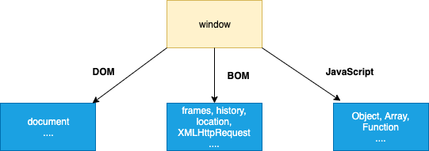

### 101. **Who created JavaScript?**（谁创造了 JavaScript？）

**JavaScript 是由 Brendan Eich 于 1995 年在 Netscape（网景公司）创建的。**

### ✅ 更详细的历史背景：

| 阶段          | 名称           | 描述                                                         |
| ------------- | -------------- | ------------------------------------------------------------ |
| 初始阶段      | **Mocha**      | JavaScript 最早的内部代号                                    |
| Beta 测试阶段 | **LiveScript** | Netscape 在测试版浏览器中将其命名为 LiveScript               |
| 正式发布时    | **JavaScript** | 为了营销目的，与当时流行的 Java 语言搭上关系，最终命名为 JavaScript |

### ✅ JavaScript 创建的背景：

* **目的**：为网页添加“交互性”功能（动态行为），区别于 HTML（结构）和 CSS（样式）。
* **开发周期**：Brendan Eich 仅用了**10 天**就完成了最初版本的设计和实现。
* **运行环境**：首次在 Netscape Navigator 浏览器中使用。

### ✅ 常见误解：

> JavaScript 虽然名字中带有“Java”，但**与 Java 语言毫无关系**，只是为了当时蹭 Java 的热度来吸引关注。

### ✅ 总结一句话：

> **JavaScript 是由 Brendan Eich 于 1995 年在 Netscape 公司创建的，最初叫 Mocha，后叫 LiveScript，最后改名为 JavaScript，用于为网页添加交互能力。**

------

### 102.**What is the use of `preventDefault` method?**（`preventDefault` 方法的作用是什么？）

**`preventDefault()` 方法用于**取消事件的默认行为，即使事件已经被触发，也可以阻止它默认要做的事情。

### ✅ 常见用途：

| 用例         | 描述                                   |
| ------------ | -------------------------------------- |
| 阻止表单提交 | 不让 `<form>` 在点击提交按钮后立即提交 |
| 阻止链接跳转 | 不让 `<a>` 标签点击后跳转页面          |
| 阻止右键菜单 | 禁止鼠标右键默认行为                   |

### ✅ 示例一：阻止链接跳转

```html
<a href="https://example.com" id="link">点击我不会跳转</a>

<script>
  document.getElementById("link").addEventListener("click", function (event) {
    event.preventDefault(); // 阻止默认跳转行为
    alert("链接默认行为已被阻止！");
  });
</script>
```

### ✅ 示例二：阻止表单提交

```html
<form id="myForm">
  <input type="text" required />
  <button type="submit">提交</button>
</form>

<script>
  document.getElementById("myForm").addEventListener("submit", function (e) {
    e.preventDefault(); // 阻止表单默认提交
    alert("表单未提交，而是执行自定义逻辑！");
  });
</script>
```

### ⚠️ 注意事项：

* 并**不是所有事件都可以被取消**。例如某些浏览器特有的事件是不可取消的。
* 可以通过 `event.cancelable` 属性判断当前事件是否可被取消：

```javascript
if (event.cancelable) {
  event.preventDefault();
}
```

### ✅ 总结一句话：

> `preventDefault()` 方法用于**阻止事件的默认行为**，如防止表单提交或链接跳转，使开发者可以自定义这些行为。

------

### 103. **What is the use of `stopPropagation` method?** （`stopPropagation` 方法的作用是什么？）

**`stopPropagation()` 方法用于**阻止事件在 DOM 冒泡阶段继续传播到上层元素。

在 JavaScript 的事件机制中，事件会从触发元素**向上传播到父元素**（这叫做事件冒泡）。调用这个方法就可以**阻止事件冒泡过程**，只在当前元素处理。

### ✅ 示例说明：

```html
<p>点击 DIV1</p>
<div onclick="secondFunc()">DIV 2
  <div onclick="firstFunc(event)">DIV 1</div>
</div>

<script>
  function firstFunc(event) {
    alert("DIV 1");
    event.stopPropagation(); // 阻止事件冒泡到 DIV 2
  }

  function secondFunc() {
    alert("DIV 2");
  }
</script>
```

#### 👉 点击 DIV 1 的结果：

```
弹出 "DIV 1"
不会弹出 "DIV 2"
```

#### ✅ 如果没有 `event.stopPropagation()`：

事件会从 `DIV 1` 冒泡到 `DIV 2`，输出：

```
DIV 1
DIV 2
```

### 📌 与 `preventDefault()` 区别：

| 方法                         | 作用                                                         |
| ---------------------------- | ------------------------------------------------------------ |
| `preventDefault()`           | 阻止事件的默认行为（如提交表单、跳转链接）                   |
| `stopPropagation()`          | 阻止事件冒泡传播到父元素                                     |
| `stopImmediatePropagation()` | 更强：除了阻止冒泡，还阻止**同一元素上的后续事件监听器**执行 |

### ✅ 应用场景举例：

* 有嵌套事件监听时，只希望某一个被点击的元素响应事件，而不是连带父级。
* 阻止一个点击按钮触发其父级的点击事件。

### ✅ 总结一句话：

> `stopPropagation()` 用于**阻止事件继续冒泡传播**，让事件只在当前元素处理，**不传递到父级**，用于控制事件传播链的行为。

------

### 104. **What are the steps involved in `return false` usage?**（`return false` 的作用包括哪些步骤？）

当你在事件处理函数中使用 `return false`，它实际上是一个**组合效果**，包含以下三步操作：

### ✅ `return false` 会执行以下操作：

1. **阻止浏览器的默认行为**（等同于 `event.preventDefault()`）
    例如：阻止链接跳转、表单提交等默认动作。
2. **阻止事件冒泡传播到父级元素**（等同于 `event.stopPropagation()`）
    不让事件继续向上冒泡触发父级的事件处理器。
3. **立即停止当前事件处理函数的执行**（中断函数后续语句）

### 📌 示例说明：

```html
<a href="https://example.com" onclick="return handleClick()">Click me</a>

<script>
  function handleClick() {
    alert("You clicked the link.");
    return false;
  }
</script>
```

#### 👆效果：

* 显示提示框 `You clicked the link`
* 不会跳转链接
* 不会触发父级任何冒泡事件

### ❗注意事项：

* `return false` 只有在**HTML 内联事件处理器**或 **jQuery 事件处理**中才具备上述三种效果。
   ✅ 例如：`onclick="return false"` 或 `$('a').click(function () { return false; })`
* 在 **现代原生事件监听器中（如 `addEventListener`）**，**`return false` 没有任何效果**！
   👉 必须显式调用 `event.preventDefault()` 和 `event.stopPropagation()`

### ✅ 原生写法对比：

```javascript
element.addEventListener("click", function (e) {
  e.preventDefault();      // 阻止默认行为
  e.stopPropagation();     // 阻止冒泡
  return false;            // 这行在这里不会自动做任何事
});
```

### ✅ 总结一句话：

> 在内联或 jQuery 中，`return false` 是 `preventDefault()` + `stopPropagation()` + 终止执行的快捷方式；但在 `addEventListener` 中，**它不会生效！**

------

### 105. **What is BOM (Browser Object Model)?**（什么是 BOM？）

**BOM（浏览器对象模型）** 是 JavaScript 用来与**浏览器本身**交互的一组对象接口集合。它让你可以控制和访问**浏览器窗口**的功能。

### 🌐 BOM 的核心特点：

* 它是 JavaScript 提供的访问 **浏览器功能**（而不是网页内容）的接口。
* 所有 BOM 的对象都是 `window` 对象的属性。
* 它**不属于 ECMAScript 标准**，不同浏览器的实现可能略有不同。



### 📦 常见的 BOM 组成：

| 对象                                     | 功能简介                                             |
| ---------------------------------------- | ---------------------------------------------------- |
| `window`                                 | 顶级对象，BOM 的核心；全局作用域默认即是 window      |
| `navigator`                              | 提供有关浏览器的信息（如浏览器名称、版本、用户代理） |
| `screen`                                 | 提供屏幕分辨率等信息                                 |
| `location`                               | 提供当前页面 URL，并可用来跳转页面或刷新             |
| `history`                                | 控制浏览器的历史记录，如前进后退等                   |
| `alert()` / `confirm()` / `setTimeout()` | 这些常用函数也是 BOM 提供的                          |

### 🧪 示例代码：

```javascript
console.log(window.navigator.userAgent); // 浏览器的用户代理字符串
console.log(window.screen.width);        // 屏幕宽度
console.log(window.location.href);       // 当前页面的 URL
console.log(window.history.length);      // 当前浏览器历史记录长度
```

### ✅ 总结一句话：

> **BOM 是让 JavaScript 可以“与浏览器对话”的一组 API。** 它让你访问浏览器功能，而不是 HTML 页面内容（HTML 内容由 DOM 处理）。

------

### 106. **What is the use of `setTimeout()` in JavaScript?**（`setTimeout()` 的用途是什么？）

**`setTimeout()`** 是 JavaScript 中用于**延迟执行函数**的函数。它在指定的毫秒数之后执行一次函数或表达式。

### 🧠 语法：

```javascript
setTimeout(callback, delay, ...args);
```

* `callback`：要执行的函数
* `delay`：延迟时间（单位：毫秒）
* `...args`：可选参数，会作为参数传给 `callback`

### 🧪 示例：

```javascript
setTimeout(function () {
  console.log("Good morning");
}, 2000); // 2秒后输出 "Good morning"
```

或者使用箭头函数：

```javascript
setTimeout(() => console.log("Hello after 1 second"), 1000);
```

### 📝 使用场景：

| 场景                           | 说明                             |
| ------------------------------ | -------------------------------- |
| 延迟执行某些任务               | 比如：页面加载后延迟弹窗提示     |
| 模拟异步行为（学习异步编程时） | 练习 Promise、async/await 的基础 |
| 节流 / 防抖                    | 配合 `clearTimeout()` 做输入优化 |
| 动画或轮播效果                 | 模拟间隔时间的状态变化           |

### ❗注意事项：

1. `setTimeout()` 是**非阻塞的异步函数**，不会暂停程序执行。
2. 返回一个 **timeout ID**，可通过 `clearTimeout(id)` 取消执行。
3. `delay` 参数的单位是毫秒，`1000` = 1 秒。

### 🧼 示例：取消 setTimeout

```javascript
const id = setTimeout(() => {
  console.log("This will not run");
}, 3000);

clearTimeout(id); // 取消定时器
```

### ✅ 总结一句话：

> `setTimeout()` 用于在指定延迟后异步执行一段代码，只执行一次。常用于延时任务、异步控制等。

---

### 107. **What is the use of `setInterval()` in JavaScript?**（JavaScript 中 `setInterval()` 的用途是什么？）

**`setInterval()`** 是 JavaScript 中用于**周期性地执行某段代码**的函数。它每隔指定的毫秒数执行一次提供的函数，直到调用 `clearInterval()` 来取消它。

### 🧠 语法：

```javascript
setInterval(callback, interval, ...args);
```

* `callback`：要反复执行的函数
* `interval`：两次执行之间的间隔时间（单位：毫秒）
* `...args`：可选参数，会传给回调函数

### 🧪 示例：

```javascript
setInterval(function () {
  console.log("Good morning");
}, 2000); // 每隔 2 秒输出一次 "Good morning"
```

或者使用箭头函数：

```javascript
setInterval(() => console.log("Tick"), 1000); // 每秒输出 "Tick"
```

### 🛑 取消定时器（非常重要）：

```javascript
const timerId = setInterval(() => {
  console.log("Running...");
}, 1000);

// 假设 5 秒后取消定时器
setTimeout(() => {
  clearInterval(timerId);
  console.log("Stopped");
}, 5000);
```

### 📌 使用场景：

| 场景           | 说明                             |
| -------------- | -------------------------------- |
| 轮播图/幻灯片  | 自动切换图片                     |
| 倒计时或计时器 | 每秒刷新页面显示                 |
| 实时获取数据   | 每隔一段时间请求一次接口         |
| 简单动画       | 每隔一段时间更新位置、颜色等属性 |

### ✅ `setInterval` vs `setTimeout`

| 比较点     | `setTimeout`       | `setInterval`            |
| ---------- | ------------------ | ------------------------ |
| 调用次数   | **只调用一次**     | **无限次调用**，直到取消 |
| 使用场景   | 延迟执行一次       | 周期性任务，如时钟、轮播 |
| 可取消方法 | `clearTimeout(id)` | `clearInterval(id)`      |

### ✅ 总结一句话：

> `setInterval()` 用于每隔一段时间重复执行某段代码，适合定时执行任务，如轮播、倒计时等。

---

### 108. Why is JavaScript treated as Single-threaded?（为什么 JavaScript 被认为是单线程的？）

JavaScript 被设计为**单线程语言**，是因为它最初用于浏览器中的用户交互逻辑，必须避免并发引起的**DOM 操作冲突**。
 这意味着一次只能执行一个任务，避免了线程之间的数据共享和锁机制。

### 🧠 技术细节说明：

#### 🔸 JavaScript 的单线程来源：

* JavaScript 的执行是基于一个**主线程（main thread）**
* 这个主线程运行在所谓的**事件循环（event loop）**中
* 所有同步任务排队执行，异步任务通过回调机制延迟执行

#### 🔸 为什么设计为单线程：

* JavaScript 的主要用途是浏览器端脚本，尤其是操作 DOM
* DOM 是非线程安全的（不能同时被多个线程修改）
* 多线程会导致：
  * 难以同步 UI 渲染
  * 出现资源竞争、死锁、线程切换开销等问题

### ⚙️ 示例说明：

```javascript
console.log("Start");

setTimeout(() => {
  console.log("Callback");
}, 0);

console.log("End");

// 输出顺序：
// Start
// End
// Callback
```

即使 `setTimeout` 设置为 0，异步代码也会在当前同步代码执行完后才运行。

### 🚀 那 JavaScript 怎么处理并发？

虽然 JavaScript 是单线程的，但可以通过以下机制实现“伪并发”或异步：

| 技术/机制                 | 说明                                             |
| ------------------------- | ------------------------------------------------ |
| `setTimeout/setInterval`  | 定时异步执行函数                                 |
| `Promise` / `async-await` | 异步任务的更清晰控制                             |
| `Web APIs`                | 浏览器提供的异步功能（如 `fetch`, `DOM events`） |
| `Web Workers`             | 真正的多线程，但不能访问主线程 DOM               |
| `Event Loop`              | 控制同步/异步任务执行顺序的机制                  |

### ✅ 总结一句话：

> JavaScript 是单线程的，是为了简化设计并确保 UI 操作的安全性，但通过事件循环和异步机制可以高效处理并发任务。

---

### 109. What is Event Delegation?（什么是事件委托？）

**事件委托（Event Delegation）**是一种使用 **事件冒泡机制** 的技术：

> **你不在每个子元素上绑定事件，而是在它们的共同父元素上绑定事件**，通过判断 `event.target` 来响应具体子元素的操作。

### 🎯 为什么使用事件委托？

| 优点             | 说明                                           |
| ---------------- | ---------------------------------------------- |
| 减少内存占用     | 不需要给每个子元素都绑定事件处理器             |
| 动态元素处理方便 | 即使后续通过 JS 添加子元素，也能被委托事件捕捉 |
| 更易维护         | 所有逻辑集中在父元素中统一管理                 |

### 📌 使用示例：

HTML 结构如下：

```html
<ul id="menu">
  <li>Home</li>
  <li>About</li>
  <li>Contact</li>
</ul>
```

传统写法：对每个 `<li>` 绑定事件（不推荐）

事件委托写法：

```javascript
const menu = document.getElementById("menu");

menu.addEventListener("click", function (event) {
  if (event.target.tagName === "LI") {
    console.log("You clicked:", event.target.textContent);
  }
});
```

✅ 这样，即使你通过 JS 动态添加新的 `<li>` 元素，也能触发事件。

### ⚠️ 注意事项：

1. **依赖事件冒泡机制**，某些事件（如 `blur`、`focus`）不会冒泡，无法使用事件委托。
2. 使用 `event.target` 判断触发事件的实际元素。
3. 可配合 `matches()` 或 `closest()` 精准匹配子元素：

```javascript
if (event.target.matches("li.some-class")) { ... }
```

### ✅ 总结一句话：

> 事件委托就是在父元素上统一监听事件，通过冒泡机制判断目标子元素，**提高性能、减少重复代码、支持动态元素处理**。

---

### 110. What is ECMAScript?

**ECMAScript（简称 ES）** 是 JavaScript 的**标准规范**，由 **ECMA 国际组织**制定，标准编号是 **ECMA-262**。

### 📌 简单理解：

* JavaScript 是一种实现，而 ECMAScript 是这门语言的“标准蓝图”。
* 所有主流 JavaScript 引擎（如 V8、SpiderMonkey、Chakra）都是对 ECMAScript 标准的实现。

### 📜 历史概览：

| 版本         | 发布时间 | 主要特性示例                                     |
| ------------ | -------- | ------------------------------------------------ |
| ES3          | 1999     | 正式被广泛使用的版本                             |
| ES5          | 2009     | 严格模式、`JSON` 支持、`Array.forEach`           |
| ES6 / ES2015 | 2015     | `let/const`、箭头函数、类、模块、Promise 等      |
| ES2016+      | 每年发布 | 包括 `includes`、`async/await`、`nullish` 合并等 |

### 📘 ECMAScript 与 JavaScript 的关系：

* ECMAScript 是标准，JavaScript 是实现。
* JavaScript 还包含浏览器相关 API（例如 `DOM`, `BOM`），它们不属于 ECMAScript 标准。

### ✅ 举个例子：

```javascript
// 这是 ECMAScript（ES6）规范的一部分
let name = "Alice";
const sayHi = () => console.log(`Hi, ${name}`);
sayHi();
```

> 这些特性都由 ECMAScript 标准定义。

### 📌 ECMAScript 不是：

* ECMAScript ≠ JavaScript 的所有内容
* ECMAScript 不包含 Web API，比如 `document.querySelector()` 或 `alert()`

### ✅ 总结一句话：

> ECMAScript 是 JavaScript 的核心标准，定义了语法、数据类型、语言特性等。JavaScript 是对 ECMAScript 的实现，并扩展了浏览器功能。

---

当然！以下是该问题的中文翻译和补充说明：

------

### 111. 什么是 JSON？

JSON（JavaScript 对象表示法）是一种用于数据交换的轻量级格式。它基于 JavaScript 语言中的对象构造方式，但本质上是一个独立于语言的文本格式。

#### 补充说明：

* JSON 是一种**文本格式**，便于人阅读和编写，也便于机器解析和生成。
* 它广泛用于客户端与服务器之间的数据传输，特别是在 Web 应用中。
* JSON 的结构包括**键值对**，数据以逗号分隔，使用花括号 `{}` 表示对象，方括号 `[]` 表示数组。
* 常见的数据类型包括字符串、数字、布尔值、数组、对象和 `null`。

#### JSON 的示例：

```json
{
  "name": "张三",
  "age": 28,
  "isStudent": false,
  "skills": ["JavaScript", "HTML", "CSS"],
  "address": {
    "city": "北京",
    "zipcode": "100000"
  }
}
```

#### 在 JavaScript 中的常用方法：

* `JSON.parse()`：将 JSON 字符串转换成 JavaScript 对象。
* `JSON.stringify()`：将 JavaScript 对象转换成 JSON 字符串。

#### JavaScript 示例：

```javascript
const jsonStr = '{"name":"张三","age":28}';
const obj = JSON.parse(jsonStr);
console.log(obj.name); // 张三

const newJsonStr = JSON.stringify(obj);
console.log(newJsonStr); // '{"name":"张三","age":28}'
```

------

### 115. 为什么需要 JSON？

在浏览器和服务器之间交换数据时，传输的数据必须是文本格式。由于 JSON 仅是纯文本格式，它可以很容易地在客户端和服务器之间传输，并且几乎所有编程语言都支持解析和生成 JSON，因此它成为了广泛使用的数据交换格式。

#### 补充说明：

* 传统的数据交换格式有 XML，但相比之下，JSON 更轻量、结构更简单，且易于阅读和编写。
* JSON 格式标准、简单，易于机器解析，也易于人工理解。
* 由于跨语言的支持，JSON 是前后端通信、接口设计、数据存储等场景中的首选格式。
* 使用 JSON 传输数据减少了网络负担，提高了性能。

#### 简单示例说明：

假设服务器返回了用户数据，使用 JSON 格式：

```json
{
  "id": 1,
  "name": "Alice",
  "email": "alice@example.com"
}
```

浏览器端通过 `fetch` 接收并解析：

```javascript
fetch('/user')
  .then(response => response.json())
  .then(data => {
    console.log(data.name); // Alice
  });
```

------

当然，这里是该问题的中文翻译及补充说明：

------

### 116. 什么是 PWA（渐进式网页应用）？

渐进式网页应用（Progressive Web Applications，简称 PWA）是一种通过网页提供的移动应用类型，使用常见的网页技术构建，包括 HTML、CSS 和 JavaScript。PWA 部署在服务器上，可以通过 URL 访问，并且能够被搜索引擎索引。

#### 补充说明：

* **PWA 结合了网页和原生应用的优点**，用户无需从应用商店下载安装，只需通过浏览器即可访问。
* 支持离线访问：通过 Service Worker 缓存资源，实现离线模式。
* 响应式设计：适配不同设备尺寸（手机、平板、桌面）。
* 支持推送通知，提升用户参与度。
* 可以像原生应用一样被“安装”到主屏幕，拥有应用图标和启动画面。
* 更新便捷，无需用户手动升级。

#### 典型特性：

| 特性         | 说明                                           |
| ------------ | ---------------------------------------------- |
| 离线访问     | 利用 Service Worker 实现资源缓存，断网也能使用 |
| 安装到主屏幕 | 用户可将 PWA 添加到手机桌面，类似原生应用      |
| 推送通知     | 支持向用户推送消息，提升互动                   |
| 安全         | 必须通过 HTTPS 进行服务                        |
| 快速响应     | 加载速度快，体验流畅                           |

#### 简单示例：

一个 PWA 的核心是注册 Service Worker：

```javascript
if ('serviceWorker' in navigator) {
  navigator.serviceWorker.register('/service-worker.js')
    .then(reg => console.log('Service Worker registered', reg))
    .catch(err => console.log('Service Worker registration failed', err));
}
```

------

### 119. 如何使用 JavaScript 跳转到新页面？

在原生 JavaScript 中，可以通过 `window` 对象的 `location` 属性来实现页面跳转。语法如下：

```javascript
function redirect() {
  window.location.href = "newPage.html";
}
```

### 补充说明：

JavaScript 中有几种常见的页面跳转方式：

#### 1. `window.location.href`

* 跳转到指定的 URL（可以是相对路径或绝对路径）
* 会在浏览器的历史记录中留下记录（可以用浏览器的“返回”按钮回退）

```javascript
window.location.href = "https://example.com";
```

#### 2. `window.location.replace()`

* 替换当前页面，不会在历史记录中留下记录（用户不能回退）

```javascript
window.location.replace("https://example.com");
```

#### 3. `window.location.assign()`

* 和 `href` 类似，会保留历史记录

```javascript
window.location.assign("https://example.com");
```

#### 4. `window.location.reload()`

* 重新加载当前页面（刷新）

```javascript
window.location.reload();
```

### 示例：点击按钮跳转页面

```html
<button onclick="redirect()">跳转页面</button>

<script>
  function redirect() {
    window.location.href = "https://www.baidu.com";
  }
</script>
```

------

### 120. 如何检查一个字符串是否包含某个子字符串？

在 JavaScript 中，有三种常用的方法可以判断一个字符串是否包含某个子字符串：

#### 1. **使用 `includes()` 方法（推荐，ES6 及以上）**

`includes()` 方法用于判断一个字符串是否包含另一个指定的子字符串，返回布尔值（true 或 false）。

```javascript
var mainString = "hello",
    subString = "hell";
mainString.includes(subString); // true
```

> ✅ 简洁直观，推荐使用（支持 IE 不佳）

#### 2. **使用 `indexOf()` 方法（ES5 及以下环境可用）**

`indexOf()` 方法返回子字符串首次出现的位置，如果不存在则返回 `-1`。

```javascript
var mainString = "hello",
    subString = "hell";
mainString.indexOf(subString) !== -1; // true
```

> ✅ 更早期的写法，兼容性更好

#### 3. **使用正则表达式 `RegExp.test()` 方法**

适用于更复杂的匹配需求，如大小写忽略、部分匹配等。

```javascript
var mainString = "hello",
    regex = /hell/;
regex.test(mainString); // true
```

> ✅ 支持高级匹配规则
>  ❗ 使用正则表达式时需注意转义字符和匹配规则书写

### 补充说明：

* `includes()` 是最简单且语义清晰的方法，适合现代开发
* `indexOf()` 更适用于兼容性要求高的项目
* `RegExp.test()` 提供灵活的模式匹配，适合复杂需求

### 示例（大小写不敏感匹配）：

```javascript
let str = "Hello World";
let pattern = /hello/i; // i 表示忽略大小写
console.log(pattern.test(str)); // true
```

------

### 122. 如何使用 JavaScript 获取当前页面的 URL？

你可以使用 `window.location.href` 表达式来获取当前页面的完整 URL，它也可以用于更新地址栏中的 URL。

```javascript
console.log("location.href", window.location.href); 
// 示例输出: "https://example.com/page?query=123"
```

### 可选方案：

#### 1. `window.location.href`

* ✅ 推荐方式
* ✅ 可读可写
* ✅ 获取整个 URL（包含协议、主机、路径、查询参数等）

#### 2. `document.URL`

```javascript
console.log(document.URL);
```

* ⚠️ 也是返回完整 URL，但在一些旧版本 Firefox 中存在兼容性问题（表现不一致）
* ⛔ 只读，不能修改 URL

#### 3. `window.location` 对象的其他属性（用于获取部分 URL）

* `window.location.protocol`：协议（如 `"https:"`）
* `window.location.hostname`：主机名（如 `"example.com"`）
* `window.location.port`：端口（如 `"8080"`）
* `window.location.pathname`：路径部分（如 `"/page"`）
* `window.location.search`：查询字符串（如 `"?query=123"`）
* `window.location.hash`：锚点部分（如 `"#section1"`）

### 示例：获取 URL 各部分

```javascript
console.log(window.location.protocol); // "https:"
console.log(window.location.hostname); // "example.com"
console.log(window.location.pathname); // "/page"
console.log(window.location.search);   // "?query=123"
console.log(window.location.hash);     // "#section1"
```

### 总结：

| 用法                   | 返回内容       | 是否推荐                 |
| ---------------------- | -------------- | ------------------------ |
| `window.location.href` | ✅ 当前完整 URL | ✅ 推荐                   |
| `document.URL`         | 当前完整 URL   | ⚠️ 不推荐（有兼容性问题） |
| `location` 子属性      | URL 各部分信息 | ✅ 补充使用               |

如需修改当前 URL 或跳转，也可以直接给 `window.location.href` 赋值：

```javascript
window.location.href = "https://example.com/new-page";
```

---

以下是该 JS 面试问题的中文翻译和补充说明：

------

### 125. 如何判断一个对象中是否存在某个键（key）？

你可以使用三种常见方式来判断对象中是否存在某个键：

### ✅ 方法一：使用 `in` 运算符（推荐）

```javascript
"key" in obj;
```

* 如果对象 `obj` 中存在名为 `"key"` 的属性，则返回 `true`。
* 包括继承的属性也会被检测到。

🔍 **示例：**

```javascript
const person = { name: "Alice" };

console.log("name" in person); // true
console.log("age" in person);  // false
```

⚠️ **如果你要判断 key 不存在，建议使用括号：**

```javascript
if (!("age" in person)) {
  console.log("age 不存在");
}
```

### ✅ 方法二：使用 `hasOwnProperty` 方法（推荐）

```javascript
obj.hasOwnProperty("key");
```

* 只判断对象本身是否含有某个属性，不检查原型链。
* 更精确，适合排除继承属性。

🔍 **示例：**

```javascript
const person = { name: "Alice" };

console.log(person.hasOwnProperty("name")); // true
console.log(person.hasOwnProperty("toString")); // false
```

### ⚠️ 方法三：使用 `undefined` 比较

```javascript
obj.key !== undefined;
```

* 如果访问一个不存在的属性，会返回 `undefined`，可用来判断。
* **但注意**：如果属性存在，但值恰好是 `undefined`，判断就不准确。

🔍 **示例：**

```javascript
const user = {
  name: "Tom",
  age: undefined,
};

console.log(user.name !== undefined); // true
console.log(user.age !== undefined);  // false → ⚠️ 实际上 "age" 存在
console.log("age" in user);           // true → 推荐使用这个
```

### ✅ 总结对比：

| 方法                        | 是否检测继承属性 | 是否准确                            | 是否推荐         |
| --------------------------- | ---------------- | ----------------------------------- | ---------------- |
| `"key" in obj`              | ✅ 是             | ✅ 精确                              | ✅ 推荐           |
| `obj.hasOwnProperty("key")` | ❌ 否             | ✅ 更安全                            | ✅ 推荐           |
| `obj.key !== undefined`     | ✅ 是             | ⚠️ 不安全（值为 `undefined` 时误判） | ⛔ 不推荐单独使用 |

------

### 126. 如何遍历（枚举）JavaScript 对象的属性？

你可以使用以下几种方法来遍历一个 JavaScript 对象：

### ✅ 方法一：`for...in` 循环（经典方式）

```javascript
const obj = {
  k1: "value1",
  k2: "value2",
  k3: "value3",
};

for (const key in obj) {
  if (obj.hasOwnProperty(key)) {
    console.log(key + " -> " + obj[key]);
  }
}
```

🔍 **说明：**

* `for...in` 会遍历对象**自身和继承的可枚举属性**。
* 所以建议使用 `hasOwnProperty(key)` 过滤掉原型链上的属性。

### ✅ 方法二：`Object.keys()` + `forEach()`（推荐）

```javascript
Object.keys(obj).forEach(function (key) {
  console.log(key + " -> " + obj[key]);
});
```

🔍 **说明：**

* `Object.keys(obj)` 返回对象自身的所有**可枚举属性键**（不包括继承）。
* 更现代、语义更清晰。

### ✅ 方法三：`Object.entries()`（键值对遍历）

```javascript
for (const [key, value] of Object.entries(obj)) {
  console.log(key + " -> " + value);
}
```

🔍 **说明：**

* `Object.entries(obj)` 返回对象自身属性的 `[key, value]` 数组。
* 与 `for...of` 搭配使用，更加优雅。

### ✅ 方法四：`Object.getOwnPropertyNames()`（包含不可枚举属性）

```javascript
Object.getOwnPropertyNames(obj).forEach(function (key) {
  console.log(key + " -> " + obj[key]);
});
```

🔍 **说明：**

* 返回对象自身所有属性，包括不可枚举属性（但不包括 symbol 属性）。

### ✅ 方法五：`Reflect.ownKeys()`（高级用法）

```javascript
Reflect.ownKeys(obj).forEach(function (key) {
  console.log(key + " -> " + obj[key]);
});
```

🔍 **说明：**

* 返回对象自身的所有键，包括 symbol 和字符串类型的键。

### ⛔ 不推荐：使用 `for...in` 不加 `hasOwnProperty`

```javascript
// 可能遍历到原型链上的属性，容易出错
for (const key in obj) {
  console.log(key); // 有风险
}
```

### ✅ 总结对比：

| 方法                           | 是否只遍历自身属性 | 是否包括 Symbol | 是否支持键值对遍历 |
| ------------------------------ | ------------------ | --------------- | ------------------ |
| `for...in` + `hasOwnProperty`  | ✅ 是               | ❌ 否            | ❌ 否               |
| `Object.keys()`                | ✅ 是               | ❌ 否            | ❌ 否               |
| `Object.entries()`             | ✅ 是               | ❌ 否            | ✅ 是               |
| `Object.getOwnPropertyNames()` | ✅ 是               | ❌ 否            | ❌ 否               |
| `Reflect.ownKeys()`            | ✅ 是               | ✅ 是            | ❌ 否               |

------

### 127. 如何判断一个对象是否为空对象（Empty Object）？

你可以根据不同版本的 ECMAScript 选择不同的方式判断对象是否为空。

### ✅ 方法一：`Object.entries()`（ES2016 / ES7+）

```javascript
Object.entries(obj).length === 0 && obj.constructor === Object;
```

📌 **说明：**

* `Object.entries(obj)` 会返回对象自身所有可枚举属性的 `[key, value]` 数组。
* 如果长度为 0 且构造函数为 `Object`，说明是空普通对象。
* ⚠️ 需要检查 `obj.constructor === Object`，因为像 `Date` 这样的对象也会返回空数组。

### ✅ 方法二：`Object.keys()`（ES5+ 推荐）

```javascript
Object.keys(obj).length === 0 && obj.constructor === Object;
```

📌 **说明：**

* `Object.keys(obj)` 返回对象自身所有可枚举属性的键数组。
* 最常用、安全且兼容性好。
* 同样建议加上构造函数判断，防止对非普通对象误判为空。

### ✅ 方法三：`for...in` + `hasOwnProperty()`（兼容旧浏览器）

```javascript
function isEmpty(obj) {
  for (let key in obj) {
    if (obj.hasOwnProperty(key)) {
      return false;
    }
  }
  return true;
}
```

📌 **说明：**

* 用于早期 ECMAScript 版本（比如 ES3/ES4）。
* 使用 `hasOwnProperty` 过滤掉原型链属性。

### ❌ 不推荐方法：使用 `JSON.stringify` 比较

```javascript
JSON.stringify(obj) === JSON.stringify({});
```

📌 **说明：**

* 虽然能判断空对象，但效率低，性能差。
* 对象属性顺序不同也可能影响结果，容易出错。

### 🧠 补充说明：

* `Object.keys()`、`Object.entries()`、`Object.getOwnPropertyNames()` 都不会返回继承属性，只会返回对象“自身”的可枚举属性。
* 如果你只想检测普通 JSON 对象是否为空，推荐使用：

```javascript
Object.keys(obj).length === 0 && obj.constructor === Object;
```

### ✅ 总结表：

| 方法                            | 支持版本 | 是否推荐 | 是否准确   | 说明          |
| ------------------------------- | -------- | -------- | ---------- | ------------- |
| `Object.keys().length`          | ES5+     | ✅ 推荐   | ✅ 是       | 简洁、兼容好  |
| `Object.entries().length`       | ES2016+  | ✅ 推荐   | ✅ 是       | 类似 `keys()` |
| `for...in` + `hasOwnProperty()` | 所有版本 | ✅ 推荐   | ✅ 是       | 老版本兼容    |
| `JSON.stringify()` 比较         | ES5+     | ❌ 不推荐 | ⚠️ 误判可能 | 性能差，易错  |

------

### 128. 什么是 `arguments` 对象？

`arguments` 是一个**类数组对象（Array-like Object）**，存在于所有非箭头函数中，用于**存储传递给函数的所有参数**。

### 📌 示例

```javascript
function sum() {
  var total = 0;
  for (var i = 0; i < arguments.length; i++) {
    total += arguments[i];
  }
  return total;
}

console.log(sum(1, 2, 3)); // 输出: 6
```

在这个例子中，不管你传多少个参数，都可以通过 `arguments` 来访问它们。

### ✅ 特点说明

* **类数组**：`arguments` 拥有 `length` 属性，可以使用索引访问，如 `arguments[0]`。

* **不是数组**：不能直接使用数组方法，如 `map()`、`forEach()` 等。

* **可转换成数组**：

  ```javascript
  var argsArray = Array.prototype.slice.call(arguments);
  // 或者在 ES6 中：
  var argsArray = [...arguments];
  ```

### ⚠️ 注意事项

1. **箭头函数中没有 `arguments` 对象**：

   ```javascript
   const fn = () => {
     console.log(arguments); // ReferenceError: arguments is not defined
   };
   ```

2. **推荐使用剩余参数（Rest Parameter）代替 `arguments`**（在 ES6 中）：

   ```javascript
   function sum(...args) {
     return args.reduce((total, cur) => total + cur, 0);
   }
   
   console.log(sum(1, 2, 3)); // 输出: 6
   ```

   ✅ 这样得到的是一个真正的数组，更安全、更灵活。

### ✅ 总结

| 特性         | `arguments`            | `...rest` 参数   |
| ------------ | ---------------------- | ---------------- |
| 类型         | 类数组对象             | 真正的数组       |
| 支持箭头函数 | ❌ 不支持               | ✅ 支持           |
| 支持数组方法 | ❌ 不支持（需手动转换） | ✅ 原生支持       |
| 推荐使用程度 | ⚠️ 老代码可用           | ✅ 新代码推荐使用 |

---

### 129. 如何将字符串的首字母转为大写？

你可以通过组合使用 `charAt()`、`toUpperCase()` 和 `slice()` 方法，构造一个将首字母大写的函数：

### ✅ 示例代码：

```javascript
function capitalizeFirstLetter(string) {
  return string.charAt(0).toUpperCase() + string.slice(1);
}

console.log(capitalizeFirstLetter("hello")); // 输出: Hello
```

### 📌 方法说明：

| 方法            | 说明                      |
| --------------- | ------------------------- |
| `charAt(0)`     | 获取字符串第一个字符      |
| `toUpperCase()` | 转换为大写字母            |
| `slice(1)`      | 获取第2个字符起的子字符串 |

### 📦 补充进阶：考虑异常情况

为了更健壮，可以先检查参数是否为字符串、是否为空：

```javascript
function capitalizeFirstLetter(str) {
  if (typeof str !== "string" || str.length === 0) return str;
  return str.charAt(0).toUpperCase() + str.slice(1);
}
```

### 🌍 示例应用场景

* 显示用户名称：`capitalizeFirstLetter(username)`
* 显示标题或表单字段名：`capitalizeFirstLetter(labelName)`

------

### 130. for 循环的优缺点是什么？

`for` 循环是 JavaScript 中最经典和广泛使用的迭代结构之一。它既有优势，也存在一些缺陷：

### ✅ 优点（Pros）

1. **兼容性强**：
    `for` 循环可以在几乎所有 JavaScript 执行环境中使用，包括旧版浏览器和嵌入式脚本环境。
2. **支持中断控制（break / continue）**：
    可以灵活使用 `break` 跳出循环或 `continue` 跳过当前迭代，非常适合对流程控制要求高的场景。
3. **完全控制循环过程**：
    可以自定义起始值、终止条件和增量/减量，非常灵活。

### ❌ 缺点（Cons）

1. **语法冗长**：
    与 `forEach`、`map` 等声明式方法相比，`for` 循环代码更冗长，不够简洁。
2. **命令式写法**：
    `for` 循环是命令式的，不易读、不可组合，缺乏函数式编程的优雅。
3. **容易出 off-by-one 错误**：
    即“差一错误”，比如 `i <= arr.length` vs `i < arr.length`，容易引发边界错误或访问未定义值。

### 🆚 与现代替代方案对比

| 特性             | `for` | `forEach` | `map` |
| ---------------- | ----- | --------- | ----- |
| 可中断 (`break`) | ✅     | ❌         | ❌     |
| 可组合           | ❌     | ❌         | ✅     |
| 可读性           | 一般  | 较好      | 较好  |
| 函数式风格       | ❌     | ✅（部分） | ✅     |

### 📝 结论

* ✅ 如果你需要精确控制循环过程、需要 `break` / `continue`，或者处理的是兼容性敏感的环境，`for` 是首选。
* ❌ 如果你追求简洁、函数式编程风格，建议使用 `forEach`、`map`、`filter` 等更现代的迭代方式。

------

### 131. 如何在 JavaScript 中显示当前日期？

在 JavaScript 中，可以通过 `new Date()` 创建一个包含当前日期和时间的 `Date` 对象，然后通过相关方法提取所需部分进行格式化。

### ✅ 示例：显示当前日期为 `MM/DD/YYYY` 格式

```javascript
var today = new Date();

var dd = String(today.getDate()).padStart(2, "0");
var mm = String(today.getMonth() + 1).padStart(2, "0"); // 月份从 0 开始，需要 +1
var yyyy = today.getFullYear();

today = mm + "/" + dd + "/" + yyyy;
document.write(today); // 比如输出: 06/16/2025
```

### 📌 方法说明：

* `getDate()`：返回当前是几号（1~31）
* `getMonth()`：返回当前月份（0~11），所以需要 `+1`
* `getFullYear()`：返回完整年份（例如 2025）
* `padStart(2, "0")`：确保日期或月份为两位数，如 `06`、`09` 等

### 🌏 补充：常见日期格式示例

| 格式         | 代码示例                                                  |
| ------------ | --------------------------------------------------------- |
| `YYYY-MM-DD` | `yyyy + "-" + mm + "-" + dd`                              |
| `DD/MM/YYYY` | `dd + "/" + mm + "/" + yyyy`                              |
| ISO 格式     | `new Date().toISOString()` → `"2025-06-16T05:38:00.000Z"` |

### 📦 更简洁的方案（可选）

如果你需要更强大的日期格式化功能，可以使用第三方库如 **[dayjs](https://day.js.org/)** 或 **moment.js**：

```javascript
dayjs().format("MM/DD/YYYY"); // 使用 dayjs 获取当前日期
```

---

### 132. 如何比较两个 JavaScript Date 对象？

直接比较两个 Date 对象（如 `d1 === d2`）只会比较对象引用是否相等，结果通常为 `false`，即使它们表示相同的时间。

正确做法是通过 `getTime()` 方法获取两个日期的时间戳（Unix 时间戳，毫秒数），再进行比较。

### 示例代码

```javascript
var d1 = new Date();
var d2 = new Date(d1);

console.log(d1.getTime() === d2.getTime()); // true，两个日期表示同一时间
console.log(d1 === d2); // false，两个对象不同引用
```

### 补充说明：

* `getTime()` 返回自1970年1月1日午夜以来的毫秒数。
* 通过比较时间戳可以判断两个日期是否相等。
* 也可以用 `<`, `>`, `<=`, `>=` 来比较日期大小，都是基于时间戳的。

------

### 135. 如何在 JavaScript 中添加键值对？**

在 JavaScript 中，有两种主要方式可以向对象中添加新的属性（键值对）：

假设我们有一个简单的对象如下：

```javascript
var object = {
  key1: value1,
  key2: value2,
};
```

#### ✅ 1. **使用点（`.`）符号（Dot Notation）**

这种方式适用于你**明确知道属性名**的情况。

```javascript
object.key3 = "value3";
```

#### ✅ 2. **使用方括号（`[]`）符号（Bracket Notation）**

这种方式适用于以下几种情况：

* 属性名是**动态计算**出来的；
* 属性名包含**特殊字符**或不符合变量命名规则（如中划线、空格等）；
* 属性名是一个变量。

```javascript
object["key3"] = "value3";
```

例如：

```javascript
let keyName = "user-name";
object[keyName] = "Tom";
```

### 🧠 补充说明：

1. **方括号更灵活**：可以通过变量作为键名，非常适合在遍历或者处理 JSON 数据时使用。
2. **不能用点访问非法属性名**：例如 `object.user-name = "Tom"` 会报错，因为 JS 解释为 `object.user - name`。
3. **可用于修改已有属性**：添加和更新属性用法相同，如果键已存在就是更新。

------

### 136. **`!--` 是一种特殊的运算符吗？**

**不是，`!--` 并不是一个特殊的运算符。**
 它其实是两个标准运算符组合在一起的写法：

1. `!` —— 逻辑非运算符（Logical NOT）
2. `--` —— 前缀递减运算符（Prefix Decrement）

### ✅ 示例解释：

```javascript
let x = 2;
if (!--x) {
  console.log("Condition is true");
} else {
  console.log("Condition is false");
}
```

* `--x`：先将 `x` 的值减少 1，变为 `1`
* `!1`：逻辑非运算，结果为 `false`

所以输出是：

```
Condition is false
```

### 🧠 补充说明：

1. `!--x` 实际上会 **先执行 `--x`，再对结果取逻辑非**。
2. 这种写法**可读性较差，不推荐**在实际开发中使用，容易让人误解为某种特殊运算符。
3. 若你尝试在表达式中使用 `! --x` 之间加空格，也能正常工作，但同样建议避免。

### 🚫 错误示例：

```javascript
if (x!--) { ... }
```

这个写法会报错，因为 JS 解析为：

```javascript
if (x ! --)  // 无效语法
```

所以如果要用逻辑非和递减操作，必须小心语法和执行顺序。

------

### 137. **如何为变量赋默认值？**

在 JavaScript 中，可以使用**逻辑或运算符 `||`** 来给变量赋默认值。语法如下：

```javascript
var a = b || c;
```

根据这条语句的逻辑：

* 如果变量 `b` 是**假值（falsy）**，那么 `a` 将会取默认值 `c`；
* 如果 `b` 是**真值（truthy）**，那么 `a` 就会取 `b` 的值。

### ❗ 什么是 "falsy" 值？

在 JavaScript 中，以下值被认为是 **falsy（假值）**：

* `false`
* `0`
* `""`（空字符串）
* `null`
* `undefined`
* `NaN`

其它所有值都被认为是 **truthy（真值）**。

### ✅ 示例：

```javascript
var username = input || "Guest";
```

如果 `input` 是 `null`、`undefined` 或空字符串等 falsy 值，`username` 就会被赋值为 `"Guest"`。

### 🧠 补充说明：

#### ✅ ES6 的推荐写法：使用默认参数

在函数中更推荐使用 ES6 的默认参数语法：

```javascript
function greet(name = "Guest") {
  console.log("Hello, " + name);
}
```

这比 `name = name || "Guest"` 更清晰，也避免了部分意外行为。

#### ⚠️ `||` 存在误判的风险

如果 `b = 0`、`""` 或 `false` 是你**期望保留的有效值**，那么使用 `||` 可能会错误地替换为默认值。

✅ 可以使用 ES2020 的**空值合并运算符（nullish coalescing operator）`??`** 来避免这种误判：

```javascript
var a = b ?? c;
```

`??` 仅在 `b` 是 `null` 或 `undefined` 时才使用 `c`。

### 🔚 总结：

| 写法                | 使用场景说明                            |
| ------------------- | --------------------------------------- |
| `a = b ?? c`        | `b` 为 `null` 或 `undefined` 时才用 `c` |
| `function f(x = 1)` | ES6 推荐的函数默认值写法                |

------

### 139. **什么是 App Shell 模型？**

**App Shell（应用外壳）模型** 是构建渐进式 Web 应用（PWA）的一种架构方式。它的目标是让你的网页像原生应用那样**可靠且快速地加载**，即使在离线或网络不佳的情况下也能呈现基本的 UI 框架。

### ✅ 中文解释：

**应用外壳（App Shell）模型**指的是将应用的**结构性 UI 部分（即“壳”）与动态内容分离**，并将这部分壳通过缓存（通常是 service worker）提前加载，从而加快页面展示速度。

### ✅ 示例说明：

你可以将 App Shell 理解为：

* **外壳（Shell）**：如导航栏、侧边栏、空的内容区域、logo 等，始终存在。
* **内容（Dynamic Content）**：如文章、数据、用户信息等，通过异步请求（AJAX/fetch）动态加载。

#### 第一次访问时：

1. 用户加载完整的 HTML 页面；
2. Service Worker 被注册；
3. 外壳资源被缓存。

#### 后续访问时：

* 只需加载内容数据；
* UI 外壳从缓存中瞬间展示，提升响应速度。

### 🧠 补充说明：

#### ✅ App Shell 的优势：

* ⚡ 快速加载初始 UI（即使离线）
* 📦 更好地利用缓存（与 Service Worker 配合）
* 🧭 提升用户体验，像原生 App 一样流畅
* 🧱 与 SPA（单页应用）模型天然契合

#### 🔧 构建 App Shell 常见技术：

* HTML/CSS/JavaScript
* Service Worker
* Cache Storage API
* Lazy Loading / Client-side rendering

### 📌 典型应用场景：

* 渐进式 Web 应用（PWA）
* 使用 React、Vue、Angular 等构建的 SPA
* 页面需要快速呈现框架，数据后加载

------

### 140. **我们可以为函数定义属性吗？**

**可以。**因为在 JavaScript 中，**函数本质上是对象**，所以我们可以像操作普通对象一样，为函数添加自定义属性或方法。

### ✅ 示例：

```javascript
let fn = function (x) {
  // 这里是函数的主体
};

fn.name = "John"; // 添加一个自定义属性

fn.profile = function (y) {
  // 这是附加在函数上的一个方法
};
```

你现在可以像访问对象属性一样使用：

```javascript
console.log(fn.name); // "John"
fn.profile(); // 调用附加的方法
```

### 🧠 补充说明：

#### ✅ 为什么可以这样做？

在 JavaScript 中：

* 函数是 **一等公民（First-Class Citizens）**，可以作为值传递；
* 函数也是一种 **对象**，所以它可以拥有自己的属性、方法。

#### ⚠️ 注意事项：

1. `fn.name` 是函数的内建只读属性，用来表示函数名。如果你赋值，会覆盖自定义属性，但不会改变函数声明时的原始名字（某些 JS 引擎可能忽略更改）。
2. 自定义属性不会影响函数的执行逻辑，**它们不会被自动继承或传递**。
3. 这类用法在**元编程、缓存、注解、装饰器（decorator）**等场景中较常见。

### ✅ 常见用法：函数缓存（memoization）

```javascript
function square(x) {
  if (!square.cache) {
    square.cache = {};
  }
  if (!square.cache[x]) {
    square.cache[x] = x * x;
  }
  return square.cache[x];
}
```

这里，`square.cache` 就是一个**绑定在函数本身上的缓存对象**。

------

### 141. **如何获取函数期望的参数数量？**

可以使用 **`function.length`** 属性来获取函数期望的参数数量（也称形参个数）。

### ✅ 示例：

```javascript
function sum(num1, num2, num3, num4) {
  return num1 + num2 + num3 + num4;
}

console.log(sum.length); // 输出 4
```

这里的 `sum.length` 返回的是该函数定义中**声明的参数个数**，即 4。

### 🧠 补充说明：

#### ✅ `function.length` 的特点：

* 它返回的是函数**声明时**形参的数量。
* **不会**统计通过 `arguments`、`...rest` 或默认值等方式传入的参数。

#### 📌 注意事项：

```javascript
function test(a, b = 2, c) {}
console.log(test.length); // 1，而不是 3！
```

因为 `b` 有默认值，JS 会**从左到右**统计**第一个带默认值参数前**的参数数量。

```javascript
function example(a, b, ...rest) {}
console.log(example.length); // 2，rest 参数不计入
```

### ✅ 用途场景：

* 实现自动函数柯里化（currying）时，可以根据 `.length` 确定何时执行调用。
* 调试或动态反射分析函数签名。

### 🔚 总结：

| 属性               | 含义                                                 |
| ------------------ | ---------------------------------------------------- |
| `function.length`  | 函数**声明时**的参数数量（不含默认参数和 rest 参数） |
| `arguments.length` | 函数运行时实际接收的参数数量（运行时可用）           |

------

### 142. **什么是 polyfill（垫片）？**

**Polyfill** 是一段 JavaScript 代码，它用于在**老旧浏览器中模拟现代功能**，以实现对不支持的 API 或语法的兼容性支持。

简而言之：**polyfill 让旧浏览器“学会”现代浏览器已经支持的新特性。**

### ✅ 示例说明：

假设老版本 IE 浏览器不支持 `Array.prototype.includes`，我们可以用如下 polyfill：

```javascript
if (!Array.prototype.includes) {
  Array.prototype.includes = function (searchElement) {
    return this.indexOf(searchElement) !== -1;
  };
}
```

这段代码检查是否已有 `.includes()` 方法，如果没有，则提供一个兼容的实现。

### 🧠 补充说明：

#### ✅ 常见用途：

* 新的 ECMAScript 方法（如：`Promise`、`Object.assign`、`Array.from` 等）
* DOM API（如：`fetch`、`requestAnimationFrame`）
* HTML5/CSS3 功能（如：Canvas、Audio、Video 元素，甚至 Web Components）

### ✅ 常用 Polyfill 库：

1. **[core-js](https://github.com/zloirock/core-js)**

   * 提供大量 ECMAScript 标准的新特性 polyfill，比如 `Promise`、`Symbol`、`Array.prototype.flat` 等。
   * 常与 Babel 配合使用。

2. **[polyfill.io](https://polyfill.io/)**

   * 一个 CDN 服务，会根据用户浏览器自动返回所需的 polyfill。

   * 使用方式简单，只需引入一段 script：

     ```html
     <script src="https://polyfill.io/v3/polyfill.min.js"></script>
     ```

### ❗ 与 transpiler（如 Babel）的区别：

| 工具         | 功能                                |
| ------------ | ----------------------------------- |
| **Polyfill** | 弥补浏览器缺失的 API 功能（运行时） |
| **Babel**    | 将现代语法“翻译”为旧语法（编译时）  |

**举例：** Babel 可以把 `class` 转换为函数，但不能帮你实现 `Promise`；需要 polyfill 来支持。

### 🔚 总结：

* Polyfill 是“功能补丁”，用代码填补老浏览器的功能缺失；
* 通常和 Babel 一起使用，用于实现兼容性良好的前端应用；
* 选择合适的 polyfill 方案可以显著提高跨浏览器兼容性。

------

### 145. **将变量声明放在顶部有什么好处？**

**建议在每个脚本或函数的顶部进行变量声明（包括 `var`、`let`、`const` 和函数声明）。**
 这样做有以下几个好处：

### ✅ 好处：

1. ✅ **代码更清晰整洁**
    所有变量集中在顶部，结构更有组织，易读性更强。

2. ✅ **便于查找局部变量**
    无需在函数体中到处查找变量声明，阅读和维护更方便。

3. ✅ **避免意外创建全局变量**
    忘记使用 `let`/`const`/`var` 声明变量时，JavaScript 会将其隐式变为全局变量。提前声明能降低这种错误发生的风险。

   ```javascript
   function example() {
     x = 10; // 如果没有提前声明，x 成为全局变量（非严格模式下）
   }
   ```

4. ✅ **减少重复声明的可能性**
    如果变量声明分散在代码中，很容易误操作重复声明同一变量，造成逻辑混乱或覆盖已有值。

### 🧠 补充说明：

#### ✅ `var` 的变量提升（Hoisting）机制

即使你不把 `var` 声明放到顶部，JavaScript 引擎在运行前也会将它**“提升”到作用域顶部**：

```javascript
function test() {
  console.log(a); // undefined
  var a = 10;
}
```

等效于：

```javascript
function test() {
  var a;
  console.log(a); // undefined
  a = 10;
}
```

所以，把 `var` 明确地写在顶部更符合引擎行为，也更容易理解。

#### ⚠️ 注意：

* `let` 和 `const` 也会被提升，但**不会初始化**，在声明前访问会抛出 **ReferenceError**（称为“暂时性死区” Temporal Dead Zone）。

### 📌 小结：

| 优点                             | 说明                     |
| -------------------------------- | ------------------------ |
| 清晰结构                         | 统一管理变量声明         |
| 减少全局变量风险                 | 避免污染全局作用域       |
| 降低重声明错误的概率             | 提前安排好变量，不易覆盖 |
| 与 JS 引擎行为一致（特别是 var） | 避免被提升行为误导       |

------

### 146. **初始化变量有什么好处？**

**推荐在声明变量时就进行初始化**，这样做有以下几个主要好处：

### ✅ 好处：

1. ✅ **代码更整洁（Cleaner Code）**
    初始化和声明写在一起，逻辑清晰，代码结构更紧凑。

   ```javascript
   // 推荐写法：
   let count = 0;
   ```

2. ✅ **在一个地方统一初始化变量**
    可以快速看出哪些变量在什么时候以什么初始值开始，提高可读性和维护性。

3. ✅ **避免出现 undefined 值**
    如果变量未初始化就使用，可能导致 `undefined` 的逻辑错误或 bug。

   ```javascript
   let total;
   console.log(total + 5); // NaN（因为 total 是 undefined）
   ```

### 🧠 补充说明：

#### ❗ 常见问题：

* **未初始化的变量容易导致逻辑错误**

  ```javascript
  let x;
  if (x > 0) {
    console.log("Positive"); // 不会执行，因为 undefined > 0 为 false
  }
  ```

* **初始化还有助于类型推断（尤其是在 TypeScript 中）**
   JS 本身是动态类型语言，但良好的初始化习惯也能减少隐式类型错误。

### 📌 总结：

| 优点                    | 说明                                   |
| ----------------------- | -------------------------------------- |
| ✅ 更整洁的代码          | 声明与初始化合并，结构更清晰           |
| ✅ 更易维护              | 所有变量初始值集中处理，便于检查与更新 |
| ✅ 减少 `undefined` 错误 | 避免未赋值就使用变量带来的潜在 bug     |

------

### 150. **你可以写一个随机整数函数，在指定范围内生成整数吗？**

**可以。**你可以定义一个函数，在给定的最小值和最大值之间（**包含两端**）返回一个随机整数。

### ✅ 示例代码：

```javascript
function randomInteger(min, max) {
  return Math.floor(Math.random() * (max - min + 1)) + min;
}

console.log(randomInteger(1, 100));   // 例如：42
console.log(randomInteger(1, 1000));  // 例如：783
```

### 🧠 补充说明：

#### ✅ `Math.random()` 说明：

* `Math.random()` 返回一个 **0（含）到 1（不含）** 之间的浮点数。
* `Math.random() * (max - min + 1)` 生成的是一个 **范围为 [0, max - min + 1) 的浮点数**。
* 使用 `Math.floor()` 向下取整，最终得到的就是 `[0, max - min]` 之间的整数，再加上 `min`，就得到 `[min, max]` 之间的整数。

### 📌 注意事项：

1. 参数必须是数字类型，且 `min <= max`。
2. 如果你传入的参数是浮点数，它也会工作，但最终返回值仍是整数。
3. 若需要生成浮点随机数，可以使用不加 `Math.floor()` 的方式。

### 🔄 可选升级：强制参数合法性校验

```javascript
function randomInteger(min, max) {
  if (typeof min !== 'number' || typeof max !== 'number' || min > max) {
    throw new Error('Invalid arguments: min and max must be numbers and min <= max');
  }
  return Math.floor(Math.random() * (max - min + 1)) + min;
}
```

------

