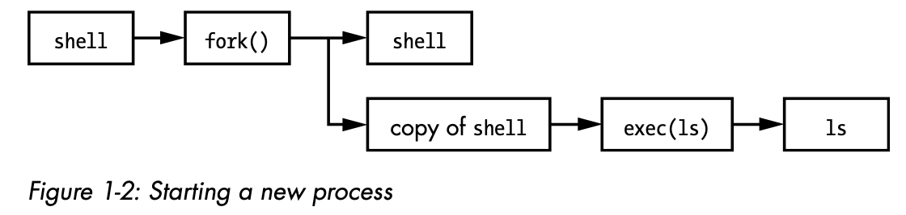

The kernel is software residing in memory that tells the CPU where to look for its next task. Acting as a mediator, the kernel manages the hardware (especially main memory) and is the primary interface between the hardware and any running program.

There is a critical difference between how the kernel and the user processes run: the kernel runs in kernel mode, and the user processes run in user mode. Code running in kernel mode has unrestricted access to the processor and main memory. This is a powerful but dangerous privilege that allows the kernel to easily corrupt and crash the entire system. The memory area that only the kernel can access is called kernel space.

User mode, in comparison, restricts access to a (usually quite small) subset of memory and safe CPU operations. User space refers to the parts of main memory that the user processes can access. If a process makes a mistake and crashes, the consequences are limited and can be cleaned up by the kernel. This means that if your web browser crashes, it probably won’t take down the scientific computation that has been running in the background for days.

The Linux kernel can run kernel threads, which look much like processes but have access to kernel space. Some examples are *kthreadd* and *kblockd*.

Of all of the hardware on a computer system, main memory is perhaps the most important. In its rawest form, main memory is just a big storage area for a bunch of 0s and 1s. Each slot for a 0 or 1 is called a bit. This is where the running kernel and processes reside—they’re just big collections of bits. A CPU is just an operator on memory; it reads its instructions and data from the memory and writes data back out to the memory.

Because it’s common to refer to the state in abstract terms rather than to the actual bits, the term image refers to a particular physical arrangement of bits.

Why are we talking about main memory and states? Nearly everything that the kernel does revolves around main memory. One of the kernel’s tasks is to split memory into many subdivisions, and it must maintain certain state information about those subdivisions at all times. Each process gets its own share of memory, and the kernel must ensure that each process keeps to its share.

The kernel is in charge of managing tasks in four general system areas: 

- **Processes**: The kernel is responsible for determining which processes are allowed to use the CPU.
- **Memory**: The kernel needs to keep track of all memory—what is currently allocated to a particular process, what might be shared between processes, and what is free.
- **Device drivers**: The kernel acts as an interface between hardware (such as a disk) and processes. It’s usually the kernel’s job to operate the hardware.
- **System calls and support**: Processes normally use system calls to communicate with the kernel.

### Process Management

Process management describes the starting, pausing, resuming, scheduling, and terminating of processes.

On any modern operating system, many processes run “simultaneously.” For example, you might have a web browser and a spreadsheet open on a desktop computer at the same time. However, things are not as they appear: the processes behind these applications typically do not run at exactly the same time.

Consider a system with a one-core CPU. Many processes may be able to use the CPU, but only one process can actually use the CPU at any given time. In practice, each process uses the CPU for a small fraction of a second, then pauses; then another process uses the CPU for another small fraction of a second; then another process takes a turn, and so on. The act of one process giving up control of the CPU to another process is called a context switch.

Each piece of time—called a time slice—gives a process enough time for significant computation (and indeed, a process often finishes its current task during a single slice). However, because the slices are so small, humans can’t perceive them, and the system appears to be running multiple processes at the same time (a capability known as multitasking).

### Memory Management

The kernel must manage memory during a context switch, which can be a complex job. The following conditions must hold: 

- The kernel must have its own private area in memory that user processes can’t access.
- Each user process needs its own section of memory.
- One user process may not access the private memory of another process.
- User processes can share memory.
- Some memory in user processes can be read-only.
- The system can use more memory than is physically present by using disk space as auxiliary.

Fortunately for the kernel, there is help. Modern CPUs include a memory management unit (MMU) that enables a memory access scheme called virtual memory. When using virtual memory, a process does not directly access the memory by its physical location in the hardware. Instead, the kernel sets up each process to act as if it had an entire machine to itself. When the process accesses some of its memory, the MMU intercepts the access and uses a memory address map to translate the memory location from the process point of view into an actual physical memory location in the machine. The kernel must still initialize and continuously maintain and alter this memory address map. For example, during a context switch, the kernel has to change the map from the outgoing process to the incoming process. The implementation of a memory address map is called a page table.

### Device Drivers and Management

The kernel’s role with devices is relatively simple. A device is typically accessible only in kernel mode because improper access (such as a user process asking to turn off the power) could crash the machine. A notable difficulty is that different devices rarely have the same programming interface, even if the devices perform the same task (for example, two different network cards). Therefore, device drivers have traditionally been part of the kernel, and they strive to present a uniform interface to user processes in order to simplify the software developer’s job.

### System Calls and Support

The acts of opening, reading, and writing files all involve system calls.

Two system calls, fork() and exec(), are important to understanding how processes start: 

- `fork()`: When a process calls fork(), the kernel creates a nearly identical copy of the process.
- `exec()`: When a process calls exec(program), the kernel loads and starts program, replacing the current process.

Other than init, all new user processes on a Linux system start as a result of fork(), and most of the time, you also run exec() to start a new program instead of running a copy of an existing process. A very simple example is any program that you run at the command line, such as the ls command to show the contents of a directory. When you enter ls into a terminal window, the shell that’s running inside the terminal window calls fork() to create a copy of the shell, and then the new copy of the shell calls exec(ls) to run ls. Figure 1-2 shows the flow of processes and system calls for starting a program like ls.

