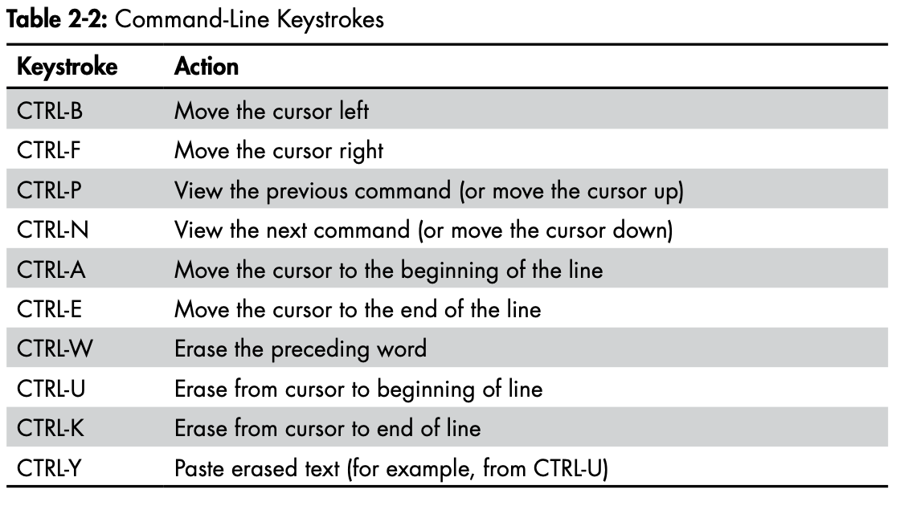
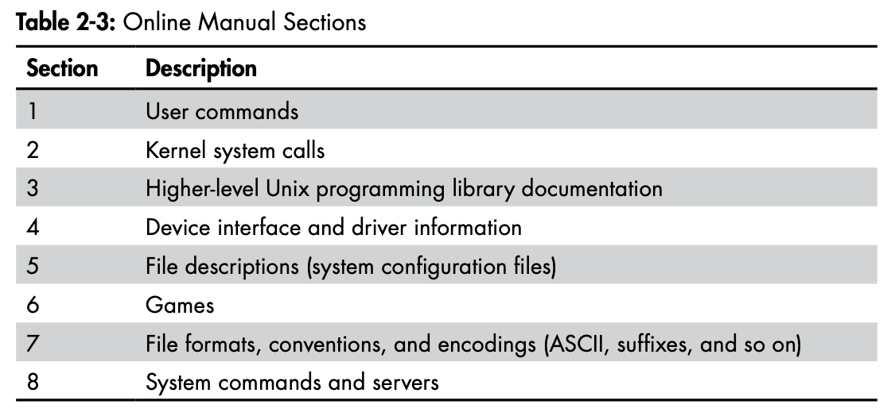

## Basic Command and Directory Hierarchy

### Basic Commands

#### `ls`

#### `cp`

To copy file1 to file2:

```sh
$ cp file1 file2
```

You can also copy a file to another directory, keeping the same file name in that directory:

```sh
$ cp file dir
```

To copy more than one file to a directory (folder) named dir, try something like this example, which copies three files:

```sh
$ cp file1 file2 file3 dir	
```

#### `mv`

The mv (move) command works much like cp. In its simplest form, it renames a file. For example, to rename file1 to file2, enter this:

```sh
$ mv file1 file2
```

You can also use mv to move files to other directories in the same way as cp.

#### `touch`

The touch command can create a file. If the target file already exists, touch doesn’t change the file, but it does update the file’s modification timestamp.

```
$ touch file

$ ls -l file
```

#### `rm`

#### `echo`

The echo command prints its arguments to the standard output.

### Navigating Directories

#### `cd`

#### `mkdir`

#### `rmdir`

#### Shell Globbing (“Wildcards”)

The shell can match simple patterns to file and directory names, a process known as globbing. This is similar to the concept of wildcards in other systems.  The simplest of these is the glob character `*`, which tells the shell to match any number of arbitrary characters. For example, the following command prints a list of files in the current directory:

```
$ echo *
```

Here are some ways to use * to expand filenames: 

- `at*` expands to all filenames that start with at.
- `*at` expands to all filenames that end with at.
- `*at*` expands to all filenames that contain at.

Another shell glob character, the question mark (`?`), instructs the shell to match exactly one arbitrary character. For example, `b?at` matches `boat` and `brat`.

If you don’t want the shell to expand a glob in a command, enclose the glob in single quotes (`''`). For example, the command `echo '*'` prints a star.

### Intermediate Commands

#### `grep`

The `grep` command prints the lines from a file or input stream that match an expression. For example, to print the lines in the `/etc/passwd` file that contain the text `root`, enter this:

```
$ grep root /etc/passwd
```

For example, if you want to check every file in `/etc` that contains the word `root`, you could use this command:

```
$ grep root /etc/*
```

Two of the most important grep options are `-i` (for case-insensitive matches) and `-v` (which inverts the search—that is, prints all lines that don’t match). There is also a more powerful variant called `egrep` (which is just a synonym for `grep -E`).

`grep` understands regular expressions. There are three important things to remember about regular expressions: 

- `.*` matches any number of characters, including none (like the `*` in globs and wildcards).
- `.+` matches any one or more characters.
- `.` matches exactly one arbitrary character.

#### `less`

The `less` command comes in handy when a file is really big or when a command’s output is long and scrolls off the top of the screen.

To page through a big file like `/usr/share/dict/words`, you can use the command `less /usr/share/dict/words`. When running `less`, you’ll see the contents of the file one screenful at a time. Press the **spacebar** to go forward in the file and press **b** (lowercase) to skip back one screenful. To quit, press **q**.

**Note**: The `less` command is an enhanced version of an older program named `more`. If you ever run into a situation when you can’t use `less`, try `more`.

You can also search for text inside `less`. For example, to search forward for a `word`, you can type `/word`, and to search backward, you can use `?word`.  When you find a match, press **n** to continue searching.

You can send the standard output of nearly any program directly to another program’s standard input. This is exceptionally useful when you have a command with a lot of output to sift through and you’d like to use something like `less` to view the output. Here’s an example of sending the output of a `grep` command to `less`:

```
$ grep ie /usr/share/dict/words | less
```

#### `pwd`

#### `diff`

To see the differences between two text files, use `diff`:

```
$ diff file1 file2
```

Several options can control the format of the output, and the default output format is often the most comprehensible for human beings. However, most programmers prefer the output from `diff -u` when they need to send the output to someone else, because automated tools have an easier time with this format.

#### `file`

If you see a file and are unsure of its format, try using the `file` command to see if the system can guess it:

```
$ file file
```

#### `find` and `locate`

It’s frustrating when you know that a certain file is in a directory tree somewhere but you just don’t know where. Run `find` to find `file` in `dir` as follows:

```
$ find dir -name file -print
```

Most systems also have a `locate` command for finding files. Rather than searching for a file in real time, `locate` searches an index that the system builds periodically. Searching with `locate` is much faster than `find`, but if the file you’re looking for is newer than the index, `locate` won’t find it.

#### `head` and `tail`

The `head` and `tail` commands allow you to quickly view a portion of a file or stream of data. For example, `head /etc/passwd` shows the first 10 lines of the password file, and `tail /etc/passwd` shows the last 10 lines.

To change the number of lines to display, use the `-n` option, where n is the number of lines you want to see (for example, `head -5 /etc/passwd`).

#### `sort`

The `sort` command quickly puts the lines of a text file in alphanumeric order. If the file’s lines start with numbers and you want to sort in numerical order, use the `-n` option. The `-r` option reverses the order of the sort.

### Changing Your Password and Shell

Use the `passwd` command to change your password.

You can change your shell with the `chsh` command (to an alternative such as `zsh`, `ksh` or `tcsh`)

### Environment and Shell Variables

The shell can store temporary variables, called shell variables, containing the values of text strings.

To assign a value to a shell variable, use the equal sign (=). Here’s a simple example:

```
$ STUFF=blah
```

The preceding example sets the value of the variable named `STUFF` to `blah`. To access this variable, use `$STUFF` (for example, try running `echo $STUFF`).

**Note**: Don’t put any spaces around the `=` when assigning a variable.

An environment variable is like a shell variable, but it’s not specific to the shell. All processes on Unix systems have environment variable storage. The main difference between environment and shell variables is that the operating system passes all of your shell’s environment variables to programs that the shell runs, whereas shell variables cannot be accessed in the commands that you run.

You assign an environment variable with the shell’s `export` command. For example, if you’d like to make the `$STUFF` shell variable into an environment variable, use the following:

```
$ STUFF=blah 
$ export STUFF
```

Because child processes inherit environment variables from their parent, many programs read them for configuration and options. For example, you can put your favorite `less` command-line options in the `LESS` environment variable, and less will use those options when you run it.

### The Command Path

`PATH` is a special environment variable that contains the command path (or path for short), a list of system directories that the shell searches when trying to locate a command. For example, when you run `ls`, the shell searches the directories listed in `PATH` for the `ls` program. If programs with the same name appear in several directories in the path, the shell runs the first matching program.

If you run echo `$PATH`, you’ll see that the path components are separated by colons (`:`).

To tell the shell to look in more places for programs, change the `PATH` environment variable. For example, by using this command, you can add a directory `dir` to the beginning of the path so that the shell looks in `dir` before looking in any of the other `PATH` directories:

```
$ PATH=dir:$PATH
```

Or you can append a directory name to the end of the `PATH` variable, causing the shell to look in `dir` last:

```
$ PATH=$PATH:dir
```

### Command-Line Editing



### Getting Online Help

To search for a manual page by keyword, use the `-k` option:

```
$ man -k keyword
```

This is helpful if you don’t quite know the name of the command that you want. For example, if you’re looking for a command to sort something, run:

```
$ man -k sort
```



For example, to read the `/etc/passwd` file description (as opposed to the `passwd` command), you can insert the section number before the page name like so:

```
$ man 5 passwd
```

If you’re just looking for a certain option for a command, try entering a command name followed by `--help` or `-h`

### Shell Input and Output

To send the output of command to a file instead of the terminal, use the `>` redirection character:

```
$ command > file
```

The shell creates `file` if it does not already exist. If `file` exists, the shell erases (clobbers) the original file first. (Some shells have parameters that prevent clobbering. For example, you can enter `set -C` to avoid clobbering in `bash`.) 

You can append the output to the file instead of overwriting it with the `>>` redirection syntax:

```
$ command >> file
```

To send the standard output of a command to the standard input of another command, use the pipe character (`|`). To see how this works, try these two commands:

```
$ head /proc/cpuinfo 
$ head /proc/cpuinfo | tr a-z A-Z
```

#### Standard Error

You can redirect the standard error if you like. For example, to send standard output to `f` and standard error to `e`, use the `2>` syntax, like this:

```
$ ls /fffffffff > f 2> e
```

The number 2 specifies the stream ID that the shell modifies. Stream ID 1 is standard output (the default), and 2 is standard error.

You can also send the standard error to the same place as stdout with the `>&` notation. For example, to send both standard output and standard error to the file named `f`, try this command:

```
$ ls /fffffffff > f 2>&1
```

#### Standard Input Redirection

To channel a file to a program’s standard input, use the `<` operator:

```
$ head < /proc/cpuinfo
```

You will occasionally run into a program that requires this type of redirection, but because most Unix commands accept filenames as arguments, this isn’t very common. For example, the preceding command could have been written as `head /proc/cpuinfo`.

### Listing and Manipulating Processes

