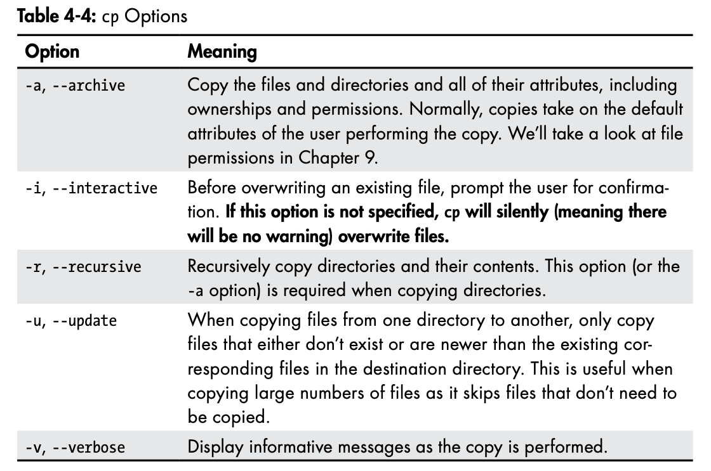
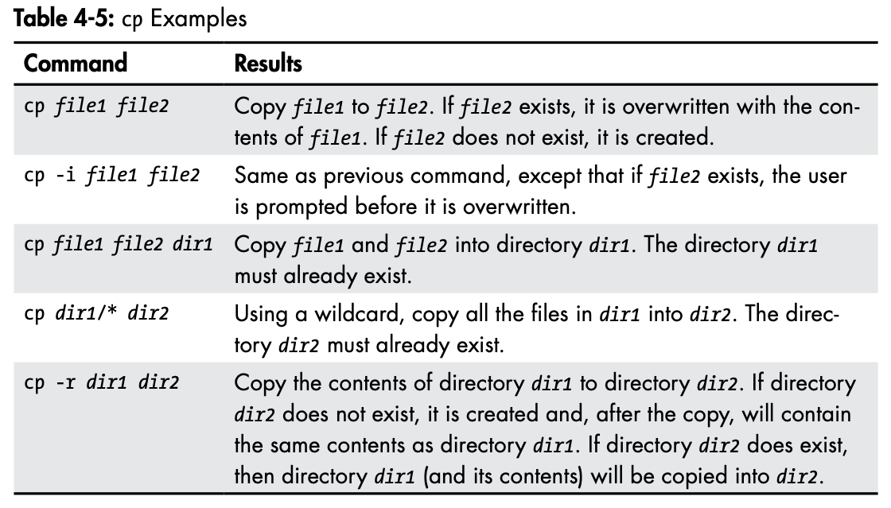

Displays the current time and date:

```
$ date
```

Displays a calendar of the current month:

```
$ cal
```

To see the current amount of free space on our disk drives, enter df.

```
$ df
```

Likewise, to display the amount of free memory, enter the free command.

```
$ free
```

Ending a terminal session:

```
$ exit
```

To display the current working directory, we use the pwd (print working directory) command.

```
$ pwd
```

Listing the contents of a directory:

```
$ ls
```

Change directory:

| Shortcut      | Result                                                       |
| ------------- | ------------------------------------------------------------ |
| cd            | Changes the working directory to your home directory.        |
| cd -          | Changes the working directory to the previous working directory. |
| cd ~user_name | Changes the working directory to the home directory of user_name. |

We can even specify multiple directories. In the following example, we list both the user’s home directory (symbolized by the ~ character) and the /usr directory:

```
$ ls ~ /usr
```


The file command will print a brief description of the file’s contents:

```
$ file picture.jpg
```

Viewing file contents with `less`

```
$ less /etc/passwd
```


## Manipulating Files and Directories

### Wildcards

Because the shell uses filenames so much, it provides special characters to help you rapidly specify groups of filenames. These special characters are called wildcards. Using wildcards (which is also known as globbing) allows you to select filenames based on patterns of characters.

| Wildcard        | Meaning                                                      |
| --------------- | ------------------------------------------------------------ |
| `*`             | Matches any characters                                       |
| `?`             | Matches any single character                                 |
| `[characters]`  | Matches any character that is a member of the set characters |
| `[!characters]` | Matches any character that is not a member of the set characters |
| `[[:class:]]`   | Matches any character that is a member of the specified class |

| Character class | Meaning                            |
| --------------- | ---------------------------------- |
| `[:alnum:]`     | Matches any alphanumeric character |
| `[:alpha:]`     | Matches any alphabetic character   |
| `[:digit:]`     | Matches any numeral                |
| `[:lower:]`     | Matches any lowercase letter       |
| `[:upper:]`     | Matches any uppercase letter       |

| Pattern                  | Matches                                                      |
| ------------------------ | ------------------------------------------------------------ |
| `*`                      | All files                                                    |
| `g*`                     | Any file beginning with g                                    |
| `b*.txt`                 | Any file beginning with b followed by any characters and ending with .txt |
| `Data???`                | Any file beginning with Data followed by exactly three characters |
| `[abc]*`                 | Any file beginning with either a, b, or c                    |
| `BACKUP.[0-9][0-9][0-9]` | Any file beginning with BACKUP. followed by exactly three numerals |
| `[[:upper:]]*`           | Any file beginning with an uppercase letter                  |
| `[![:digit:]]*`          | Any file not beginning with a numeral                        |
| `*[[:lower:]123]`        | Any file ending with a lowercase letter or the numerals 1, 2, or 3 |

**Note**: If you are coming from another Unix-like environment or have been reading some other books on this subject, you may have encountered the `[A-Z]` and `[a-z]` character range notations. These are traditional Unix notations and worked in older versions of Linux as well. They can still work, but you have to be careful with them because they will not produce the expected results unless properly configured. For now, you should avoid using them and use character classes instead.

### `mkdir`—Create Directories

```
$ mkdir directory...
```

Note that when three periods follow an argument in the description of a command, it means that the argument can be repeated.

### `cp`—Copy Files and Directories

```
$ cp item... directory
```





### `mv`—Move and Rename Files


### `rm`—Remove Files and Directories


> ##### Be Careful With `rm`!
>
> Be particularly careful with wildcards. Consider this classic example. Let’s say you want to delete just the HTML files in a directory. To do this, you type the following: `rm *.html`. 
>
> This is correct, but if you accidentally place a space between the * and the .html like so: `rm * .html`, the `rm` command will delete all the files in the directory and then complain that there is no file called `.html`. 
>
> Here is a useful tip: whenever you use wildcards with `rm` (besides carefully checking your typing!), test the wildcard first with `ls`. This will let you see the files that will be deleted. Then press the up arrow to recall the command and replace `ls` with `rm`.


### `ln`—Create Links

The following creates a hard link: `ln file link`. The following creates a symbolic link: `ln -s item link`, where `item` is either a file or a directory.

#### Hard Links

Hard links are the original Unix way of creating links, compared to symbolic links, which are more modern. By default, every file has a single hard link that gives the file its name. When we create a hard link, we create an additional directory entry for a file. Hard links have two important limitations. 

- A hard link cannot reference a file outside its own file system. This means a link cannot reference a file that is not on the same disk partition as the link itself. 
- A hard link may not reference a directory.

A hard link is indistinguishable from the file itself. Unlike a symbolic link, when you list a directory containing a hard link, you will see no special indication of the link. When a hard link is deleted, the link is removed, but the contents of the file itself continue to exist (that is, its space is not deallocated) until all links to the file are deleted. 

It is important to be aware of hard links because you might encounter them from time to time, but modern practice prefers symbolic links.

#### Symbolic Links

Symbolic links were created to overcome the limitations of hard links. They work by creating a special type of file that contains a text pointer to the referenced file or directory. In this regard, they operate in much the same way as a Windows shortcut, though of course they predate the Windows feature by many years. 

A file pointed to by a symbolic link and the symbolic link itself are largely indistinguishable from one another. For example, if you write something to the symbolic link, the referenced file is written to. When you delete a symbolic link, however, only the link is deleted, not the file itself. If the file is deleted before the symbolic link, the link will continue to exist but will point to nothing. In this case, the link is said to be broken. In many implementations, the ls command will display broken links in a distinguishing color, such as red, to reveal their presence.

#### Creating Hard Links

```sh
$ ln fun fun-hard 
$ ln fun dir1/fun-hard 
$ ln fun dir2/fun-hard
```

```
$ ls -l
drwxrwxr-x 2 parallels parallels 4096 Dec 12 12:29 dir1
drwxrwxr-x 2 parallels parallels 4096 Dec 12 12:30 dir2
-rw-r--r-- 4 parallels parallels 2991 Dec 12 12:27 fun
-rw-r--r-- 4 parallels parallels 2991 Dec 12 12:27 fun-hard
```

One thing we notice is that both the second fields in the listings for fun and fun-hard contain a 4, which is the number of hard links that now exist for the file. Remember that a file will always have at least one link because the file’s name is created by a link. So, how do we know that fun and fun-hard are, in fact, the same file?

When we create hard links, we are actually creating additional name parts that all refer to the same data part. The system assigns a chain of disk blocks to what is called an inode, which is then associated with the name part. Each hard link therefore refers to a specific inode containing the file’s contents. 

The ls command has a way to reveal this information. It is invoked with the -i option.

```
$ ls -li
2623505 drwxrwxr-x 2 parallels parallels 4096 Dec 12 12:29 dir1
2623506 drwxrwxr-x 2 parallels parallels 4096 Dec 12 12:30 dir2
2623504 -rw-r--r-- 4 parallels parallels 2991 Dec 12 12:27 fun
2623504 -rw-r--r-- 4 parallels parallels 2991 Dec 12 12:27 fun-hard
```

#### Creating Symbolic Links

```
$ ln -s fun fun-sym
```

One thing to remember about symbolic links is that most file operations are carried out on the link’s target, not the link itself. rm is an exception. When you delete a link, it is the link that is deleted, not the target.

### Getting a Command’s Documentation

#### help—Get Help for Shell Builtins

```
$ help cd
```

#### --help—Display Usage Information

```
$ mkdir --help
```

#### man—Display a Program’s Manual Page

#### apropos—Display Appropriate Commands

```
$ apropos partition
```

#### whatis—Display One-line Manual Page Descriptions

```
$ whatis ls
```

#### info—Display a Program’s Info Entry

#### Creating Our Own Commands with alias

It’s possible to put more than one command on a line by separating each command with a semicolon.

```
$ cd /usr; ls; cd -
```

As we can see, we have combined three commands on one line. First we change the current working directory to `/usr`, then list the directory, and finally return to the original directory (by using `cd -`) so we end up where we started.

Now let’s turn this sequence into a new command using alias. The first thing we have to do is dream up a name for our new command. Let’s try test. Before we do that, it would be a good idea to find out whether the name test is already being used. To find out, we can use the type command again.

```
$ type test
test is a shell builtin
```

The name test is already taken. Let’s try foo.

```
$ type foo
bash: type: foo: not found
```

Great! foo is not taken. So, let’s create our alias.

```
$ alias foo='cd /usr; ls; cd -'
```

We can also use the type command again to see our alias.

```
$ type foo 
foo is aliased to `cd /usr; ls; cd -'
```

To remove an alias, the unalias command is used, like so:

```
$ unalias foo
```

To see all the aliases defined in the environment, use the alias command without arguments.

```
$ alias
```

