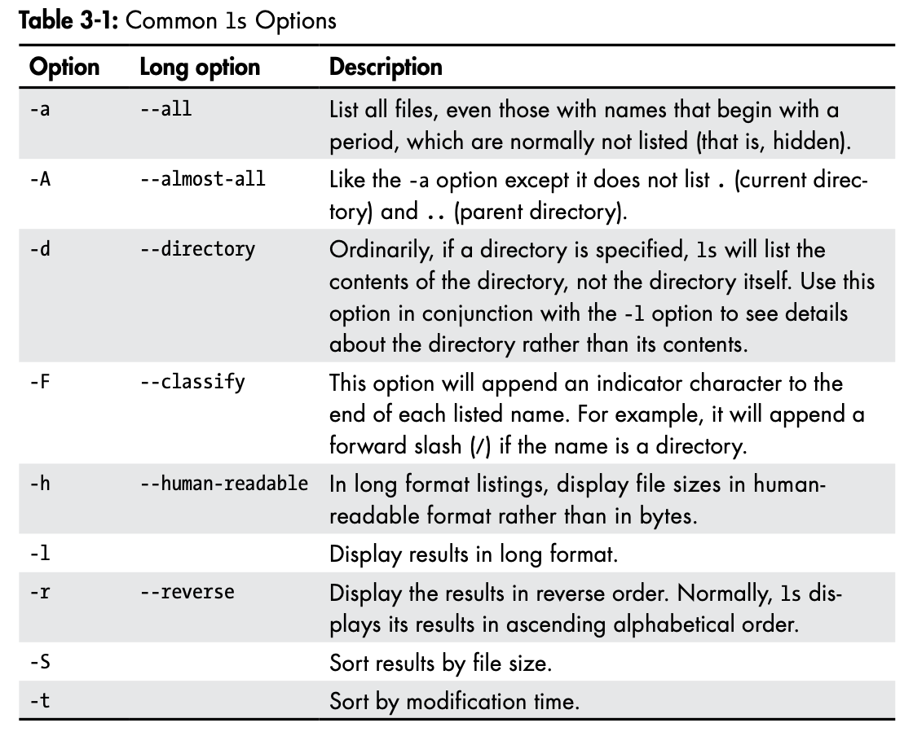

Displays the current time and date:

```
$ date
```

Displays a calendar of the current month:

```
$ cal
```

To see the current amount of free space on our disk drives, enter df.

```
$ df
```

Likewise, to display the amount of free memory, enter the free command.

```
$ free
```

Ending a terminal session:

```
$ exit
```

To display the current working directory, we use the pwd (print working directory) command.

```
$ pwd
```

Listing the contents of a directory:

```
$ ls
```

Change directory:

| Shortcut      | Result                                                       |
| ------------- | ------------------------------------------------------------ |
| cd            | Changes the working directory to your home directory.        |
| cd -          | Changes the working directory to the previous working directory. |
| cd ~user_name | Changes the working directory to the home directory of user_name. |

We can even specify multiple directories. In the following example, we list both the user’s home directory (symbolized by the ~ character) and the /usr directory:

```
$ ls ~ /usr
```



The file command will print a brief description of the file’s contents:

```
$ file picture.jpg
```

Viewing file contents with `less`

```
$ less /etc/passwd
```


## Manipulating Files and Directories

### Wildcards

Because the shell uses filenames so much, it provides special characters to help you rapidly specify groups of filenames. These special characters are called wildcards. Using wildcards (which is also known as globbing) allows you to select filenames based on patterns of characters.

| Wildcard        | Meaning                                                      |
| --------------- | ------------------------------------------------------------ |
| `*`             | Matches any characters                                       |
| `?`             | Matches any single character                                 |
| `[characters]`  | Matches any character that is a member of the set characters |
| `[!characters]` | Matches any character that is not a member of the set characters |
| `[[:class:]]`   | Matches any character that is a member of the specified class |

| Character class | Meaning                            |
| --------------- | ---------------------------------- |
| `[:alnum:]`     | Matches any alphanumeric character |
| `[:alpha:]`     | Matches any alphabetic character   |
| `[:digit:]`     | Matches any numeral                |
| `[:lower:]`     | Matches any lowercase letter       |
| `[:upper:]`     | Matches any uppercase letter       |

| Pattern                  | Matches                                                      |
| ------------------------ | ------------------------------------------------------------ |
| `*`                      | All files                                                    |
| `g*`                     | Any file beginning with g                                    |
| `b*.txt`                 | Any file beginning with b followed by any characters and ending with .txt |
| `Data???`                | Any file beginning with Data followed by exactly three characters |
| `[abc]*`                 | Any file beginning with either a, b, or c                    |
| `BACKUP.[0-9][0-9][0-9]` | Any file beginning with BACKUP. followed by exactly three numerals |
| `[[:upper:]]*`           | Any file beginning with an uppercase letter                  |
| `[![:digit:]]*`          | Any file not beginning with a numeral                        |
| `*[[:lower:]123]`        | Any file ending with a lowercase letter or the numerals 1, 2, or 3 |

**Note**: If you are coming from another Unix-like environment or have been reading some other books on this subject, you may have encountered the `[A-Z]` and `[a-z]` character range notations. These are traditional Unix notations and worked in older versions of Linux as well. They can still work, but you have to be careful with them because they will not produce the expected results unless properly configured. For now, you should avoid using them and use character classes instead.

### `mkdir`—Create Directories

```
$ mkdir directory...
```

Note that when three periods follow an argument in the description of a command, it means that the argument can be repeated.

### `cp`—Copy Files and Directories

```
$ cp item... directory
```


### `mv`—Move and Rename Files