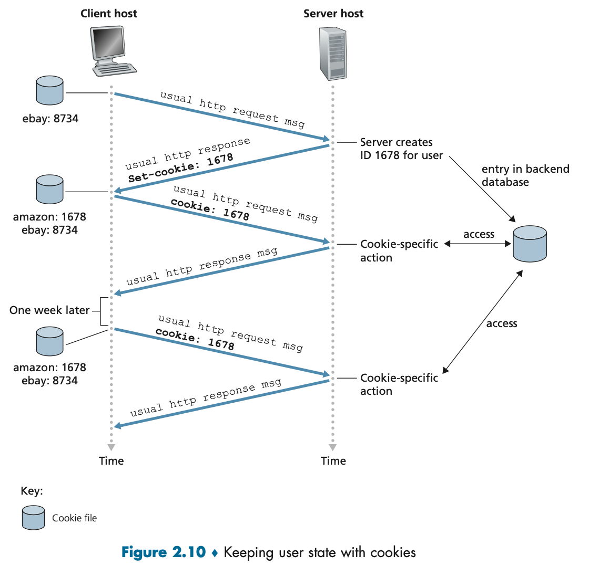

**2.1 Principles of Network Applications**

An application’s architecture is distinctly different from the network architecture (the five-layer Internet architecture). The application architecture, on the other hand, is designed by the application developer and dictates how the application is structured over the various end systems. In choosing the application architecture, an application developer will likely draw on one of the two predominant architectural paradigms used in modern network applications: the client-server architecture or the peer-to-peer (P2P) architecture.

Often in a client-server application, a single-server host is incapable of keeping up with all the requests from clients. For example, a popular social-networking site can quickly become overwhelmed if it has only one server handling all of its requests. For this reason, a **data center**, housing a large number of hosts, is often used to create a powerful virtual server. A data center can have hundreds of thousands of servers, which must be powered and maintained.

In a P2P architecture, there is minimal (or no) reliance on dedicated servers in data centers. Instead, the application exploits direct communication between pairs of intermittently connected hosts, called peers. The peers are not owned by the service provider, but are instead desktops and laptops controlled by users, with most of the peers residing in homes, universities, and offices.

A network application consists of pairs of processes that send messages to each other over a network. For example, in the Web application, a client browser process exchanges messages with a Web server process. In a P2P file-sharing system, a file is transferred from a process in one peer to a process in another peer. For each pair of communicating processes, we typically label one of the two processes as the client and the other process as the server. With the Web, a browser is a client process and a Web server is a server process. With P2P file sharing, the peer that is downloading the file is labeled as the client, and the peer that is uploading the file is labeled as the server.

We define the client and server processes as follows: In the context of a communication session between a pair of processes, the process that initiates the communication (that is, initially contacts the other process at the beginning of the session) is labeled as the client. The process that waits to be contacted to begin the session is the server.

In the Web, a browser process initializes contact with a Web server process; hence the browser process is the client and the Web server process is the server. In P2P file sharing, when Peer A asks Peer B to send a specific file, Peer A is the client and Peer B is the server in the context of this specific communication session. When there’s no confusion, we’ll sometimes also use the terminology “client side and server side of an application.”

A process sends messages into, and receives messages from, the network through a software interface called a socket. Let’s consider an analogy to help us understand processes and sockets. A process is analogous to a house and its socket is analogous to its door. When a process wants to send a message to another process on another host, it shoves the message out its door (socket). This sending process assumes that there is a transportation infrastructure on the other side of its door that will transport the message to the door of the destination process. Once the message arrives at the destination host, the message passes through the receiving process’s door (socket), and the receiving process then acts on the message.

A socket is the interface between the application layer and the transport layer within a host. It is also referred to as the Application Programming Interface (API) between the application and the network. The application developer has control of everything on the application-layer side of the socket but has little control of the transport-layer side of the socket. The only control that the application developer has on the transport-layer side is (1) the choice of transport protocol and (2) perhaps the ability to fix a few transport-layer parameters such as maximum buffer and maximum segment sizes.

Similarly, in order for a process running on one host to send packets to a process running on another host, the receiving process needs to have an address. To identify the receiving process, two pieces of information need to be specified: (1) the address of the host and (2) an identifier that specifies the receiving process in the destination host. In addition to knowing the address of the host to which a message is destined, the sending process must also identify the receiving process (more specifically, the receiving socket) running in the host. A destination **port number** serves this purpose.

Recall that a socket is the interface between the application process and the transport-layer protocol. The application at the sending side pushes messages through the socket. At the other side of the socket, the transport-layer protocol has the responsibility of getting the messages to the socket of the receiving process.

What are the services that a transport-layer protocol can offer to applications invoking it? We can broadly classify the possible services along four dimensions: reliable data transfer, throughput, timing, and security.

For many applications—such as electronic mail, file transfer, remote host access, Web document transfers, and financial applications—data loss can have devastating consequences. Thus, to support these applications, something has to be done to guarantee that the data sent by one end of the application is delivered correctly and completely to the other end of the application. If a protocol provides such a guaranteed data delivery service, it is said to provide reliable data transfer.

When a transport-layer protocol doesn’t provide reliable data transfer, some of the data sent by the sending process may never arrive at the receiving process. This may be acceptable for loss-tolerant applications, most notably multimedia applications such as conversational audio/video that can tolerate some amount of data loss. In these multimedia applications, lost data might result in a small glitch in the audio/video—not a crucial impairment.

A transport protocol can provide an application with one or more security services. For example, in the sending host, a transport protocol can encrypt all data transmitted by the sending process, and in the receiving host, the transport-layer protocol can decrypt the data before delivering the data to the receiving process.

The TCP service model includes a connection-oriented service and a reliable data transfer service. When an application invokes TCP as its transport protocol, the application receives both of these services from TCP.

- _Connection-oriented service_. The connection is a full-duplex connection in that the two processes can send messages to each other over the connection at the same time. When the application finishes sending messages, it must tear down the connection.
- _Reliable data transfer service_. When one side of the application passes a stream of bytes into a socket, it can count on TCP to deliver the same stream of bytes to the receiving socket, with no missing or duplicate bytes.
- TCP also includes a congestion-control mechanism. The TCP congestion-control mechanism throttles a sending process (client or server) when the network is congested between sender and receiver.

UDP is a no-frills, lightweight transport protocol, providing minimal services. UDP is connectionless, so there is no handshaking before the two processes start to communicate. UDP provides an unreliable data transfer service—that is, when a process sends a message into a UDP socket, UDP provides no guarantee that the message will ever reach the receiving process. Furthermore, messages that do arrive at the receiving process may arrive out of order. UDP does not include a congestion-control mechanism, so the sending side of UDP can pump data into the layer below (the network layer) at any rate it pleases.

Neither TCP nor UDP provides any encryption—the data that the sending process passes into its socket is the same data that travels over the network to the destination process. Because privacy and other security issues have become critical for many applications, the Internet community has developed an enhancement for TCP, called Transport Layer Security (TLS). TCP-enhanced-with-TLS not only does everything that traditional TCP does but also provides critical process-to-process security services, including encryption, data integrity, and end-point authentication.

---

**2.2 The Web and HTTP**

The **HyperText Transfer Protocol** (**HTTP**), the Web’s application-layer protocol, is at the heart of the Web. HTTP is implemented in two programs: a client program and a server program. The client program and server program, executing on different end systems, talk to each other by exchanging HTTP messages. HTTP defines the structure of these messages and how the client and server exchange the messages.

Because Web browsers implement the client side of HTTP, in the context of the Web, we will use the words browser and client interchangeably. Web servers, which implement the server side of HTTP, house Web objects, each addressable by a URL.

HTTP uses TCP as its underlying transport protocol (rather than running on top of UDP). The HTTP client first initiates a TCP connection with the server. Once the connection is established, the browser and the server processes access TCP through their socket interfaces. The client sends HTTP request messages into its socket interface and receives HTTP response messages from its socket interface. Similarly, the HTTP server receives request messages from its socket interface and sends response messages into its socket interface. Once the client sends a message into its socket interface, the message is out of the client’s hands and is “in the hands” of TCP. TCP provides a reliable data transfer service to HTTP, this implies that each HTTP request message sent by a client process eventually arrives intact at the server; similarly, each HTTP response message sent by the server process eventually arrives intact at the client. Here we see one of the great advantages of a layered architecture—HTTP need not worry about lost data or the details of how TCP recovers from loss or reordering of data within the network. That is the job of TCP and the protocols in the lower layers of the protocol stack.

It is important to note that the server sends requested files to clients without storing any state information about the client. If a particular client asks for the same object twice in a period of a few seconds, the server does not respond by saying that it just served the object to the client; instead, the server resends the object, as it has completely forgotten what it did earlier. Because an HTTP server maintains no information about the clients, HTTP is said to be a **stateless protocol**.

When this client-server interaction is taking place over TCP, the application developer needs to make an important decision—should each request/response pair be sent over a separate TCP connection, or should all of the requests and their corresponding responses be sent over the same TCP connection? In the former approach, the application is said to use **non-persistent connections**; and in the latter approach, **persistent connections**. HTTP/1.0 is a non-persistent connection, and HTTP/1.1 is a persistent connection.

The **round-trip time** (**RTT**) is the time that takes a small packet to travel from client to server and then back to the client. The RTT includes packet-propagation delays, packet-queuing delays in intermediate routers and switches, and packet-processing delays. The first two parts of the three-way handshake take one RTT. After completing the first two parts of the handshake, the client sends the HTTP request message combined with the third part of the three-way handshake (the acknowledgment) into the TCP connection. Once the request message arrives at the server, the server sends the HTML file into the TCP connection. This HTTP request/response eats up another RTT. Thus, roughly, the total response time is two RTTs plus the transmission time at the server of the HTML file.

The first line of an HTTP request message is called the request line; the subsequent lines are called the header lines. The request line has three fields: the method field, the URL field, and the HTTP version field.

The server uses the _Connection: close_ header line to tell the client that it is going to close the TCP connection after sending the message. The _Date:_ header line indicates the time and date when the HTTP response was created and sent by the server. Note that this is not the time when the object was created or last modified; it is the time when the server retrieves the object from its file system, inserts the object into the response message, and sends the response message. The _Last-Modified:_ header line indicates the time and date when the object was created or last modified. The _Last-Modified:_ header, is critical for object caching, both in the local client and in network cache servers (also known as proxy servers). The _Content-Length:_ header line indicates the number of bytes in the object being sent.

We mentioned above that an HTTP server is stateless. This simplifies server design and has permitted engineers to develop high-performance Web servers that can handle thousands of simultaneous TCP connections. However, it is often desirable for a Web site to identify users, either because the server wishes to restrict user access or because it wants to serve content according to user identity. For these purposes, HTTP uses cookies to allow sites to keep track of users. As shown in Figure 2.10, cookie technology has four components: (1) a cookie header line in the HTTP response message; (2) a cookie header line in the HTTP request message; (3) a cookie file kept on the user’s end system and managed by the user’s browser; and (4) a back-end database at the Web site.

A Web cache—also called a proxy server—is a network entity that satisfies HTTP requests on the behalf of an origin Web server. The Web cache has its own disk storage and keeps copies of recently requested objects in this storage. HTTP has a mechanism that allows a cache to verify that its objects are up to date. This mechanism is called the conditional GET. An HTTP request message is a so-called conditional GET message if (1) the request message uses the GET method and (2) the request message includes an _If-Modified-Since:_ header line.

The primary goals for HTTP/2 are to reduce perceived latency by enabling request and response multiplexing over a single TCP connection, provide request prioritization and server push, and provide efficient compression of HTTP header fields. HTTP/2 does not change HTTP methods, status codes, URLs, or header fields. Instead, HTTP/2 changes how the data is formatted and transported between the client and server.

To motivate the need for HTTP/2, recall that HTTP/1.1 uses persistent TCP connections, allowing a Web page to be sent from server to client over a single TCP connection. By having only one TCP connection per Web page, the number of sockets at the server is reduced and each transported Web page gets a fair share of the network bandwidth. But developers of Web browsers quickly discovered that sending all the objects in a Web page over a single TCP connection has a **Head of Line** (**HOL**) blocking problem. To understand HOL blocking, consider a Web page that includes an HTML base page, a large video clip near the top of Web page, and many small objects below the video. Further suppose there is a low-to-medium speed bottleneck link (for example, a low-speed wireless link) on the path between server and client. Using a single TCP connection, the video clip will take a long time to pass through the bottleneck link, while the small objects are delayed as they wait behind the video clip; that is, the video clip at the head of the line blocks the small objects behind it. HTTP/1.1 browsers typically work around this problem by opening multiple parallel TCP connections, thereby having objects in the same web page sent in parallel to the browser. This way, the small objects can arrive at and be rendered in the browser much faster, thereby reducing user-perceived delay.

Very roughly speaking, TCP congestion control aims to give each TCP connection sharing a bottleneck link an equal share of the available bandwidth of that link; so if there are n TCP connections operating over a bottleneck link, then each connection approximately gets 1/nth of the bandwidth. By opening multiple parallel TCP connections to transport a single Web page, the browser can “cheat” and grab a larger portion of the link bandwidth. Many HTTP/1.1 browsers open up to six parallel TCP connections not only to circumvent HOL blocking but also to obtain more bandwidth.

One of the primary goals of HTTP/2 is to get rid of (or at least reduce the number of) parallel TCP connections for transporting a single Web page. This not only reduces the number of sockets that need to be open and maintained at servers, but also allows TCP congestion control to operate as intended. But with only one TCP connection to transport a Web page, HTTP/2 requires carefully designed mechanisms to avoid HOL blocking.

The HTTP/2 solution for HOL blocking is to break each message into small frames, and interleave the request and response messages on the same TCP connection. To understand this, consider again the example of a Web page consisting of one large video clip and, say, 8 smaller objects. Thus the server will receive 9 concurrent requests from any browser wanting to see this Web page. For each of these requests, the server needs to send 9 competing HTTP response messages to the browser. Suppose all frames are of fixed length, the video clip consists of 1000 frames, and each of the smaller objects consists of two frames. With frame interleaving, after sending one frame from the video clip, the first frames of each of the small objects are sent. Then after sending the second frame of the video clip, the last frames of each of the small objects are sent. Thus, all of the smaller objects are sent after sending a total of 18 frames. If interleaving were not used, the smaller objects would be sent only after sending 1016 frames. Thus the HTTP/2 framing mechanism can significantly decrease user-perceived delay

The ability to break down an HTTP message into independent frames, interleave them, and then reassemble them on the other end is the single most important enhancement of HTTP/2. The framing is done by the framing sub-layer of the HTTP/2 protocol. When a server wants to send an HTTP response, the response is processed by the framing sub-layer, where it is broken down into frames. The header field of the response becomes one frame, and the body of the message is broken down into one or more additional frames. The frames of the response are then interleaved by the framing sub-layer in the server with the frames of other responses and sent over the single persistent TCP connection. As the frames arrive at the client, they are first reassembled into the original response messages at the framing sub-layer and then processed by the browser as usual. Similarly, a client’s HTTP requests are broken into frames and interleaved.

Message prioritization allows developers to customize the relative priority of requests to better optimize application performance. When a client sends concurrent requests to a server, it can prioritize the responses it is requesting by assigning a weight between 1 and 256 to each message. The higher number indicates higher priority. Using these weights, the server can send first the frames for the responses with the highest priority. In addition to this, the client also states each message’s dependency on other messages by specifying the ID of the message on which it depends.

Another feature of HTTP/2 is the ability for a server to send multiple responses for a single client request. That is, in addition to the response to the original request, the server can push additional objects to the client, without the client having to request each one. This is possible since the HTML base page indicates the objects that will be needed to fully render the Web page. So instead of waiting for the HTTP requests for these objects, the server can analyze the HTML page, identify the objects that are needed, and send them to the client before receiving explicit requests for these objects. Server push eliminates the extra latency due to waiting for the requests.
