**3.1 Introduction and Transport-Layer Services**

A transport-layer protocol provides for **logical communication** between application processes running on different hosts. By logical communication, we mean that from an application’s perspective, it is as if the hosts running the processes were directly connected; in reality, the hosts may be on opposite sides of the planet, connected via numerous routers and a wide range of link types. Application processes use the logical communication provided by the transport layer to send messages to each other, free from the worry of the details of the physical infrastructure used to carry these messages.

Transport-layer protocols are implemented in the end systems but not in network routers. On the sending side, the transport layer converts the application-layer messages it receives from a sending application process into transport-layer packets, known as transport-layer segments in Internet terminology. This is done by (possibly) breaking the application messages into smaller chunks and adding a transport-layer header to each chunk to create the transport-layer segment. The transport layer then passes the segment to the network layer at the sending end system, where the segment is encapsulated within a network-layer packet (a datagram) and sent to the destination. It’s important to note that network routers act only on the network-layer fields of the datagram; that is, they do not examine the fields of the transport-layer segment encapsulated with the datagram. On the receiving side, the network layer extracts the transport-layer segment from the datagram and passes the segment up to the transport layer. The transport layer then processes the received segment, making the data in the segment available to the receiving application.

Whereas a transport-layer protocol provides logical communication between _processes_ running on different hosts, a network-layer protocol provides logical communication between _hosts_. This distinction is subtle but important.

The services that a transport protocol can provide are often constrained by the service model of the underlying network-layer protocol. If the network-layer protocol cannot provide delay or bandwidth guarantees for transport-layer segments sent between hosts, then the transport-layer protocol cannot provide delay or bandwidth guarantees for application messages sent between processes. Nevertheless, certain services can be offered by a transport protocol even when the underlying network protocol doesn’t offer the corresponding service at the network layer. For example, a transport protocol can offer reliable data transfer service to an application even when the underlying network protocol is unreliable, that is, even when the network protocol loses, garbles, or duplicates packets. As another example, a transport protocol can use encryption to guarantee that application messages are not read by intruders, even when the network layer cannot guarantee the confidentiality of transport-layer segments.

Recall that the Internet makes two distinct transport-layer protocols available to the application layer. One of these protocols is UDP (User Datagram Protocol), which provides an unreliable, connectionless service to the invoking application. The second of these protocols is TCP (Transmission Control Protocol), which provides a reliable, connection-oriented service to the invoking application.

To simplify terminology, we refer to the transport-layer packet as a segment. We mention, however, that the Internet literature (for example, the RFCs) also refers to the transport-layer packet for TCP as a segment but often refers to the packet for UDP as a datagram. However, this same Internet literature also uses the term datagram for the network-layer packet! To make it less confusing, we refer to both TCP and UDP packets as segments, and reserve the term datagram for the network-layer packet.

The Internet’s network-layer protocol has a name—IP, for Internet Protocol. IP provides logical communication between hosts. The IP service model is a best-effort delivery service. This means that IP makes its “best effort” to deliver segments between communicating hosts, but it makes no guarantees. In particular, it does not guarantee segment delivery, it does not guarantee orderly delivery of segments, and it does not guarantee the integrity of the data in the segments. For these reasons, IP is said to be an unreliable service.

The most fundamental responsibility of UDP and TCP is to extend IP’s delivery service between two end systems to a delivery service between two processes running on the end systems. Extending host-to-host delivery to process-to-process delivery is called transport-layer **multiplexing** and **demultiplexing**.

UDP and TCP also provide integrity checking by including error-detection fields in their segments’ headers. These two minimal transport-layer services—process-to-process data delivery and error checking—are the only two services that UDP provides! In particular, like IP, UDP is an unreliable service—it does not guarantee that data sent by one process will arrive intact (or at all!) to the destination process.

TCP, on the other hand, offers several additional services to applications. First and foremost, it provides reliable data transfer. Using flow control, sequence numbers, acknowledgments, and timers (techniques we’ll explore in detail in this chapter), TCP ensures that data is delivered from the sending process to the receiving process, correctly and in order. TCP thus converts IP’s unreliable service between end systems into a reliable data transport service between processes. TCP also provides congestion control. Congestion control is not so much a service provided to the invoking application as it is a service for the Internet as a whole, a service for the general good. Loosely speaking, TCP congestion control prevents any one TCP connection from swamping the links and routers between communicating hosts with an excessive amount of traffic. TCP strives to give each connection traversing a congested link an equal share of the link bandwidth. This is done by regulating the rate at which the sending sides of TCP connections can send traffic into the network. UDP traffic, on the other hand, is unregulated. An application using UDP transport can send at any rate it pleases, for as long as it pleases.

---

**3.2 Multiplexing and Demultiplexing**

At the destination host, the transport layer receives segments from the network layer just below. The transport layer has the responsibility of delivering the data in these segments to the appropriate application process running in the host.

A process (as part of a network application) can have one or more sockets, doors through which data passes from the network to the process and through which data passes from the process to the network. Thus, the transport layer in the receiving host does not actually deliver data directly to a process, but instead to an intermediary socket.

Now let’s consider how a receiving host directs an incoming transport-layer segment to the appropriate socket. Each transport-layer segment has a set of fields in the segment for this purpose. At the receiving end, the transport layer examines these fields to identify the receiving socket and then directs the segment to that socket. This job of delivering the data in a transport-layer segment to the correct socket is called demultiplexing. The job of gathering data chunks at the source host from different sockets, encapsulating each data chunk with header information (that will later be used in demultiplexing) to create segments, and passing the segments to the network layer is called multiplexing.

To illustrate the demultiplexing job, recall the household analogy in the previous section. Each of the kids is identified by his or her name. When Bill receives a batch of mail from the mail carrier, he performs a demultiplexing operation by observing to whom the letters are addressed and then hand delivering the mail to his brothers and sisters. Ann performs a multiplexing operation when she collects letters from her brothers and sisters and gives the collected mail to the mailperson.

From the discussion above, we know that transport-layer multiplexing requires (1) that sockets have unique identifiers, and (2) that each segment has special fields that indicate the socket to which the segment is to be delivered. These special fields are the source port number field and the destination port number field. Each port number is a 16-bit number, ranging from 0 to 65535. The port numbers ranging from 0 to 1023 are called well-known port numbers and are restricted.

It should now be clear how the transport layer could implement the demultiplexing service: Each socket in the host could be assigned a port number, and when a segment arrives at the host, the transport layer examines the destination port number in the segment and directs the segment to the corresponding socket. The segment’s data then passes through the socket into the attached process. As we’ll see, this is basically how UDP does it. However, we’ll also see that multiplexing/demultiplexing in TCP is yet more subtle.

One subtle difference between a TCP socket and a UDP socket is that a TCP socket is identified by a four-tuple: (source IP address, source port number, destination IP address, destination port number). Thus, when a TCP segment arrives from the network to a host, the host uses all four values to direct (demultiplex) the segment to the appropriate socket. In particular, and in contrast with UDP, two arriving TCP segments with different source IP addresses or source port numbers will (with the exception of a TCP segment carrying the original connection-establishment request) be directed to two different sockets.

The server host may support many simultaneous TCP connection sockets, with each socket attached to a process, and with each socket identified by its own four-tuple. When a TCP segment arrives at the host, all four fields (source IP address, source port, destination IP address, destination port) are used to direct (demultiplex) the segment to the appropriate socket.

> [Difference between port number and socket](https://stackoverflow.com/questions/35828447/difference-between-port-number-and-socket)
>
> - A computer running IP networking always has a fixed number of ports -- 65535 TCP ports and 65535 UDP ports. A network packet's header contains a 16-bit unsigned field specifying which of those ports the packet should be delivered to.
>
> - Sockets, on the other hand, are demand-allocated by each program. A socket serves as a handle/interface between the program and the OS's networking stack, and is used to build and specify a context for a particular networking task. A socket may or may not be bound to a port, and it's also possible (and common) to have more than one socket bound to a particular port at the same time.

As we mentioned before, there is not always a one-to-one correspondence between connection sockets and processes. In fact, today’s high-performing Web servers often use only one process, and create a new thread with a new connection socket for each new client connection.

---

**3.3 Connectionless Transport: UDP**

If the application developer chooses UDP instead of TCP, then the application is almost directly talking with IP. UDP takes messages from the application process, attaches source and destination port number fields for the multiplexing/demultiplexing service, adds two other small fields, and passes the resulting segment to the network layer. The network layer encapsulates the transport-layer segment into an IP datagram and then makes a best-effort attempt to deliver the segment to the receiving host. If the segment arrives at the receiving host, UDP uses the destination port number to deliver the segment’s data to the correct application process. Note that with UDP there is no handshaking between sending and receiving transport-layer entities before sending a segment. For this reason, UDP is said to be connectionless.

DNS is an example of an application-layer protocol that typically uses UDP. When the DNS application in a host wants to make a query, it constructs a DNS query message and passes the message to UDP. Without performing any handshaking with the UDP entity running on the destination end system, the host-side UDP adds header fields to the message and passes the resulting segment to the network layer. The network layer encapsulates the UDP segment into a datagram and sends the datagram to a name server. The DNS application at the querying host then waits for a reply to its query. If it doesn’t receive a reply (possibly because the underlying network lost the query or the reply), it might try resending the query, try sending the query to another name server, or inform the invoking application that it can’t get a reply.

The reason to choose UDP instead of TCP:

- _Finer application-level control over what data is sent, and when._ Under UDP, as soon as an application process passes data to UDP, UDP will package the data inside a UDP segment and immediately pass the segment to the network layer. TCP, on the other hand, has a congestion-control mechanism that throttles the transport-layer TCP sender when one or more links between the source and destination hosts become excessively congested. TCP will also continue to resend a segment until the receipt of the segment has been acknowledged by the destination, regardless of how long reliable delivery takes. Since real-time applications often require a minimum sending rate, do not want to overly delay segment transmission, and can tolerate some data loss, TCP’s service model is not particularly well matched to these applications’ needs.
- _No connection establishment_. TCP uses a three-way handshake before it starts to transfer data. UDP just blasts away without any formal preliminaries. Thus UDP does not introduce any delay to establish a connection. This is probably the principal reason why DNS runs over UDP rather than TCP—DNS would be much slower if it ran over TCP. HTTP uses TCP rather than UDP, since reliability is critical for Web pages with text. The TCP connection-establishment delay in HTTP is an important contributor to the delays associated with downloading Web documents. Indeed, the QUIC protocol (Quick UDP Internet Connection), used in Google’s Chrome browser, uses UDP as its underlying transport protocol and implements reliability in an application-layer protocol on top of UDP.
- _No connection state_. TCP maintains connection state in the end systems. This connection state includes receive and send buffers, congestion-control parameters, and sequence and acknowledgment number parameters. UDP, on the other hand, does not maintain connection state and does not track any of these parameters. For this reason, a server devoted to a particular application can typically support many more active clients when the application runs over UDP rather than TCP.
- _Small packet header overhead_. The TCP segment has 20 bytes of header overhead in every segment, whereas UDP has only 8 bytes of overhead.

Although commonly done today, running multimedia applications over UDP needs to be done with care. UDP has no congestion control, if everyone were to start streaming high-bit-rate video without using any congestion control, there would be so much packet overflow at routers that very few UDP packets would successfully traverse the source-to-destination path. Moreover, the high loss rates induced by the uncontrolled UDP senders would cause the TCP senders to dramatically decrease their rates. Thus, the lack of congestion control in UDP can result in high loss rates between a UDP sender and receiver, and the crowding out of TCP sessions. Many researchers have proposed new mechanisms to force all sources, including UDP sources, to perform adaptive congestion control.

The UDP header has only four fields, each consisting of two bytes. The port numbers allow the destination host to pass the application data to the correct process running on the destination end system (that is, to perform the demultiplexing function). The length field specifies the number of bytes in the UDP segment (header plus data). An explicit length value is needed since the size of the data field may differ from one UDP segment to the next. The checksum is used by the receiving host to check whether errors have been introduced into the segment. In truth, the checksum is also calculated over a few of the fields in the IP header in addition to the UDP segment. But we ignore this detail in order to see the forest through the trees.

The checksum is used to determine whether bits within the UDP segment have been altered (for example, by noise in the links or while stored in a router) as they moved from source to destination. UDP at the sender side performs the 1's complement of the sum of all the 16-bit words in the segment, with any overflow encountered during the sum being **wrapped around**. This result is put in the checksum field of the UDP segment. At the receiver, all four 16-bit words are added, including the checksum. If no errors are introduced into the packet, then clearly the sum at the receiver will be 1111111111111111. If one of the bits is a 0, then we know that errors have been introduced into the packet.

You may wonder why UDP provides a checksum in the first place, as many link-layer protocols (including the popular Ethernet protocol) also provide error checking. The reason is that there is no guarantee that all the links between source and destination provide error checking; that is, one of the links may use a link-layer protocol that does not provide error checking. Furthermore, even if segments are correctly transferred across a link, it’s possible that bit errors could be introduced when a segment is stored in a router’s memory. Given that neither link-by-link reliability nor in-memory error detection is guaranteed, UDP must provide error detection at the transport layer. Although UDP provides error checking, it does not do anything to recover from an error. Some implementations of UDP simply discard the damaged segment; others pass the damaged segment to the application with a warning.

---

**3.4 Principles of Reliable Data Transfer**

Reliable Data Transfer over a Perfectly Reliable Channel: rdt1.0

> The finite-state machine (FSM) definitions for the rdt1.0 sender and receiver are shown in Figure 3.9. The arrows in the FSM description indicate the transition of the protocol from one state to another. The event causing the transition is shown above the horizontal line labeling the transition, and the actions taken when the event occurs are shown below the horizontal line. When no action is taken on an event, or no event occurs and an action is taken, we’ll use the symbol Λ below or above the horizontal, respectively, to explicitly denote the lack of an action or event. The initial state of the FSM is indicated by the dashed arrow. Although the FSMs in Figure 3.9 have but one state, the FSMs we will see shortly have multiple states, so it will be important to identify the initial state of each FSM.
>
> 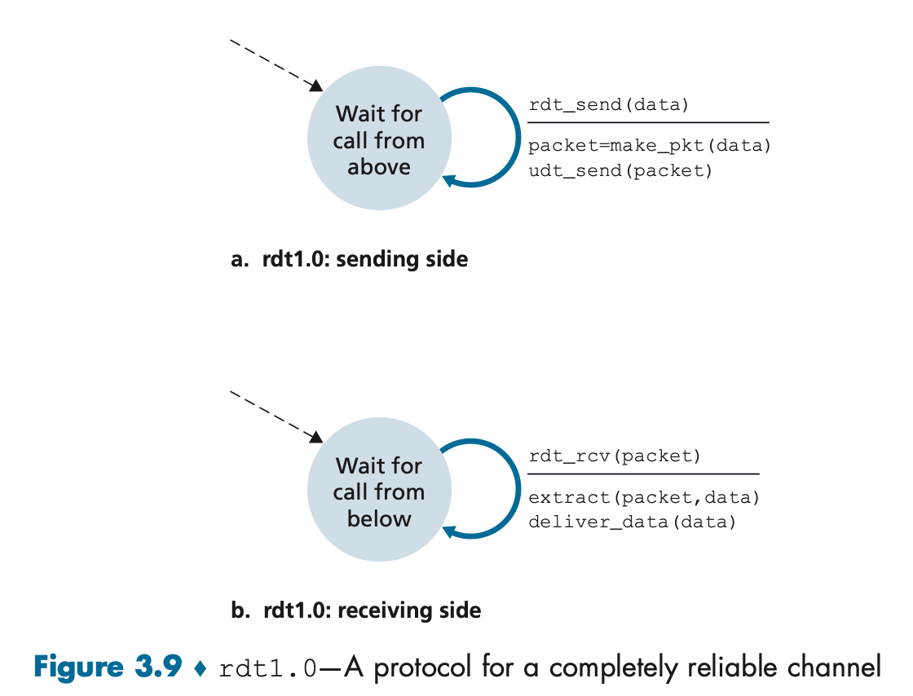
>
> In this simple protocol, there is no difference between a unit of data and a packet. Also, all packet flow is from the sender to receiver; with a perfectly reliable channel there is no need for the receiver side to provide any feedback to the sender since nothing can go wrong! Note that we have also assumed that the receiver is able to receive data as fast as the sender happens to send data. Thus, there is no need for the receiver to ask the sender to slow down!

Reliable Data Transfer over a Channel with Bit Errors: rdt2.0

> In a real-life scenario, when we dictate a message, we use both positive acknowledgments (“OK”) and negative acknowledgments (“Please repeat that.”). These control messages allow the receiver to let the sender know what has been received correctly, and what has been received in error and thus requires repeating. In a computer network setting, reliable data transfer protocols based on such retransmission are known as **ARQ** (**Automatic Repeat reQuest**) protocols.
>
> Fundamentally, three additional protocol capabilities are required in ARQ protocols to handle the presence of bit errors:
>
> - Error detection.
> - Receiver feedback.
> - Retransmission.
>
> 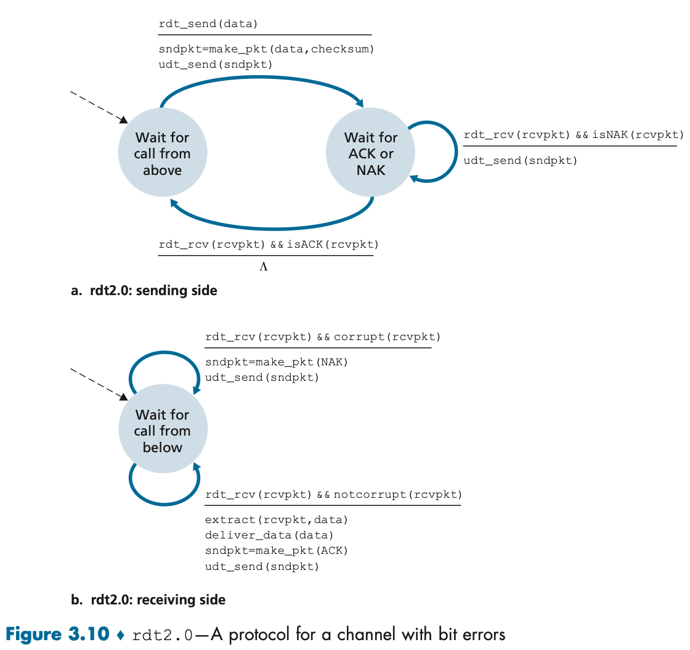
>
> It is important to note that when the sender is in the wait-for-ACK-or-NAK state, it cannot get more data from the upper layer; that is, the rdt_send() event can not occur; that will happen only after the sender receives an ACK and leaves this state. Thus, the sender will not send a new piece of data until it is sure that the receiver has correctly received the current packet. Because of this behavior, protocols such as rdt2.0 are known as **stop-and-wait** protocols.
>
> Protocol rdt2.0 may look as if it works but, unfortunately, it has a fatal flaw. In particular, we haven’t accounted for the possibility that the ACK or NAK packet could be corrupted! Unfortunately, our slight oversight is not as innocuous as it may seem. Minimally, we will need to add checksum bits to ACK/NAK packets in order to detect such errors. The more difficult question is how the protocol should recover from errors in ACK or NAK packets. The difficulty here is that if an ACK or NAK is corrupted, the sender has no way of knowing whether or not the receiver has correctly received the last piece of transmitted data.
>
> A simple solution to this new problem (and one adopted in almost all existing data transfer protocols, including TCP) is to add a new field to the data packet and have the sender number its data packets by putting a sequence number into this field. The receiver then need only check this sequence number to determine whether or not the received packet is a retransmission. For this simple case of a stop-and-wait protocol, a 1-bit sequence number will suffice, since it will allow the receiver to know whether the sender is resending the previously transmitted packet (the sequence number of the received packet has the same sequence number as the most recently received packet) or a new packet (the sequence number changes, moving “forward” in modulo-2 arithmetic). Since we are currently assuming a channel that does not lose packets, ACK and NAK packets do not themselves need to indicate the sequence number of the packet they are acknowledging. The sender knows that a received ACK or NAK packet (whether garbled or not) was generated in response to its most recently transmitted data packet.
>
> 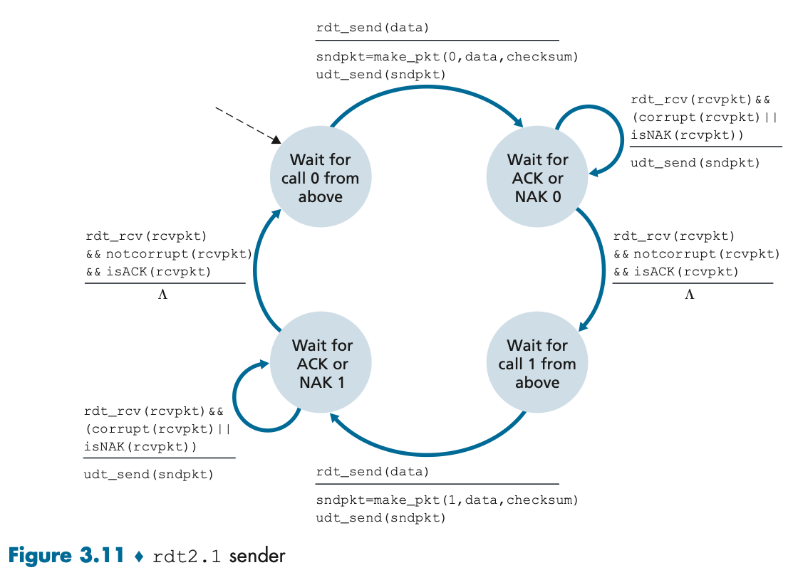
>
> 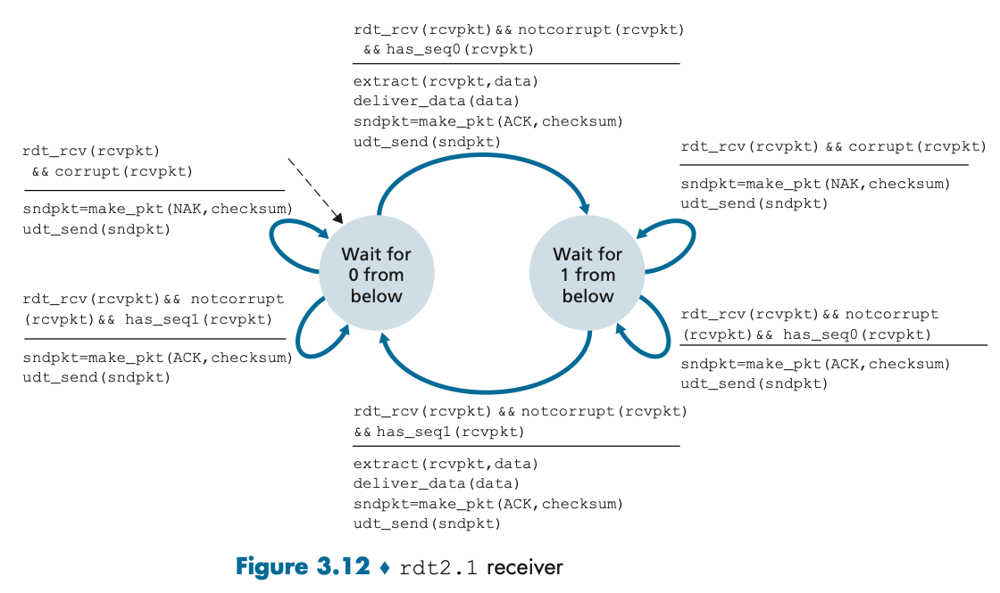
>
> Protocol rdt2.1 uses both positive and negative acknowledgments from the receiver to the sender. When an out-of-order packet is received, the receiver sends a positive acknowledgment for the packet it has received. When a corrupted packet is received, the receiver sends a negative acknowledgment. We can accomplish the same effect as a NAK if, instead of sending a NAK, we send an ACK for the last correctly received packet. A sender that receives two ACKs for the same packet (that is, receives duplicate ACKs) knows that the receiver did not correctly receive the packet following the packet that is being ACKed twice. Our NAK-free reliable data transfer protocol for a channel with bit errors is rdt2.2, shown in Figures 3.13 and 3.14. One subtle change between rtdt2.1 and rdt2.2 is that the receiver must now include the sequence number of the packet being acknowledged by an ACK message (this is done by including the ACK, 0 or ACK, 1 argument in make_pkt() in the receiver FSM), and the sender must now check the sequence number of the packet being acknowledged by a received ACK message (this is done by including the 0 or 1 argument in isACK() in the sender FSM).
>
> 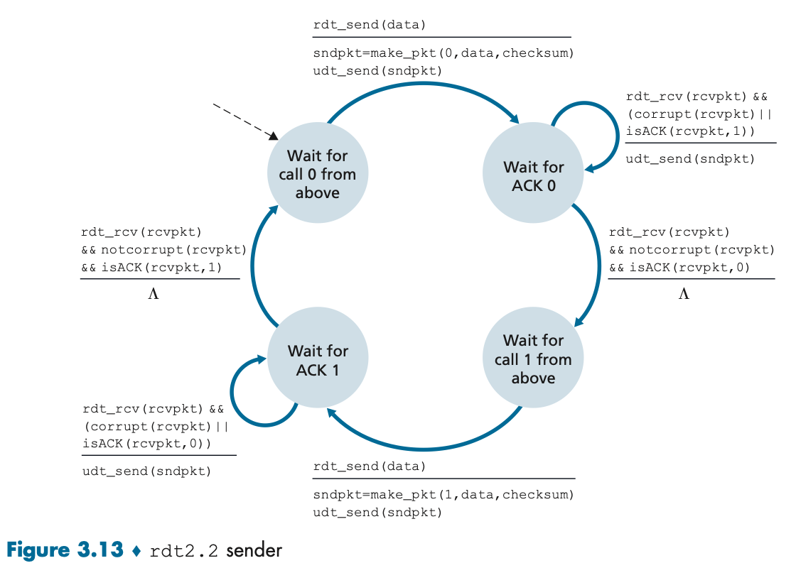
>
> 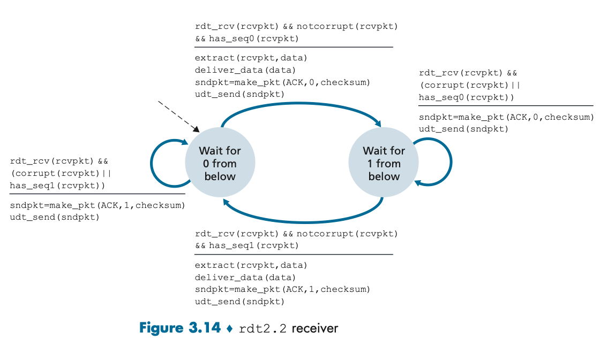

Reliable Data Transfer over a Lossy Channel with Bit Errors: rdt3.0

> Suppose now that in addition to corrupting bits, the underlying channel can lose packets as well. Two additional concerns must now be addressed by the protocol: how to detect packet loss and what to do when packet loss occurs. The use of checksumming, sequence numbers, ACK packets, and retransmissions—the techniques already developed in rdt2.2—will allow us to answer the latter concern. Handling the first concern will require adding a new protocol mechanism.
>
> The approach adopted in practice is for the sender to judiciously choose a time value such that packet loss is likely, although not guaranteed, to have happened. If an ACK is not received within this time, the packet is retransmitted. Note that if a packet experiences a particularly large delay, the sender may retransmit the packet even though neither the data packet nor its ACK have been lost. This introduces the possibility of duplicate data packets in the sender-to-receiver channel. Happily, protocol rdt2.2 already has enough functionality (that is, sequence numbers) to handle the case of duplicate packets.
>
> From the sender’s viewpoint, retransmission is a panacea. The sender does not know whether a data packet was lost, an ACK was lost, or if the packet or ACK was simply overly delayed. In all cases, the action is the same: retransmit. Implementing a time-based retransmission mechanism requires a countdown timer that can interrupt the sender after a given amount of time has expired. The sender will thus need to be able to (1) start the timer each time a packet (either a first-time packet or a retransmission) is sent, (2) respond to a timer interrupt (taking appropriate actions), and (3) stop the timer.
>
> 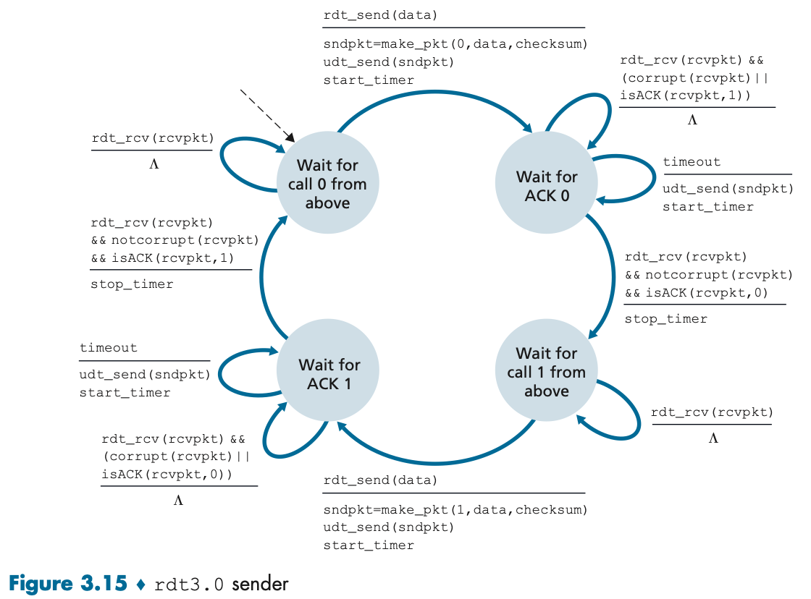
>
> Because packet sequence numbers alternate between 0 and 1, protocol rdt3.0 is sometimes known as the alternating-bit protocol.
>
> We have now assembled the key elements of a data transfer protocol. Checksums, sequence numbers, timers, and positive and negative acknowledgment packets each play a crucial and necessary role in the operation of the protocol. We now have a working reliable data transfer protocol!

Pipelined Reliable Data Transfer Protocols

> Protocol rdt3.0 is a functionally correct protocol, but it is unlikely that anyone would be happy with its performance, particularly in today’s high-speed networks. At the heart of rdt3.0’s performance problem is the fact that it is a stop-and-wait protocol.
>
> 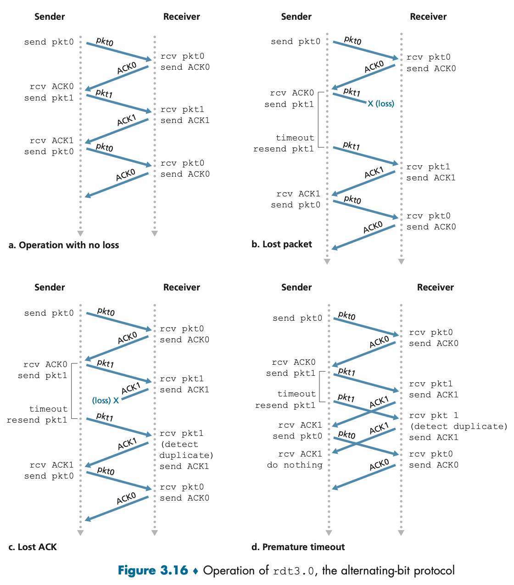
>
> 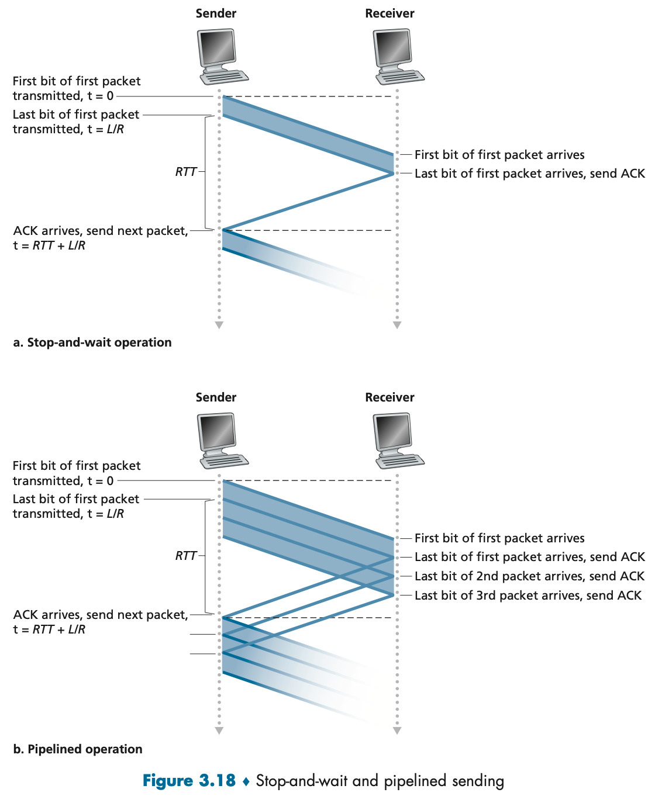
>
> Rather than operate in a stop-and-wait manner, the sender is allowed to send multiple packets without waiting for acknowledgments. Figure 3.18(b) shows that if the sender is allowed to transmit three packets before having to wait for acknowledgments, the utilization of the sender is essentially tripled. Since the many in-transit sender-to-receiver packets can be visualized as filling a pipeline, this technique is known as pipelining. Two basic approaches toward pipelined error recovery can be identified: **Go-Back-N** and **selective repeat**.

Go-Back-N (GBN)

> 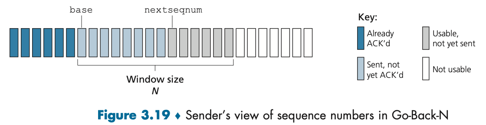
>
> Figure 3.19 shows the sender’s view of the range of sequence numbers in a GBN protocol. If we define base to be the sequence number of the oldest unacknowledged packet and nextseqnum to be the smallest unused sequence number (that is, the sequence number of the next packet to be sent), then four intervals in the range of sequence numbers can be identified. Sequence numbers in the interval [0,base-1] correspond to packets that have already been transmitted and acknowledged. The interval [base,nextseqnum-1] corresponds to packets that have been sent but not yet acknowledged. Sequence numbers in the interval [nextseqnum,base+N-1] can be used for packets that can be sent immediately, should data arrive from the upper layer. Finally, sequence numbers greater than or equal to base+N cannot be used until an unacknowledged packet currently in the pipeline (specifically, the packet with sequence number base) has been acknowledged.
>
> In practice, a packet’s sequence number is carried in a fixed-length field in the packet header. If k is the number of bits in the packet sequence number field, the range of sequence numbers is thus [0, $2^k-1$]. With a finite range of sequence numbers, all arithmetic involving sequence numbers must then be done using modulo $2^k$ arithmetic. (That is, the sequence number space can be thought of as a ring of size $2^k$, where the sequence number $2^k-1$ is immediately followed by sequence number 0). TCP has a 32-bit sequence number field, where TCP sequence numbers count bytes in the byte stream rather than packets.
>
> 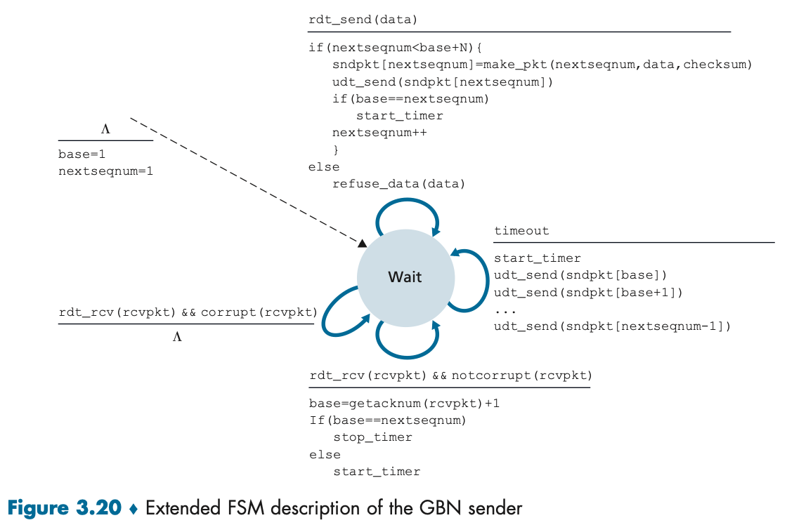
>
> 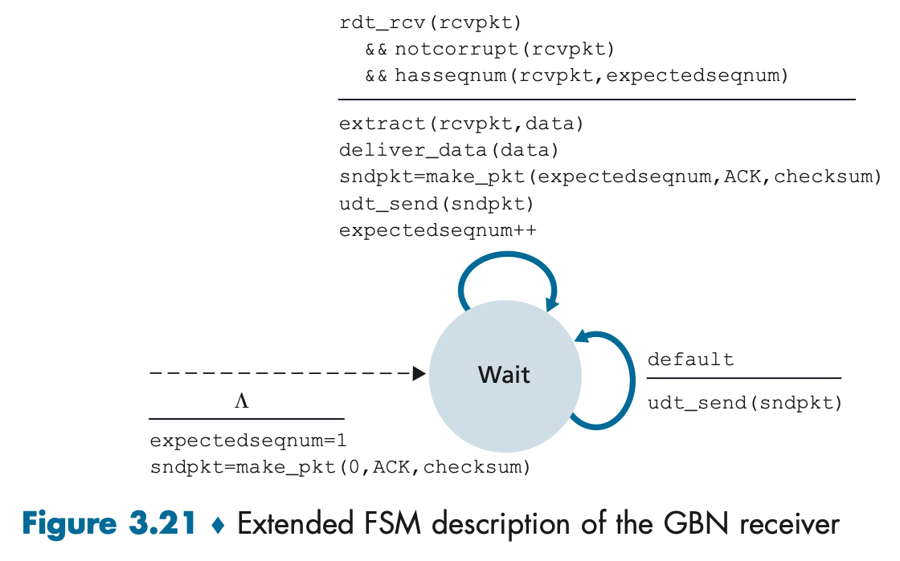
>
> The _default_ in Figure 3.21 means that in all other cases, the receiver discards the packet and resends an ACK for the most recently received in-order packet.
>
> 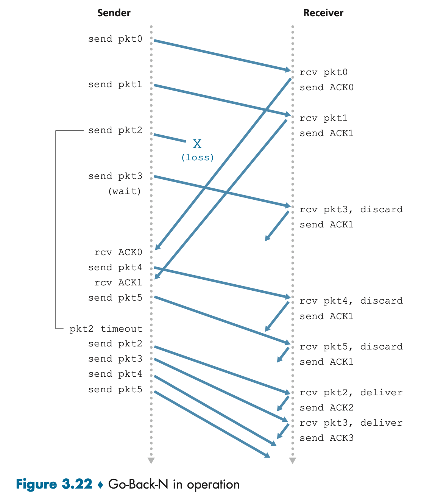
>
> In our GBN protocol, the receiver discards out-of-order packets. The advantage of this approach is the simplicity of receiver buffering—the receiver need not buffer any out-of-order packets. Thus, while the sender must maintain the upper and lower bounds of its window and the position of _nextseqnum_ within this window, the only piece of information the receiver needs to maintain is the sequence number of the next in-order packet. This value is held in the variable _expectedseqnum_.
>
> We note here that the GBN protocol incorporates almost all of the techniques that TCP needs. These techniques include the use of sequence numbers, cumulative acknowledgments, checksums, and a timeout/retransmit operation.

Selective Repeat (SR)

> There are, however, scenarios in which GBN itself suffers from performance problems. In particular, when the window size and **bandwidth-delay product** are both large, many packets can be in the pipeline. A single packet error can thus cause GBN to retransmit a large number of packets, many unnecessarily. As the probability of channel errors increases, the pipeline can become filled with these unnecessary retransmissions.
>
> As the name suggests, selective-repeat protocols avoid unnecessary retransmissions by having the sender retransmit only those packets that it suspects were received in error (that is, were lost or corrupted) at the receiver. However, unlike GBN, the sender will have already received ACKs for some of the packets in the window. The SR receiver will acknowledge a correctly received packet whether or not it is in order. Out-of-order packets are buffered until any missing packets (that is, packets with lower sequence numbers) are received, at which point a batch of packets can be delivered in order to the upper layer.
>
> 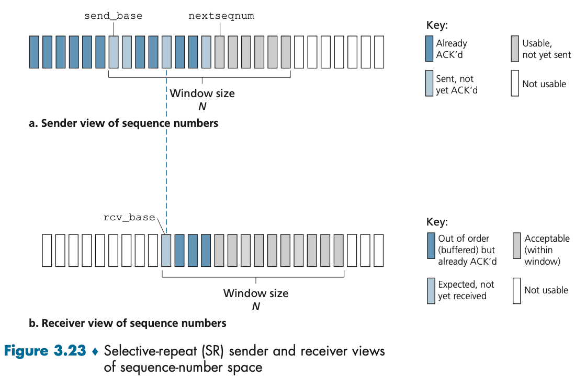
>
> 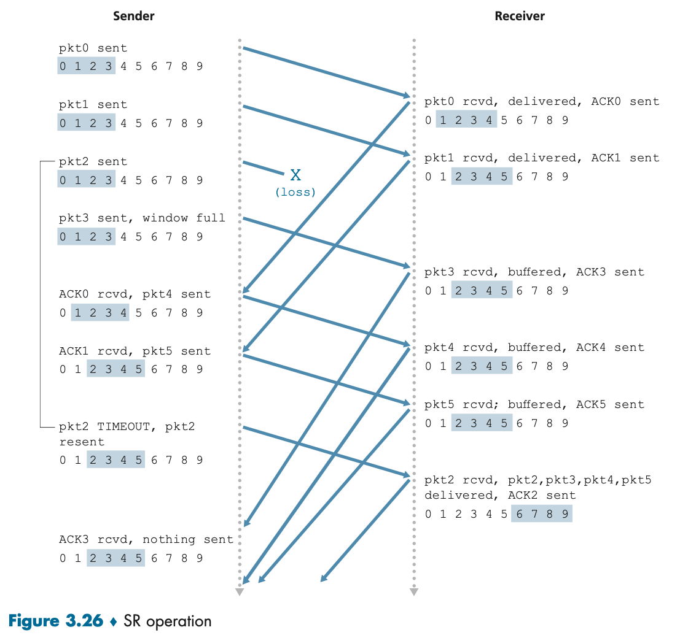
>
> 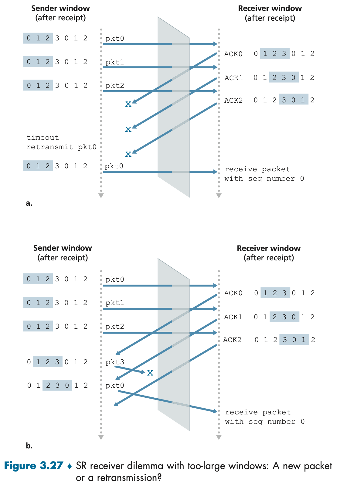
>
> The lack of synchronization between sender and receiver windows has important consequences when we are faced with the reality of a finite range of sequence numbers. As far as it is concerned, the two scenarios in Figure 3.27 are identical. There is no way of distinguishing the retransmission of the first packet from the original transmission of the fifth packet. Clearly, a window size that is 1 less than the size of the sequence number space won’t work. But how small must the window size be? The window size must be less than or equal to half the size of the sequence number space for SR protocols.
