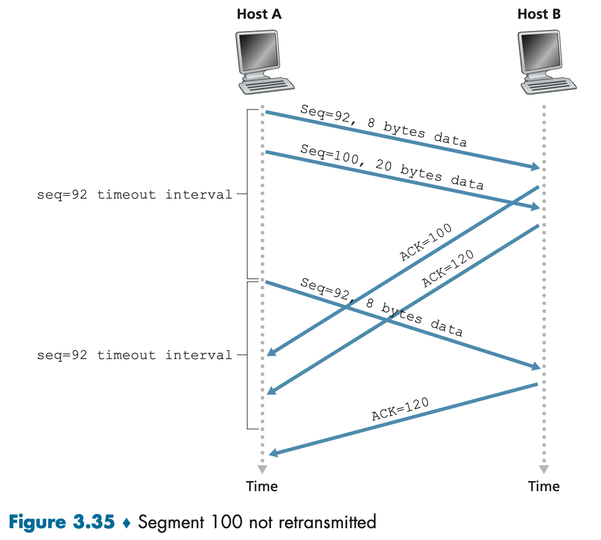

**3.1 Introduction and Transport-Layer Services**

A transport-layer protocol provides for **logical communication** between application processes running on different hosts. By logical communication, we mean that from an application’s perspective, it is as if the hosts running the processes were directly connected; in reality, the hosts may be on opposite sides of the planet, connected via numerous routers and a wide range of link types. Application processes use the logical communication provided by the transport layer to send messages to each other, free from the worry of the details of the physical infrastructure used to carry these messages.

Transport-layer protocols are implemented in the end systems but not in network routers. On the sending side, the transport layer converts the application-layer messages it receives from a sending application process into transport-layer packets, known as transport-layer segments in Internet terminology. This is done by (possibly) breaking the application messages into smaller chunks and adding a transport-layer header to each chunk to create the transport-layer segment. The transport layer then passes the segment to the network layer at the sending end system, where the segment is encapsulated within a network-layer packet (a datagram) and sent to the destination. It’s important to note that network routers act only on the network-layer fields of the datagram; that is, they do not examine the fields of the transport-layer segment encapsulated with the datagram. On the receiving side, the network layer extracts the transport-layer segment from the datagram and passes the segment up to the transport layer. The transport layer then processes the received segment, making the data in the segment available to the receiving application.

Whereas a transport-layer protocol provides logical communication between _processes_ running on different hosts, a network-layer protocol provides logical communication between _hosts_. This distinction is subtle but important.

The services that a transport protocol can provide are often constrained by the service model of the underlying network-layer protocol. If the network-layer protocol cannot provide delay or bandwidth guarantees for transport-layer segments sent between hosts, then the transport-layer protocol cannot provide delay or bandwidth guarantees for application messages sent between processes. Nevertheless, certain services can be offered by a transport protocol even when the underlying network protocol doesn’t offer the corresponding service at the network layer. For example, a transport protocol can offer reliable data transfer service to an application even when the underlying network protocol is unreliable, that is, even when the network protocol loses, garbles, or duplicates packets. As another example, a transport protocol can use encryption to guarantee that application messages are not read by intruders, even when the network layer cannot guarantee the confidentiality of transport-layer segments.

Recall that the Internet makes two distinct transport-layer protocols available to the application layer. One of these protocols is UDP (User Datagram Protocol), which provides an unreliable, connectionless service to the invoking application. The second of these protocols is TCP (Transmission Control Protocol), which provides a reliable, connection-oriented service to the invoking application.

To simplify terminology, we refer to the transport-layer packet as a segment. We mention, however, that the Internet literature (for example, the RFCs) also refers to the transport-layer packet for TCP as a segment but often refers to the packet for UDP as a datagram. However, this same Internet literature also uses the term datagram for the network-layer packet! To make it less confusing, we refer to both TCP and UDP packets as segments, and reserve the term datagram for the network-layer packet.

The Internet’s network-layer protocol has a name—IP, for Internet Protocol. IP provides logical communication between hosts. The IP service model is a best-effort delivery service. This means that IP makes its “best effort” to deliver segments between communicating hosts, but it makes no guarantees. In particular, it does not guarantee segment delivery, it does not guarantee orderly delivery of segments, and it does not guarantee the integrity of the data in the segments. For these reasons, IP is said to be an unreliable service.

The most fundamental responsibility of UDP and TCP is to extend IP’s delivery service between two end systems to a delivery service between two processes running on the end systems. Extending host-to-host delivery to process-to-process delivery is called transport-layer **multiplexing** and **demultiplexing**.

UDP and TCP also provide integrity checking by including error-detection fields in their segments’ headers. These two minimal transport-layer services—process-to-process data delivery and error checking—are the only two services that UDP provides! In particular, like IP, UDP is an unreliable service—it does not guarantee that data sent by one process will arrive intact (or at all!) to the destination process.

TCP, on the other hand, offers several additional services to applications. First and foremost, it provides reliable data transfer. Using flow control, sequence numbers, acknowledgments, and timers (techniques we’ll explore in detail in this chapter), TCP ensures that data is delivered from the sending process to the receiving process, correctly and in order. TCP thus converts IP’s unreliable service between end systems into a reliable data transport service between processes. TCP also provides congestion control. Congestion control is not so much a service provided to the invoking application as it is a service for the Internet as a whole, a service for the general good. Loosely speaking, TCP congestion control prevents any one TCP connection from swamping the links and routers between communicating hosts with an excessive amount of traffic. TCP strives to give each connection traversing a congested link an equal share of the link bandwidth. This is done by regulating the rate at which the sending sides of TCP connections can send traffic into the network. UDP traffic, on the other hand, is unregulated. An application using UDP transport can send at any rate it pleases, for as long as it pleases.

---

**3.2 Multiplexing and Demultiplexing**

At the destination host, the transport layer receives segments from the network layer just below. The transport layer has the responsibility of delivering the data in these segments to the appropriate application process running in the host.

A process (as part of a network application) can have one or more sockets, doors through which data passes from the network to the process and through which data passes from the process to the network. Thus, the transport layer in the receiving host does not actually deliver data directly to a process, but instead to an intermediary socket.

Now let’s consider how a receiving host directs an incoming transport-layer segment to the appropriate socket. Each transport-layer segment has a set of fields in the segment for this purpose. At the receiving end, the transport layer examines these fields to identify the receiving socket and then directs the segment to that socket. This job of delivering the data in a transport-layer segment to the correct socket is called demultiplexing. The job of gathering data chunks at the source host from different sockets, encapsulating each data chunk with header information (that will later be used in demultiplexing) to create segments, and passing the segments to the network layer is called multiplexing.

To illustrate the demultiplexing job, recall the household analogy in the previous section. Each of the kids is identified by his or her name. When Bill receives a batch of mail from the mail carrier, he performs a demultiplexing operation by observing to whom the letters are addressed and then hand delivering the mail to his brothers and sisters. Ann performs a multiplexing operation when she collects letters from her brothers and sisters and gives the collected mail to the mailperson.

From the discussion above, we know that transport-layer multiplexing requires (1) that sockets have unique identifiers, and (2) that each segment has special fields that indicate the socket to which the segment is to be delivered. These special fields are the source port number field and the destination port number field. Each port number is a 16-bit number, ranging from 0 to 65535. The port numbers ranging from 0 to 1023 are called well-known port numbers and are restricted.

It should now be clear how the transport layer could implement the demultiplexing service: Each socket in the host could be assigned a port number, and when a segment arrives at the host, the transport layer examines the destination port number in the segment and directs the segment to the corresponding socket. The segment’s data then passes through the socket into the attached process. As we’ll see, this is basically how UDP does it. However, we’ll also see that multiplexing/demultiplexing in TCP is yet more subtle.

One subtle difference between a TCP socket and a UDP socket is that a TCP socket is identified by a four-tuple: (source IP address, source port number, destination IP address, destination port number). Thus, when a TCP segment arrives from the network to a host, the host uses all four values to direct (demultiplex) the segment to the appropriate socket. In particular, and in contrast with UDP, two arriving TCP segments with different source IP addresses or source port numbers will (with the exception of a TCP segment carrying the original connection-establishment request) be directed to two different sockets.

The server host may support many simultaneous TCP connection sockets, with each socket attached to a process, and with each socket identified by its own four-tuple. When a TCP segment arrives at the host, all four fields (source IP address, source port, destination IP address, destination port) are used to direct (demultiplex) the segment to the appropriate socket.

> [Difference between port number and socket](https://stackoverflow.com/questions/35828447/difference-between-port-number-and-socket)
>
> - A computer running IP networking always has a fixed number of ports -- 65535 TCP ports and 65535 UDP ports. A network packet's header contains a 16-bit unsigned field specifying which of those ports the packet should be delivered to.
>
> - Sockets, on the other hand, are demand-allocated by each program. A socket serves as a handle/interface between the program and the OS's networking stack, and is used to build and specify a context for a particular networking task. A socket may or may not be bound to a port, and it's also possible (and common) to have more than one socket bound to a particular port at the same time.

As we mentioned before, there is not always a one-to-one correspondence between connection sockets and processes. In fact, today’s high-performing Web servers often use only one process, and create a new thread with a new connection socket for each new client connection.

---

**3.3 Connectionless Transport: UDP**

If the application developer chooses UDP instead of TCP, then the application is almost directly talking with IP. UDP takes messages from the application process, attaches source and destination port number fields for the multiplexing/demultiplexing service, adds two other small fields, and passes the resulting segment to the network layer. The network layer encapsulates the transport-layer segment into an IP datagram and then makes a best-effort attempt to deliver the segment to the receiving host. If the segment arrives at the receiving host, UDP uses the destination port number to deliver the segment’s data to the correct application process. Note that with UDP there is no handshaking between sending and receiving transport-layer entities before sending a segment. For this reason, UDP is said to be connectionless.

DNS is an example of an application-layer protocol that typically uses UDP. When the DNS application in a host wants to make a query, it constructs a DNS query message and passes the message to UDP. Without performing any handshaking with the UDP entity running on the destination end system, the host-side UDP adds header fields to the message and passes the resulting segment to the network layer. The network layer encapsulates the UDP segment into a datagram and sends the datagram to a name server. The DNS application at the querying host then waits for a reply to its query. If it doesn’t receive a reply (possibly because the underlying network lost the query or the reply), it might try resending the query, try sending the query to another name server, or inform the invoking application that it can’t get a reply.

The reason to choose UDP instead of TCP:

- _Finer application-level control over what data is sent, and when._ Under UDP, as soon as an application process passes data to UDP, UDP will package the data inside a UDP segment and immediately pass the segment to the network layer. TCP, on the other hand, has a congestion-control mechanism that throttles the transport-layer TCP sender when one or more links between the source and destination hosts become excessively congested. TCP will also continue to resend a segment until the receipt of the segment has been acknowledged by the destination, regardless of how long reliable delivery takes. Since real-time applications often require a minimum sending rate, do not want to overly delay segment transmission, and can tolerate some data loss, TCP’s service model is not particularly well matched to these applications’ needs.
- _No connection establishment_. TCP uses a three-way handshake before it starts to transfer data. UDP just blasts away without any formal preliminaries. Thus UDP does not introduce any delay to establish a connection. This is probably the principal reason why DNS runs over UDP rather than TCP—DNS would be much slower if it ran over TCP. HTTP uses TCP rather than UDP, since reliability is critical for Web pages with text. The TCP connection-establishment delay in HTTP is an important contributor to the delays associated with downloading Web documents. Indeed, the QUIC protocol (Quick UDP Internet Connection), used in Google’s Chrome browser, uses UDP as its underlying transport protocol and implements reliability in an application-layer protocol on top of UDP.
- _No connection state_. TCP maintains connection state in the end systems. This connection state includes receive and send buffers, congestion-control parameters, and sequence and acknowledgment number parameters. UDP, on the other hand, does not maintain connection state and does not track any of these parameters. For this reason, a server devoted to a particular application can typically support many more active clients when the application runs over UDP rather than TCP.
- _Small packet header overhead_. The TCP segment has 20 bytes of header overhead in every segment, whereas UDP has only 8 bytes of overhead.

Although commonly done today, running multimedia applications over UDP needs to be done with care. UDP has no congestion control, if everyone were to start streaming high-bit-rate video without using any congestion control, there would be so much packet overflow at routers that very few UDP packets would successfully traverse the source-to-destination path. Moreover, the high loss rates induced by the uncontrolled UDP senders would cause the TCP senders to dramatically decrease their rates. Thus, the lack of congestion control in UDP can result in high loss rates between a UDP sender and receiver, and the crowding out of TCP sessions. Many researchers have proposed new mechanisms to force all sources, including UDP sources, to perform adaptive congestion control.

The UDP header has only four fields, each consisting of two bytes. The port numbers allow the destination host to pass the application data to the correct process running on the destination end system (that is, to perform the demultiplexing function). The length field specifies the number of bytes in the UDP segment (header plus data). An explicit length value is needed since the size of the data field may differ from one UDP segment to the next. The checksum is used by the receiving host to check whether errors have been introduced into the segment. In truth, the checksum is also calculated over a few of the fields in the IP header in addition to the UDP segment. But we ignore this detail in order to see the forest through the trees.

The checksum is used to determine whether bits within the UDP segment have been altered (for example, by noise in the links or while stored in a router) as they moved from source to destination. UDP at the sender side performs the 1's complement of the sum of all the 16-bit words in the segment, with any overflow encountered during the sum being **wrapped around**. This result is put in the checksum field of the UDP segment. At the receiver, all four 16-bit words are added, including the checksum. If no errors are introduced into the packet, then clearly the sum at the receiver will be 1111111111111111. If one of the bits is a 0, then we know that errors have been introduced into the packet.

You may wonder why UDP provides a checksum in the first place, as many link-layer protocols (including the popular Ethernet protocol) also provide error checking. The reason is that there is no guarantee that all the links between source and destination provide error checking; that is, one of the links may use a link-layer protocol that does not provide error checking. Furthermore, even if segments are correctly transferred across a link, it’s possible that bit errors could be introduced when a segment is stored in a router’s memory. Given that neither link-by-link reliability nor in-memory error detection is guaranteed, UDP must provide error detection at the transport layer. Although UDP provides error checking, it does not do anything to recover from an error. Some implementations of UDP simply discard the damaged segment; others pass the damaged segment to the application with a warning.

---

**3.4 Principles of Reliable Data Transfer**

Reliable Data Transfer over a Perfectly Reliable Channel: rdt1.0

> The finite-state machine (FSM) definitions for the rdt1.0 sender and receiver are shown in Figure 3.9. The arrows in the FSM description indicate the transition of the protocol from one state to another. The event causing the transition is shown above the horizontal line labeling the transition, and the actions taken when the event occurs are shown below the horizontal line. When no action is taken on an event, or no event occurs and an action is taken, we’ll use the symbol Λ below or above the horizontal, respectively, to explicitly denote the lack of an action or event. The initial state of the FSM is indicated by the dashed arrow. Although the FSMs in Figure 3.9 have but one state, the FSMs we will see shortly have multiple states, so it will be important to identify the initial state of each FSM.
>
> 
>
> In this simple protocol, there is no difference between a unit of data and a packet. Also, all packet flow is from the sender to receiver; with a perfectly reliable channel there is no need for the receiver side to provide any feedback to the sender since nothing can go wrong! Note that we have also assumed that the receiver is able to receive data as fast as the sender happens to send data. Thus, there is no need for the receiver to ask the sender to slow down!

Reliable Data Transfer over a Channel with Bit Errors: rdt2.0

> In a real-life scenario, when we dictate a message, we use both positive acknowledgments (“OK”) and negative acknowledgments (“Please repeat that.”). These control messages allow the receiver to let the sender know what has been received correctly, and what has been received in error and thus requires repeating. In a computer network setting, reliable data transfer protocols based on such retransmission are known as **ARQ** (**Automatic Repeat reQuest**) protocols.
>
> Fundamentally, three additional protocol capabilities are required in ARQ protocols to handle the presence of bit errors:
>
> - Error detection.
> - Receiver feedback.
> - Retransmission.
>
> 
>
> It is important to note that when the sender is in the wait-for-ACK-or-NAK state, it cannot get more data from the upper layer; that is, the rdt_send() event can not occur; that will happen only after the sender receives an ACK and leaves this state. Thus, the sender will not send a new piece of data until it is sure that the receiver has correctly received the current packet. Because of this behavior, protocols such as rdt2.0 are known as **stop-and-wait** protocols.
>
> Protocol rdt2.0 may look as if it works but, unfortunately, it has a fatal flaw. In particular, we haven’t accounted for the possibility that the ACK or NAK packet could be corrupted! Unfortunately, our slight oversight is not as innocuous as it may seem. Minimally, we will need to add checksum bits to ACK/NAK packets in order to detect such errors. The more difficult question is how the protocol should recover from errors in ACK or NAK packets. The difficulty here is that if an ACK or NAK is corrupted, the sender has no way of knowing whether or not the receiver has correctly received the last piece of transmitted data.
>
> A simple solution to this new problem (and one adopted in almost all existing data transfer protocols, including TCP) is to add a new field to the data packet and have the sender number its data packets by putting a sequence number into this field. The receiver then need only check this sequence number to determine whether or not the received packet is a retransmission. For this simple case of a stop-and-wait protocol, a 1-bit sequence number will suffice, since it will allow the receiver to know whether the sender is resending the previously transmitted packet (the sequence number of the received packet has the same sequence number as the most recently received packet) or a new packet (the sequence number changes, moving “forward” in modulo-2 arithmetic). Since we are currently assuming a channel that does not lose packets, ACK and NAK packets do not themselves need to indicate the sequence number of the packet they are acknowledging. The sender knows that a received ACK or NAK packet (whether garbled or not) was generated in response to its most recently transmitted data packet.
>
> 
>
> 
>
> Protocol rdt2.1 uses both positive and negative acknowledgments from the receiver to the sender. When an out-of-order packet is received, the receiver sends a positive acknowledgment for the packet it has received. When a corrupted packet is received, the receiver sends a negative acknowledgment. We can accomplish the same effect as a NAK if, instead of sending a NAK, we send an ACK for the last correctly received packet. A sender that receives two ACKs for the same packet (that is, receives duplicate ACKs) knows that the receiver did not correctly receive the packet following the packet that is being ACKed twice. Our NAK-free reliable data transfer protocol for a channel with bit errors is rdt2.2, shown in Figures 3.13 and 3.14. One subtle change between rtdt2.1 and rdt2.2 is that the receiver must now include the sequence number of the packet being acknowledged by an ACK message (this is done by including the ACK, 0 or ACK, 1 argument in make_pkt() in the receiver FSM), and the sender must now check the sequence number of the packet being acknowledged by a received ACK message (this is done by including the 0 or 1 argument in isACK() in the sender FSM).
>
> 
>
> 

Reliable Data Transfer over a Lossy Channel with Bit Errors: rdt3.0

> Suppose now that in addition to corrupting bits, the underlying channel can lose packets as well. Two additional concerns must now be addressed by the protocol: how to detect packet loss and what to do when packet loss occurs. The use of checksumming, sequence numbers, ACK packets, and retransmissions—the techniques already developed in rdt2.2—will allow us to answer the latter concern. Handling the first concern will require adding a new protocol mechanism.
>
> The approach adopted in practice is for the sender to judiciously choose a time value such that packet loss is likely, although not guaranteed, to have happened. If an ACK is not received within this time, the packet is retransmitted. Note that if a packet experiences a particularly large delay, the sender may retransmit the packet even though neither the data packet nor its ACK have been lost. This introduces the possibility of duplicate data packets in the sender-to-receiver channel. Happily, protocol rdt2.2 already has enough functionality (that is, sequence numbers) to handle the case of duplicate packets.
>
> From the sender’s viewpoint, retransmission is a panacea. The sender does not know whether a data packet was lost, an ACK was lost, or if the packet or ACK was simply overly delayed. In all cases, the action is the same: retransmit. Implementing a time-based retransmission mechanism requires a countdown timer that can interrupt the sender after a given amount of time has expired. The sender will thus need to be able to (1) start the timer each time a packet (either a first-time packet or a retransmission) is sent, (2) respond to a timer interrupt (taking appropriate actions), and (3) stop the timer.
>
> 
>
> Because packet sequence numbers alternate between 0 and 1, protocol rdt3.0 is sometimes known as the alternating-bit protocol.
>
> We have now assembled the key elements of a data transfer protocol. Checksums, sequence numbers, timers, and positive and negative acknowledgment packets each play a crucial and necessary role in the operation of the protocol. We now have a working reliable data transfer protocol!

Pipelined Reliable Data Transfer Protocols

> Protocol rdt3.0 is a functionally correct protocol, but it is unlikely that anyone would be happy with its performance, particularly in today’s high-speed networks. At the heart of rdt3.0’s performance problem is the fact that it is a stop-and-wait protocol.
>
> 
>
> 
>
> Rather than operate in a stop-and-wait manner, the sender is allowed to send multiple packets without waiting for acknowledgments. Figure 3.18(b) shows that if the sender is allowed to transmit three packets before having to wait for acknowledgments, the utilization of the sender is essentially tripled. Since the many in-transit sender-to-receiver packets can be visualized as filling a pipeline, this technique is known as pipelining. Two basic approaches toward pipelined error recovery can be identified: **Go-Back-N** and **selective repeat**.

Go-Back-N (GBN)

> 
>
> Figure 3.19 shows the sender’s view of the range of sequence numbers in a GBN protocol. If we define base to be the sequence number of the oldest unacknowledged packet and nextseqnum to be the smallest unused sequence number (that is, the sequence number of the next packet to be sent), then four intervals in the range of sequence numbers can be identified. Sequence numbers in the interval [0,base-1] correspond to packets that have already been transmitted and acknowledged. The interval [base,nextseqnum-1] corresponds to packets that have been sent but not yet acknowledged. Sequence numbers in the interval [nextseqnum,base+N-1] can be used for packets that can be sent immediately, should data arrive from the upper layer. Finally, sequence numbers greater than or equal to base+N cannot be used until an unacknowledged packet currently in the pipeline (specifically, the packet with sequence number base) has been acknowledged.
>
> In practice, a packet’s sequence number is carried in a fixed-length field in the packet header. If k is the number of bits in the packet sequence number field, the range of sequence numbers is thus [0, $2^k-1$]. With a finite range of sequence numbers, all arithmetic involving sequence numbers must then be done using modulo $2^k$ arithmetic. (That is, the sequence number space can be thought of as a ring of size $2^k$, where the sequence number $2^k-1$ is immediately followed by sequence number 0). TCP has a 32-bit sequence number field, where TCP sequence numbers count bytes in the byte stream rather than packets.
>
> 
>
> 
>
> The _default_ in Figure 3.21 means that in all other cases, the receiver discards the packet and resends an ACK for the most recently received in-order packet.
>
> 
>
> In our GBN protocol, the receiver discards out-of-order packets. The advantage of this approach is the simplicity of receiver buffering—the receiver need not buffer any out-of-order packets. Thus, while the sender must maintain the upper and lower bounds of its window and the position of _nextseqnum_ within this window, the only piece of information the receiver needs to maintain is the sequence number of the next in-order packet. This value is held in the variable _expectedseqnum_.
>
> We note here that the GBN protocol incorporates almost all of the techniques that TCP needs. These techniques include the use of sequence numbers, cumulative acknowledgments, checksums, and a timeout/retransmit operation.

Selective Repeat (SR)

> There are, however, scenarios in which GBN itself suffers from performance problems. In particular, when the window size and **bandwidth-delay product** are both large, many packets can be in the pipeline. A single packet error can thus cause GBN to retransmit a large number of packets, many unnecessarily. As the probability of channel errors increases, the pipeline can become filled with these unnecessary retransmissions.
>
> As the name suggests, selective-repeat protocols avoid unnecessary retransmissions by having the sender retransmit only those packets that it suspects were received in error (that is, were lost or corrupted) at the receiver. However, unlike GBN, the sender will have already received ACKs for some of the packets in the window. The SR receiver will acknowledge a correctly received packet whether or not it is in order. Out-of-order packets are buffered until any missing packets (that is, packets with lower sequence numbers) are received, at which point a batch of packets can be delivered in order to the upper layer.
>
> 
>
> 
>
> 
>
> The lack of synchronization between sender and receiver windows has important consequences when we are faced with the reality of a finite range of sequence numbers. As far as it is concerned, the two scenarios in Figure 3.27 are identical. There is no way of distinguishing the retransmission of the first packet from the original transmission of the fifth packet. Clearly, a window size that is 1 less than the size of the sequence number space won’t work. But how small must the window size be? The window size must be less than or equal to half the size of the sequence number space for SR protocols.

---

**3.5 Connection-Oriented Transport: TCP**

The TCP “connection” is not an end-to-end TDM or FDM circuit as in a circuit-switched network. Instead, the “connection” is a logical one, with common state residing only in the TCPs in the two communicating end systems. Recall that because the TCP protocol runs only in the end systems and not in the intermediate network elements (routers and link-layer switches), the intermediate network elements do not maintain TCP connection state. In fact, the intermediate routers are completely oblivious to TCP connections; they see datagrams, not connections.

A TCP connection provides a full-duplex service: If there is a TCP connection between Process A on one host and Process B on another host, then application-layer data can flow from Process A to Process B at the same time as application-layer data flows from Process B to Process A. A TCP connection is also always point-to-point, that is, between a single sender and a single receiver. So-called “multicasting”—the transfer of data from one sender to many receivers in a single send operation—is not possible with TCP.

The maximum amount of data that can be grabbed and placed in a segment is limited by the **maximum segment size** (**MSS**). The MSS is typically set by first determining the length of the largest link-layer frame that can be sent by the local sending host (the so-called **maximum transmission unit**, **MTU**), and then setting the MSS to ensure that a TCP segment plus the TCP/IP header length (typically 40 bytes) will fit into a single link-layer frame. Both Ethernet and PPP link-layer protocols have an MTU of 1,500 bytes. Thus, a typical value of MSS is 1460 bytes. Note that the MSS is the maximum amount of application-layer data in the segment, not the maximum size of the TCP segment including headers.

TCP pairs each chunk of client data with a TCP header, thereby forming TCP segments. The segments are passed down to the network layer, where they are separately encapsulated within network-layer IP datagrams. The IP datagrams are then sent into the network. When TCP receives a segment at the other end, the segment’s data is placed in the TCP connection’s receive buffer. The application reads the stream of data from this buffer. Each side of the connection has its own send buffer and its own receive buffer.

We see from this discussion that a TCP connection consists of buffers, variables, and a socket connection to a process in one host, and another set of buffers, variables, and a socket connection to a process in another host. As mentioned earlier, no buffers or variables are allocated to the connection in the network elements (routers, switches, and repeaters) between the hosts.

As with UDP, the header includes source and destination port numbers, which are used for multiplexing/demultiplexing data from/to upper-layer applications. Also, as with UDP, the header includes a checksum field. A TCP segment header also contains the following fields:

- The 32-bit sequence number field and the 32-bit acknowledgment number field.
- The 16-bit receive window field is used for flow control. It is used to indicate the number of bytes that a receiver is willing to accept.
- The 4-bit header length field specifies the length of the TCP header in 32-bit words. The TCP header can be of variable length due to the TCP options field. (Typically, the options field is empty, so that the length of the typical TCP header is 20 bytes.)
- The CWR and ECE bits are used in explicit congestion notification.
- The flag field contains 6 bits. The ACK bit is used to indicate that the value carried in the acknowledgment field is valid; that is, the segment contains an acknowledgment for a segment that has been successfully received. The RST, SYN, and FIN bits are used for connection setup and teardown. Setting the PSH bit indicates that the receiver should pass the data to the upper layer immediately. Finally, the URG bit is used to indicate that there is data in this segment that the sending-side upper-layer entity has marked as “urgent.” The location of the last byte of this urgent data is indicated by the 16-bit urgent data pointer field. TCP must inform the receiving-side upper-layer entity when urgent data exists and pass it a pointer to the end of the urgent data. In practice, the PSH, URG, and the urgent data pointer are not used.

Two of the most important fields in the TCP segment header are the sequence number field and the acknowledgment number field.

TCP views data as an unstructured, but ordered, stream of bytes. TCP’s use of sequence numbers reflects this view in that sequence numbers are over the stream of transmitted bytes and not over the series of transmitted segments. The sequence number for a segment is therefore the byte-stream number of the first byte in the segment.

Acknowledgment numbers are a little trickier than sequence numbers. Recall that TCP is full-duplex, so that Host A may be receiving data from Host B while it sends data to Host B (as part of the same TCP connection). Each of the segments that arrive from Host B has a sequence number for the data flowing from B to A. The acknowledgment number that Host A puts in its segment is the sequence number of the next byte Host A is expecting from Host B. Suppose that Host A has received all bytes numbered 0 through 535 from B and suppose that it is about to send a segment to Host B. Host A is waiting for byte 536 and all the subsequent bytes in Host B’s data stream. So Host A puts 536 in the acknowledgment number field of the segment it sends to B.

The subtle issue is: What does a host do when it receives out-of-order segments in a TCP connection? Interestingly, the TCP RFCs do not impose any rules here and leave the decision up to the programmers implementing a TCP implementation. There are basically two choices: either (1) the receiver immediately discards out-of-order segments (which, as we discussed earlier, can simplify receiver design), or (2) the receiver keeps the out-of-order bytes and waits for the missing bytes to fill in the gaps. Clearly, the latter choice is more efficient in terms of network bandwidth, and is the approach taken in practice.

In truth, both sides of a TCP connection randomly choose an initial sequence number. This is done to minimize the possibility that a segment that is still present in the network from an earlier, already-terminated connection between two hosts is mistaken for a valid segment in a later connection between these same two hosts (which also happen to be using the same port numbers as the old connection).

Telnet, is a popular application-layer protocol used for remote login. It runs over TCP and is designed to work between any pair of hosts. We discuss a Telnet example here, as it nicely illustrates TCP sequence and acknowledgment numbers. We note that many users now prefer to use the SSH protocol rather than Telnet, since data sent in a Telnet connection (including passwords!) are not encrypted, making Telnet vulnerable to eavesdropping attacks.

TCP uses a timeout/retransmit mechanism to recover from lost segments. One of the questions that arises is the length of the timeout intervals. Clearly, the timeout should be larger than the connection’s round-trip time (RTT).

Let’s begin our study of TCP timer management by considering how TCP estimates the round-trip time between sender and receiver. This is accomplished as follows. The sample RTT, denoted _SampleRTT_, for a segment is the amount of time between when the segment is sent (that is, passed to IP) and when an acknowledgment for the segment is received. Instead of measuring a _SampleRTT_ for every transmitted segment, most TCP implementations take only one _SampleRTT_ measurement at a time. That is, at any point in time, the _SampleRTT_ is being estimated for only one of the transmitted but currently unacknowledged segments, leading to a new value of _SampleRTT_ approximately once every RTT. Also, TCP never computes a _SampleRTT_ for a segment that has been retransmitted; it only measures _SampleRTT_ for segments that have been transmitted once.

Obviously, the SampleRTT values will fluctuate from segment to segment due to congestion in the routers and to the varying load on the end systems. Because of this fluctuation, any given SampleRTT value may be atypical. In order to estimate a typical RTT, it is therefore natural to take some sort of average of the SampleRTT values. TCP maintains an average, called _EstimatedRTT_, of the SampleRTT values. Upon obtaining a new SampleRTT, TCP updates EstimatedRTT according to the following formula:

> $EstimatedRTT = (1 – α) \bullet EstimatedRTT + α \bullet SampleRTT$
>
> the new value of EstimatedRTT is a weighted combination of the previous value of EstimatedRTT and the new value for SampleRTT. The recommended value of α is α = 0.125 (that is, 1/8)

In addition to having an estimate of the RTT, it is also valuable to have a measure of the variability of the RTT. DevRTT is used as an estimate of how much SampleRTT typically deviates from EstimatedRTT:

> $DevRTT = (1 – β) \bullet DevRTT + β \bullet | SampleRTT – EstimatedRTT |$
>
> If the SampleRTT values have little fluctuation, then DevRTT will be small; on the other hand, if there is a lot of fluctuation, DevRTT will be large. The recommended value of β is 0.25 (that is, 1/4).

It is therefore desirable to set the timeout equal to the EstimatedRTT plus some margin. The margin should be large when there is a lot of fluctuation in the SampleRTT values; it should be small when there is little fluctuation. The value of DevRTT should thus come into play here. All of these considerations are taken into account in TCP’s method for determining the retransmission timeout interval:

> $TimeoutInterval = EstimatedRTT + 4 \bullet DevRTT$
>
> An initial TimeoutInterval value of 1 second is recommended. Also, when a timeout occurs, the value of TimeoutInterval is doubled to avoid a premature timeout occurring for a subsequent segment that will soon be acknowledged. However, as soon as a segment is received and EstimatedRTT is updated, the TimeoutInterval is again computed using the formula above.

TCP creates a reliable data transfer service on top of IP’s unreliable best-effort service. TCP’s reliable data transfer service ensures that the data stream that a process reads out of its TCP receive buffer is uncorrupted, without gaps, without duplication, and in sequence; that is, the byte stream is exactly the same byte stream that was sent by the end system on the other side of the connection.

In our earlier development of reliable data transfer techniques, it was conceptually easiest to assume that an individual timer is associated with each transmitted but not yet acknowledged segment. While this is great in theory, timer management can require considerable overhead. Thus, the recommended TCP timer management procedures use only a single retransmission timer, even if there are multiple transmitted but not yet acknowledged segments.

In a second scenario, shown in Figure 3.35, that neither of the acknowledgments arrives at Host A before the timeout. When the timeout event occurs, Host A resends the first segment with sequence number 92 and restarts the timer. As long as the ACK for the second segment arrives before the new timeout, the second segment will not be retransmitted.

In a third and final scenario, suppose Host A sends the two segments, exactly as in the second example. The acknowledgment of the first segment is lost in the network, but just before the timeout event, Host A receives an acknowledgment with acknowledgment number 120. Host A therefore knows that Host B has received everything up through byte 119; so Host A does not resend either of the two segments.

We now discuss a few modifications that most TCP implementations employ. The first concerns the length of the timeout interval after a timer expiration. In this modification, whenever the timeout event occurs, TCP retransmits the not-yet-acknowledged segment with the smallest sequence number, as described above. But each time TCP retransmits, it sets the next timeout interval to twice the previous value, rather than deriving it from the last EstimatedRTT and DevRTT. For example, suppose TimeoutInterval associated with the oldest not yet acknowledged segment is .75 sec when the timer first expires. TCP will then retransmit this segment and set the new expiration time to 1.5 sec. If the timer expires again 1.5 sec later, TCP will again retransmit this segment, now setting the expiration time to 3.0 sec. Thus, the intervals grow exponentially after each retransmission. However, whenever the timer is started after either of the two other events (that is, data received from application above, and ACK received), the TimeoutInterval is derived from the most recent values of EstimatedRTT and DevRTT.

One of the problems with timeout-triggered retransmissions is that the timeout period can be relatively long. When a segment is lost, this long timeout period forces the sender to delay resending the lost packet, thereby increasing the end-to-end delay. Fortunately, the sender can often detect packet loss well before the timeout event occurs by noting so-called **duplicate ACKs**. A duplicate ACK is an ACK that reacknowledges a segment for which the sender has already received an earlier acknowledgment.

Since TCP does not use negative acknowledgments, the receiver cannot send an explicit negative acknowledgment back to the sender. Instead, it simply reacknowledges (that is, generates a duplicate ACK for) the last in-order byte of data it has received.

If the TCP sender receives three duplicate ACKs for the same data, it takes this as an indication that the segment following the segment that has been ACKed three times has been lost. In the case that three duplicate ACKs are received, the TCP sender performs a **fast retransmit**, retransmitting the missing segment before that segment’s timer expires. For TCP with fast retransmit, the following code snippet replaces the ACK received event in Figure 3.33:

Consequently, as shown in Figure 3.33 (see also Figure 3.19), the TCP sender need only maintain the smallest sequence number of a transmitted but unacknowledged byte (SendBase) and the sequence number of the next byte to be sent (NextSeqNum). In this sense, TCP looks a lot like a GBN-style protocol. But there are some striking differences between TCP and GoBack-N. Many TCP implementations will buffer correctly received but out-of-order segments.

A proposed modification to TCP, the so-called **selective acknowledgment**, allows a TCP receiver to acknowledge out-of-order segments selectively rather than just cumulatively acknowledging the last correctly received, in-order segment. When combined with selective retransmission—skipping the retransmission of segments that have already been selectively acknowledged by the receiver—TCP looks a lot like our generic SR protocol. Thus, TCP’s error-recovery mechanism is probably best categorized as a hybrid of GBN and SR protocols.

TCP provides a **flow-control service** to its applications to eliminate the possibility of the sender overflowing the receiver’s buffer. Flow control is thus a speed-matching service—matching the rate at which the sender is sending against the rate at which the receiving application is reading. As noted earlier, a TCP sender can also be throttled due to congestion within the IP network; this form of sender control is referred to as congestion control. Even though the actions taken by flow and congestion control are similar (the throttling of the sender), they are obviously taken for very different reasons. In order to see the forest for the trees, we suppose throughout this section that the TCP implementation is such that the TCP receiver discards out-of-order segments.

TCP provides **flow control** by having the sender maintain a variable called the **receive window**. Informally, the receive window is used to give the sender an idea of how much free buffer space is available at the receiver. Because TCP is **full-duplex**, the sender at each side of the connection maintains a distinct receive window. Suppose that Host A is sending a large file to Host B over a TCP connection. Host B allocates a **receive buffer** to this connection; denote its size by _RcvBuffer_. From time to time, the application process in Host B reads from the buffer. Define the following variables:

> _LastByteRead_: the number of the last byte in the data stream read from the buffer by the application process in B
>
> _LastByteRcvd_: the number of the last byte in the data stream that has arrived from the network and has been placed in the receive buffer at B
>
> Because TCP is not permitted to overflow the allocated buffer, we must have: $LastByteRcvd – LastByteRead \le RcvBuffer$
>
> The receive window, denoted _rwnd_ is set to the amount of spare room in the buffer: $rwnd = RcvBuffer – [LastByteRcvd – LastByteRead]$
>
> Because the spare room changes with time, _rwnd_ is dynamic
>
> 

Host B tells Host A how much spare room it has in the connection buffer by placing its current value of _rwnd_ in **the receive window** field of every segment it sends to A. Initially, Host B sets $rwnd = RcvBuffer$. Note that to pull this off, Host B must keep track of several connection-specific variables.

Host A in turn keeps track of two variables, _LastByteSent_ and _LastByteAcked_, which have obvious meanings. Note that the difference between these two variables, $LastByteSent – LastByteAcked$, is the amount of unacknowledged data that A has sent into the connection. By keeping the amount of unacknowledged data less than the value of _rwnd_, Host A is assured that it is not overflowing the receive buffer at Host B. Thus, Host A makes sure throughout the connection’s life that $LastByteSent – LastByteAcked \le rwnd$

There is one minor technical problem with this scheme. To see this, suppose Host B’s receive buffer becomes full so that $rwnd = 0$. After advertising $rwnd = 0$ to Host A, also suppose that B has nothing to send to A. Now consider what happens. As the application process at B empties the buffer, TCP does not send new segments with new rwnd values to Host A; indeed, TCP sends a segment to Host A only if it has data to send or if it has an acknowledgment to send. Therefore, Host A is never informed that some space has opened up in Host B’s receive buffer—Host A is blocked and can transmit no more data! To solve this problem, the TCP specification requires Host A to continue to send segments with one data byte when B’s receive window is zero. These segments will be acknowledged by the receiver. Eventually the buffer will begin to empty and the acknowledgments will contain a nonzero rwnd value.

Having described TCP’s flow-control service, we briefly mention here that UDP does not provide flow control and consequently, segments may be lost at the receiver due to buffer overflow. For a typical UDP implementation, UDP will append the segments in a finite-sized buffer that “precedes” the corresponding socket (that is, the door to the process). The process reads one entire segment at a time from the buffer. If the process does not read the segments fast enough from the buffer, the buffer will overflow and segments will get dropped.

TCP connection establishment can significantly add to perceived delays. Furthermore, many of the most common network attacks—including the incredibly popular SYN flood attack—exploit vulnerabilities in TCP connection management. Let’s first take a look at how a TCP connection is established.

> Step 1. The client-side TCP first sends a special TCP segment to the server-side TCP. This special segment contains no application-layer data. But one of the flag bits in the segment’s header, the SYN bit, is set to 1. For this reason, this special segment is referred to as a SYN segment. In addition, the client randomly chooses an initial sequence number (client_isn) and puts this number in the sequence number field of the initial TCP SYN segment. This segment is encapsulated within an IP datagram and sent to the server.
>
> Step 2. Once the IP datagram containing the TCP SYN segment arrives at the server host (assuming it does arrive!), the server extracts the TCP SYN segment from the datagram, allocates the TCP buffers and variables to the connection, and sends a connection-granted segment to the client TCP. (The allocation of these buffers and variables before completing the third step of the three-way handshake makes TCP vulnerable to a denial-of-service attack known as SYN flooding.) This connection-granted segment also contains no application-layer data. However, it does contain three important pieces of information in the segment header. First, the SYN bit is set to 1. Second, the acknowledgment field of the TCP segment header is set to client_isn+1. Finally, the server chooses its own initial sequence number (server_isn) and puts this value in the sequence number field of the TCP segment header. This connection-granted segment is saying, in effect, “I received your SYN packet to start a connection with your initial sequence number, client_isn. I agree to establish this connection. My own initial sequence number is server_isn.” The connection-granted segment is referred to as a **SYNACK segment**.
>
> Step 3. Upon receiving the SYNACK segment, the client also allocates buffers and variables to the connection. The client host then sends the server yet another segment; this last segment acknowledges the server’s connection-granted segment (the client does so by putting the value server_isn+1 in the acknowledgment field of the TCP segment header). The SYN bit is set to zero, since the connection is established. This third stage of the three-way handshake may carry client-to-server data in the segment payload.
>
> 
>
> The TCP connection management protocol sets the stage for a classic Denial of Service (DoS) attack known as the SYN flood attack. In this attack, the attacker(s) send a large number of TCP SYN segments, without completing the third handshake step. With this deluge of SYN segments, the server’s connection resources become exhausted as they are allocated (but never used!) for half-open connections; legitimate clients are then denied service. Such SYN flooding attacks were among the first documented DoS attacks. Fortunately, an effective defense known as **SYN cookies** are now deployed in most major operating systems.

When a connection ends, the “resources” (that is, the buffers and variables) in the hosts are deallocated. The client application process issues a close command. This causes the client TCP to send a special TCP segment to the server process. This special segment has a flag bit in the segment’s header, the FIN bit, set to 1. When the server receives this segment, it sends the client an acknowledgment segment in return. The server then sends its own shutdown segment, which has the FIN bit set to 1. Finally, the client acknowledges the server’s shutdown segment. At this point, all the resources in the two hosts are now deallocated.

The TIME_WAIT state lets the TCP client resend the final acknowledgment in case the ACK is lost. The time spent in the TIME_WAIT state is implementation-dependent, but typical values are 30 seconds, 1 minute, and 2 minutes. After the wait, the connection formally closes and all resources on the client side (including port numbers) are released.

Let’s consider what happens when a host receives a TCP segment whose port numbers or source IP address do not match with any of the ongoing sockets in the host. For example, suppose a host receives a TCP SYN packet with destination port 80, but the host is not accepting connections on port 80 (that is, it is not running a Web server on port 80). Then the host will send a special reset segment to the source. This TCP segment has the RST flag bit set to 1. Thus, when a host sends a reset segment, it is telling the source “I don’t have a socket for that segment. Please do not resend the segment.” When a host receives a UDP packet whose destination port number doesn’t match with an ongoing UDP socket, the host sends a special ICMP datagram.

Let’s revisit the nmap port-scanning tool and examine more closely how it works. To explore a specific TCP port, say port 6789, on a target host, nmap will send a TCP SYN segment with destination port 6789 to that host. There are three possible outcomes:

- The source host receives a TCP SYNACK segment from the target host. Since this means that an application is running with TCP port 6789 on the target post, nmap returns “open.”
- The source host receives a TCP RST segment from the target host. This means that the SYN segment reached the target host, but the target host is not running an application with TCP port 6789. But the attacker at least knows that the segments destined to the host at port 6789 are not blocked by any firewall on the path between source and target hosts.
- The source receives nothing. This likely means that the SYN segment was blocked by an intervening firewall and never reached the target host.
