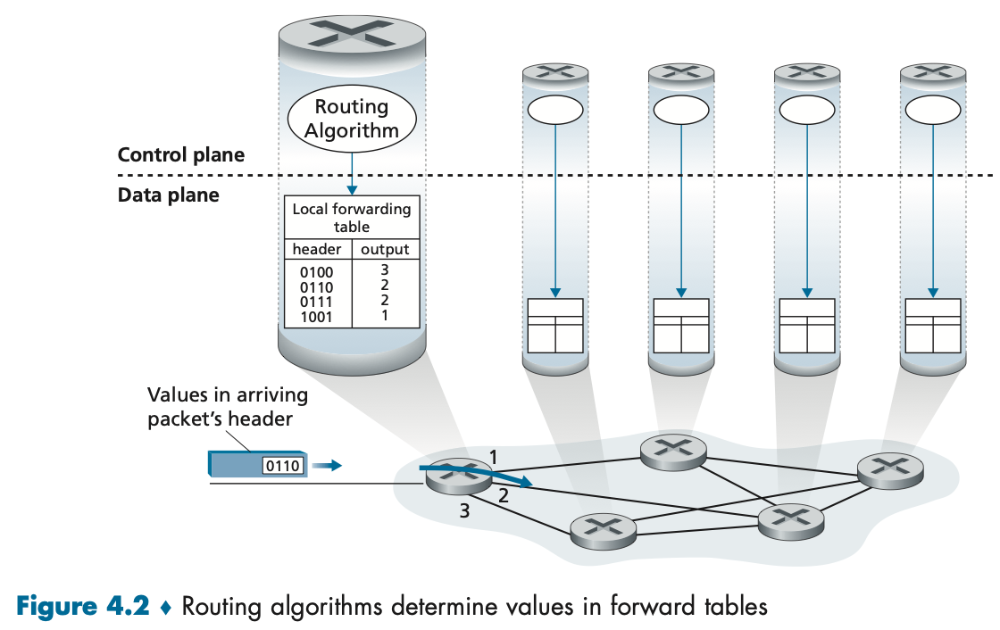
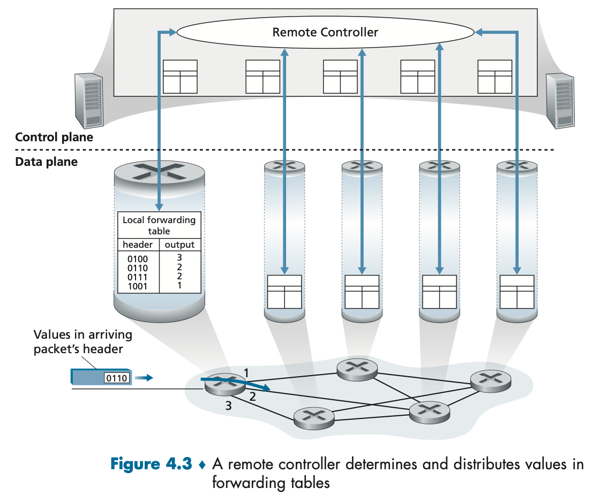

**4.1 Overview of Network Layer**

The primary role of the network layer is deceptively simple—to move packets from a sending host to a receiving host. To do so, two important network-layer functions can be identified:

- Forwarding. When a packet arrives at a router’s input link, the router must move the packet to the appropriate output link.
- Routing. The network layer must determine the route or path taken by packets as they flow from a sender to a receiver. The algorithms that calculate these paths are referred to as routing algorithms. Routing is implemented in the control plane of the network layer.

The terms forwarding and routing are often used interchangeably by authors discussing the network layer. We’ll use these terms much more precisely. Forwarding refers to the router-local action of transferring a packet from an input link interface to the appropriate output link interface. Forwarding takes place at very short timescales (typically a few nanoseconds), and thus is typically implemented in hardware. Routing refers to the network-wide process that determines the end-to-end paths that packets take from source to destination. Routing takes place on much longer timescales (typically seconds), and as we will see is often implemented in software.

A key element in every network router is its forwarding table. A router forwards a packet by examining the value of one or more fields in the arriving packet’s header, and then using these header values to index into its forwarding table. Forwarding is the key function performed by the data-plane functionality of the network layer.

Control Plane: The Traditional Approach

> 
>
> As shown in Figure 4.2, the routing algorithm determines the contents of the routers’ forwarding tables. In this example, a routing algorithm runs in each and every router and both forwarding and routing functions are contained within a router.

Control Plane: The SDN Approach

> 
>
> The control-plane approach shown in Figure 4.3 is at the heart of **software-defined networking** (**SDN**), where the network is “software-defined” because the controller that computes forwarding tables and interacts with routers is implemented in software.
