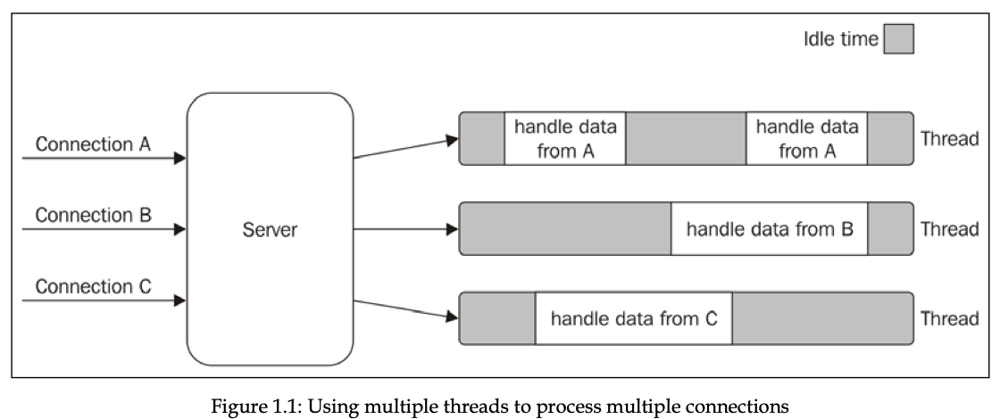
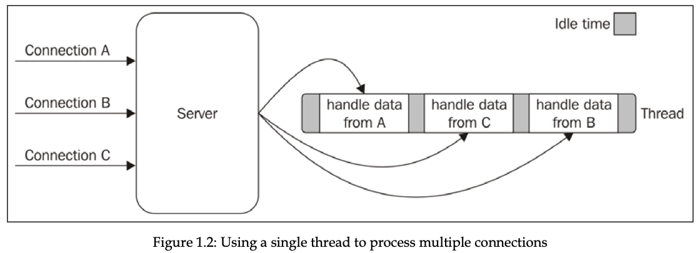
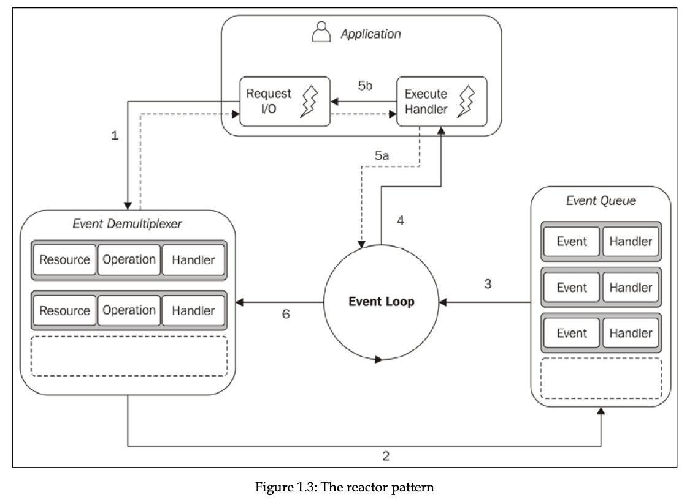
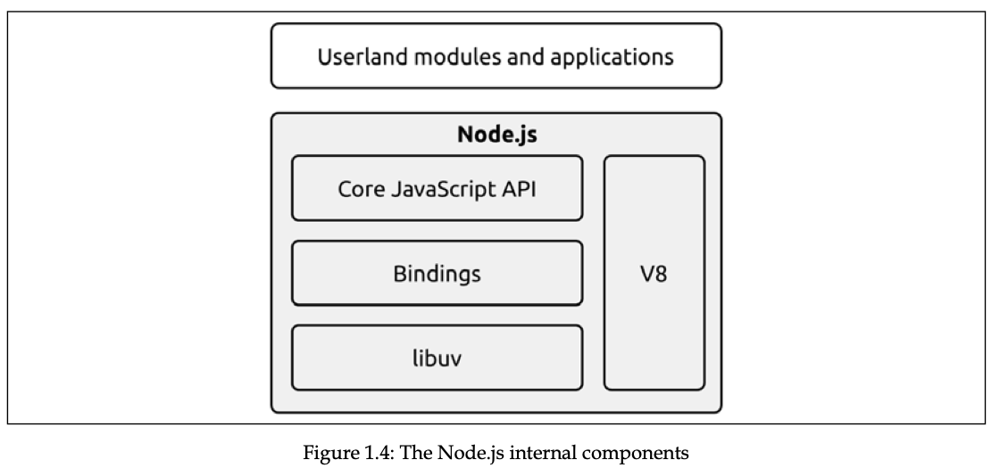

In traditional blocking I/O programming, the function call corresponding to an I/O request will block the execution of the thread until the operation completes. The traditional approach to solving this problem is to use a separate thread (or process) to handle each concurrent connection. This way, a thread blocked on an I/O operation will not impact the availability of the other connections, because they are handled in separate threads.



Unfortunately, a thread is not cheap in terms of system resources—it consumes memory and causes context switches—so having a long-running thread for each connection and not using it for most of the time means wasting precious memory and CPU cycles.

In addition to blocking I/O, most modern operating systems support another mechanism to access resources, called non-blocking I/O. In this operating mode, the system call always returns immediately without waiting for the data to be read or written.

The most basic pattern for dealing with this type of non-blocking I/O is to actively poll the resource within a loop until some actual data is returned. This is called **busy-waiting**. The following pseudocode shows you how it's possible to read from multiple resources using non-blocking I/O and an active polling loop:

```js
resources = [socketA, socketB, fileA] 
while (!resources.isEmpty()) {   
  for (resource of resources) {     
    // try to read     
    data = resource.read()     
    if (data === NO_DATA_AVAILABLE) {       
      // there is no data to read at the moment       
      continue     
    }     
    if (data === RESOURCE_CLOSED) {       
      // the resource was closed, remove it from the list       
      resources.remove(i)     
    } else {       
      //some data was received, process it       
      consumeData(data)     
    }   
  } 
}
```

As you can see, with this simple technique, it is possible to handle different resources in the same thread, but it's still not efficient. In fact, in the preceding example, the loop will only consume precious CPU for iterating over resources that are unavailable most of the time. Polling algorithms usually result in a huge amount of wasted CPU time.

Busy-waiting is definitely not an ideal technique for processing non-blocking resources, but luckily, most modern operating systems provide a native mechanism to handle concurrent non-blocking resources in an efficient way. We are talking about the **synchronous event demultiplexer** (also known as the **event notification interface**).

If you are unfamiliar with the term, in telecommunications, **multiplexing** refers to the method by which multiple signals are combined into one so that they can be easily transmitted over a medium with limited capacity.

**Demultiplexing** refers to the opposite operation, whereby the signal is split again into its original components. Both terms are used in other areas (for example, video processing) to describe the general operation of combining different things into one and vice versa.

The synchronous event demultiplexer that we were talking about watches multiple resources and returns a new event (or set of events) when a read or write operation executed over one of those resources completes. The advantage here is that the synchronous event demultiplexer is, of course, synchronous, so it blocks until there are new events to process. The following is the pseudocode of an algorithm that uses a generic synchronous event demultiplexer to read from two different resources:

```js
watchedList.add(socketA, FOR_READ)                            // (1) 
watchedList.add(fileB, FOR_READ) 
while (events = demultiplexer.watch(watchedList)) {           // (2)   
  // event loop   
  for (event of events) {                                     // (3)     
    // This read will never block and will always return data     
    data = event.resource.read()     
    if (data === RESOURCE_CLOSED) {       
      // the resource was closed, remove it from the watched list       
      demultiplexer.unwatch(event.resource)     
    } else {       
      // some actual data was received, process it       
      consumeData(data)     
    }   
  } 
}
```

> 1. The resources are added to a data structure, associating each one of them with a specific operation (in our example, a read).
>
> 2. The demultiplexer is set up with the group of resources to be watched. The call to *demultiplexer.watch()* is synchronous and blocks until any of the watched resources are ready for read. When this occurs, the event demultiplexer returns from the call and a new set of events is available to be processed.
> 3. Each event returned by the event demultiplexer is processed. At this point, the resource associated with each event is guaranteed to be ready to read and to not block during the operation. When all the events are processed, the flow will block again on the event demultiplexer until new events are again available to be processed. This is called the **event loop**.

It's interesting to see that, with this pattern, we can now handle several I/O operations inside a single thread, without using the busy-waiting technique. It should now be clearer why we are talking about demultiplexing; using just a single thread, we can deal with multiple resources. Figure 1.2 will help you visualize what's happening in a web server that uses a synchronous event demultiplexer and a single thread to handle multiple concurrent connections:



As this shows, using only one thread does not impair our ability to run multiple I/O-bound tasks concurrently. The tasks are spread over time, instead of being spread across multiple threads. This has the clear advantage of minimizing the total idle time of the thread, as is clearly shown in Figure 1.2.

We can now introduce the reactor pattern, which is a specialization of the algorithms presented in the previous sections. The main idea behind the reactor pattern is to have a handler associated with each I/O operation. A handler in Node.js is represented by a callback (or cb for short) function. The handler will be invoked as soon as an event is produced and processed by the event loop. The structure of the reactor pattern is shown in Figure 1.3:



This is what happens in an application using the reactor pattern: 

1. The application generates a new I/O operation by submitting a request to the Event Demultiplexer. The application also specifies a handler, which will be invoked when the operation completes. Submitting a new request to the Event Demultiplexer is a non-blocking call and it immediately returns control to the application.

2. When a set of I/O operations completes, the Event Demultiplexer pushes a set of corresponding events into the Event Queue.

3. At this point, the Event Loop iterates over the items of the Event Queue.

4. For each event, the associated handler is invoked.

5. The handler, which is part of the application code, gives back control to the Event Loop when its execution completes (5a). While the handler executes, it can request new asynchronous operations (5b), causing new items to be added to the Event Demultiplexer (1).
6.  When all the items in the Event Queue are processed, the Event Loop blocks again on the Event Demultiplexer, which then triggers another cycle when a new event is available.

The asynchronous behavior has now become clear. The application expresses interest in accessing a resource at one point in time (without blocking) and provides a handler, which will then be invoked at another point in time when the operation completes.

Each operating system has its own interface for the event demultiplexer: **epoll** on Linux, **kqueue** on macOS, and the I/O completion port (IOCP) API on Windows. On top of that, each I/O operation can behave quite differently depending on the type of resource, even within the same operating system.

All these inconsistencies across and within the different operating systems required a higher-level abstraction to be built for the event demultiplexer. This is exactly why the Node.js core team created a native library called **libuv**, with the objective to make Node.js compatible with all the major operating systems and normalize the non-blocking behavior of the different types of resource. Libuv represents the low-level I/O engine of Node.js and is probably the most important component that Node.js is built on. Other than abstracting the underlying system calls, libuv also implements the reactor pattern, thus providing an API for creating event loops, managing the event queue, running asynchronous I/O operations, and queuing other types of task.

The reactor pattern and libuv are the basic building blocks of Node.js, but we need three more components to build the full platform: 

- A set of bindings responsible for wrapping and exposing libuv and other low-level functionalities to JavaScript.
- V8, the JavaScript engine originally developed by Google for the Chrome browser. This is one of the reasons why Node.js is so fast and efficient. V8 is acclaimed for its revolutionary design, its speed, and for its efficient memory management.
- A core JavaScript library that implements the high-level Node.js API.

This is the recipe for creating Node.js, and the following image represents its final architecture:




