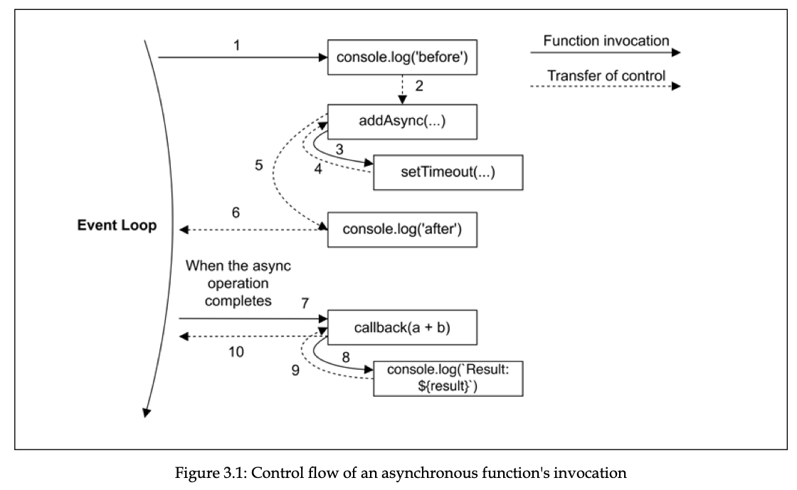
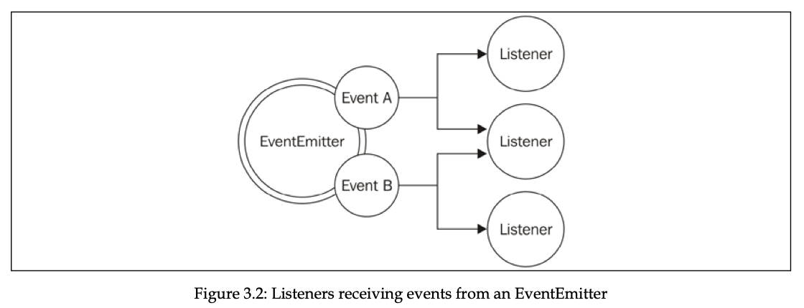

The most basic mechanism to get notified about the completion of an asynchronous operation in Node.js is the callback, which is nothing more than a function invoked by the runtime with the result of an asynchronous operation.

The callback is the most basic building block on which all other asynchronous mechanisms are based. In fact, without callbacks, we wouldn't have promises, and therefore not even async/await; we also wouldn't have streams or events. This is why it's important to know how callbacks work.

You will also learn about the Observer pattern, which can be considered a close relative of the Callback pattern. The Observer pattern—embodied by the EventEmitter—uses callbacks to deal with multiple heterogeneous events and is one of the most extensively used components in Node.js programming.

### The Callback pattern

JavaScript is the ideal language for callbacks because functions are first-class objects and can be easily assigned to variables, passed as arguments, returned from another function invocation, or stored in data structures. Another ideal construct for implementing callbacks is closures. With closures, we can reference the environment in which a function was created; this way, we can always maintain the context in which the asynchronous operation was requested, no matter when or where its callback is invoked.

In JavaScript, a callback is a function that is passed as an argument to another function and is invoked with the result when the operation completes. In functional programming, this way of propagating the result is called the continuation-passing style (CPS). It is a general concept, and it is not always associated with asynchronous operations. In fact, it simply indicates that a result is propagated by passing it to another function (the callback), instead of directly returning it to the caller.

```js
function add (a, b) {   
  return a + b 
}
```

If you are wondering, there is nothing special going on here. The result is passed back to the caller using the return instruction. This is also called direct style, and it represents the most common way of returning a result in synchronous programming. The equivalent CPS of the preceding function would be as follows:

```js
function addCps (a, b, callback) {   
  callback(a + b) 
}
```

The addCps() function is a synchronous CPS function. It's synchronous because it will complete its execution only when the callback completes its execution too. The following code demonstrates this statement:

```js
console.log('before') 
addCps(1, 2, result => console.log(`Result: ${result}`)) 
console.log('after')

// before 
// Result: 3 
// after
```

```js
function additionAsync (a, b, callback) {   
  setTimeout(() => callback(a + b), 100) 
}
```

In the previous code, we used setTimeout() to simulate an asynchronous invocation of the callback. setTimeout() adds a task to the event queue that is executed after the given number of milliseconds. This is clearly an asynchronous operation. Now, let's try to use additionAsync() and see how the order of the operations changes:

```js
console.log('before') 
additionAsync(1, 2, result => console.log(`Result: ${result}`)) 
console.log('after')

// before 
// after 
// Result: 3
```

Since setTimeout() triggers an asynchronous operation, it doesn't wait for the callback to be executed; instead, it returns immediately, giving the control back to additionAsync(), and then back again to its caller. This property in Node.js is crucial, as it gives control back to the event loop as soon as an asynchronous request is sent, thus allowing a new event from the queue to be processed.



Thanks to closures, it is trivial to maintain the context of the caller of the asynchronous function, even if the callback is invoked at a different point in time and from a different location.

To sum this up, a synchronous function blocks until it completes its operations. An asynchronous function returns immediately, and its result is passed to a handler (in our case, a callback) at a later cycle of the event loop.

```js
// Non-CPS callbacks
const result = [1, 5, 7].map(element => element - 1) 
console.log(result) // [0, 4, 6]
```

Clearly, the callback is used just to iterate over the elements of the array, and not to pass the result of the operation. In fact, the result is returned synchronously using a direct style. There's no syntactic difference between non-CPS callbacks and CPS ones. Therefore, the intent of a callback should be clearly stated in the documentation of the API.

One of the most dangerous situations is to have an API that behaves synchronously under certain conditions and asynchronously under others. Let's take the following code as an example:

```js
import { readFile } from 'fs'

const cache = new Map()

function inconsistentRead (filename, cb) {
  if (cache.has(filename)) {
    // invoked synchronously
    cb(cache.get(filename))
  } else {
    // asynchronous function
    readFile(filename, 'utf8', (err, data) => {
      cache.set(filename, data)
      cb(data)
    })
  }
}

function createFileReader (filename) {
  const listeners = []
  inconsistentRead(filename, value => {
    listeners.forEach(listener => listener(value))
  })

  return {
    onDataReady: listener => listeners.push(listener)
  }
}

const reader1 = createFileReader('data.txt')
reader1.onDataReady(data => {
  console.log(`First call data: ${data}`)

  // ...sometime later we try to read again from
  // the same file
  const reader2 = createFileReader('data.txt')
  reader2.onDataReady(data => {
    console.log(`Second call data: ${data}`)
  })
})

// First call data: some data
```

As you can see, the callback of the second reader is never invoked. Let's see why: 

- During the creation of reader1, our inconsistentRead() function behaves asynchronously because there is no cached result available. This means that any onDataReady listener will be invoked later in another cycle of the event loop, so we have all the time we need to register our listener.
- Then, reader2 is created in a cycle of the event loop in which the cache for the requested file already exists. In this case, the inner call to inconsistentRead() will be synchronous. So, its callback will be invoked immediately, which means that all the listeners of reader2 will be invoked synchronously as well. However, we are registering the listener after the creation of reader2, so it will never be invoked.

The bug that you've just seen can be extremely complicated to identify and reproduce in a real application. Imagine using a similar function in a web server, where there can be multiple concurrent requests. Imagine seeing some of those requests hanging, without any apparent reason and without any error being logged. This can definitely be considered a nasty defect. Isaac Z. Schlueter, the creator of npm and former Node.js project lead, in one of his blog posts, compared the use of this type of unpredictable function to unleashing Zalgo.

One possible fix for our inconsistentRead() function is to make it completely synchronous. This is possible because Node.js provides a set of synchronous direct style APIs for most basic I/O operations. For example, we can use the fs.readFileSync() function in place of its asynchronous counterpart. The code would become as follows:

```js
import { readFileSync } from 'fs'

const cache = new Map()

function consistentReadSync (filename) {
  if (cache.has(filename)) {
    return cache.get(filename)
  } else {
    const data = readFileSync(filename, 'utf8')
    cache.set(filename, data)
    return data
  }
}

console.log(consistentReadSync('data.txt'))
// the next call will read from the cache
console.log(consistentReadSync('data.txt'))
```

You can see that the entire function was also converted into direct style. There is no reason for a function to have a CPS if it is synchronous. In fact, it is always best practice to implement a synchronous API using a direct style. This will eliminate any confusion around its nature and will also be more efficient from a performance perspective.

In our consistentReadSync() function, the risk of blocking the event loop is partially mitigated because the synchronous I/O API is invoked only once per filename, while the cached value will be used for all the subsequent invocations. If we have a limited number of static files, then using consistentReadSync() won't have a big effect on our event loop. Things can change quickly if we have to read many files and only once.

Using synchronous I/O in Node.js is strongly discouraged in many circumstances, but in some situations, this might be the easiest and most efficient solution. Always evaluate your specific use case in order to choose the right alternative. As an example, it makes perfect sense to use a synchronous blocking API to load a configuration file while bootstrapping an application.

Another alternative for fixing our inconsistentRead() function is to make it purely asynchronous. The trick here is to schedule the synchronous callback invocation to be executed "in the future" instead of it being run immediately in the same event loop cycle. In Node.js, this is possible with process.nextTick(), which defers the execution of a function after the currently running operation completes. Its functionality is very simple: it takes a callback as an argument and pushes it to the top of the event queue, in front of any pending I/O event, and returns immediately. The callback will then be invoked as soon as the currently running operation yields control back to the event loop.

```js
import { readFile } from 'fs'

const cache = new Map()

function consistentReadAsync (filename, callback) {
  if (cache.has(filename)) {
    // deferred callback invocation
    process.nextTick(() => callback(cache.get(filename)))
  } else {
    // asynchronous function
    readFile(filename, 'utf8', (err, data) => {
      cache.set(filename, data)
      callback(data)
    })
  }
}

function createFileReader (filename) {
  const listeners = []
  consistentReadAsync(filename, value => {
    listeners.forEach(listener => listener(value))
  })

  return {
    onDataReady: listener => listeners.push(listener)
  }
}

const reader1 = createFileReader('data.txt')
reader1.onDataReady(data => {
  console.log(`First call data: ${data}`)

  // ...sometime later we try to read again from
  // the same file
  const reader2 = createFileReader('data.txt')
  reader2.onDataReady(data => {
    console.log(`Second call data: ${data}`)
  })
})

```

Another API for deferring the execution of code is setImmediate(). While its purpose is very similar to that of process.nextTick(), its semantics are quite different. Callbacks deferred with process.nextTick() are called microtasks and they are executed just after the current operation completes, even before any other I/O event is fired. With setImmediate(), on the other hand, the execution is queued in an event loop phase that comes after all I/O events have been processed. Since process.nextTick() runs before any already scheduled I/O, it will be executed faster, but under certain circumstances, it might also delay the running of any I/O callback indefinitely (also known as I/O starvation), such as in the presence of a recursive invocation. This can never happen with setImmediate().

Using setTimeout(callback, 0) has a behavior comparable to that of setImmediate(), but in typical circumstances, callbacks scheduled with setImmediate() are executed faster than those scheduled with setTimeout(callback, 0). To see why, we have to consider that the event loop executes all the callbacks in different phases; for the type of events we are considering, we have timers (setTimeout()) that are executed before I/O callbacks, which are, in turn, executed before setImmediate() callbacks. This means that if we queue a task with setImmediate() in a setTimeout() callback, in an I/O callback, or in a microtask queued after these two phases, then the callback will be executed in a phase that comes right after the phase we are currently in. setTimeout() callbacks have to wait for the next cycle of the event loop.

> ### Event Loop Phases
>
> In Node.js, the event loop has several phases, and it processes different types of callbacks in a specific order:
>
> 1. **Timers Phase:** This is where callbacks scheduled by `setTimeout` and `setInterval` are executed.
> 2. **I/O Callbacks Phase:** This handles callbacks from I/O operations like file reads, network requests, etc.
> 3. **Idle, Prepare Phase:** Internal phase used for various purposes by the Node.js runtime.
> 4. **Poll Phase:** This is where the event loop waits for new I/O events and executes I/O-related callbacks.
> 5. **Check Phase:** This is where callbacks scheduled by `setImmediate` are executed.
> 6. **Close Callbacks Phase:** This handles callbacks related to closing resources like `socket` `end` events.
>
> ### `setTimeout(callback, 0)`
>
> - **Purpose:** Schedules a `callback` to run after at least 0 milliseconds.
> - **Behavior:** Although it’s called with a delay of 0 milliseconds, it doesn’t execute immediately. Instead, it queues the `callback` to run after the current phase of the event loop, but it still needs to wait for the timers phase to complete and the event loop to move to the next iteration.
>
> ### `setImmediate()`
>
> - **Purpose:** Schedules a `callback` to run in the "check" phase of the event loop, which comes after the I/O callbacks phase.
> - **Behavior:** It executes as soon as the I/O callbacks phase is finished, before moving to the next iteration of the event loop.
>
> ### Comparison and Explanation
>
> - **Execution Order:** 
>   - `setTimeout(callback, 0)` queues the `callback` to execute in the timers phase, which is part of the next event loop iteration. It effectively waits for the timers phase of the current loop to complete before executing.
>   - `setImmediate()` schedules the `callback` to run immediately after the I/O callbacks phase, within the current iteration of the event loop.
>
> - **Speed of Execution:**
>   - If you use `setImmediate()` inside a `setTimeout` callback, the `setImmediate()` callback will be executed in the check phase of the same iteration, whereas the `setTimeout` callback would only execute in the next iteration of the event loop.
>   - Therefore, `setImmediate()` is generally faster than `setTimeout(callback, 0)` because `setImmediate()` executes immediately after the I/O callbacks phase, without waiting for the next iteration of the event loop.
>
> - **Example Scenario:**
>   If you schedule a task with `setImmediate()` inside an I/O callback or a `setTimeout` callback, the `setImmediate()` callback will run before the `setTimeout` callback of `0` milliseconds in the subsequent phase of the same loop iteration. 
>
> In essence, `setImmediate()` is intended for scenarios where you want a callback to run as soon as possible, immediately following the current phase of the event loop, whereas `setTimeout(callback, 0)` schedules a callback for the next iteration, introducing a slight delay in execution.

In all core Node.js functions, the standard convention is that when a function accepts a callback as input, this has to be passed as the last argument.

In CPS, errors are propagated like any other type of result, which means using callbacks. In Node.js, any error produced by a CPS function is always passed as the first argument of the callback, and any actual result is passed starting from the second argument. If the operation succeeds without errors, the first argument will be null or undefined.

In asynchronous CPS, however, proper error propagation is done by simply passing the error to the next callback in the chain. The typical pattern looks as follows:

```js
import { readFile } from "fs";

function readJSON(filename, callback) {
  readFile(filename, "utf8", (err, data) => {
    let parsed;
    if (err) {
      // propagate the error and exit the current function
      return callback(err);
    }

    try {
      // parse the file contents
      parsed = JSON.parse(data);
    } catch (err) {
      // catch parsing errors
      return callback(err);
    }
    // no errors, propagate just the data
    callback(null, parsed);
  });
}

const cb = (err, data) => {
  if (err) {
    return console.error(err);
  }

  console.log(data);
};

readJSON("valid_json.json", cb); // { hello: 'world' }
readJSON("invalid_json.json", cb); // SyntaxError

```

Notice how we propagate the error received by the readFile() operation. We do not throw it or return it; instead, we just use the callback as if it were any other result. Also, notice how we use the try...catch statement to catch any error thrown by JSON.parse(), which is a synchronous function and therefore uses the traditional throw instruction to propagate errors to the caller. Lastly, if everything went well, callback is invoked with null as the first argument to indicate that there are no errors. It's also interesting to note how we refrained from invoking callback from within the try block. This is because doing so would catch any error thrown from the execution of the callback itself, which is usually not what we want.

Sometimes, it can happen that an error is thrown and not caught within the callback of an asynchronous function. This could happen if, for example, we had forgotten to surround JSON.parse() with a try...catch statement in the readJSON() function we defined previously. In fact, when this happens, Node.js will emit a special event called uncaughtException, just before exiting the process:

```js
import { readFile } from "fs";

function readJSONThrows(filename, callback) {
  readFile(filename, "utf8", (err, data) => {
    if (err) {
      return callback(err);
    }
    callback(null, JSON.parse(data));
  });
}

// The error is not propagated to the final callback nor is caught
// by a try/catch statement
try {
  readJSONThrows("invalid_json.json", (err) => console.error(err));
} catch (err) {
  console.log("This will NOT catch the JSON parsing exception");
}

// Our last chance to intercept any uncaught error
process.on("uncaughtException", (err) => {
  console.error(`This will catch at last the JSON parsing exception: ${err.message}`);
  // Terminates the application with 1 (error) as exit code.
  // Without the following line, the application would continue
  process.exit(1);
});

```

It's important to understand that an uncaught exception leaves the application in a state that is not guaranteed to be consistent, which can lead to unforeseeable problems. For example, there might still be incomplete I/O requests running or closures might have become inconsistent. That's why it is always advised, especially in production, to never leave the application running after an uncaught exception is received. Instead, the process should exit immediately, optionally after having run some necessary cleanup tasks, and ideally, a supervising process should restart the application. This is also known as the **fail-fast** approach and it's the recommended practice in Node.js.

### The Observer pattern

Another important and fundamental pattern used in Node.js is the Observer pattern. Together with the Reactor pattern and callbacks, the Observer pattern is an absolute requirement for mastering the asynchronous world of Node.js.

The main difference from the Callback pattern is that the subject can actually notify multiple observers, while a traditional CPS callback will usually propagate its result to only one listener, the callback.

##### The EventEmitter

In traditional object-oriented programming, the Observer pattern requires interfaces, concrete classes, and a hierarchy. In Node.js, all this becomes much simpler. The Observer pattern is already built into the core and is available through the EventEmitter class. The EventEmitter class allows us to register one or more functions as listeners, which will be invoked when a particular event type is fired.



The essential methods of the EventEmitter are as follows:

- `on(event, listener)`: This method allows us to register a new listener (a function) for the given event type (a string).
- `once(event, listener)`: This method registers a new listener, which is then removed after the event is emitted for the first time.
- `emit(event, [arg1], [...])`: This method produces a new event and provides additional arguments to be passed to the listeners.
- `removeListener(event, listener)`: This method removes a listener for the specified event type.

All the preceding methods will return the `EventEmitter` instance to allow chaining. The listener function has the signature `function([arg1], [...])`, so it simply accepts the arguments provided at the moment the event is emitted.

##### Creating and using the EventEmitter

```js
import { EventEmitter } from "events";
import { readFile } from "fs";

function findRegex(files, regex) {
  const emitter = new EventEmitter();
  for (const file of files) {
    readFile(file, "utf8", (err, content) => {
      if (err) {
        return emitter.emit("error", err);
      }

      emitter.emit("fileread", file);
      const match = content.match(regex);
      if (match) {
        match.forEach((elem) => emitter.emit("found", file, elem));
      }
    });
  }
  return emitter;
}

findRegex(["fileA.txt", "fileB.json"], /hello \w+/g)
  .on("fileread", (file) => console.log(`${file} was read`))
  .on("found", (file, match) => console.log(`Matched "${match}" in ${file}`))
  .on("error", (err) => console.error(`Error emitted ${err.message}`));

/*
fileA.txt was read
Matched "hello world" in fileA.txt
fileB.json was read
Matched "hello NodeJS" in fileB.json
Matched "hello you" in fileB.json
*/
```

##### Propagating errors

As with callbacks, the `EventEmitter` can't just throw an exception when an error condition occurs. Instead, the convention is to emit a special event, called `error`, and pass an `Error` object as an argument.

The `EventEmitter` treats the `error` event in a special way. It will automatically throw an exception and exit from the application if such an event is emitted and no associated listener is found. For this reason, it is recommended to always register a listener for the error event.

##### Making any object observable

In the Node.js world, the `EventEmitter` is rarely used on its own, as you saw in the previous example. Instead, it is more common to see it extended by other classes. In practice, this enables any class to inherit the capabilities of the `EventEmitter`, hence becoming an observable object.

```js
import { EventEmitter } from "events";
import { readFile } from "fs";

class FindRegex extends EventEmitter {
  constructor(regex) {
    super();
    this.regex = regex;
    this.files = [];
  }

  addFile(file) {
    this.files.push(file);
    return this;
  }

  find() {
    for (const file of this.files) {
      readFile(file, "utf8", (err, content) => {
        if (err) {
          return this.emit("error", err);
        }

        this.emit("fileread", file);

        const match = content.match(this.regex);
        if (match) {
          match.forEach((elem) => this.emit("found", file, elem));
        }
      });
    }
    return this;
  }
}

const findRegexInstance = new FindRegex(/hello \w+/g);
findRegexInstance
  .addFile("fileA.txt")
  .addFile("fileB.json")
  .find()
  .on("fileread", (file) => console.log(`${file} was read`))
  .on("found", (file, match) => console.log(`Matched "${match}" in file ${file}`))
  .on("error", (err) => console.error(`Error emitted ${err.message}`));

/*
fileA.txt was read
Matched "hello world" in file fileA.txt
fileB.json was read
Matched "hello NodeJS" in file fileB.json
Matched "hello you" in file fileB.json
*/
```

##### EventEmitter and memory leaks

When subscribing to observables with a long life span, it is extremely important that we **unsubscribe** our listeners once they are no longer needed. This allows us to release the memory used by the objects in a listener's scope and prevent **memory leaks**. Unreleased `EventEmitter` listeners are the main source of memory leaks in Node.js (and JavaScript in general).

A memory leak is a software defect whereby memory that is no longer needed is not released, causing the memory usage of an application to grow indefinitely. For example, consider the following code:

```js
const thisTakesMemory = 'A big string....' 
const listener = () => {   
  console.log(thisTakesMemory) 
} 
emitter.on('an_event', listener)
```

The variable `thisTakesMemory` is referenced in the listener and therefore its memory is retained until the listener is released from `emitter`, or until the `emitter` itself is garbage collected, which can only happen when there are no more active references to it, making it unreachable.

This means that if an `EventEmitter` remains reachable for the entire duration of the application, all its listeners do too, and with them all the memory they reference. If, for example, we register a listener to a "permanent" EventEmitter at every incoming HTTP request and never release it, then we are causing a memory leak. The memory used by the application will grow indefinitely, sometimes slowly, sometimes faster, but eventually it will crash the application. To prevent such a situation, we can release the listener with the `removeListener()` method of the EventEmitter:

```js
emitter.removeListener('an_event', listener)
```

An EventEmitter has a very simple built-in mechanism for warning the developer about possible memory leaks. When the count of listeners registered to an event exceeds a specific amount (by default, 10), the EventEmitter will produce a warning. Sometimes, registering more than 10 listeners is completely fine, so we can adjust this limit by using the `setMaxListeners()` method of the EventEmitter.

We can use the convenience method `once(event, listener)` in place of `on(event, listener)` to automatically unregister a listener after the event is received for the first time. However, be advised that if the event we specify is never emitted, then the listener is never released, causing a memory leak.

##### Synchronous and asynchronous events

As with callbacks, events can also be emitted synchronously or asynchronously with respect to the moment the tasks that produce them are triggered. It is crucial that we never mix the two approaches in the same `EventEmitter`, but even more importantly, we should never emit the same event type using a mix of synchronous and asynchronous code, to avoid producing the same problems described in the Unleashing Zalgo section. The main difference between emitting synchronous and asynchronous events lies in the way listeners can be registered.

When events are emitted asynchronously, we can register new listeners, even after the task that produces the events is triggered, up until the current stack yields to the event loop. This is because the events are guaranteed not to be fired until the next cycle of the event loop, so we can be sure that we won't miss any events.

The `FindRegex()` class we defined previously emits its events asynchronously after the `find()` method is invoked. This is why we can register the listeners after the `find()` method is invoked, without losing any events.

On the other hand, if we emit our events synchronously after the task is launched, we have to register all the listeners before we launch the task, or we will miss all the events. To see how this works, let's modify the `FindRegex` class we defined previously and make the `find()` method synchronous:

```js
import { EventEmitter } from "events";
import { readFileSync } from "fs";

class FindRegexSync extends EventEmitter {
  constructor(regex) {
    super();
    this.regex = regex;
    this.files = [];
  }

  addFile(file) {
    this.files.push(file);
    return this;
  }

  find() {
    for (const file of this.files) {
      let content;
      try {
        content = readFileSync(file, "utf8");
      } catch (err) {
        this.emit("error", err);
      }

      this.emit("fileread", file);
      const match = content.match(this.regex);
      if (match) {
        match.forEach((elem) => this.emit("found", file, elem));
      }
    }
    return this;
  }
}

const findRegexSyncInstance = new FindRegexSync(/hello \w+/g);
findRegexSyncInstance
  .addFile("fileA.txt")
  .addFile("fileB.json")
  // this listener is invoked
  .on("found", (file, match) => console.log(`[Before] Matched "${match}"`))
  .find()
  // this listener is never invoked
  .on("found", (file, match) => console.log(`[After] Matched "${match}"`));

/*
[Before] Matched "hello world"
[Before] Matched "hello NodeJS"
[Before] Matched "hello you"
*/
```

There are some (rare) situations in which emitting an event in a synchronous fashion makes sense, but the very nature of the `EventEmitter` lies in its ability to deal with asynchronous events. Most of the time, emitting events synchronously is a telltale sign that we either don't need the `EventEmitter` at all or that, somewhere else, the same observable is emitting another event asynchronously, potentially causing a Zalgo type of situation.

The emission of synchronous events can be deferred with `process.nextTick()` to guarantee that they are emitted asynchronously.

##### EventEmitter versus callbacks

A common dilemma when defining an asynchronous API is deciding whether to use an EventEmitter or simply accept a callback. The general differentiating rule is semantic: callbacks should be used when a result must be returned in an asynchronous way, while events should be used when there is a need to communicate that something has happened.

But besides this simple principle, a lot of confusion is generated from the fact that the two paradigms are, most of the time, equivalent and allow us to achieve the same results. Consider the following code as an example:

```js
import { EventEmitter } from "events";

function helloEvents() {
  const eventEmitter = new EventEmitter();
  setTimeout(() => eventEmitter.emit("complete", "hello world"), 100);
  return eventEmitter;
}

function helloCallback(cb) {
  setTimeout(() => cb(null, "hello world"), 100);
}

helloEvents().on("complete", (message) => console.log(message));
helloCallback((err, message) => console.log(message));

```

The two functions `helloEvents()` and `helloCallback()` can be considered equivalent in terms of functionality. The first communicates the completion of the timeout using an event, while the second uses a callback. But what really differentiates them is the readability, the semantics, and the amount of code that is required for them to be implemented or used.

While a deterministic set of rules for you to choose between one style or the other can't be given, here are some hints to help you make a decision on which method to use: 

- Callbacks have some limitations when it comes to supporting different types of events. In fact, we can still differentiate between multiple events by passing the type as an argument of the callback, or by accepting several callbacks, one for each supported event. However, this can't exactly be considered an elegant API. In this situation, the `EventEmitter` can give a better interface and leaner code.
- The `EventEmitter` should be used when the same event can occur multiple times, or may not occur at all. A callback, in fact, is expected to be invoked exactly once, whether the operation is successful or not. Having a possibly repeating circumstance should make us think again about the semantic nature of the occurrence, which is more similar to an event that has to be communicated, rather than a result to be returned.
- An API that uses callbacks can notify only one particular callback, while using an `EventEmitter` allows us to register multiple listeners for the same event.


