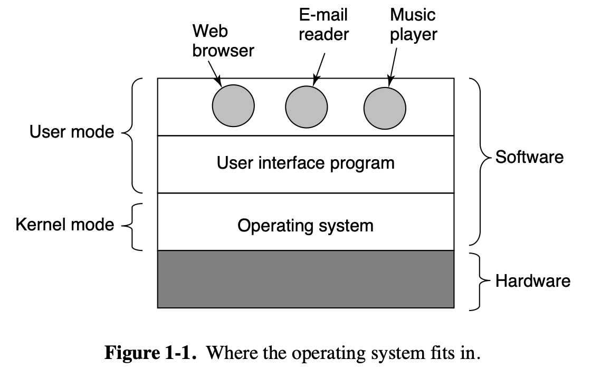
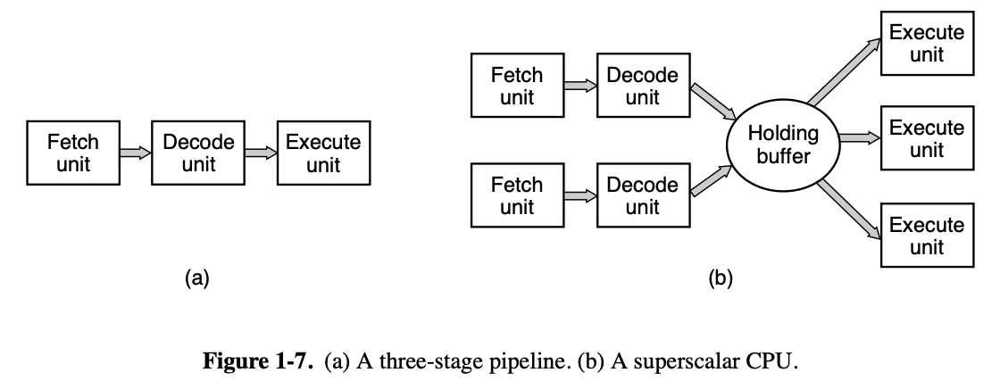
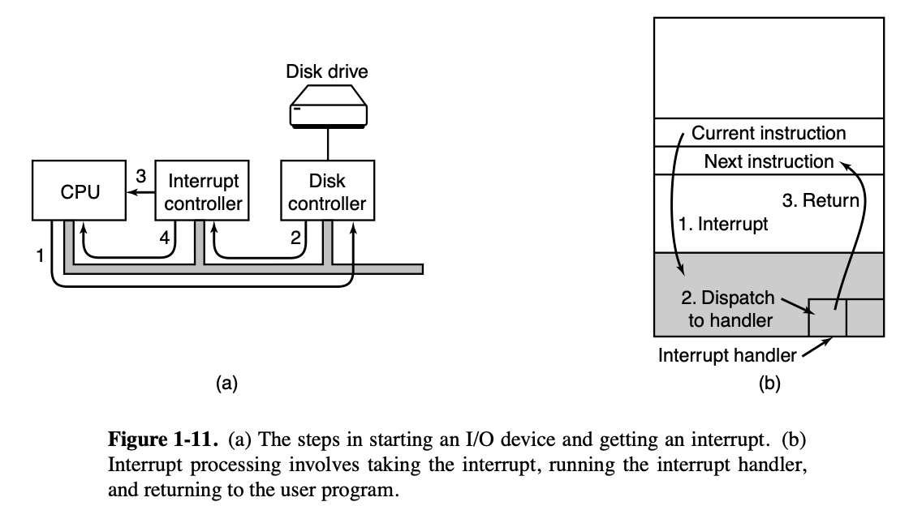
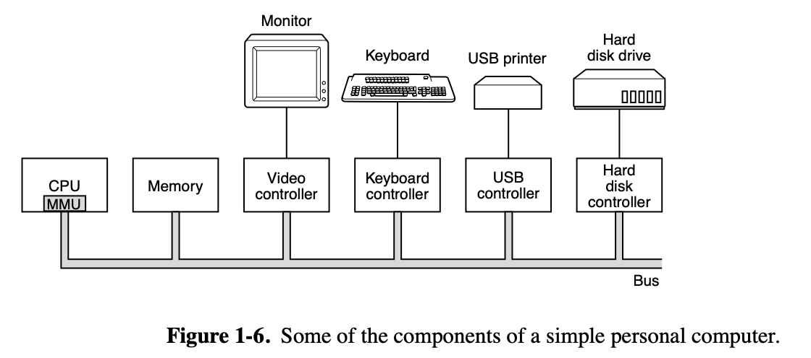
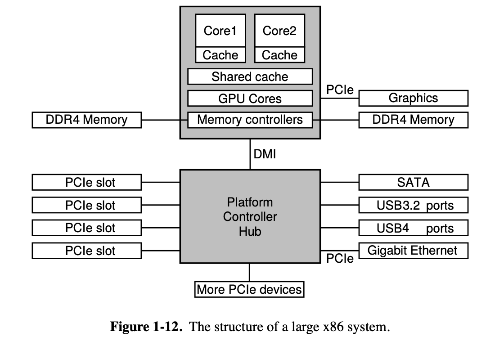
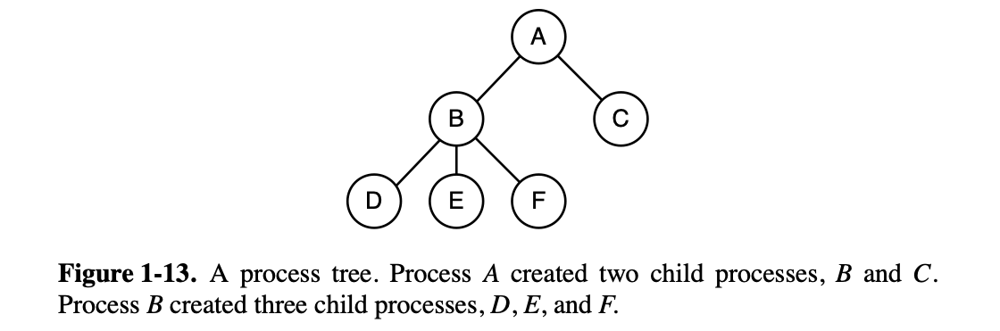

The operating system, the most fundamental piece of software, runs in kernel mode (also called supervisor mode) for at least some of its functionality. In this mode, it has complete access to all the hardware and can execute any instruction the machine is capable of executing. The rest of the software runs in user mode, in which only a subset of the machine instructions is available.

The user interface program, shell or GUI, is the lowest level of user-mode software, and allows the user to start other programs, such as a Web browser, email reader, or music player. These programs, too, make heavy use of the operating system.

No sane programmer would want to deal with this disk at the hardware level. Instead, a piece of software, called a disk driver, deals with the hardware and provides an interface to read and write disk blocks, without getting into the details. Operating systems contain many drivers for controlling I/O devices.

But even this level is much too low for most applications. For this reason, all operating systems provide yet another layer of abstraction for using disks: files. Using this abstraction, programs can create, write, and read files, without having to deal with the messy details of how the hardware actually works.

This abstraction is the key to managing all this complexity. Good abstractions turn a nearly impossible task into two manageable ones. The first is defining and implementing the abstractions. The second is using these abstractions to solve the problem at hand. One abstraction that almost every computer user understands is the file, as mentioned above. It is a useful piece of information, such as a digital photo, saved email message, song, or Web page. It is much easier to deal with photos, emails, songs, and Web pages than with the details of SATA (or other) disks. The job of the operating system is to create good abstractions and then implement and manage the abstract objects thus created.

The concept of an operating system as primarily providing abstractions to application programs is a top-down view. In the bottom-up view, the job of the operating system is to provide for an orderly and controlled allocation of the processors, memories, and I/O devices among the various programs wanting them.

### COMPUTER HARDWARE REVIEW

#### Processors

Because accessing memory to get an instruction or data word takes much longer than executing an instruction, all CPUs contain registers inside to hold key variables and temporary results. Instruction sets often contains instructions to load a word from memory into a register, and store a word from a register into memory. Other instructions combine two operands from registers and/or memory, into a result, such as adding two words and storing the result in a register or in memory.

In addition to the general registers used to hold variables and temporary results, most computers have sev eral special registers that are visible to the programmer. One of these is the program counter, which contains the memory address of the next instruction to be fetched. After that instruction has been fetched, the program counter is updated to point to its successor.

Another register is the stack pointer, which points to the top of the current stack in memory. The stack contains one frame for each procedure that has been entered but not yet exited. A procedure’s stack frame holds those input parameters, local variables, and temporary variables that are not kept in registers.

Yet another register is the PSW (Program Status Word). This register contains the condition code bits, which are set by comparison instructions, the CPU priority, the mode (user or kernel), and various other control bits. User programs may normally read the entire PSW but typically may write only some of its fields. The PSW plays an important role in system calls and I/O.

The operating system must be fully aware of all the registers. When time multiplexing the CPU, the operating system will often stop the running program to (re)start another one. Every time it stops a running program, the operating system must save all the registers so they can be restored when the program runs later.

Many modern CPUs have facilities for executing more than one instruction at the same time. For example, a CPU might have separate fetch, decode, and execute units, so that while it is executing instruction n, it could also be decoding instruction n + 1 and fetching instruction n + 2. Such an organization is called a pipeline.

Even more advanced than a pipeline design is a superscalar CPU, shown in Fig. 1-7(b). In this design, multiple execution units are present, for example, one for integer arithmetic, one for floating-point arithmetic, and one for Boolean operations. Two or more instructions are fetched at once, decoded, and dumped into a holding buffer until they can be executed.

Multithreading does not offer true parallelism. Only one process at a time is running, but thread-switching time is reduced to the order of a nanosecond. Beyond multithreading, many CPU chips now hav e four, eight, or more complete processors or cores on them. Incidentally, in terms of sheer numbers, nothing beats a modern GPU (Graphics Processing Unit). A GPU is a processor with, literally, thousands of tiny cores. They are very good for many small computations done in parallel, like rendering polygons in graphics applications. They are not so good at serial tasks. They are also hard to program. While GPUs can be useful for operating systems (e.g., for encryption or processing of network traffic), it is not likely that much of the operating system itself will run on the GPUs.

#### Memory

The top layer consists of the registers internal to the CPU. They are made of the same material as the CPU and are thus just as fast as the CPU. Consequently, there is no delay in accessing them. The storage capacity available in them is on the order of 32 × 32 bits on a 32-bit CPU and 64 × 64 bits on a 64-bit CPU. Less than 1 KB in both cases.

Next comes the cache memory, which is mostly controlled by the hardware. Main memory is divided up into cache lines, typically 64 bytes, with addresses 0 to 63 in cache line 0, 64 to 127 in cache line 1, and so on. The most heavily used cache lines are kept in a high-speed cache located inside or very close to the CPU. When the program needs to read a memory word, the cache hardware checks to see if the line needed is in the cache. If it is, called a cache hit, the request is satisfied from the cache and no memory request is sent over the bus to the main memory. Cache hits normally take only a few clock cycles. Cache misses have to go to memory, with a substantial time penalty of tens to hundreds of cycles. Cache memory is limited in size due to its high cost. Some machines have two or even three levels of cache, each one slower and bigger than the one before it.

Caches are such a good idea that modern CPUs have two or more of them. The first level or L1 cache is always inside the CPU and usually feeds decoded instructions into the CPU’s execution engine. Most chips have a second L1 cache for very heavily used data words. The L1 caches are typically 32 KB each. In addition, there is often a second cache, called the L2 cache, that holds several megabytes of recently used memory words. The difference between the L1 and L2 caches lies in the timing. Access to the L1 cache is done without any delay, whereas access to the L2 cache involves a delay of several clock cycles.

Main memory is the workhorse of the memory system. Main memory is usually called RAM (Random Access Memory). Unlike RAM, nonvolatile memory does not lose its contents when the power is switched off. ROM (Read Only Memory) is programmed at the factory and cannot be changed afterward. It is fast and inexpensive. On some computers, the bootstrap loader used to start the computer is contained in ROM. EEPROM (Electrically Erasable PROM) is also nonvolatile, but in contrast to ROM can be erased and rewritten. However, writing it takes orders of magnitude more time than writing RAM, so it is used in the same way ROM is, except that it is now possible to correct bugs in programs by rewriting them in the field. Boot strapping code may also be stored in Flash memory, which is similarly nonvolatile, but in contrast to ROM can be erased and rewritten. The boot strapping code is commonly referred to as BIOS (Basic Input/Output System).

Yet another kind of memory is CMOS, which is volatile. Many computers use CMOS memory to hold the current time and date. The CMOS memory and the clock circuit that increments the time in it are powered by a small battery, so the time is correctly updated, even when the computer is unplugged. The CMOS memory can also hold the configuration parameters, such as which drive to boot from. CMOS is used because it draws so little power that the original factory-installed battery often lasts for several years. However, when it begins to fail, the computer can appear to be losing its marbles, forgetting things that it has known for years, like how to boot.

Incidentally, many computers today support a scheme known as virtual memory. It makes it possible to run programs larger than physical memory by placing them on nonvolatile storage (SSD or disk) and using main memory as a kind of cache for the most heavily executed parts.

#### Nonvolatile Storage

Many people also refer to SSDs as disks, even though they are physically not disks at all and do not have platters or moving arms. They store data in electronic (Flash) memory. The only way in which they resemble disks in terms of hardware is that they also store a lot of data which is not lost when the power is off. But from the operating system’s point of view, they are somewhat disk-like.

#### I/O Devices

I/O devices generally consist of two parts: a controller and the device itself. The controller is a chip (or a set of chips) that physically controls the device. It accepts commands from the operating system, for example, to read data from the device, and carries them out.

SATA is currently the standard type of hard disk on many computers. Since the actual device interface is hidden behind the controller, all that the operating system sees is the interface to the controller, which may be quite different from the interface to the device.

Because each type of controller is different, different software is needed to control each one. The software that talks to a controller, giving it commands and accepting responses, is called a device driver.

To be used, the driver has to be put into the operating system so it can run in kernel mode. Drivers can actually run outside the kernel, and operating systems like Linux and Windows nowadays do offer some support for doing so, but the vast majority of the drivers still run below the kernel boundary.

Input and output can be done in three different ways. In the simplest method, a user program issues a system call, which the kernel then translates into a procedure call to the appropriate driver. The driver then starts the I/O and sits in a tight loop continuously polling the device to see if it is done (usually there is some bit that indicates that the device is still busy). When the I/O has completed, the driver puts the data (if any) where they are needed and returns. The operating system then returns control to the caller. This method is called busy waiting and has the disadvantage of tying up the CPU polling the device until it is finished.

The second method is for the driver to start the device and ask it to give an interrupt when it is finished. At that point, the driver returns. The operating system then blocks the caller if need be and looks for other work to do. When the controller detects the end of the transfer, it generates an interrupt to signal completion.

Interrupts are very important in operating systems, so let us examine the idea more closely. In Fig. 1-11(a) we see a three-step process for I/O. In step 1, the driver tells the controller what to do by writing into its device registers. The controller then starts the device. When the controller has finished reading or writing the number of bytes it has been instructed to transfer, it signals the interrupt controller chip using certain bus lines in step 2. If the interrupt controller is ready to accept the interrupt (which it may not be if it is busy handling a higher-priority interrupt), it asserts a pin on the CPU chip telling it, in step 3. In step 4, the interrupt controller puts the number of the device on the bus so the CPU can read it and know which device has just finished (many devices may be running at the same time).

Once the CPU has decided to take the interrupt, the program counter and PSW are typically then pushed onto the current stack and the CPU switched into kernel mode. The device number may be used as an index into part of memory to find the address of the interrupt handler for this device. This part of memory is called the interrupt vector table. Once the interrupt handler (part of the driver for the interrupting device) has started, it saves the stacked program counter, PSW, and other registers (typically in the process table). Then it queries the device to learn its status. When the handler is all finished, it restores the context and returns to the previously running user program to the first instruction that was not yet executed.

The third method for doing I/O makes use of special hardware: a DMA (Direct Memory Access) chip that can control the flow of bits between memory and some controller without constant CPU intervention. The CPU sets up the DMA chip, telling it how many bytes to transfer, the device and memory addresses involved, and the direction, and lets it go. When the DMA chip is done, it causes an interrupt, which is handled as described above.

#### Buses

The organization of Fig. 1-6 was used on minicomputers for years and also on the original IBM PC. However, as processors and memories got faster, the ability of a single bus (and certainly the IBM PC bus) to handle all the traffic was strained to the breaking point. Something had to give. As a result, additional buses were added, both for faster I/O devices and for CPU-to-memory traffic. As a consequence of this evolution, a large x86 system currently looks something like Fig. 1-12.

The main bus is the PCIe (Peripheral Component Interconnect Express) bus. The PCIe bus was invented by Intel as a successor to the older PCI bus, which in turn was a replacement for the original ISA (Industry Standard Architecture) bus. Capable of transferring tens of gigabits per second, PCIe is much faster than its predecessors. It is also very different in nature. Up to its creation in 2004, most buses were parallel and shared. A shared bus architecture means that multiple devices use the same wires to transfer data. Thus, when multiple devices have data to send, you need an arbiter to determine who can use the bus. In contrast, PCIe makes use of dedicated, point-to-point connections. A parallel bus architecture as used in traditional PCI means that you send each word of data over multiple wires. For instance, in regular PCI buses, a single 32-bit number is sent over 32 parallel wires. In contrast to this, PCIe uses a serial bus architecture and sends all bits in a message through a single connection, known as a lane, much like a network packet. This is much simpler because you do not have to ensure that all 32 bits arrive at the destination at exactly the same time. Parallelism is still used, because you can have multiple lanes in parallel. For instance, we may use 32 lanes to carry 32 messages in parallel. As the speed of peripheral devices like network cards and graphics adapters increases rapidly, the PCIe standard is upgraded every 3–5 years. For instance, 16 lanes of PCIe 4.0 offer 256 gigabits per second. Upgrading to PCIe 5.0 will give you twice that speed and PCIe 6.0 will double that again. Meanwhile, we still have leg acy devices for the older PCI standard. These devices can be hooked up to a separate hub processor.

In this configuration, the CPU talks to memory over a fast DDR4 bus, to an external graphics device over PCIe and to all other devices via a hub over a DMI (Direct Media Interface) bus. The hub in turn connects all the other devices, using the Universal Serial Bus to talk to USB devices, the SATA bus to interact with hard disks and DVD drives, and PCIe to transfer Ethernet frames. We hav e already mentioned the older PCI devices that use a traditional PCI bus.

### OPERATING SYSTEM CONCEPTS

#### Processes

A key concept in all operating systems is the process. A process is basically a program in execution. Associated with each process is its address space, a list of memory locations from 0 to some maximum, which the process can read and write. A process is fundamentally a container that holds all the information needed to run a program.

In many operating systems, all the information about each process, other than the contents of its own address space, is stored in an operating system table called the process table, which is an array of structures, one for each process currently in existence.

Thus, a (suspended) process consists of its address space, usually called the core image (in honor of the magnetic core memories used in days of yore), and its process table entry, which contains the contents of its registers and many other items needed to restart the process later.

If a process can create one or more other processes (referred to as child processes) and these processes in turn can create child processes, we quickly arrive at the process tree structure of Fig. 1-13. Related processes that are cooperating to get some job done often need to communicate with one another and synchronize their activities. This communication is called interprocess communication.

### SYSTEM CALLS

We have seen that operating systems have two main functions: providing abstractions to user programs and managing the computer’s resources. For the most part, the interaction between user programs and the operating system deals with the former; for example, creating, writing, reading, and deleting files. The resource-management part is largely transparent to the users and done automatically. Thus, the interface between user programs and the operating system is primarily about dealing with the abstractions. To really understand what operating systems do, we must examine this interface closely. The system calls available in the interface vary from one operating system to another, but the underlying concepts are similar.

It is useful to keep the following in mind. Any single-CPU computer can execute only one instruction at a time. If a process is running a user program in user mode and needs a system service, such as reading data from a file, it has to execute a trap instruction to transfer control to the operating system. The operating system then figures out what the calling process wants by inspecting the parameters. Then it carries out the system call and returns control to the instruction following the system call. In a sense, making a system call is like making a special kind of procedure call—only system calls enter the kernel and procedure calls do not.

#### System Calls for Process Management

