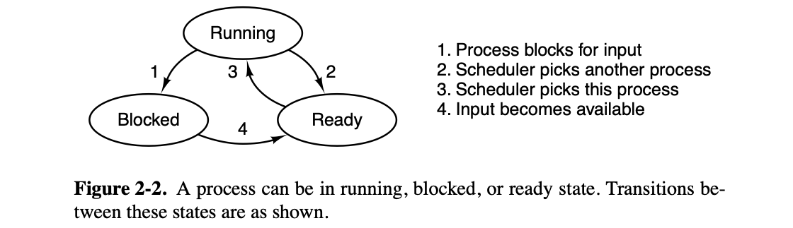
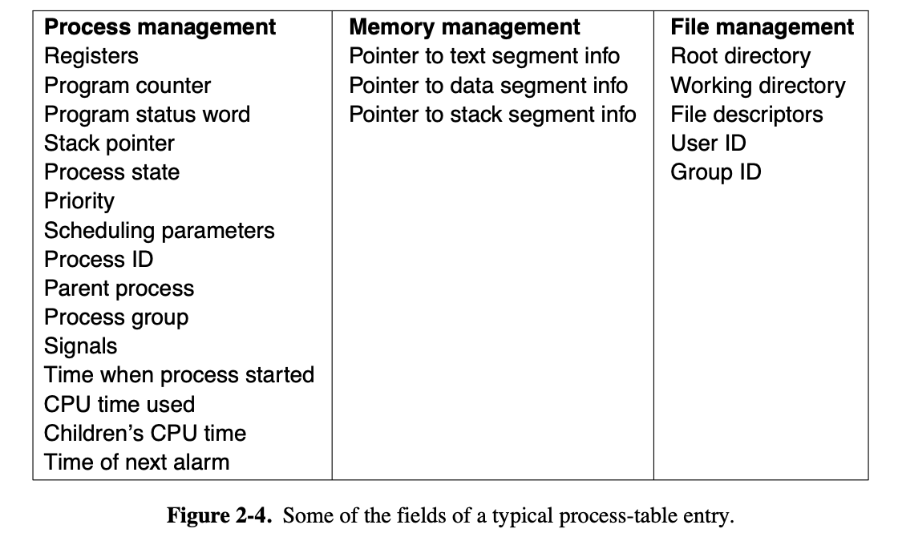
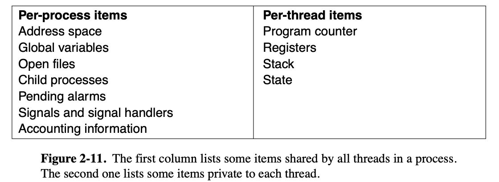
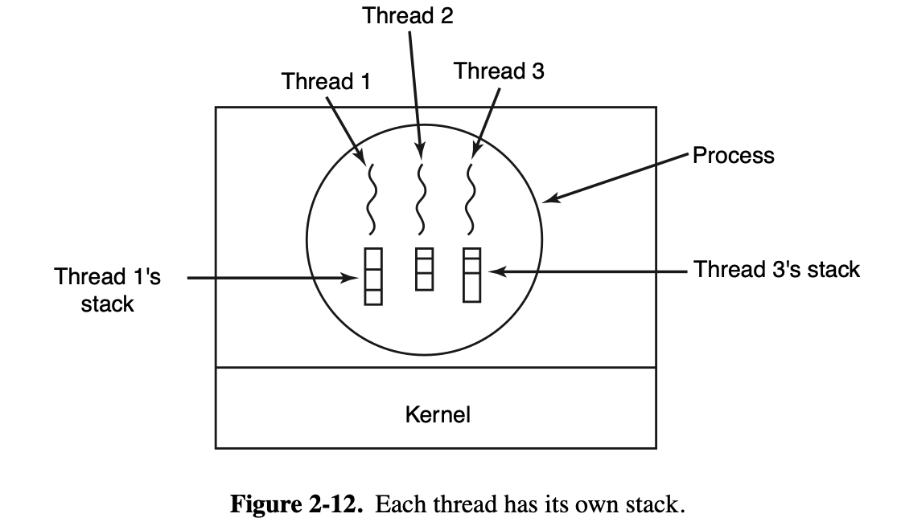

The most central concept in any operating system is the process: an abstraction of a running program. Processes are one of the oldest and most important abstractions that operating systems provide. They support the ability to have (pseudo) concurrent operation ev en when there is only one CPU available. They turn a single CPU into multiple virtual CPUs. When there are four or eight or more CPUs (cores) available, there could be dozens or hundreds of processes running. Without the process abstraction, modern computing could not exist.

### PROCESSES

While strictly speaking, at any one instant each CPU is running only one process, in the course of 1 second it may work on several of them, giving the illusion of parallelism. Sometimes people speak of pseudoparallelism in this context, to contrast it with the true hardware parallelism of multiprocessor systems (which have two or more CPUs sharing the same physical memory).

#### Process Creation

Processes that stay in the background to handle some activity such as email, Web pages, news, printing, and so on are called daemons. Large systems commonly have dozens of them. In UNIX, the ps program can be used to list the running processes.

In UNIX, there is only one system call to create a new process: `fork`. This call creates an exact clone of the calling process. After the `fork`, the two processes, the parent and the child, have the same memory image, the same environment strings, and the same open files. That is all there is. Usually, the child process then executes `execve` or a similar system call to change its memory image and run a new program. For example, when a user types a command, say, sort, to the shell, the shell forks off a child process and the child executes sort. The reason for this two-step process is to allow the child to manipulate its file descriptors after the fork but before the `execve` in order to accomplish redirection of standard input, standard output, and standard error.

In both UNIX and Windows systems, after a process is created, the parent and child have their own distinct address spaces. If either process changes a word in its address space, the change is not visible to the other process. In traditional UNIX, the child’s initial address space is a copy of the parent’s, but there are definitely two distinct address spaces involved; no writable memory is shared. Some UNIX implementations share the program text between the two since that cannot be modified. Alternatively, the child may share all of the parent’s memory, but in that case the memory is shared copy-on-write, which means that whenever either of the two wants to modify part of the memory, that chunk of memory is explicitly copied first to make sure the modification occurs in a private memory area. Again, no writable memory is shared. It is, however, possible for a newly created process to share some of its creator’s other resources, such as open files. In Windows, the parent’s and child’s address spaces are different from the start.

#### Process Termination

Most processes terminate because they have done their work. When a compiler has compiled the program given to it, the compiler executes a system call to tell the operating system that it is finished. This call is `exit` in UNIX and `ExitProcess` in Windows.

The second reason for termination is that the process discovers a fatal error.

The third reason for termination is an error caused by the process, often due to a program bug. Examples include executing an illegal instruction, referencing nonexistent memory, or dividing by zero.

The fourth reason a process might terminate is that the process executes a system call telling the operating system to kill some other process. In UNIX this call is `kill`. The corresponding Win32 function is `TerminateProcess`. In both cases, the killer must have the necessary authorization to do in the killee. In some systems, when a process terminates, either voluntarily or otherwise, all processes it created are immediately killed as well. Neither UNIX nor Windows works this way, however.

#### Process Hierarchies

In UNIX, a process and all of its children and further descendants together form a process group. When a user sends a signal from the keyboard (e.g., by pressing CTRL-C), the signal is delivered to all members of the process group currently associated with the keyboard (usually all active processes that were created in the current window). Individually, each process can catch the signal, ignore the signal, or take the default action, which is to be killed by the signal.

As another example of where the process hierarchy plays a key role, let us look at how UNIX initializes itself when it is started, just after the computer is booted. A special process, called init, is present in the boot image. When it starts running, it reads a file telling how many terminals there are. Then it forks off a new process per terminal. These processes wait for someone to log in. If a login is successful, the login process executes a shell to accept commands. These commands may start up more processes, and so forth. Thus, all the processes in the whole system belong to a single tree, with init at the root.

#### Process States

When a process blocks, it does so because logically it cannot continue, typically because it is waiting for input that is not yet available. It is also possible for a process that is conceptually ready and able to run to be stopped because the operating system has decided to allocate the CPU to another process for a while. These two conditions are completely different. In the first case, the suspension is inherent in the problem (you cannot process the user’s command line until it has been typed). In the second case, it is a technicality of the system (not enough CPUs to give each process its own private processor). In Fig. 2-2 we see a state diagram showing the three states a process may be in: 

1. Running (actually using the CPU at that instant).
2. Ready (runnable; temporarily stopped to let another process run).
3. Blocked (unable to run until some external event happens).

#### Implementation of Processes

To implement the process model, the operating system maintains a table (an array of structures), called the process table, with one entry per process. (Some authors call these entries process control blocks.) This entry contains important information about the process’ state, including its program counter, stack pointer, memory allocation, the status of its open files, its accounting and scheduling information, and everything else about the process that must be saved when the process is switched from running to ready or blocked state so that it can be restarted later as if it had never been stopped.

### THREADS

#### Thread Usage

The main reason for having threads is that in many applications, multiple activities are going on at once. Some of these may block from time to time. By decomposing such an application into multiple sequential threads that run in quasi-parallel, the programming model becomes simpler.

A second argument for having threads is that since they are lighter weight than processes, they are easier (i.e., faster) to create and destroy. In many systems, creating a thread goes 10–100 times faster than creating a process. When the number of threads needed changes dynamically and rapidly, this property is useful to have.

A third reason for having threads is also a performance argument. Threads yield no performance gain when all of them are CPU bound, but when there is substantial computing and also substantial I/O, having threads allows these activities to overlap, thus speeding up the application.

Finally, threads are useful on systems with multiple CPUs, where real parallelism is possible.

Now consider what happens when the user suddenly deletes one sentence from page 1 of an 800-page book. After checking the changed page for correctness, she now wants to make another change on page 600 and types in a command telling the word processor to go to that page (possibly by searching for a phrase occurring only there). The word processor is now forced to reformat the entire book up to page 600 on the spot because it does not know what the first line of page 600 will be until it has processed all the previous pages. There may be a substantial delay before page 600 can be displayed, leading to an unhappy user.

Threads can help here. Suppose that the word processor is written as a two-threaded program. One thread interacts with the user and the other handles reformatting in the background. As soon as the sentence is deleted from page 1, the interactive thread tells the reformatting thread to reformat the whole book. Meanwhile, the interactive thread continues to listen to the keyboard and mouse and responds to simple commands like scrolling page 1 while the other thread is computing madly in the background. With a little luck, the reformatting will be completed before the user asks to see page 600, so it can be displayed instantly.

While we are at it, why not add a third thread? Many word processors have a feature of automatically saving the entire file to disk every few minutes to protect the user against losing a day’s work in the event of a program crash, system crash, or power failure. The third thread can handle the disk backups without interfering with the other two.

If the program were single-threaded, then whenever a disk backup started, commands from the keyboard and mouse would be ignored until the backup was finished.

It should be clear that having three separate processes would not work here because all three threads need to operate on the document. By having three threads instead of three processes, they share a common memory and thus all have access to the document being edited. With three processes this would be impossible.

A third example where threads are useful is in applications that must process very large amounts of data. The normal approach is to read in a block of data, process it, and then write it out again. The problem here is that if only blocking system calls are available, the process blocks while data are coming in and data are going out. Having the CPU go idle when there is lots of computing to do is clearly wasteful and should be avoided if possible.

Threads offer a solution. The process could be structured with an input thread, a processing thread, and an output thread. The input thread reads data into an input buffer. The processing thread takes data out of the input buffer, processes them, and puts the results in an output buffer. The output buffer writes these results back to disk. In this way, input, output, and processing can all be going on at the same time.

#### The Classical Thread Model

One way of looking at a process is that it is a convenient way to group together related resources. A process has an address space that contains program text and data, as well as other resources. These resources may include open files, child processes, pending alarms, signal handlers, accounting information, and more. By putting them together in the form of a process, they can be managed more easily.

The other concept a process has is a thread of execution, usually shortened to just thread. The thread has a program counter associated with it that keeps track of which instruction to execute next. It has registers, which hold its current working variables. It also has a stack, which contains the thread’s execution history, one frame for each procedure called but not yet returned from. Although a thread must execute in some process, the thread and its process are different concepts and can be treated separately. Processes are used to group resources together; threads are the entities scheduled for execution on the CPU.

What threads add to the process model is to allow multiple executions to take place in the same process environment (and address space), to a large degree independent of one another. Having multiple threads running in parallel in one process is analogous to having multiple processes running in parallel in one computer. In the former case, the threads share an address space and other resources. In the latter case, processes share physical memory, disks, printers, and other resources. Because threads have some of the properties of processes, they are sometimes called lightweight processes. The term multithreading is also used to describe the situation of allowing multiple threads in the same process.

Since every thread can access every memory address within the process’ address space, one thread can read, write, or even wipe out another thread’s stack. There is no protection between threads because (1) it is impossible, and (2) it should not be necessary. In addition to sharing an address space, all the threads can share the same set of open files, child processes, signals, alarms, and so forth, as shown in Fig. 2-11.

The items in the first column are process properties, not thread properties. For example, if one thread opens a file, that file is visible to the other threads in the process and they can read and write it. This is logical, since the process is the unit of resource management, not the thread. If each thread had its own address space, open files, pending alarms, and so on, it would be a separate process.

Like a traditional process (i.e., a process with only one thread), a thread can be in any one of several states: running, blocked, ready, or terminated.

It is important to realize that each thread has its own stack, as illustrated in Fig. 2-12. Each thread’s stack contains one frame for each procedure called but not yet returned from.

#### Implementing Threads in User Space

When threads are managed in user space, each process needs its own private thread table to keep track of the threads in that process.

Despite their better performance, user-level threads packages have some major problems. First among these is the problem of how blocking system calls are implemented.

Somewhat analogous to the problem of blocking system calls is the problem of page faults. We will study these in Chap. 3. For the moment, suffice it to say that computers can be set up in such a way that not all of the program is in main memory at once. If the program calls or jumps to an instruction that is not in memory, a page fault occurs and the operating system will go and get the missing instruction (and its neighbors) from disk. This is called a page fault. The process is blocked while the necessary instruction is being located and read in. If a thread causes a page fault, the kernel, unaware of even the existence of threads, naturally blocks the entire process until the disk I/O is complete, even though other threads might be runnable.

Another problem with user-level thread packages is that if a thread starts running, no other thread in that process will ever run unless the first thread voluntarily gives up the CPU. Within a single process, there are no clock interrupts, making it impossible to schedule processes in round-robin fashion (taking turns). Unless a thread exits the run-time system of its own free will, the scheduler will never run.

#### Implementing Threads in the Kernel

