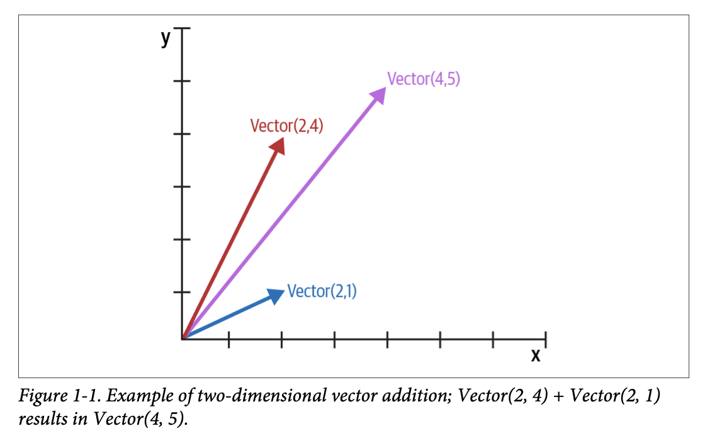
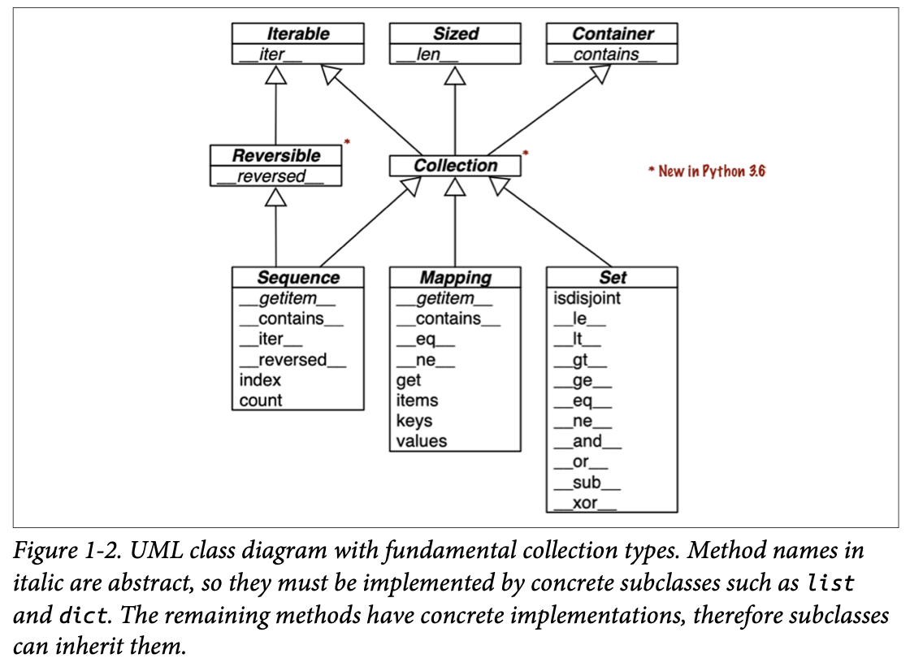
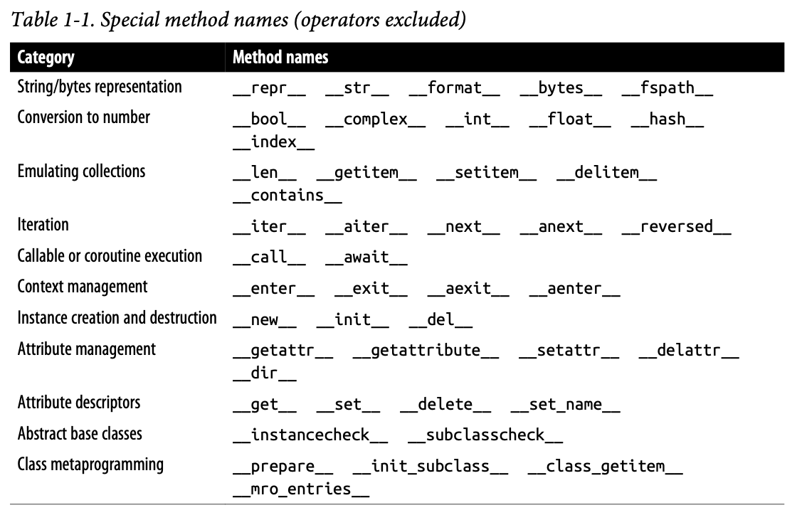
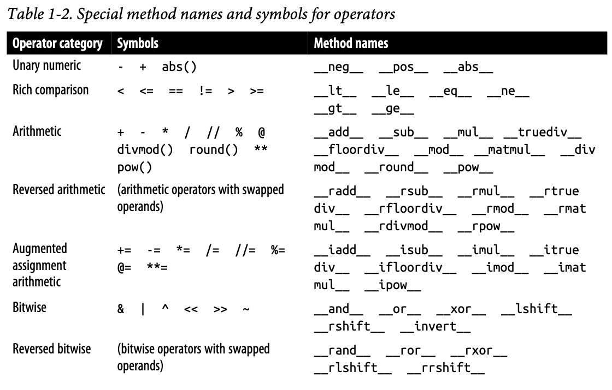
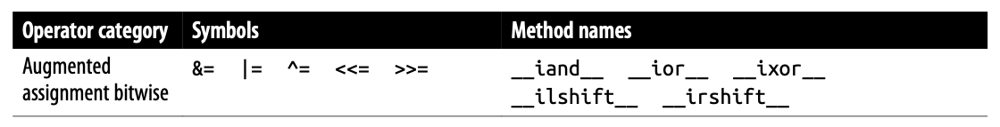

## The Python Data Model

### A Pythonic Card Deck

```py
# Example 1-1. A deck as a sequence of playing cards 

import collections 

Card = collections.namedtuple('Card', ['rank', 'suit']) 

class FrenchDeck:   
  ranks = [str(n) for n in range(2, 11)] + list('JQKA')  
  suits = 'spades diamonds clubs hearts'.split()   
  
  def __init__(self):     
    self._cards = [Card(rank, suit) for suit in self.suits                              
                   for rank in self.ranks]   
  
  def __len__(self):      
    return len(self._cards)   
  
  def __getitem__(self, position):   
    return self._cards[position]
```

```py
>>> from frenchdeck import FrenchDeck, Card

>>> beer_card = Card('7', 'diamonds')
>>> beer_card
Card(rank='7', suit='diamonds')

>>> deck = FrenchDeck()
>>> len(deck)
52

>>> deck[:3]
[Card(rank='2', suit='spades'), Card(rank='3', suit='spades'), Card(rank='4', suit='spades')]

>>> deck[12::13]
[Card(rank='A', suit='spades'), Card(rank='A', suit='diamonds'), Card(rank='A', suit='clubs'), Card(rank='A', suit='hearts')]

>>> Card('Q', 'hearts') in deck
True

>>> Card('Z', 'clubs') in deck
False

>>> for card in deck:  # doctest: +ELLIPSIS
...   print(card)
Card(rank='2', suit='spades')
Card(rank='3', suit='spades')
Card(rank='4', suit='spades')
...

>>> for card in reversed(deck):  # doctest: +ELLIPSIS
...   print(card)
Card(rank='A', suit='hearts')
Card(rank='K', suit='hearts')
Card(rank='Q', suit='hearts')
...

>>> for n, card in enumerate(deck, 1):  # doctest: +ELLIPSIS
...   print(n, card)
1 Card(rank='2', suit='spades')
2 Card(rank='3', suit='spades')
3 Card(rank='4', suit='spades')
...

>>> suit_values = dict(spades=3, hearts=2, diamonds=1, clubs=0)
>>> def spades_high(card):
...     rank_value = FrenchDeck.ranks.index(card.rank)
...     return rank_value * len(suit_values) + suit_values[card.suit]

Rank test:
>>> spades_high(Card('2', 'clubs'))
0
>>> spades_high(Card('A', 'spades'))
51

>>> for card in sorted(deck, key=spades_high):  # doctest: +ELLIPSIS
...      print(card)
Card(rank='2', suit='clubs')
Card(rank='2', suit='diamonds')
Card(rank='2', suit='hearts')
...
Card(rank='A', suit='diamonds')
Card(rank='A', suit='hearts')
Card(rank='A', suit='spades')
```

Although `FrenchDeck` implicitly inherits from the `object` class, most of its functionality is not inherited, but comes from leveraging the data model and composition. By implementing the special methods `__len__` and `__getitem__`, our `FrenchDeck` behaves like a standard Python sequence, allowing it to benefit from core language features (e.g., iteration and slicing) and from the standard library, as shown by the examples using random.choice, reversed, and sorted. Thanks to composition, the `__len__` and `__getitem__` implementations can delegate all the work to a `list` object, `self._cards`.

As implemented so far, a `FrenchDeck` cannot be shuffled because it is **immutable**: the cards and their positions cannot be changed, except by violating encapsulation and handling the `_cards` attribute directly.

### How Special Methods Are Used

The first thing to know about special methods is that they are meant to be called by the Python interpreter, and not by you. You don’t write `my_object.__len__()`. You write `len(my_object)` and, if `my_object` is an instance of a user-defined class, then Python calls the `__len__` method you implemented.

More often than not, the special method call is implicit. For example, the statement `for i in x:` actually causes the invocation of `iter(x)`, which in turn may call `x.__iter__()` if that is available, or use `x.__getitem__()`, as in the `FrenchDeck` example.

#### Emulating Numeric Types

Several special methods allow user objects to respond to operators such as `+`.



```py
# Example 1-2. A simple two-dimensional vector class 

""" vector2d.py: a simplistic class demonstrating some special methods 

It is simplistic for didactic reasons. It lacks proper error handling,
especially in the ``__add__`ànd ``__mul__`` methods.

This example is greatly expanded later in the book.

Addition::   
		>>> v1 = Vector(2, 4)  
    >>> v2 = Vector(2, 1)  
    >>> v1 + v2   
    Vector(4, 5) 

Absolute value::  
		>>> v = Vector(3, 4)  
    >>> abs(v)   
    5.0 
    
Scalar multiplication::   
		>>> v * 3   
    Vector(9, 12)  
    >>> abs(v * 3)   
    15.0 
"""

import math 

class Vector:   
  def __init__(self, x=0, y=0):    
    self.x = x    
    self.y = y   
    
  def __repr__(self):   
    return f'Vector({self.x!r}, {self.y!r})'  
  
  def __abs__(self):     
    return math.hypot(self.x, self.y)  
  
  def __bool__(self): 
    return bool(abs(self))   
  
  def __add__(self, other):  
    x = self.x + other.x    
    y = self.y + other.y     
    return Vector(x, y)  
  
  def __mul__(self, scalar):    
    return Vector(self.x * scalar, self.y * scalar)
```

```py
>>> from vector2d import Vector

>>> v1 = Vector(2, 4)
>>> v2 = Vector(2, 1)
>>> v1 + v2
Vector(4, 5)

>>> v = Vector(3, 4)
>>> abs(v)
5.0

>>> v * 3
Vector(9, 12)

>>> abs(v * 3)
15.0
```

We implemented five special methods in addition to the familiar `__init__`. Note that none of them is directly called within the class or in the typical usage of the class illustrated by the doctests. As mentioned before, the Python interpreter is the only frequent caller of most special methods.

Example 1-2 implements two operators: `+` and `*`, to show basic usage of `__add__` and `__mul__`. In both cases, the methods create and return a new instance of `Vector`, and do not modify either operand—`self` or `other` are merely read. This is the expected behavior of infix operators: to create new objects and not touch their operands.

**Note**: As implemented, Example 1-2 allows multiplying a Vector by a number, but not a number by a Vector, which violates the commutative property of scalar multiplication. We will fix that with the special method `__rmul__` in Chapter 16.

#### String Representation

The `__repr__` special method is called by the repr built-in to get the string representation of the object for inspection. Without a custom `__repr__`, Python’s console would display a Vector instance `<__main__.Vector object at 0x100add790>`.

Sometimes same string returned by `__repr__` is user-friendly, and you don’t need to code `__str__` because the implementation inherited from the `object` class calls `__repr__` as a fallback.

Programmers with prior experience in languages with a `toString` method tend to implement `__str__` and not `__repr__`. If you only implement one of these special methods in Python, choose `__repr__`. [What is the difference between `__str__` and `__repr__`?](https://stackoverflow.com/questions/1436703/what-is-the-difference-between-str-and-repr)

#### Boolean Value of a Custom Type

By default, instances of user-defined classes are considered truthy, unless either `__bool__` or `__len__` is implemented. Basically, `bool(x)` calls `x.__bool__()` and uses the result. If `__bool__` is not implemented, Python tries to invoke `x.__len__()`, and if that returns zero, bool returns False. Otherwise bool returns `True`.

#### Collection API

Figure 1-2 documents the interfaces of the essential collection types in the language. All the classes in the diagram are ABCs—*abstract base classes*.



Each of the top ABCs has a single special method. The `Collection` ABC (new in Python 3.6) unifies the three essential interfaces that every collection should implement:

- `Iterable` to support `for`, [unpacking](https://docs.python.org/3/tutorial/controlflow.html#unpacking-argument-lists), and other forms of iteration 
- `Sized` to support the `len` built-in function 
- `Container` to support the `in` operator

Python does not require concrete classes to actually inherit from any of these ABCs. Any class that implements `__len__` satisfies the `Sized` interface.

Three very important specializations of `Collection` are: 

- `Sequence`, formalizing the interface of built-ins like `list` and `str` 
- `Mapping`, implemented by `dict`, `collections.defaultdict`, etc.
- `Set`, the interface of the `set` and `frozenset` built-in types 

Only `Sequence` is `Reversible`, because sequences support arbitrary ordering of their contents, while mappings and sets do not.

**Note**: Since Python 3.7, the `dict` type is officially “ordered,” but that only means that the key insertion order is preserved. You cannot rearrange the keys in a `dict` however you like.

All the special methods in the `Set` ABC implement infix operators. For example, `a & b` computes the intersection of sets `a` and `b`, and is implemented in the `__and__` special method.

A basic requirement for a Python object is to provide usable string representations of itself, one used for debugging and logging, another for presentation to end users. That is why the special methods `__repr__` and `__str__` exist in the data model.

### Overview of Special Methods






