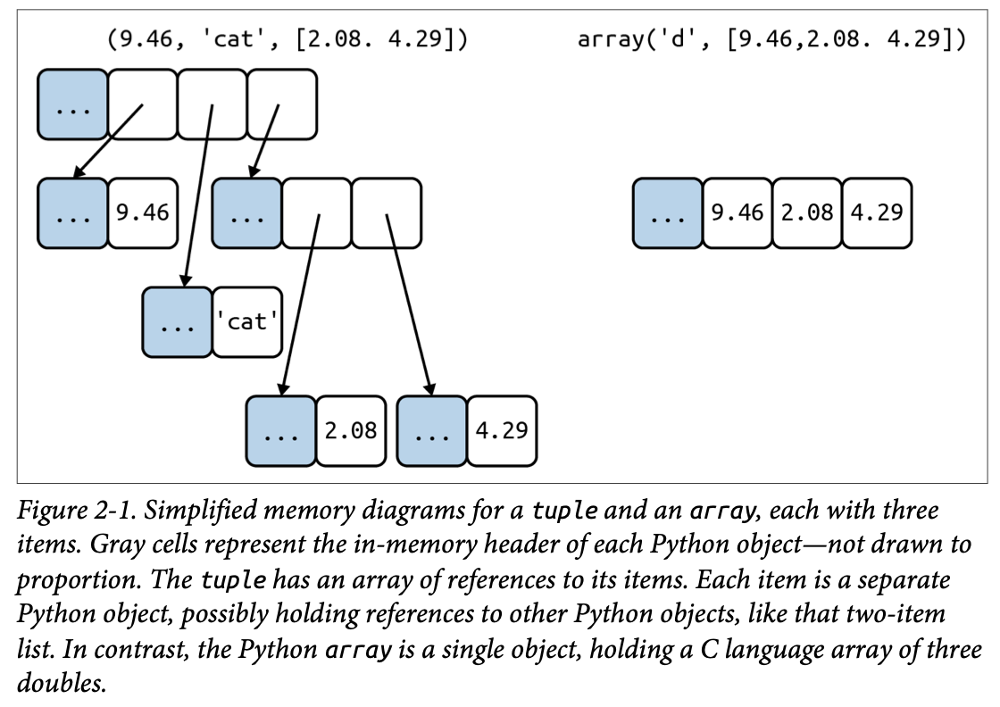
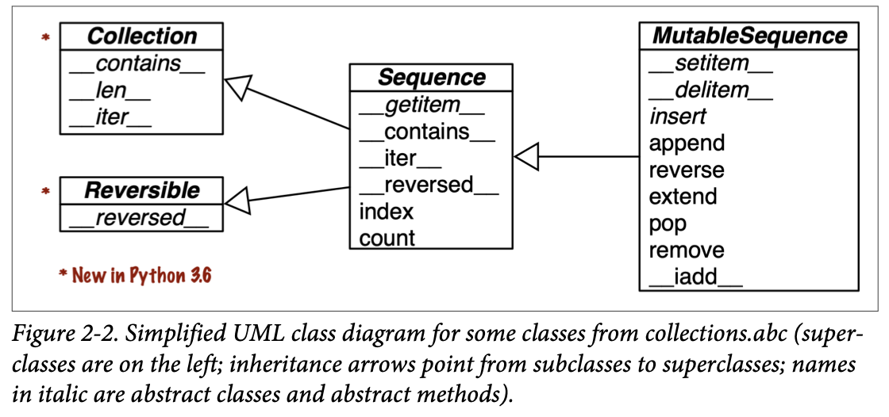

## An Array of Sequences

### Overview of Built-In Sequences

The standard library offers a rich selection of sequence types implemented in C: 

**Container sequences** 

- Can hold items of different types, including nested containers. Some examples: `list`, `tuple`, and `collections.deque`.

**Flat sequences** 

- Hold items of one simple type. Some examples: `str`, `bytes`, and `array.array`.

A **container sequence** holds references to the objects it contains, which may be of any type, while a **flat sequence** stores the value of its contents in its own memory space, not as distinct Python objects. See Figure 2-1.



Thus, flat sequences are more compact, but they are limited to holding primitive machine values like bytes, integers, and floats.

Every Python object in memory has a header with metadata. The simplest Python object, a `float`, has a value field and two metadata fields: 

- `ob_refcnt`: the object’s reference count 
- `ob_type`: a pointer to the object’s type 
- `ob_fval`: a C `double` holding the value of the `float`

Another way of grouping sequence types is by mutability: 

- **Mutable sequences** 

  For example, `list`, `bytearray`, `array.array`, and `collections.deque`.

- **Immutable sequences** 

  For example, `tuple`, `str`, and `bytes`.

Figure 2-2 helps visualize how mutable sequences inherit all methods from immuta‐ble sequences, and implement several additional methods.



### List Comprehensions and Generator Expressions

For brevity, many Python programmers refer to list comprehensions as **listcomps**, and generator expressions as **genexps**. I will use these words as well.

#### List Comprehensions and Readability

```py
# Example 2-1. Build a list of Unicode code points from a string 

>>> symbols = '$¢£¥€¤' 
>>> codes = [] 
>>> for symbol in symbols: 
...     codes.append(ord(symbol)) 
...
>>> codes 
[36, 162, 163, 165, 8364, 164]
```

```py
# Example 2-2. Build a list of Unicode code points from a string, using a listcomp 

>>> symbols = '$¢£¥€¤' 
>>> codes = [ord(symbol) for symbol in symbols] 
>>> codes 
[36, 162, 163, 165, 8364, 164]
```

#### Local Scope Within Comprehensions and Generator Expressions

In Python 3, list comprehensions, generator expressions, and their siblings `set` and `dict` comprehensions, have a local scope to hold the variables assigned in the `for` clause.

However, variables assigned with the “Walrus operator” `:=` remain accessible after those comprehensions or expressions return—unlike local variables in a function.

```py
>>> x = 'ABC' 
>>> codes = [ord(x) for x in x] 
>>> x  
'ABC' 
>>> codes 
[65, 66, 67] 
>>> codes = [last := ord(c) for c in x] 
>>> last  
67 
>>> c  # Error
```

#### Listcomps Versus map and filter

Listcomps do everything the `map` and `filter` functions do, without the contortions of the functionally challenged Python `lambda`.

```py
# Example 2-3. The same list built by a listcomp and a map/filter composition 

>>> symbols = '$¢£¥€¤' 
>>> beyond_ascii = [ord(s) for s in symbols if ord(s) > 127] 
>>> beyond_ascii 
[162, 163, 165, 8364, 164] 
>>> beyond_ascii = list(filter(lambda c: c > 127, map(ord, symbols))) 
>>> beyond_ascii 
[162, 163, 165, 8364, 164]
```

#### Cartesian Products

```py
# Example 2-4. Cartesian product using a list comprehension 

>>> colors = ['black', 'white'] 
>>> sizes = ['S', 'M', 'L'] 
>>> tshirts = [(color, size) for color in colors for size in sizes]  
>>> tshirts 
[('black', 'S'), ('black', 'M'), ('black', 'L'), ('white', 'S'),  ('white', 'M'), ('white', 'L')] 

>>> for color in colors:  
...     for size in sizes: 
...         print((color, size)) 
...
('black', 'S') 
('black', 'M') 
('black', 'L') 
('white', 'S') 
('white', 'M') 
('white', 'L') 

>>> tshirts = [(color, size) for size in sizes      
...                          for color in colors] 
>>> tshirts 
[('black', 'S'), ('white', 'S'), ('black', 'M'), ('white', 'M'),  ('black', 'L'), ('white', 'L')]
```

#### Generator Expressions

To initialize tuples, arrays, and other types of sequences, you could also start from a listcomp, but a genexp (generator expression) saves memory because it yields items one by one using the iterator protocol instead of building a whole list just to feed another constructor.

Genexps use the same syntax as listcomps, but are enclosed in parentheses rather than brackets.

```py
# Example 2-5. Initializing a tuple and an array from a generator expression 

>>> symbols = '$¢£¥€¤' 
>>> tuple(ord(symbol) for symbol in symbols)  
(36, 162, 163, 165, 8364, 164) 

>>> import array 
>>> array.array('I', (ord(symbol) for symbol in symbols))  
array('I', [36, 162, 163, 165, 8364, 164])
```

```py
# Example 2-6. Cartesian product in a generator expression 

>>> colors = ['black', 'white'] 
>>> sizes = ['S', 'M', 'L'] 
>>> for tshirt in (f'{c} {s}' for c in colors for s in sizes):  
...     print(tshirt) 
...
black S
black M
black L
white S
white M
white L
```

### Tuples Are Not Just Immutable Lists

Tuples do double duty: they can be used as immutable lists and also as records with no field names.

#### Tuples as Records

Example 2-7 shows tuples used as records. Note that in every expression, sorting the tuple would destroy the information because the meaning of each field is given by its position in the tuple.

```py
# Example 2-7. Tuples used as records 

>>> lax_coordinates = (33.9425, -118.408056)  
>>> city, year, pop, chg, area = ('Tokyo', 2003, 32_450, 0.66, 8014)  
>>> traveler_ids = [('USA', '31195855'), ('BRA', 'CE342567'),  
...     ('ESP', 'XDA205856')] 

>>> for passport in sorted(traveler_ids):  
...     print('%s/%s' % passport)   
...
BRA/CE342567 
ESP/XDA205856 
USA/31195855 

>>> for country, _ in traveler_ids:  
...     print(country) 
...
USA 
BRA 
ESP
```

In Example 2-7, we assigned `('Tokyo', 2003, 32_450, 0.66, 8014)` to `city`, `year`, `pop`, `chg`, `area` in a single statement. Then, the `%` operator assigned each item in the `passport` tuple to the corresponding slot in the format string in the `print` argument. Those are two examples of **tuple unpacking**.

#### Tuples as Immutable Lists


