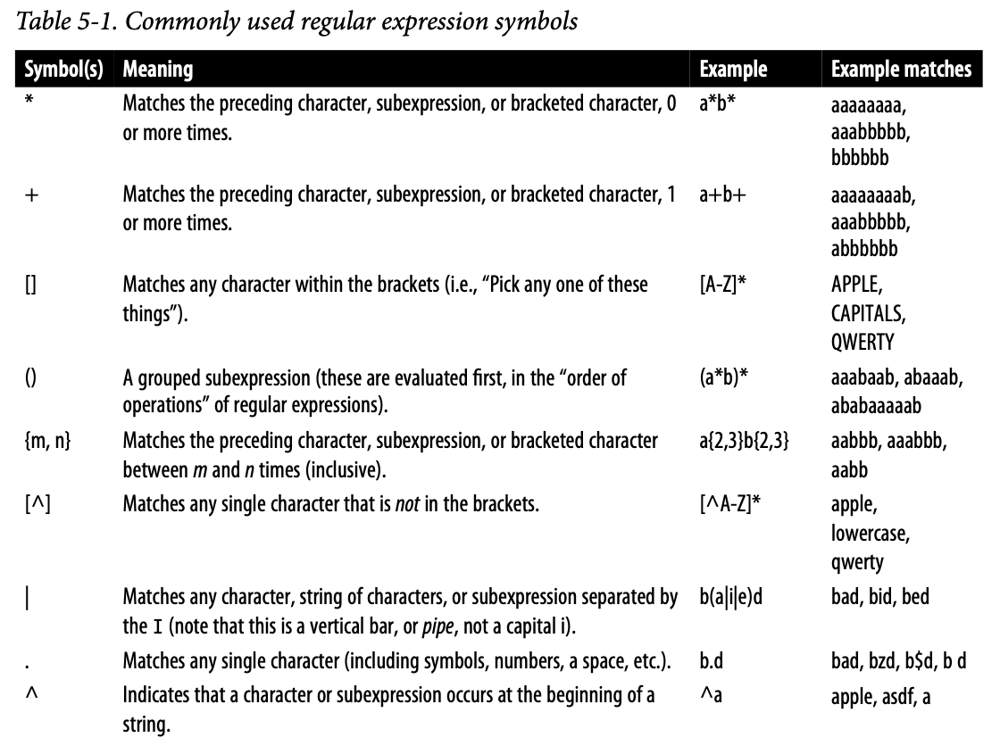
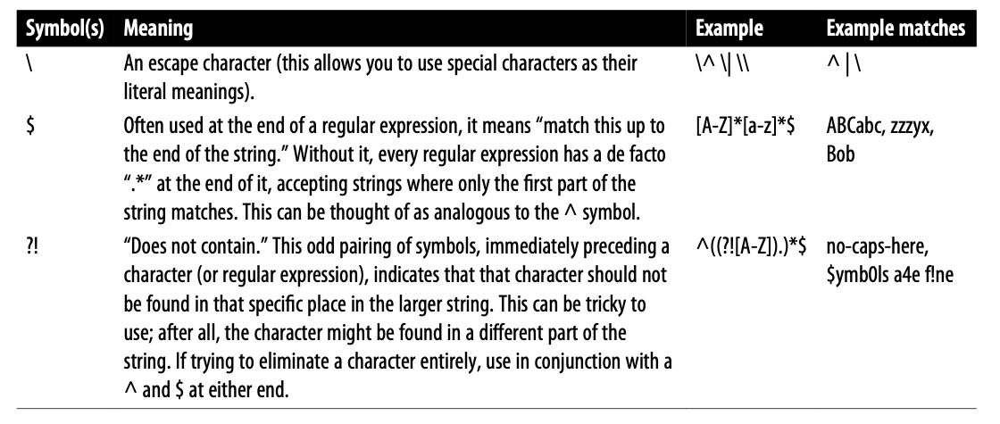

## How the Internet Works

### Networking

In the early days of the telephone system, each telephone was connected by a physical wire to a central switchboard. If you wanted to make a call to a nearby friend, you picked up the phone, asked the switchboard operator to connect you, and the switch‐board operator physically created (via plugs and jacks) a dedicated connection between your phone and your friend’s phone.

Today, rather than make a telephone call over a temporary dedicated connection, we can make a video call from our house to anywhere in the world across a persistent web of wires. The wire doesn’t tell the data where to go, the data guides itself, in a process called packet switching. Although many technologies over the years contrib‐uted to what we think of as “the internet,” packet switching is really the technology that single-handedly started it all.

In a packet-switched network, the message to be sent is divided into discrete ordered packets, each with its own sender and destination address. These packets are routed dynamically to any destination on the network, based on that address. Rather than being forced to blindly traverse the single dedicated connection from receiver to sender, the packets can take any path the network chooses. In fact, packets in the same message transmission might take different routes across the network and be reordered by the receiving computer when they arrive.

#### Session Layer

The session layer is responsible for opening and closing a session between two appli‐cations. This session allows stateful information about what data has and hasn’t been sent, and who the computer is communicating with. The session generally stays open for as long as it takes to complete the data request, and then closes.

The session layer allows for retrying a transmission in case of a brief crash or disconnect.

**Sessions Versus Sessions**

- Sessions in the session layer of the OSI model are different from sessions and session data that web developers usually talk about. Session variables in a web application are a concept in the applica‐tion layer that are implemented by the web browser software.

  Session variables, in the application layer, stay in the browser for as long as they need to or until the user closes the browser window. In the session layer of the OSI model, the session usually only lasts for as long as it takes to transmit a single file!

#### Presentation Layer

The presentation layer transforms incoming data from character strings into a format that the application can understand and use. It is also responsible for character encoding and data compression. The presentation layer cares about whether incom‐ing data received by the application represents a PNG file or an HTML file, and hands this file to the application layer accordingly.

#### Application Layer

The application layer interprets the data encoded by the presentation layer and uses it appropriately for the application. I like to think of the presentation layer as being concerned with transforming and identifying things, while the application layer is concerned with “doing” things. For instance, HTTP with its methods and statuses is an application layer protocol. The more banal JSON and HTML (because they are file types that define how data is encoded) are presentation layer protocols.

## Writing Your First Web Scraper

```py
from urllib.request import urlopen 

html = urlopen('http://pythonscraping.com/pages/page1.html') 
print(html.read())
```

### An Introduction to BeautifulSoup

#### Installing BeautifulSoup

```sh
pip3 install bs4
```

#### Running BeautifulSoup

```py
from urllib.request import urlopen 
from bs4 import BeautifulSoup 

html = urlopen('http://www.pythonscraping.com/pages/page1.html') 
bs = BeautifulSoup(html.read(), 'html.parser') 
print(bs.h1)

# <h1>An Interesting Title</h1>
```

Check out the Document: [Beautiful Soup Documentation](https://www.crummy.com/software/BeautifulSoup/bs4/doc/)

#### Connecting Reliably and Handling Exceptions

```py
html = urlopen('http://www.pythonscraping.com/pages/page1.html')
```

Two main things can go wrong in this line: 

- The page is not found on the server (or there was an error in retrieving it).
- The server is not found at all.

In the first situation, an HTTP error will be returned. You can handle this exception in the following way:

```py
from urllib.request import urlopen 
from urllib.error import HTTPError 

try:  
  html = urlopen('http://www.pythonscraping.com/pages/page1.html') 
except HTTPError as e:   
  print(e)   
  # return null, break, or do some other "Plan B" 
else: 
  # program continues. 
```

If the server is not found at all, `urlopen` will throw an `URLError`.

```py
from urllib.request import urlopen 
from urllib.error import HTTPError 
from urllib.error import URLError 

try:  
  html = urlopen('https://pythonscrapingthisurldoesnotexist.com') 
except HTTPError as e: 
  print(e) 
except URLError as e:   
  print('The server could not be found!') 
else:   
  print('It Worked!')
```

Of course, if the page is retrieved successfully from the server, there is still the issue of the content on the page not being quite what you expected. Every time you access a tag in a `BeautifulSoup` object, it’s smart to add a check to make sure the tag actually exists. If you attempt to access a tag that does not exist, `BeautifulSoup` will return a `None` object. The problem is, attempting to access a tag on a `None` object itself will result in an `AttributeError` being thrown.

```py
from urllib.request import urlopen 
from urllib.error import HTTPError 
from bs4 import BeautifulSoup 

def getTitle(url): 
  try:      
    html = urlopen(url) 
  except HTTPError as e:    
    return None   
  try:       
    bs = BeautifulSoup(html.read(), 'html.parser')  
    title = bs.body.h1   
  except AttributeError as e:  
    return None   
  return title 

title = getTitle('http://www.pythonscraping.com/pages/page1.html') 
if title == None:   
  print('Title could not be found') 
else:    
  print(title)
```

## Advanced HTML Parsing

### Another Serving of BeautifulSoup

CSS is, in fact, a huge boon for web scrapers because it requires the differentiation of HTML elements in order to style them differently.

```py
from urllib.request import urlopen 
from bs4 import BeautifulSoup 

html = urlopen('http://www.pythonscraping.com/pages/warandpeace.html') 
bs = BeautifulSoup(html.read(), 'html.parser') 
nameList = bs.find_all('span', {'class':'green'}) 
for name in nameList:  
  print(name.get_text())
```

#### find() and find_all() with BeautifulSoup

The two functions are extremely similar, as evidenced by their definitions in the BeautifulSoup documentation:

```py
find_all(tag, attrs, recursive, text, limit, **kwargs) 
find(tag, attrs, recursive, text, **kwargs)
```

In all likelihood, 95% of the time you will need to use only the first two arguments: `tag` and `attrs`.

you can pass a string name of a tag or even a Python list of string tag names. For example, the following returns a list of all the header tags in a document:

```py
.find_all(['h1','h2','h3','h4','h5','h6'])
```

Unlike the `tag` parameter, which can be either a string or an iterable, the `attrs` parameter must be a Python dictionary of attributes and values. It matches tags that contain any one of those attributes. For example, the following function would return both the green and red span tags in the HTML document:

```py
.find_all('span', {'class': ['green', 'red']})
```

The `recursive` parameter is a boolean. How deeply into the document do you want to go? If `recursive` is set to `True`, the `find_all` function looks into children, and children’s children, etc., for tags that match the parameters. If it is `False`, it will look only at the top-level tags in your document. By default, `find_all` works recursively (`recursive` is set to `True`).

The `text` parameter is unusual in that it matches based on the text content of the tags, rather than properties of the tags themselves. For instance, if you want to find the number of times “the prince” is surrounded by tags on the example page, you could replace your `.find_all()` function in the previous example with the following lines:

```py
nameList = bs.find_all(text='the prince') 
print(len(nameList))
```

The `limit` parameter, of course, is used only in the `find_all` method; find is equivalent to the same `find_all` call, with a limit of 1. You might set this if you’re interested in retrieving only the first x items from the page.

The additional `kwargs` parameter allows you to pass any additional named arguments you want into the method. Any extra arguments that `find` or `find_all` doesn’t recognize will be used as tag attribute matchers. For example:

```py
title = bs.find_all(id='title', class_='text')
```

The following two lines are identical:

```py
bs.find(id='text') 
bs.find(attrs={'id':'text'})
```

When filters get more complex, or when you need to pass attribute value options as a list in the arguments, you may want to use the `attrs` parameter:

```py
bs.find(attrs={'class':['red', 'blue', 'green']})
```

#### Navigating Trees

##### Dealing with children and other descendants

If you want to find only descendants that are children, you can use the `.children` tag:

```py
from urllib.request import urlopen 
from bs4 import BeautifulSoup 

html = urlopen('http://www.pythonscraping.com/pages/page3.html') 
bs = BeautifulSoup(html, 'html.parser') 

for child in bs.find('table',{'id':'giftList'}).children:     
  print(child)
```

```py
from urllib.request import urlopen 
from bs4 import BeautifulSoup 

html = urlopen('http://www.pythonscraping.com/pages/page3.html') 
bs = BeautifulSoup(html, 'html.parser') 
 
print(bs.find('table',{'id':'giftList'}))
```

##### Dealing with siblings

```py
from urllib.request import urlopen 
from bs4 import BeautifulSoup 

html = urlopen('http://www.pythonscraping.com/pages/page3.html') 
bs = BeautifulSoup(html, 'html.parser') 

for sibling in bs.find('table', {'id':'giftList'}).tr.next_siblings:     
  print(sibling)
```

The output of this code is to print all rows of products from the product table, except for the first title row.

##### Dealing with parents

```py
from urllib.request import urlopen 
from bs4 import BeautifulSoup 

html = urlopen('http://www.pythonscraping.com/pages/page3.html') 
bs = BeautifulSoup(html, 'html.parser') 
print(bs.find('img',              
              {'src':'../img/gifts/img1.jpg'})   
      .parent.previous_sibling.get_text())
```

### Regular Expressions





### Regular Expressions and BeautifulSoup

```py
from urllib.request import urlopen 
from bs4 import BeautifulSoup 
import re 

html = urlopen('http://www.pythonscraping.com/pages/page3.html') 
bs = BeautifulSoup(html, 'html.parser') 
images = bs.find_all('img',   
                     {'src':re.compile('../img/gifts/img.*.jpg')}) 
for image in images:   
  print(image['src'])
  
# ../img/gifts/img1.jpg
# ../img/gifts/img2.jpg
# ../img/gifts/img3.jpg
# ../img/gifts/img4.jpg
# ../img/gifts/img6.jpg
```

### Lambda Expressions

Lambda is a fancy academic term that, in programming, simply means “a shorthand way of writing a function.” In Python, we might write a function that returns the square of a number as:

```py
def square(n):    
  return n**2
```

We could use a lambda expression to do the same thing in one line:

```py
square = lambda n: n**2
```

Lambda functions are so useful you can even use them to replace existing BeautifulSoup functions:

```py
bs.find_all(lambda tag: tag.get_text() == 'Or maybe he\'s only resting?')
```

This also can be accomplished without a lambda function:

```py
bs.find_all('', text='Or maybe he\'s only resting?')
```

